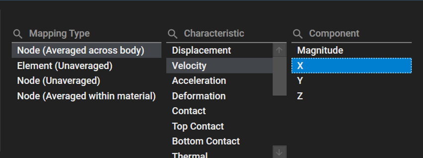
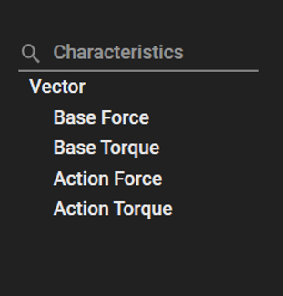

# Result File Reader using the Python language

The Ansys Motion Standalone Postprocessor C# library can be used in the python code by using [Python.NET](https://pythonnet.github.io/) or [IronPython](https://ironpython.net/).

## System requirements

If you are using CPython, you will need to install Python.NET first.

```
pip install pythonnet
```

## Notes

* PythonNet only support Python  3.7 - 3.11. If you are using Ironpython or run the Python script from the Scripting menu of Ansys Workbench, PythonNet may not be required.

* As illustrated in the figures below, to create a Contour or Vector using the Result File Reader, you need to be aware of the following information:
  * Within the UI, by accessing the "Contour" function, you can observe Characteristics and Components. The combination of these paths (Characteristics, Components) can be utilized as input values.



  * Within the UI, by accessing the "Vector" function, you can observe Characteristics. These paths (Characteristics) can be used as input values.



## How to execute Result File Reader

The Postprocessor API is a functionality that allows you to access Ansys Motion analysis results independently of the postprocessor and extract the desired results. The Postprocessor API can be used for process automation, integration with other processes, and integration with design optimization tools.


## Example

The following sample code demonstrates how to use Result File Reader API :

* To use the Result Filer Reader API, you can conveniently develop by refering to the following guidlines.
* Refer to resultfilereader.py in "Ansys installed path/Motion/Document/Postprocessor API for Python.zip"
* The example was created using "Ansys installed path/Motion/Document/Pre and Post Processor.zip"
* Create a example_resultfilereader.py file

```
# Example_ResultFileReaderAPI.py
from ResultFileReaderAPI import *

# The 'XX' in AWP_ROOTXXX represents the year, like 25 for the year 2025, and the leat 'X' indicates the half of the year,
# where '1' represents the first half and '2' represents the second half.
# For example, in 'AWP_ROOT251' and 'AWP_ROOT252', '25' represents the year 2025, and '1' indicates the first half of the year,
# while '2' indicates the second half.
install_path = os.environ['AWP_ROOTXXX']
filePath = os.path.join(install_path, r'Motion\Document\Pre and Post Processor\Model\Result\Suspension.dfr')

# Import result file
outputReader = OutputReader(filePath)

# Close
outputReader.Close()
```

## See also

* [Python.NET](https://pythonnet.github.io/)
* [IronPython](https://ironpython.net/)
* [Reference](lib/VM.md)
	* [VM](lib/VM.md)	 
	* [VM.Post.API.OutputReader](lib/VM.Post.API.OutputReader.md)