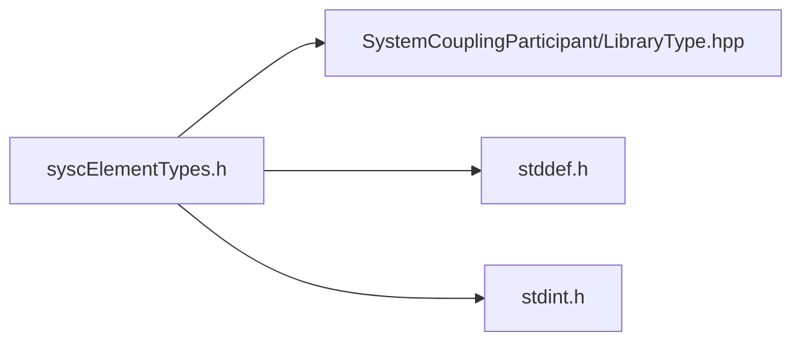

<a id="syscElementTypes_8h"></a>
# File syscElementTypes.h

![][C++]

**Location**: `syscElementTypes.h`


## Includes

* SystemCouplingParticipant/LibraryType.hpp
* <stddef.h>
* <stdint.h>



## Enumeration types

<a id="group__SyscParticipantLibraryCAPI_1gab18060c2493ddba0678016696642f005"></a>
### Enumeration type SyscElementTypes

![][public]

**Definition**: `syscElementTypes.h` (line 236)

```cpp
enum SyscElementTypes {
  SyscTri3 = 5,
  SyscTri6 = 6,
  SyscQuad4 = 7,
  SyscQuad8 = 8,
  SyscTet4 = 9,
  SyscTet10 = 10,
  SyscHex8 = 11,
  SyscHex20 = 12,
  SyscWedge6 = 13,
  SyscWedge15 = 14,
  SyscPyramid5 = 15,
  SyscPyramid13 = 16,
  SyscPolygon = 18,
  SyscPolyhedron = 19
}
```

Provide an enum for element types.

Tri3: Trilateral element with corner nodes only. verbatim {"type":"element","name":"verbatim","attributes":{},"children":[{"type":"text","text":"         *2 \n        / \\    \n       /   \\   \n      /     \\\n     /       \\ \n    /         \\      \n  0*-----------*1\n"}]}


Tri6: Trilateral element with corner and mid-side nodes. verbatim {"type":"element","name":"verbatim","attributes":{},"children":[{"type":"text","text":"         *2 \n        / \\    \n       /   \\   \n     5*     *4\n     /       \\ \n    /         \\      \n  0*-----*-----*1        \n         3\n"}]}


Quad4: Quadrilateral element with corner nodes only. verbatim {"type":"element","name":"verbatim","attributes":{},"children":[{"type":"text","text":"  3*-----------*2\n   |           | \n   |           | \n   |           | \n   |           |\n   |           |\n   |           |\n   |           |\n  0*-----------*1\n"}]}


Quad8: Quadrilateral element with corner and mid-side nodes. verbatim {"type":"element","name":"verbatim","attributes":{},"children":[{"type":"text","text":"         6\n  3*-----*-----*2\n   |           | \n   |           | \n   |           | \n  7*           *5\n   |           |\n   |           |\n   |           |\n  0*-----*-----*1\n         4 \n"}]} Tet4: Tetrahedral element with corner nodes only. verbatim {"type":"element","name":"verbatim","attributes":{},"children":[{"type":"text","text":"        3\n        *            \n       /|\\           \n      / | \\          \n     /  |  \\\n    /   |   \\        \n   /    |    \\       \n 0*- - -|- - -*2     \n   \\    |    /       \n    \\   |   /        \n     \\  |  /        \n      \\ | /          \n       \\|/           \n        *1           \n"}]}


Tet10: Tetrahedral element with corner and mid-side nodes. verbatim {"type":"element","name":"verbatim","attributes":{},"children":[{"type":"text","text":"        3\n        *              \n       /|\\             \n      / | \\            \n    7*  |  *9          \n    /   |   \\          \n   /    *8   \\         \n 0*- - *|- - -*2       \n   \\   6|    /         \n    \\   |   /          \n    4*  |  *5          \n      \\ | /            \n       \\|/             \n        *1             \n"}]} Hex8: Hexahedral element with corner nodes only.


verbatim {"type":"element","name":"verbatim","attributes":{},"children":[{"type":"text","text":"    7*-----------*6 \n    /|          /|  \n   /           / |  \n  /  |        /  |  \n /   |       /   |\n/    |      /    |  \n"}]} 4*--------&mdash*5 | <br/>
 | | | | <br/>
 | 3*- - -|- - -*2 | / | / <br/>
 | | / <br/>
 | / | / <br/>
 | | / <br/>
 |/ |/ <br/>
 0*--------&mdash*1 <br/>


Hex20: Hexahedral element with corner and mid-side nodes. verbatim {"type":"element","name":"verbatim","attributes":{},"children":[{"type":"text","text":"          14             \n    7*-----*-----*6   \n    /|          /|   \n   /           / |     \n15*  |      13*  |    \n /   *19     /   *18     \n/  12|      /    |     \n"}]} 4*--&mdash*--&mdash*5 | <br/>
 | | | | <br/>
 | 3*- - *|- - -*2 | / 10| / 16* _17 / | *11 | *9 | | / |/ |/ 0_--&mdash*--&mdash*1 8 <br/>


Wedge6: Wedge element with corner nodes only.


verbatim {"type":"element","name":"verbatim","attributes":{},"children":[{"type":"text","text":"  3*-----------*5\n   |\\         /|\n   | \\       / |\n   |  \\     /  |\n   |   \\   /   |\n   |    \\ /    |\n   |     *4    |\n   |     |     |\n  0*- - -|- - -*2\n    \\    |    /\n     \\   |   /\n      \\  |  /\n       \\ | /\n        \\|/\n         *\n         1\n"}]}


Wedge15: Wedge element with corner and mid-side nodes.


verbatim {"type":"element","name":"verbatim","attributes":{},"children":[{"type":"text","text":"        11\n  3*-----*-----*5\n   |\\         /|\n   | \\       / |\n   |  *9  10*  |\n 12*   \\   /   *14\n   |    \\ /    |\n   |     *4    |\n   |     |     |\n  0*- - -|*8- -*2\n    \\    |    /\n     \\ 13*   /\n     6*  |  *7\n       \\ | /\n        \\|/\n         *\n         1\n"}]} Pyramid5: Pyramid element with corner nodes only.


verbatim {"type":"element","name":"verbatim","attributes":{},"children":[{"type":"text","text":"             *4                           4\n            /|\\                           *\n           / | \\                         /|\\\n          /  |  \\                       // \\\\\n         /   |   \\                     / | | \\\n        /    |    \\                   / /   \\ \\\n      3*- - -|- - -*2                /  |   |  \\\n      /      |    /                 /  /     \\  \\\n     /       |   /                3*- -|- - -|- -*2\n    /        |  /                  |  /       \\  |\n   /         | /                   |  |       |  |\n  /          |/                    | /         \\ |\n0*-----------*1                    | |         | |\n                                   |/           \\|\n                                   *-------------*\n                                   0             1\n"}]}


Pyramid13: Pyramid element with corner and mid-side nodes. verbatim {"type":"element","name":"verbatim","attributes":{},"children":[{"type":"text","text":"             *4                           4\n            /|\\                           *\n           / | \\                         /|\\\n        12*  |  *11                     // \\\\\n         /   |   \\                     / | | \\\n        /    |7   \\                 12* /   \\ *11\n      3*- - -|* - -*2                /  |   |  \\\n      /      *10  /                 /  /  7  \\  \\\n     /       |   /                3*- -|- * -|- -*2\n  8 *        |  * 6                |  *9    10*  |\n   /         | /                   |  |       |  |\n  /          |/                   8* /         \\ *6\n0*-----*-----*1                    | |         | |\n     5                             |/           \\|\n                                   *------*------*\n                                   0      5      1\n"}]} Polygon: Arbitrary polygon.


Polyhedron: Arbitrary polyhedron.


<a id="group__SyscParticipantLibraryCAPI_1ggab18060c2493ddba0678016696642f005a77470006c9f90e0699d34cb4529977bd"></a>
#### Enumerator SyscTri3


Trilateral element with corner nodes only.

<a id="group__SyscParticipantLibraryCAPI_1ggab18060c2493ddba0678016696642f005ad973b33a8c615a7088218bb68c95cef1"></a>
#### Enumerator SyscTri6


Trilateral element with corner and mid-side nodes.

<a id="group__SyscParticipantLibraryCAPI_1ggab18060c2493ddba0678016696642f005ac829eb996aacda6977a2633d3d4b6ae0"></a>
#### Enumerator SyscQuad4


Quadrilateral element with corner nodes only.

<a id="group__SyscParticipantLibraryCAPI_1ggab18060c2493ddba0678016696642f005aefd1fe32f0987d59a023071a8d6729a9"></a>
#### Enumerator SyscQuad8


Quadrilateral element with corner and mid-side nodes.

<a id="group__SyscParticipantLibraryCAPI_1ggab18060c2493ddba0678016696642f005afb767ddc846b275cc9f06f4c552ef8ea"></a>
#### Enumerator SyscTet4


Tetrahedral element with corner nodes only.

<a id="group__SyscParticipantLibraryCAPI_1ggab18060c2493ddba0678016696642f005a706ca034c9b7e05f8f2a87301b72a6be"></a>
#### Enumerator SyscTet10


Tetrahedral element with corner and mid-side nodes.

<a id="group__SyscParticipantLibraryCAPI_1ggab18060c2493ddba0678016696642f005a15bbc3ed5ebf288d89e4e9af7ce9e0ae"></a>
#### Enumerator SyscHex8


Hexahedral element with corner nodes only.

<a id="group__SyscParticipantLibraryCAPI_1ggab18060c2493ddba0678016696642f005a4eaa66437832a76bdcbc92a727dfedd1"></a>
#### Enumerator SyscHex20


Hexahedral element with corner and mid-side nodes.

<a id="group__SyscParticipantLibraryCAPI_1ggab18060c2493ddba0678016696642f005a05727b1e9b0ab410f1d5f9c31337b508"></a>
#### Enumerator SyscWedge6


Wedge element with corner nodes only.

<a id="group__SyscParticipantLibraryCAPI_1ggab18060c2493ddba0678016696642f005a53a4340e11f6e1a6b75f084f2518649a"></a>
#### Enumerator SyscWedge15


Wedge element with corner and mid-side nodes.

<a id="group__SyscParticipantLibraryCAPI_1ggab18060c2493ddba0678016696642f005a6389c588d45313437139bcea52d94866"></a>
#### Enumerator SyscPyramid5


Pyramid element with corner nodes only.

<a id="group__SyscParticipantLibraryCAPI_1ggab18060c2493ddba0678016696642f005a366c507804e6022a52b6f38852861b1b"></a>
#### Enumerator SyscPyramid13


Pyramid element with corner and mid-side nodes.

<a id="group__SyscParticipantLibraryCAPI_1ggab18060c2493ddba0678016696642f005ac46af723ae879263d8c74a0cd91dfb9e"></a>
#### Enumerator SyscPolygon


Arbitrary polygon.

<a id="group__SyscParticipantLibraryCAPI_1ggab18060c2493ddba0678016696642f005aa1667251e6eb0b96ab2b003591a8983f"></a>
#### Enumerator SyscPolyhedron


Arbitrary polyhedron.

## Source

```cpp
/*
* Copyright ANSYS, Inc. Unauthorized use, distribution, or duplication is prohibited.
*/

#pragma once

#include "SystemCouplingParticipant/LibraryType.hpp"

#include <stddef.h>
#include <stdint.h>

#ifdef __cplusplus
extern "C" {
#endif

enum SyscElementTypes {
  SyscTri3 = 5,       
  SyscTri6 = 6,       
  SyscQuad4 = 7,      
  SyscQuad8 = 8,      
  SyscTet4 = 9,       
  SyscTet10 = 10,     
  SyscHex8 = 11,      
  SyscHex20 = 12,     
  SyscWedge6 = 13,    
  SyscWedge15 = 14,   
  SyscPyramid5 = 15,  
  SyscPyramid13 = 16, 
  SyscPolygon = 18,   
  SyscPolyhedron = 19 
};

#ifdef __cplusplus
}
#endif
```

[public]: https://img.shields.io/badge/-public-brightgreen (public)
[C++]: https://img.shields.io/badge/language-C%2B%2B-blue (C++)