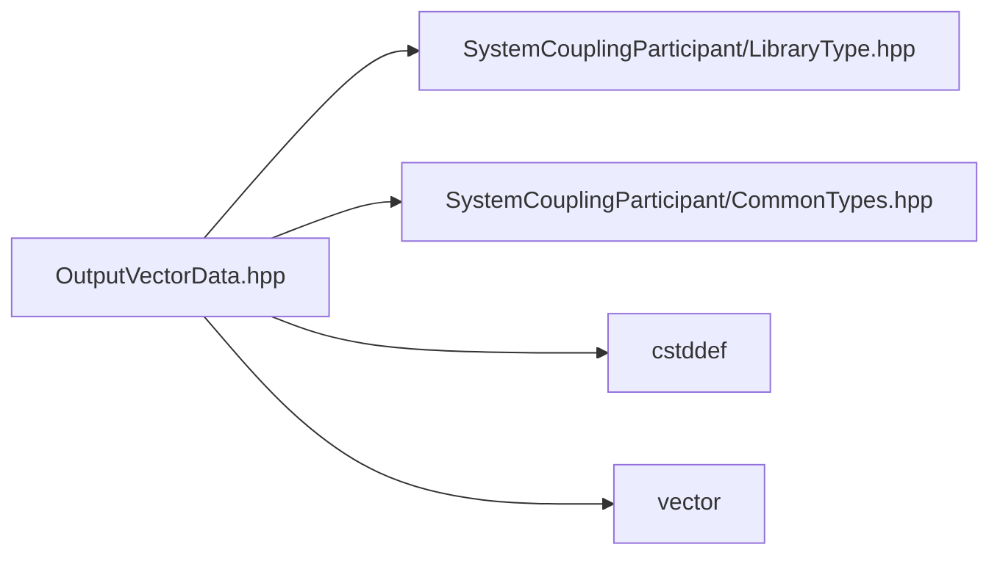

# File OutputVectorData.hpp

![][C++]

**Location**: `OutputVectorData.hpp`


## Classes

* [sysc::OutputVectorData](classsysc_1_1OutputVectorData.md#classsysc_1_1OutputVectorData)

## Namespaces

* [sysc](namespacesysc.md#namespacesysc)

## Includes

* SystemCouplingParticipant/LibraryType.hpp
* SystemCouplingParticipant/CommonTypes.hpp
* <cstddef>
* <vector>



## Source

```cpp
/*
* Copyright ANSYS, Inc. Unauthorized use, distribution, or duplication is prohibited.
*/

#pragma once

#include "SystemCouplingParticipant/LibraryType.hpp"

#include "SystemCouplingParticipant/CommonTypes.hpp"

#include <cstddef>
#include <vector>

namespace sysc {

class SYSTEM_COUPLING_PARTICIPANT_DLL OutputVectorData {
public:
  OutputVectorData(const double* data, std::size_t size);

  OutputVectorData(const double* data, std::size_t size, Dimension dimension);

  OutputVectorData(const float* data, std::size_t size);

  OutputVectorData(const float* data, std::size_t size, Dimension dimension);

  OutputVectorData(const std::vector<double>& data);

  OutputVectorData(const std::vector<double>& data, Dimension dimension);

  OutputVectorData(const std::vector<float>& data);

  OutputVectorData(const std::vector<float>& data, Dimension dimension);

  OutputVectorData(
    const double* data0,
    const double* data1,
    const double* data2,
    std::size_t size);

  OutputVectorData(
    const double* data0,
    const double* data1,
    std::size_t size);

  OutputVectorData(
    const float* data0,
    const float* data1,
    const float* data2,
    std::size_t size);

  OutputVectorData(
    const float* data0,
    const float* data1,
    std::size_t size);

  OutputVectorData(
    const std::vector<double>& data0,
    const std::vector<double>& data1,
    const std::vector<double>& data2);

  OutputVectorData(
    const std::vector<double>& data0,
    const std::vector<double>& data1);

  OutputVectorData(
    const std::vector<float>& data0,
    const std::vector<float>& data1,
    const std::vector<float>& data2);

  OutputVectorData(
    const std::vector<float>& data0,
    const std::vector<float>& data1);

  OutputVectorData() = default;

  OutputVectorData(const OutputVectorData&) = default;

  OutputVectorData(OutputVectorData&&) = default;

  OutputVectorData& operator=(const OutputVectorData&) = default;

  OutputVectorData& operator=(OutputVectorData&&) = default;

  std::size_t size() const noexcept;

  bool empty() const noexcept;

  sysc::PrimitiveType getDataType() const noexcept;

  bool isSplitVector() const noexcept;

  const void* getData0() const noexcept;

  const void* getData1() const noexcept;

  const void* getData2() const noexcept;

  Dimension getDimension() const noexcept;

private:
  sysc::PrimitiveType m_dataType{sysc::Double};
  bool m_isSplitVector{false};
  const void* m_data0{nullptr};
  const void* m_data1{nullptr};
  const void* m_data2{nullptr};
  std::size_t m_size{0};
  Dimension m_dimension{Dimension::D3};
};

}  // namespace sysc
```

[public]: https://img.shields.io/badge/-public-brightgreen (public)
[C++]: https://img.shields.io/badge/language-C%2B%2B-blue (C++)
[private]: https://img.shields.io/badge/-private-red (private)
[const]: https://img.shields.io/badge/-const-lightblue (const)