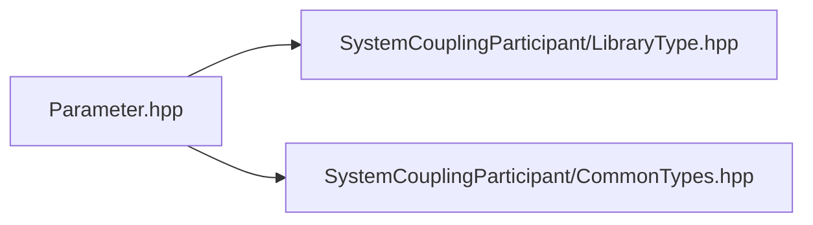

# File Parameter.hpp

![][C++]

**Location**: `Parameter.hpp`


## Classes

* [sysc::Parameter](classsysc_1_1Parameter.md#classsysc_1_1Parameter)

## Namespaces

* [sysc](namespacesysc.md#namespacesysc)

## Includes

* SystemCouplingParticipant/LibraryType.hpp
* SystemCouplingParticipant/CommonTypes.hpp



## Source

```cpp
/*
 * Copyright ANSYS, Inc. Unauthorized use, distribution, or duplication is prohibited.
 */

#pragma once

#include "SystemCouplingParticipant/LibraryType.hpp"

#include "SystemCouplingParticipant/CommonTypes.hpp"

namespace sysc {

class SYSTEM_COUPLING_PARTICIPANT_DLL Parameter {
public:
  explicit Parameter(ParameterName name);

  Parameter(ParameterName name,
            DisplayName displayName);

  const ParameterName& getName() const noexcept;

  const DisplayName& getDisplayName() const noexcept;

private:
  ParameterName m_name;      
  DisplayName m_displayName; 
};

}  // namespace sysc
```

[public]: https://img.shields.io/badge/-public-brightgreen (public)
[C++]: https://img.shields.io/badge/language-C%2B%2B-blue (C++)
[private]: https://img.shields.io/badge/-private-red (private)
[const]: https://img.shields.io/badge/-const-lightblue (const)