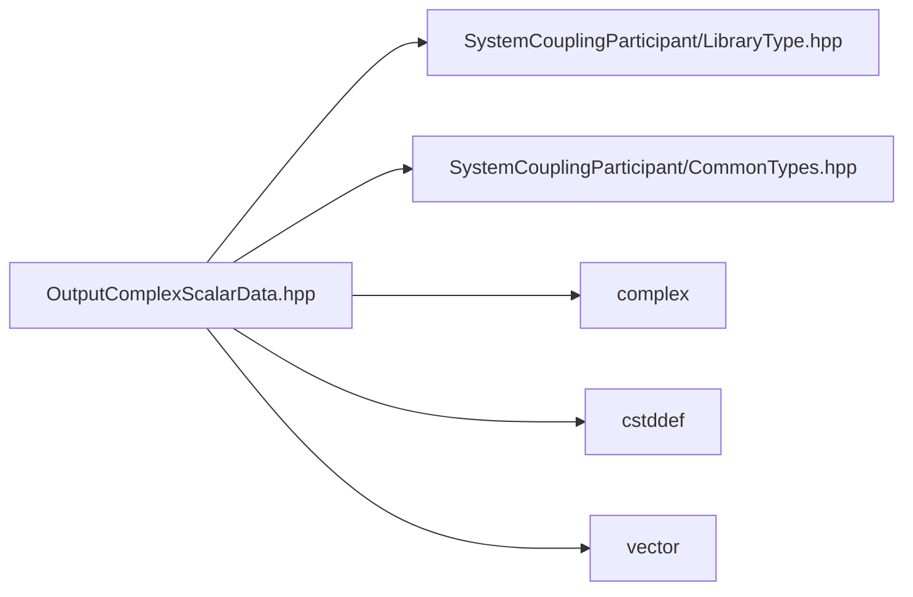

# File OutputComplexScalarData.hpp

![][C++]

**Location**: `OutputComplexScalarData.hpp`


## Classes

* [sysc::OutputComplexScalarData](classsysc_1_1OutputComplexScalarData.md#classsysc_1_1OutputComplexScalarData)

## Namespaces

* [sysc](namespacesysc.md#namespacesysc)

## Includes

* SystemCouplingParticipant/LibraryType.hpp
* SystemCouplingParticipant/CommonTypes.hpp
* <complex>
* <cstddef>
* <vector>



## Source

```cpp
/*
* Copyright ANSYS, Inc. Unauthorized use, distribution, or duplication is prohibited.
*/

#pragma once

#include "SystemCouplingParticipant/LibraryType.hpp"

#include "SystemCouplingParticipant/CommonTypes.hpp"

#include <complex>
#include <cstddef>
#include <vector>

namespace sysc {

class SYSTEM_COUPLING_PARTICIPANT_DLL OutputComplexScalarData {
public:
  OutputComplexScalarData(const std::vector<std::complex<double>>& dataComplex);

  OutputComplexScalarData(const std::complex<double>* dataComplex, std::size_t size);

  OutputComplexScalarData(const double* dataComplex, std::size_t size);

  OutputComplexScalarData(
    const std::vector<double>& dataReal,
    const std::vector<double>& dataImaginary);

  OutputComplexScalarData(
    const double* dataReal,
    const double* dataImaginary,
    std::size_t size);

  OutputComplexScalarData(const std::vector<std::complex<float>>& dataComplex);

  OutputComplexScalarData(const std::complex<float>* dataComplex, std::size_t size);

  OutputComplexScalarData(const float* dataComplex, std::size_t size);

  OutputComplexScalarData(
    const std::vector<float>& dataReal,
    const std::vector<float>& dataImaginary);

  OutputComplexScalarData(
    const float* dataReal,
    const float* dataImaginary,
    std::size_t size);

  OutputComplexScalarData() = default;

  OutputComplexScalarData(const OutputComplexScalarData&) = default;

  OutputComplexScalarData(OutputComplexScalarData&&) = default;

  OutputComplexScalarData& operator=(const OutputComplexScalarData&) = default;

  OutputComplexScalarData& operator=(OutputComplexScalarData&&) = default;

  std::size_t size() const noexcept;

  bool empty() const noexcept;

  sysc::PrimitiveType getDataType() const noexcept;

  bool isSplitComplex() const noexcept;

  const void* getData1() const noexcept;

  const void* getData2() const noexcept;

private:
  sysc::PrimitiveType m_dataType{sysc::Double};
  bool m_isSplitComplex{false};

  const void* m_data1{nullptr};
  const void* m_data2{nullptr};

  std::size_t m_size{0};
};

}  // namespace sysc
```

[public]: https://img.shields.io/badge/-public-brightgreen (public)
[C++]: https://img.shields.io/badge/language-C%2B%2B-blue (C++)
[private]: https://img.shields.io/badge/-private-red (private)
[const]: https://img.shields.io/badge/-const-lightblue (const)