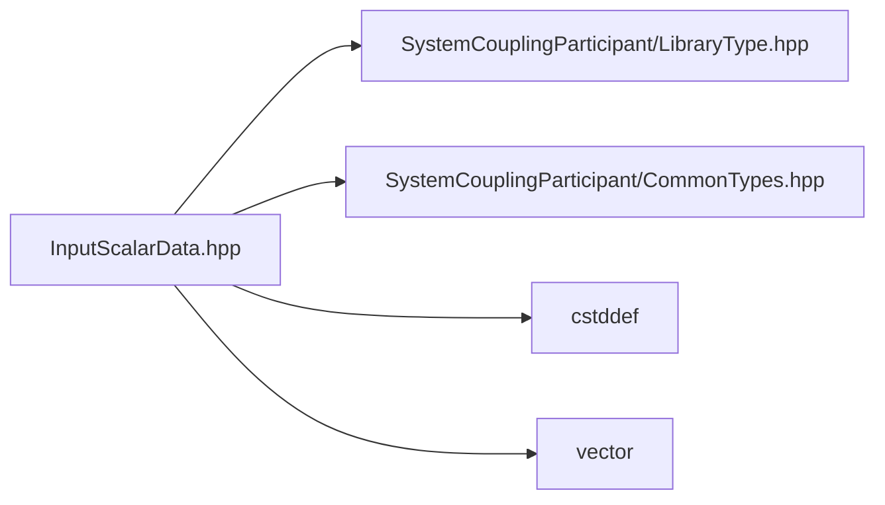

# File InputScalarData.hpp

![][C++]

**Location**: `InputScalarData.hpp`


## Classes

* [sysc::InputScalarData](classsysc_1_1InputScalarData.md#classsysc_1_1InputScalarData)

## Namespaces

* [sysc](namespacesysc.md#namespacesysc)

## Includes

* SystemCouplingParticipant/LibraryType.hpp
* SystemCouplingParticipant/CommonTypes.hpp
* <cstddef>
* <vector>



## Source

```cpp
/*
* Copyright ANSYS, Inc. Unauthorized use, distribution, or duplication is prohibited.
*/

#pragma once

#include "SystemCouplingParticipant/LibraryType.hpp"

#include "SystemCouplingParticipant/CommonTypes.hpp"

#include <cstddef>
#include <vector>

namespace sysc {

class SYSTEM_COUPLING_PARTICIPANT_DLL InputScalarData {
public:
  InputScalarData(
    double* data,
    std::size_t size);

  InputScalarData(
    float* data,
    std::size_t size);

  InputScalarData(std::vector<double>& data);

  InputScalarData(std::vector<float>& data);

  InputScalarData() = default;

  InputScalarData(const InputScalarData&) = default;

  InputScalarData(InputScalarData&&) = default;

  InputScalarData& operator=(const InputScalarData&) = default;

  InputScalarData& operator=(InputScalarData&&) = default;

  std::size_t size() const noexcept;

  bool empty() const noexcept;

  sysc::PrimitiveType getDataType() const noexcept;

  void* getData() const noexcept;

private:
  sysc::PrimitiveType m_dataType{sysc::Double};
  void* m_data{nullptr};
  std::size_t m_size{0};
};

}  // namespace sysc
```

[public]: https://img.shields.io/badge/-public-brightgreen (public)
[C++]: https://img.shields.io/badge/language-C%2B%2B-blue (C++)
[private]: https://img.shields.io/badge/-private-red (private)
[const]: https://img.shields.io/badge/-const-lightblue (const)