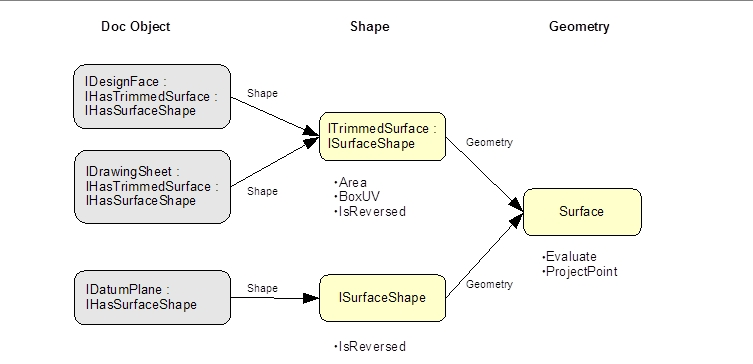

# Shape in general

Shape also applies to doc objects that have untrimmed geometry, for example a datum plane. DatumPlane implements IHasSurfaceShape and its Shape, not surprisingly, is a ISurfaceShape. Compare this to DesignFace, which implements IHasTrimmedSurface and has a Shape of type ITrimmedSurface. This parallel path exists because IHasTrimmedSurface is derived form IHasSurfaceShape, and ITrimmedSurface is derived from ISurfaceShape. Therefore, whether the geometry is untrimmed or trimmed, there is always a two step traversal, first to Shape, and then to Geometry:

