# API description

> **Important Note:** You are reading the documentation for AVxcelerate Asset Preparation API v3 delivered in 2025 R2.
>
> To consult the documentation of the v3 delivered in 2025 R1, go to the [Ansys Developer Portal](https://developer.ansys.com/).
>
> Please refer to the [Changelog](../changelog/changelog.md) to get the complete list of changes introduced in this version.
>
## Overview

Intended for developers who need to streamline the preparation of AVX assets and tracks, AVxcelerate Asset Preparation API exposes the interfaces required to prepare AVX assets and tracks.

It allows you to:

- create geometries,
- apply physical properties
- organize geometries into a scene tree in order to:
  - generate an AVX asset,
  - add the scene tree to an environment to generate an AVX track.

The AVX assets and tracks created using the API can be:

- exported as files written on the disk (.asset or .track), which can be used in a sensors simulation, and also opened in AVxcelerate Asset Preparation Editor

- streamed to the Sensors Simulator API server, see [Data Streaming with Chunk](#streaming-data-with-chunk)

  A Python sample illustrating how to use this exchange format is provided in *Autonomy/AVxcelerateSensors/APIs/Asset_Preparation_API/Samples/Python* (*asset_prep_to_avx_sensors_streaming.py*).

- imported back to Asset Preparation Server for further modifications

Using AVxcelerate Asset Preparation API, you can develop:

- an add-on for a terrain creation tool to export AVX tracks
- an add-on for a 3D computer graphics software to export AVX assets
- a custom exporter to convert data from any standard format (obj or fbx for instance) to the AVX format
- a script to automate the physics-based preparation process of AVX tracks and assets
- a "live terrain creation" capability in your custom co-simulation module (add-on for your driving simulator) created with AVxcelerate Sensors Simulator API

### Current version limitations

Creating animated pedestrians or animated animals is not possible.

This API is meant to be a one-shot AVX Assets and Tracks creation tool. When the Asset Preparation Server is stopped, all the created or imported data, as well as collections and identifiers are removed from the server.

When importing an asset file, the scene tree created on the server has an extra root node compared to the original scene tree. The extra node has the same name as the scene tree.

It is not possible to import an asset or a track if it includes an object in which several states have the same name, or if it includes a geometry with several material parts with the same name.

### Definition of terms

Here are the definitions of some important terms used throughout the AVxcelerate Asset Preparation API.

- An AVX **track** is the world environment in which the sensors simulation will take place. It must be based on the road/track/terrain (the terminology depends on the driving simulator) including the road logic, terrain topography, road and landscape decoration.

- An **Asset** is an element to be included in an AVX sensors simulation, such as a vehicle, a street light or a traffic sign.
  
  - content: geometries (3D representation + properties) organized into a scene tree
  - format: packaged in the format as expected by AVxcelerate Sensors Simulator

- An **Entity** is any object created through the API that can be packaged into an AVX format and exported from the API. Among all the objects that can be created using the API, only the following are entities:
  
  - Scene Tree (asset)
  - Environment (track)
  - Resource
    In the context of the AVxcelerate Asset Preparation API, a **Resource** is an external file that can be uploaded, then referenced as a property of an object. For more details about the accepted type of resources, see [Resource Preparation Service](#resource-preparation-service).

- An **Object** is any component created through the API and accessible via its identifier.

- A unique **Identifier** is automatically assigned to any object as soon as it has been created. This identifier is the key for accessing the binary data representing the object kept in memory.

> **Note**: The "in-memory" data is non-persistent, objects are kept in the "collection" only as long as the server is running.
  
  The identifier of an object is needed for various purposes, for example:
  
- when creating an object under a scene tree: to define its parent
- to reference an object in another service (e.g. referencing a scene tree in an environment, referencing a geometry as a geometry instance under the node of a scene tree, referencing a surface source in the material part properties of a geometry)
- for entities: to export an entity as chunks or as a file (e.g. exporting a scene tree as an asset)
- to edit the properties of an object

### gRPC services

AVxcelerate Asset Preparation API is composed of different [protocol buffer](https://developers.google.com/protocol-buffers) contracts and [gRPC](https://grpc.io/) services.

The main benefit of using gRPC with protocol buffers is that the contract files (.proto) can be compiled into [different programming languages](https://grpc.io/docs/#official-support).

In this document, some code snippets written in C# programming language are provided. Python samples demonstrating the usage of the Asset Preparation API are provided in the *Asset_Preparation_API* folder.

This API includes the following gRPC services:

- [Information service](#information-service)
- [Reset service](#reset-service)
- [Resource Preparation service](#resource-preparation-service)
- [Geometry Preparation service](#geometry-preparation-service)
- [Scene Tree Preparation service](#scene-tree-preparation-service)
- [Environment Preparation service](#environment-preparation-service)
- [Natural Sky Preparation service](#natural-sky-preparation-service)
- [HDRI Sky Preparation service](#hdri-sky-preparation-service)
- [Material Preparation service](#material-preparation-service)
- [Surface Source Preparation service](#surface-source-preparation-service)
- [Directional Light Preparation service](#directional-light-preparation-service)
- [Point Light Preparation service](#point-light-preparation-service)

All those services rely on the [Asset Preparation server](#asset-preparation-server).

## Asset Preparation server

To access the AVxcelerate Asset Preparation API, the server must be started so that the services are active.

The script to start the server is provided in the *Asset_Preparation_API* folder:

- on Windows:  `asset_preparation.ps1` (with the default installation path the script is located in `C:/Program Files/ANSYS Inc/v252/Autonomy/AVxcelerateSensors/APIs/Asset_Preparation_API`)
- on Linux: `asset_preparation.sh` (with the default installation path the script is located in `/ansys_inc/v252/Autonomy/AVxcelerateSensors/APIs/Asset_Preparation_API`)
  
To access the user documentation of the API, launch the script with the `user-doc` argument.

### Supported versions

The Asset Preparation Server delivered in the 2025 R2 product package supports several versions of the API. You must specify which API version must be launched when starting the Asset Preparation Server.

### Port

The default port the server uses to communicate is TCP port 5001. If this port is already used by another application, specify the port parameter when starting the Asset Preparation Server.

### Starting the Asset Preparation server

To start the Asset preparation server, launch the script with the `start` argument and the following parameters:

- `-apiVersion` to specify the version of the API

  > **Note**: If you do not set this parameter, the server will start the API v1.

- `-port` to specify the port to communicate with the Asset Preparation server.  If not set the default port (TCP 5001) is used.

Example on Windows using PowerShell:

```ps
PS C:\Users\myusername> cd "C:\Program Files\ANSYS Inc\v252\Autonomy\AVxcelerateSensors\APIs\Asset_Preparation_API"
PS C:\Program Files\ANSYS Inc\v252\Autonomy\AVxcelerateSensors\APIs\Asset_Preparation_API> .\asset_preparation.ps1 start -apiVersion 3
```

Example on Linux using PowerShell:

```ps
PS /home>cd "/ansys_inc/v252/Autonomy/AVxcelerateSensors/APIs/Asset_Preparation_API"
PS /ansys_inc/v252/Autonomy/AVxcelerateSensors/APIs/Asset_Preparation_API>./asset_preparation.sh start -apiVersion 3
```

### Stopping the Asset Preparation server

To stop the Asset preparation server, launch the script with the `stop` argument.

Example on Windows using PowerShell:

```ps
PS C:\Program Files\ANSYS Inc\v252\Autonomy\AVxcelerateSensors\APIs\Asset_Preparation_API> .\asset_preparation.ps1 stop
```

Example on Linux using PowerShell:

```ps
PS /ansys_inc/v252/Autonomy/AVxcelerateSensors/APIs/Asset_Preparation_API>./asset_preparation.sh stop
```

## Status and error management

All rpc calls return a response containing a **Status**.
The goal of this message is to inform about the level of success of the operations. It contains 3 pieces of information:

- The Level of success:
  - fully successful,
  - successful with warnings,
  - unsuccessful with errors.
- The error code following [gRPC standards](https://grpc.github.io/grpc/core/md_doc_statuscodes.html), most common codes are:
  - 0  for success and warning,
  - 3  if some input parameters are invalid,
  - 5  if an identifier is not found on the server,
  - 11 if some input parameters are out of range.
- The message that describes the operation's status.

## Streaming data with chunk

The **Chunk** message is used for streaming binary data:

- to export tracks or assets as chunks (from the *Environment Preparation* service or *Scene Tree Preparation* service)
- to import tracks or assets from a stream of chunks (from the *Environment Preparation* service or *Scene Tree Preparation* service)
- to upload and download resources (*Resource Preparation* service)

All stream requests or responses in AVX Asset Preparation API use with the following description:

```cs
message Chunk {
  map<string, string> metadata = 1;
  bytes bytes = 2;
}
```

A chunk can include either:

- only metadata,
- only data,
- both metadata and data.

The service receiving the data handles the chunks in the same order as it receives them, and ignores void data. If more than one chunk contains metadata, the maps will be merged in the order they are received, overwriting items with the same keys. Therefore, the service sending the data must send the chunks sequentially.

  For information about using streams as input in AVxcelerate Sensors Simulator, refer to the Upload service in AVX Sensors Simulator API documentation or to the Python sample *asset_prep_to_avx_sensors_streaming.py*.

> **Performance advice**
>
> - Each chunk should not exceed 1MB.
> - If there are several chunks to send:
>   - each chunk should be equal or superior to 256kB,
>   - all the needed metadata should be sent in the first chunk and only the byte array in the other ones.

## Services

> The diagrams in the below *Data Structure* sections aim at illustrating the structure of each object that a service allows you to create. They do not represent the workflow to follow to create AVX entities.

 Diagrams reading convention:

-  Underlined texts represent references to an object or entity created from another service and which is accessible via its identifier. Examples: a scene tree is referenced in an environment, a geometry is referenced in a geometry instance.
-  Boxes with large borders represent elements that can be repeated. Examples: a scene tree can have one or several child nodes, a geometry can include one or several material parts, a vertices array can include one vertex or several vertices.
-  Dashed boxes represent objects or properties that are optional or only required in specific conditions. Examples: the node under a tree may have a child node.
-  Rounded boxes represent possibilities (OneOf). Example: the rotation can be a Quaternion or Euler Angles.

> **Note**:
> To ease the creation of objects using this API, most of the fields in the creation request messages are not required: if a field is not specified, the default value for the field is used. The default value of each field in the messages used in object creation requests are provided in the [Reference](../ref/reference-documentation.md) section of the documentation.
>
> The fields where a reference or an instance is expected however are always required.
>
### Information service

The *Information* service (exposed in the *information/information.proto* file) allows you to check if the server and all the services are running properly.

**Example** - System health check

```cs
var healthClient = new Information.InformationClient(channel);

var healthResponse = healthClient.GetHealth(new Empty());
if (healthResponse == null || !healthResponse.IsHealthy)
{
    Console.Write("Not all services are properly initialized. Please restart the server.");
    return 1;
}
```

### Reset service

The *Reset* service (exposed in the *common/reset.proto* file) allows you to reset the Asset Preparation Server, that is to say to clear all the data from the server. Resetting the server removes from the server all the "in-memory" data, namely all the created or imported data, as well as collections and identifiers.

**Example** - Server reset

```cs
var resetClient = new Reset.ResetClient(channel);
var resetResponse = resetClient.Reset(new Empty());
Console.Write(resetResponse.Status.FeedbackMessage);
```

### Resource Preparation service

The *Resource Preparation* service (exposed in the *resource/resource.proto* file) allows you to upload and download resources, such as textures and spectra to use them in your scene construction.

#### Resource Preparation service input

The *Resource Preparation* service accepts a stream of chunks as input of the **UploadResource** call, see [ResourcePreparation](../ref/reference-documentation.md#resourcepreparation). The service waits for metadata with the `AVX MIMEType` key, which contains the MIMEType of the sent data.

A user-defined name can be provided to the uploaded resource with the `AVX DataName` key, which contains the name of the sent data.

Here are the accepted MIME Types:

- for texture
  - `image/dds`
  - `image/tga`
  - `image/hdr`
  - `image/exr`
  - `image/png`
  - `image/jpg`
  - `image/jpeg`
- for dielectric material
  - `dielectric/dielec`
- for intensity diagram
  - `intensity-diagram/ies`
- for spectrum
  - `spectrum/spectrum`
- for surface state
  - `surface-state/brdf`
  - `surface-state/anisotropicbsdf`
  - `surface-state/scattering`
  - `surface-state/simplescattering`
  - `surface-state/mirror`
  - `surface-state/unpolished`
  - `surface-state/retroreflecting`
  - `surface-state/doe`
  - `surface-state/fluorescent`
  - `surface-state/grating`
  - `surface-state/polarizer`
  - `surface-state/bsdf180`
  - `surface-state/bsdf`
  - `surface-state/coated`
- for volume material
  - `volume-material/material`
- for irradiance map
  - `irradiance-map/xmp`

For irradiance maps, they must comply with the following requirements:

- unit type must be radiometric or spectral,
- spectral definition must be in the Long-wavelength infrared range of the electromagnetic spectrum going from 7 to 14 micrometers,
- merging all the layers into one is highly recommended.

You can generate an irradiance map (.xmp) file with Speos as follows:

1. Create an irradiance sensor. For more details, refer to [Creating an Irradiance Sensor in Ansys Speos User's Guide](https://ansyshelp.ansys.com/account/secured?returnurl=/Views/Secured/corp/v252/en/Optis_UG_ASP/Optis/UG_ASP/T_UG_ASP_sensor_creating_irradiance_sensor.html).
1. Check the orientation of the xmp: +X of the xmp map must correspond to the right lateral direction of the car (+x expressed in car coordinate system).
1. Check the orientation of the xmp:-Y of the xmp map must correspond to the forward direction of the car (-z expressed in car coordinate system).
1. Run a [simulation](https://ansyshelp.ansys.com/account/secured?returnurl=/Views/Secured/corp/v252/en/Optis_UG_ASP/Optis/UG_ASP/simulations_179503.html).

**Example** - send the first chunk containing only metadata

```c#
await call.RequestStream.WriteAsync(new Chunk
{
    Metadata = {
        { "AVX MIMEType", $"image/{Path.GetExtension(filename)[1..]}" },
        { "AVX DataName", $"{Path.GetFileNameWithoutExtension(filename)" }
    }
});
```

#### Resource Preparation service output

The *Resource Description* service outputs chunks as a byte stream from the **DownloadResourceAsChunks** call, see [ResourcePreparation](../ref/reference-documentation.md#resourcepreparation). The service sends metadata with the `AVX MIMEType` key defining the type of the data, with the same format as for the **UploadResource**: `type/subtype` with the original file extension as a subtype, and the `AVX DataName` key defining the name of the data. The data is the stream of the original file.
The identifier of a downloaded resource can then be used to reference the resource in a message of another service.

> **Note:** Irradiance maps cannot be downloaded, neither as chunks, nor as file because after import, the xmp file is converted into a proprietary format which cannot be converted back to the xmp file format.

### Geometry Preparation service

The *Geometry Preparation* service (exposed in the *geometry/geometry.proto* file) allows you to build geometries from vertices.

#### Geometry data structure

Here is the structure of a geometry:

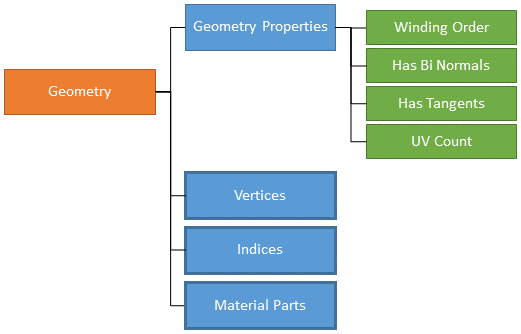

A geometry can include one vertex or several vertices as well as one or several material parts. To associate materials to areas, indices are used to reference the vertices composing the concerned primitives. You will find more details on indices in [Geometry Creation Workflow](#geometry-creation-workflow) and [Indices Example](#indices-example).

Here are the properties of a vertex:

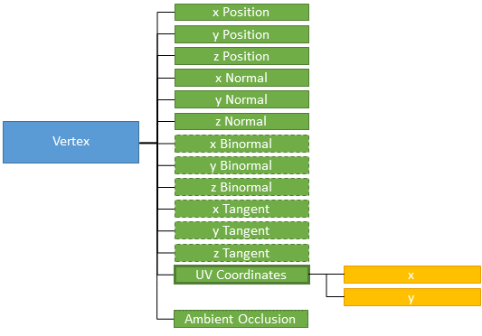

The x, y and z bi-normals are needed only if the `has_binormals` setting in the geometry properties is set to true.

The x, y and z tangents are needed only if the `has_tangents` setting in the geometry properties is set to true.

When the UV count is set to a value superior to zero in the geometry properties, the UV coordinates must be repeated as many times as the value set for the UV count.

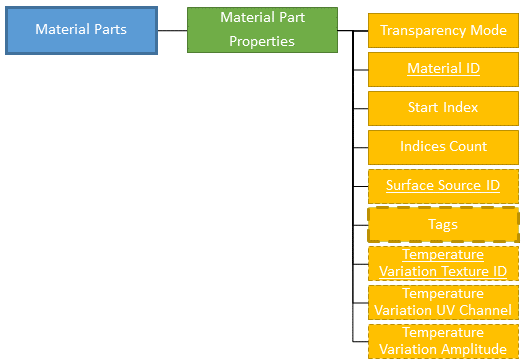

In the **Material Part Properties**:

- a material created using the *Material Preparation* service must be referenced using its identifier (when no material is defined in a material part, the default material is automatically added),
- the `start_index` and `indices_count` fields define the area to which the material is applied (refer to [Geometry creation workflow](#geometry-creation-workflow) and [Indices example](#indices-example) below for more details on indices),
- a surface source created using the *Surface Source Preparation* service may be referenced, using its identifier,
- you can add or remove one or several [tags](#tags) using `added_tags` or `removed_tags`.
- temperature variation settings may also be added.

#### Geometry creation workflow

1. Create a geometry and set its properties
1. Push vertices into the geometry.
1. Push into the geometry the indices of the already pushed vertices. The order in which the vertices and then the indices must be pushed depends on the winding order set in the geometry properties (clockwise, counterclockwise, double-sided).
1. Create one or several material parts.
1. In the properties of each material part, set the value of the following two fields to reference the area to which the material will be applied:
    - `start_index`, which defines the position in the indices array of the first index of the area (this will be the starting point from which the indices will be counted),
    - `indices_count`, which defines the number of indices of the area from the indices array.

> **Note:** Pushed vertices and indices are respectively stored in a vertices array and an indices array. Those arrays have zero-based numbering, meaning that the value of the index to reference the very first vertex of the array is 0 and not 1.

#### Indices example

A geometry has been created; the winding order set in its properties is clockwise.

Five vertices have been pushed into the geometry: V<sub>0</sub>, V<sub>1</sub>, V<sub>2</sub>, V<sub>3</sub>, V<sub>4</sub>. The geometry is then composed of 3 primitives: A, B and C.

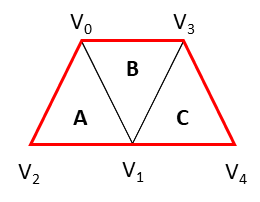

The indices of each primitive are:

- 0 1 2 for primitive A
- 0 3 1 for primitive B
- 3 4 1 for primitive C

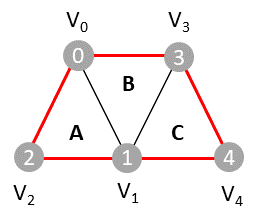

Therefore, to be able to identify areas (primitives A, B and C) in order to associate materials with, the following 9 indices must be pushed in this order (clockwise) in the indices array:

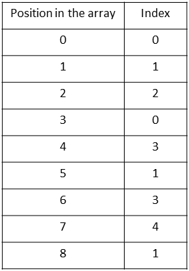

Let's see how to associate a material with primitive A and another material to the area composed of primitives B and C.

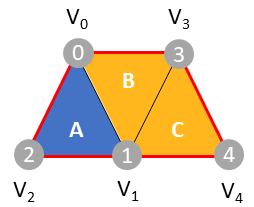

To reference primitive A in the properties of a Material Part:

- the index of the first vertex of this area is 0 which is in position 0 in the indices table, so the `start_index` is 0,
- the number of indices that define this area in the indices array is 3, so the `indices_count` is 3.

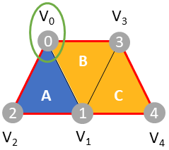

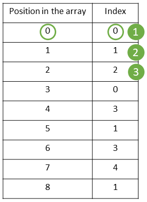

To reference the area composed by primitives B and C in the properties of a Material Part:

- the index of the first vertex of this area is 0 which is in position 3 in the indices table, so the `start_index` is 3,
- the number of indices that define this area in the indices array is 6, so the `indices_count` is 6.


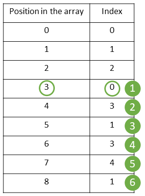

#### Geometry Preparation service inputs

The inputs of the *Geometry Preparation* service are:

- a 3D component in any basic exchange format (for instance fbx, obj), proprietary format or any data as long as the geometries description at the vertices and polygons levels can be retrieved (for instance from an API),
- the Identifier of a material that has been created with the *Material Preparation* service,
- optionally, the Identifier of a surface source that has been created using the *Surface Source Preparation* service.

#### Geometry Preparation service outputs

The output of the *Geometry Preparation* service is the binary data of the geometry with an identifier. This identifier is to be used in the *Scene Tree Preparation* service to reference the created geometry as a geometry instance in a scene tree.

Geometries are not meant to be exported as files or as chunks.
For each geometry that is referenced in a scene tree which is exported as a .asset file from the *Scene Tree* service (**GetAssetFile** call), or referenced in a scene tree that is referenced in an environment exported as a .track file from the *Environment* service (**GetTrackFile**), a .mesh file (with its associated .geometry file) is created.
In other words, a geometry created through the API corresponds to a mesh in AVxcelerate Asset Preparation Editor.

### Scene Tree Preparation service

The *Scene Tree Preparation* service (exposed in the *scenetree/scenetree.proto* file) allows you to build scene trees from geometries.

#### Scene Tree data structure

Here is the structure of a scene tree:

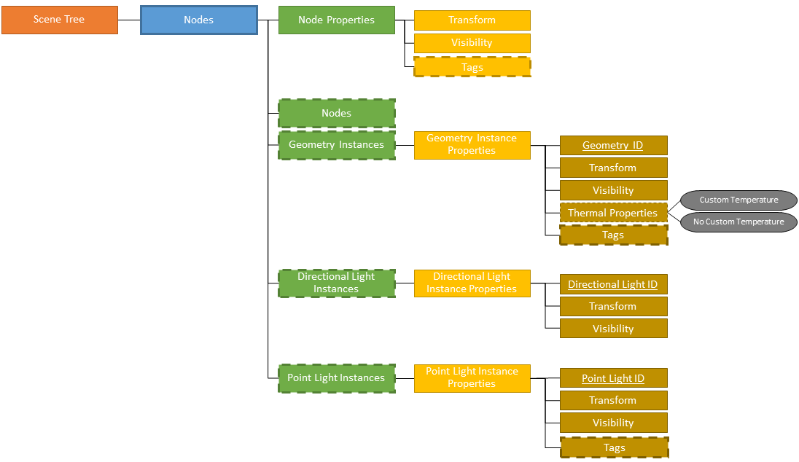

You can add or remove one or several [tags](#tags) using `added_tags` or `removed_tags` in:

- **Node Properties**
- **Geometry Instance Properties**
- **Point Light Instance Properties**

Here is the structure of a transform:

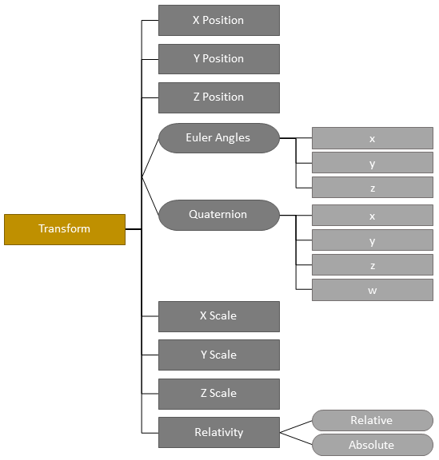

#### Tags

The **Tag** message, exposed in the *common/tag.proto* file, allows you to specify parts of interest so that the assets are properly animated during the simulation. Refer to the tags listed [here](../ref/reference-documentation.md#tag) for the expected case of each tag.

There are two main categories of tags: `Basic` and `Lighting System`.

Here are the Tags of the `Basic` category:

- Pedestrian
- Vehicle
- Animal
- Street Light
- Road Sign
- Simulation Object (corresponds to the **Object** tag in AVxcelerate Asset Preparation Editor)
- Custom Object (corresponds to the **Custom** tag in AVxcelerate Asset Preparation Editor)
- Vehicle Body
- Sensor Referential
- Lighting System Referential
- Wheel
- Steering Wheel
- Illuminance Sensor

Basic tags can be added to Nodes and Geometry Instances, except for Illuminance Sensor tag which can only be added to Nodes.

Here are the Tags of the `Lighting System` category:

- Brake Light
- Low Beam
- High Beam
- Turn Indicator
- Rear Fog Light
- Front Fog Light
- Side Light
- Rear Position Light
- Reverse Light
- License Plate Light
- Daytime Running Light

Lighting System tags can be added to Nodes, Geometry Instances, Point Lights Instances and Material parts.

A property is required for the following tags:

- the Custom Object tag requires a `Name` set in its **Properties**
- the Wheel tag requires an `Identifier` set in its **Properties**
- the Daytime Running Light and Turn Indicator tags require a `Position` set in the tag's **Properties**

The following tags can hold an optional `Label` set in its **Properties**: Pedestrian, Vehicle, Animal, Street Light, Road Sign, Simulation Object and Custom Object.

The Vehicle tag can hold an optional `Irradiance Map Identifier` set in its **Properties**, which is the Identifier of an irradiance map created using the *Resource Preparation* service.

#### Scene Tree Preparation service inputs

The inputs of the *Scene Tree Preparation* service are:

- the geometries (referenced to using identifiers) that have been created with the *Geometry Preparation* service,
- optionally, the directional lights (referenced to using identifiers) that have been created with the *Directional Light Preparation* service,
- optionally, the point lights (referenced to using identifiers) that have been created with the *Point Light Preparation* service.

A scene tree can also be created on the server by importing a .asset file using the **PutSceneTreeFromAssetFile** call, or by uploading a stream of chunks using the **PutSceneTreeFromAssetChunks** call.
All the dependencies of the imported scene tree are also uploaded into the corresponding services.

The import operation triggers a check for conflicts between the objects already existing on the server and the objects to import based on their names, except for scene trees, light instances, nodes and material parts.
How the conflicting objects are handled is ruled by:

- the `Name Conflict Policy` field of the **PutSceneTreeFromAssetFileRequest** message for **PutSceneTreeFromAssetFile**, see [ConflictPolicy](../ref/reference-documentation.md#conflictpolicy).
- the `AVX ConflictPolicy` metadata which must be provided in the first chunk for **PutSceneTreeFromAssetChunks**.
  The `AVX ConflictPolicy` metadata should be one of the following text strings (case-insensitive):

  - `Stop` or `CONFLICT_POLICY_STOP`
  - `KeepExisting` or `CONFLICT_POLICY_KEEP_EXISTING`
  - `Override` or `CONFLICT_POLICY_OVERRIDE`
  - `KeepBoth` or `CONFLICT_POLICY_KEEP_BOTH`

**Note**: When importing an asset file, the scene tree created on the server has an extra root node compared to the original scene tree. The extra node has the same name as the scene tree.

#### Scene Tree Preparation service outputs

Here are possible outputs of the *Scene Tree Preparation* service.

- The binary data of the scene tree with an identifier. This identifier can be used to reference the created scene tree in an environment.
- Chunks of binary data from the **GetAssetChunks** call, see [SceneTreePreparation](../ref/reference-documentation.md#scenetreepreparation). The data is the content of the asset.
- A .asset file from the **GetAssetFile** call, see [SceneTreePreparation](../ref/reference-documentation.md#scenetreepreparation).
  When the .asset file exported from the API is imported in AVxcelerate Asset Preparation Editor, the scene tree is converted to one .scenetree file.

### Environment Preparation service

The *Environment Preparation* service (exposed in the *environment/environment.proto* file) allows you to build environments from scene trees.

#### Environment data structure

Here is the structure of an environment:

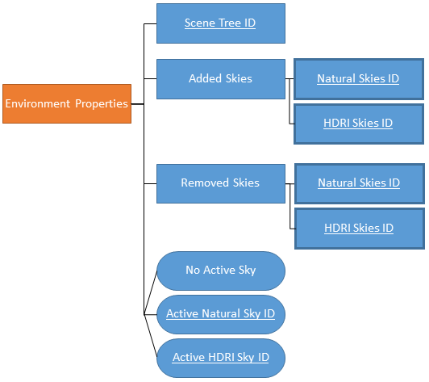

An environment references a scene tree created from the *Scene Tree Preparation* service via its identifier. It also includes one or several skies, created from the *Natural Sky Preparation* service or *HDRI Sky Preparation* service, which are referenced via their identifiers. One of these skies can be set as the active sky.
If there is no active sky defined, the first sky added to the environment will be set as active.
If there is no sky added to the environment, a default natural sky is automatically created, added to the track and set as the active sky.

#### Environment Preparation service inputs

The inputs of the *Environment Preparation* service are:

- the scene tree (referenced to using its identifier) that has been created with the *Scene Tree Preparation* service,
- a list of natural skies that have been created with the *Natural Sky Preparation* service, and/or a list of HDRI skies that have been created with the *HDRI Sky Preparation* service, in the lists skies are referenced to using their identifiers,
- the identifier of one sky, natural or HDRI, added to the environment to be set as the active sky.

An environment can also be created on the server by importing a .track file using the **PutEnvironmentFromTrackFile** call, or by uploading a stream of chunks using the **PutEnvironmentFromTrackChunks** call.
All the dependencies of the imported environment are also uploaded into the corresponding services.

The import operation triggers a check for conflicts between the objects already existing on the server and the objects to import based on their names, except for scene trees, light instances, nodes and material parts.
How the conflicting objects are handled is ruled by:

- the `Name Conflict Policy` field of the **PutEnvironmentFromTrackFileRequest** message for **PutEnvironmentFromTrackFile**, see [ConflictPolicy](../ref/reference-documentation.md#conflictpolicy).
- the `AVX ConflictPolicy` metadata which must be provided in the first chunk for **PutEnvironmentFromTrackChunks**.
  The `AVX ConflictPolicy` metadata should be one of the following text strings (case-insensitive):

  - `Stop` or `CONFLICT_POLICY_STOP`
  - `KeepExisting` or `CONFLICT_POLICY_KEEP_EXISTING`
  - `Override` or `CONFLICT_POLICY_OVERRIDE`
  - `KeepBoth` or `CONFLICT_POLICY_KEEP_BOTH`

#### Environment Preparation service outputs

The different outputs of the *Environment Preparation* service are:

- chunks as a byte stream from the **GetTackChunks** call, see [EnvironmentPreparation](../ref/reference-documentation.md#environmentpreparation). The data is the content of the track.
- a .track file from the **GetTrackFile** call, see [EnvironmentPreparation](../ref/reference-documentation.md#environmentpreparation).
  When the .track file exported from the API is imported in AVxcelerate Asset Preparation Editor, the environment is converted to one .env file.

### Natural Sky Preparation service

The *Natural Sky Preparation* service (exposed in the *naturalSky/natural_sky.proto* file) allows you to create, edit and manage natural skies.

#### Natural Sky data structure

Here is the structure of a natural sky:


Once a natural sky is created, it is possible to create several states in it, each state including a distinct set of natural sky properties.

#### Natural Sky Preparation service Output

The output of the *Natural Sky Preparation* service is the binary data of the sky with an identifier. This identifier is to be used in the *Environment Preparation* service to reference the created sky in an environment.

Natural skies are not meant to be exported as files or as chunks.

### HDRI Sky Preparation service

The *HDRI Sky Preparation* service (exposed in the *hdriSky/hdri_sky.proto* file) allows you to create, edit and manage HDRI skies.

#### HDRI Sky data structure

Here is the structure of an HDRI sky:

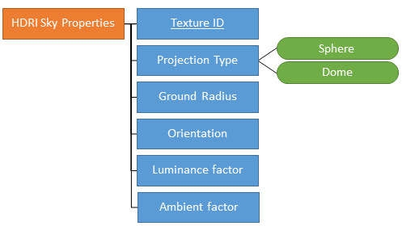

Once an HDRI sky is created, it is possible to create several states in it, each state including a distinct set of HDRI sky properties.

#### HDRI Sky Preparation service input

For HDRI skies, the identifier of a texture created using the *Resource Preparation* service is required as an input.

#### HDRI Sky Preparation service output

The output of the *HDRI Sky Preparation* service is the binary data of the sky with an identifier. This identifier is to be used in the *Environment Preparation* service to reference the created sky in an environment.

HDRI skies are not meant to be exported as files or as chunks.

### Material Preparation service

The *Material Preparation* service (exposed in the *material/material.proto* file) allows you to create, edit and manage materials.

  > **Note**: The sample *geometry_generation_gltf.py* does not create materials, it uses physics-based materials provided in a library and on a mapping file.

#### Material data structure

Here is the structure of a material:

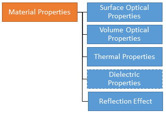

Once a material is created, it is possible to create several states in it, each state including a distinct set of material properties.

The data structure of each of the following sub-sets of material properties is detailed in the below sections:

- [Surface Optical Properties](#surface-optical-properties)
- [Volume Optical Properties](#volume-optical-properties)
- [Thermal Properties](#thermal-properties)
- [Dielectric Properties](#dielectric-properties), which are optional
- [Reflection Effect Properties](#reflection-effect-properties)

##### Surface Optical Properties

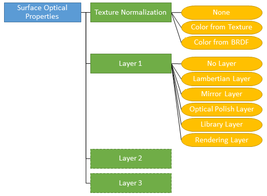

Then, the sub-sets of properties to define depend on the layer type.

###### Lambertian Layer

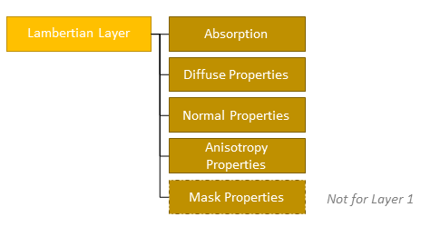

###### Mirror Layer

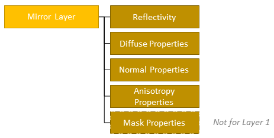

###### Optical Polish Layer

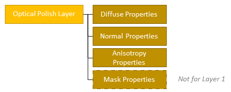

###### LibraryLayer

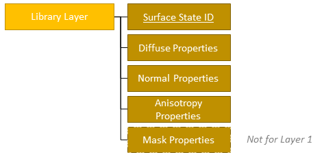

###### Rendering Layer

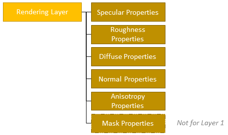

###### Layers Properties


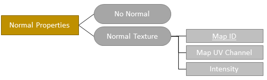


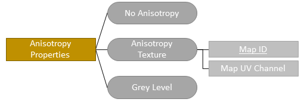

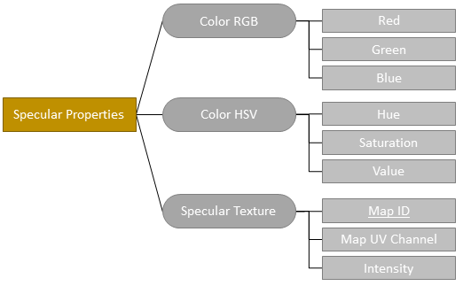

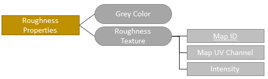

##### Volume Optical Properties

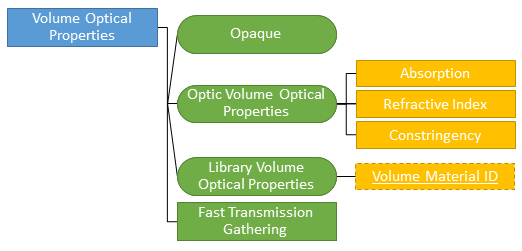

There are 3 possible types of Volume Optical Properties: Opaque, Optic and Library.
When the Volume Optical Properties type is set to `Library`, the identifier of a volume material created using the *Resource Preparation* service must be referenced.

##### Thermal Properties

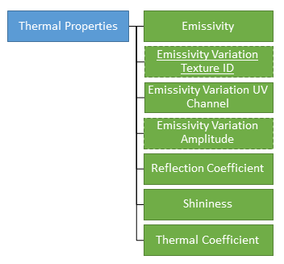

The `Emissivity Variation Texture Identifier` is optional. When set, the identifier of texture created using the *Resource Preparation* service must be referenced.
The `Emissivity Variation Amplitude` is required only when an `Emissivity Variation Texture Identifier` has been set.

##### Dielectric Properties


The `Dielectric Properties` are optional.
If you want to define the dielectric properties of the material, the identifier of a dielectric material created using the *Resource Preparation* service must be referenced.

##### Reflection Effect Properties

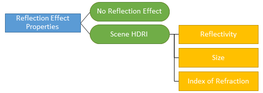

There are 2 possible types of reflection effect: `No Reflection Effect` and `Scene HDRI`.
When the Reflection Effect Type is set to `Scene HDRI`, the `Reflectivity`, `Size` and `Index of Refraction` parameters must be set.

#### Material Preparation service inputs

The identifier of a resource created using the *Resource Preparation* service is needed as an input in some cases.

- For the Diffuse, Normal, Mask, Anisotropy, Specular and/or Roughness Properties with the `texture` contribution type, the identifier of a texture is required.
- For `Library Volume Optical Properties`, the identifier of a volume material is required.
- If you want to define `Dielectric Properties`, the identifier of a dielectric material is required.
- In the `Thermal Properties`, if you want to set an Emissivity Variation from a texture, the identifier of a texture is required.
  
#### Material Preparation service output

The output of the *Material Preparation* service is the binary data of the material with an identifier. This identifier can be used in the *Geometry Preparation* service to reference the created material under a material part.

Materials are not meant to be exported as files or as chunks.

### Surface Source Preparation service

The *Surface Source Preparation* service (exposed in the *surfaceSource/surfacesource.proto* file) allows you to create, edit and manage surface sources and display sources.

#### Surface Source data structure

Here is the structure of a source:

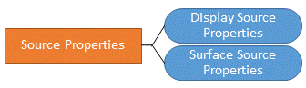

Once a surface source is created, it is possible to create several states in it, each state including a distinct set of properties.

Here is the structure of a surface source:

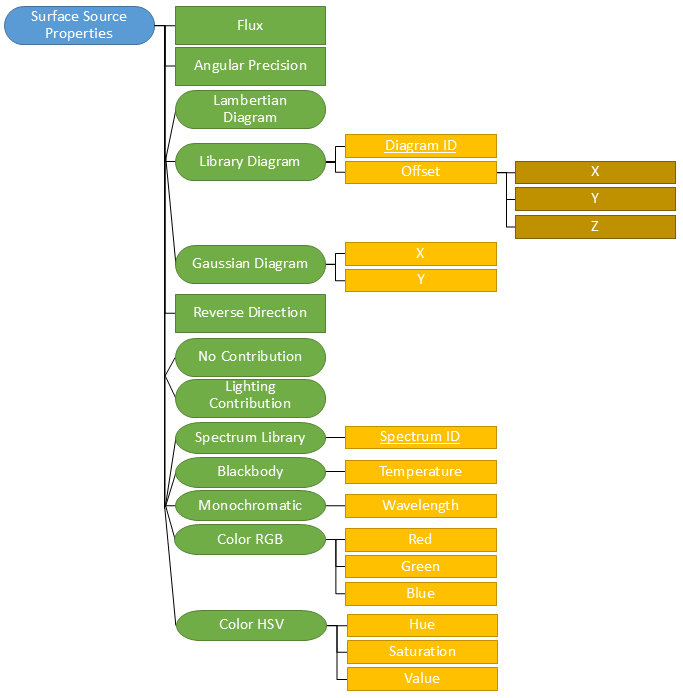

Here is the structure of a display source:

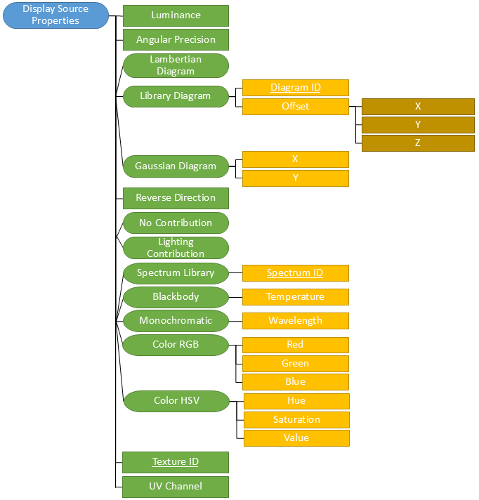

There are three possible types of angular diagram. When the angular diagram type is set to `Library`, the identifier of an intensity diagram created using the *Resource Preparation* service must be referenced.

In the properties of a surface source or display source, you can define whether it contributes to the ambient lighting (`Lighting Contribution`) or not (`No Contribution`).

There are five possible types of spectrum. When the texture type is set to `Library`, the identifier of a spectrum created using the *Resource Preparation* service must be referenced.

For display sources, the identifier of a texture created using the *Resource Preparation* service must be referenced.

Here are the properties for the lighting contribution:

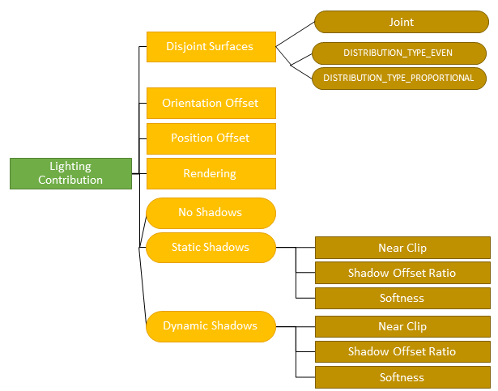

#### Surface Source Preparation service inputs

The identifier of a resource created using the *Resource Preparation* service is required as an input:

- for `Library Diagram` (identifier of an intensity diagram),
- for `Spectrum Library` (identifier of a spectrum),
- for display sources (identifier of a texture).

#### Surface Source Preparation service output

The output of the *Surface Source Preparation* service is the binary data of the surface source with an identifier. This identifier can be used in the *Geometry Preparation* service to reference the created surface source under a material part.

Surface sources are not meant to be exported as files or as chunks.

### Directional Light Preparation service

The *Directional Light Preparation* service (exposed in the *directionalLight/directionallight.proto* file) allows you to create, edit and manage directional lights.

#### Directional Light data structure

Here is the structure of a directional light:

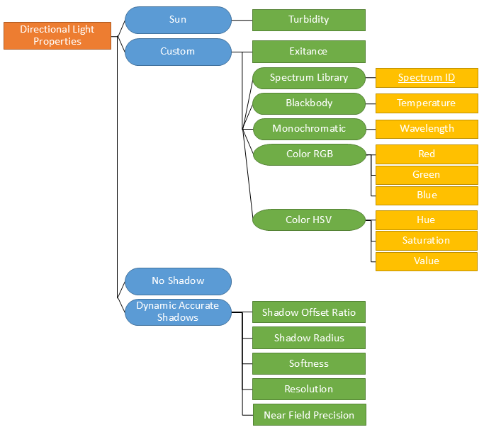

There are two possible types of directional light: `Sun` or `Custom`.

In the properties of a directional light, you can define whether it casts shadows (`Dynamic Accurate Shadows`) or not (`No Shadows`).

Once a directional light is created, it is possible to create several states in it, each state including a distinct set of properties.

#### Directional Light Preparation service inputs

For `Custom` type with a `Spectrum Library`, the identifier of a spectrum created using the *Resource Preparation* service is required as an input.

#### Directional Light Preparation service output

The output of the *Directional Light Preparation* service is the binary data of the directional light with an identifier.
This identifier can be used in the *Scene Tree Preparation* service to reference the created directional light as a directional light instance under a node.

Directional Lights are not meant to be exported as files or as chunks.

### Point Light Preparation service

The *Point Light Preparation* service (exposed in the *pointLight/pointlight.proto* file) allows you to create, edit and manage point lights.

#### Point Light data structure

Here is the structure of a point light:

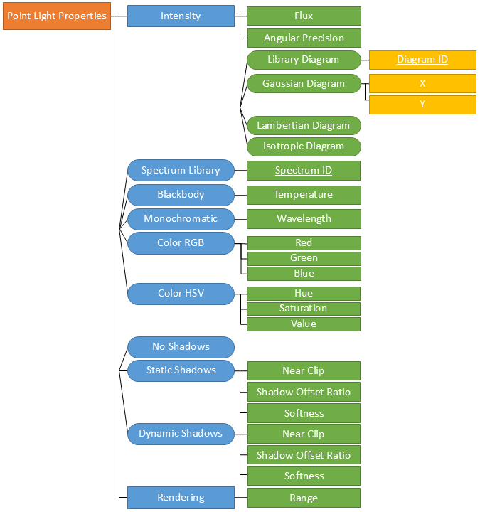

Once a point light is created, it is possible to create several states in it, each state including a distinct set of properties.

#### Point Light Preparation service inputs

When the Spectrum type is `Spectrum Library`, the identifier of a spectrum created using the *Resource Preparation* service is required as an input.
When the Intensity diagram type is `Library Diagram`, the identifier of an intensity diagram created using the *Resource Preparation* service is required as an input.

#### Point Light Preparation service output

The output of the *Point Light Preparation* service is the binary data of the point light with an identifier.
This identifier can be used in the *Scene Tree Preparation* service to reference the created point light as a point light instance under a node.

Point Lights are not meant to be exported as files or as chunks.

## AVxcelerate Asset Preparation API outputs

The outputs of the AVxcelerate Asset Preparation API, namely AVX assets and tracks, can now be set as inputs for AVxcelerate Sensors Simulator.

### Asset and Track streams

For tracks and assets exported as a byte stream from the AVxcelerate Asset Preparation API, you must use the AVxcelerate Sensors Simulator APIs to set them as inputs for a sensors simulation.

1. Use a dedicated grpc streaming service to stream the chunks (byte array) from the AVxcelerate Asset Preparation API server to the AVxcelerate Sensors Simulator API server.
1. Request the stream upload from the **Resource Uploader** service of AVxcelerate Sensors Simulator APIs.
1. Set the identifier of the uploaded resource the **LOAD** command > **Configuration** message > `SceneInfo` field:

    - **AssetInfo** > **Assets** > **ResourceIdentifier** > **ID**
    - **Track** > **ResourceIdentifier** > **ID**

Refer to the AVXCELERATE Sensors Simulator API Documentation published on the [Ansys Developer Portal](https://developer.ansys.com/).

### Asset and Track files

To check the .asset and .track files created using this API, open the files in AVxcelerate Asset Preparation Editor, refer to [AVxcelerate Asset Preparation User's Guide](https://ansyshelp.ansys.com/account/secured?returnurl=/Views/Secured/corp/v252/en/Optis_UG_VRXP/index.html).

To set the .asset and .track files as inputs for AVxcelerate Sensors Simulator for a co-simulation with CarMaker:

1. add the references to the .asset and .track files into the json co-simulation mapping file (refer to [Mapping AVX to CarMaker Track and Assets](https://ansyshelp.ansys.com/account/secured?returnurl=/Views/Secured/corp/v252/en/Optis_UG_VSS/Optis/shared/reusable_topics/tasks/T_UG_VSS_mapping_CM_assets.html) or [Mapping AVX to SCANeR Assets](https://ansyshelp.ansys.com/account/secured?returnurl=/Views/Secured/corp/v252/en/Optis_UG_VSS/Optis/UG_VSS/T_UG_VSS_mapping_assets.html))
1. set the mapping file in the connector parameters (refer to [Setting the AVXConnector Parameters](https://ansyshelp.ansys.com/account/secured?returnurl=/Views/Secured/corp/v252/en/Optis_UG_VSS/Optis/shared/reusable_topics/tasks/T_UG_VSS_setting_AVXConnector_settings.html) or [Applying the Configuration Files to a SCANeR Scenario](https://ansyshelp.ansys.com/account/secured?returnurl=/Views/Secured/corp/v252/en/Optis_UG_VSS/Optis/UG_VSS/T_UG_VSS_setting_AVXConnector_settings.html)).

To set the .asset and .track files as inputs for AVxcelerate Sensors Simulator through a custom connector built upon AVxcelerate Sensors Simulator API, define them in the *Simulation Control* service > **LOAD** command > **Configuration** message > `SceneInfo` field. Refer to the AVXCELERATE Sensors Simulator API Documentation published on the [Ansys Developer Portal](https://developer.ansys.com/).
