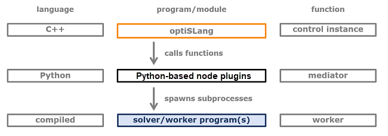

# Python-Based Plugins

The following topics cover the custom integration version. It is currently the only version recommended for writing new integration plugins. Documentation for previous versions can be found in the help content of previous releases.

Python-based node plugins are written in Python and coded against a Python API. The API is written in C++. This creates interacting modules as shown in the following image:

You implement a set of functions in the Python code of the plugin. By calling function after function, the sequence of work steps is driven. The layer of Python functions in direct contact with the plugin interface must follow strong conventions, while the other parts of your plugin code can be freely designed.

For more information, see the following topics:

- [Algorithms](opti_api_python_algorithms.md)
- [Extraction Toolkit](opti_api_python_extraction_toolkit.md)
- [File Access](opti_api_python_file_access.md)
- [Nodes](opti_api_python_nodes.md)
- [Postprocessing](opti_api_python_postprocessing.md)
- [Surrogates](opti_api_python_surrogates.md)
- [Wizards](opti_api_python_wizards.md)
- [QML Based User Interfaces](opti_api_python_qml.md)