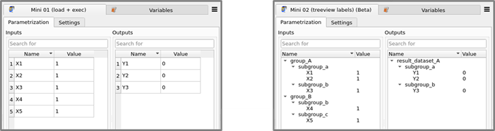
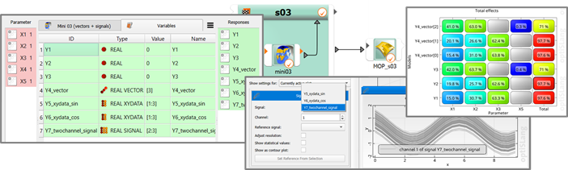
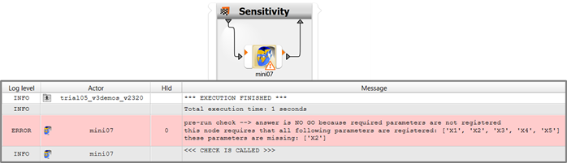
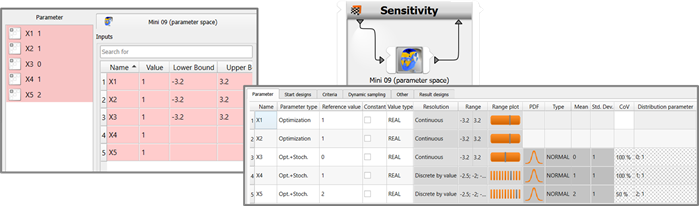
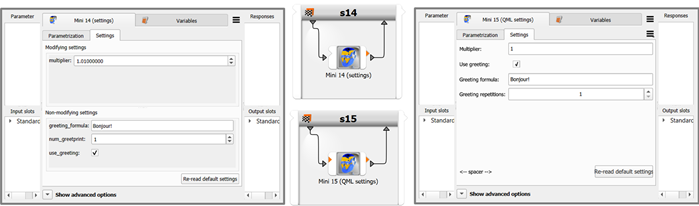

# Minimalistic Demos

The minimalistic demos are made of very simple codes and represent integration nodes of the file-less sort. Therefore, not even a reference file has to be picked. This means that they run really out of the box after being dropped anywhere in the scenery and registering parameters. With the exception of one somewhat more comprehensive case, they are generally written to spotlight only one aspect or feature per demo. Because of their barebone character, they might be described as substandard or less than ideally robust or not fully real-world-worthy in their off-spotlight code parts.

- [Mini demo zero (abstract_demo)](#mini-demo-zero-abstract_demo)
- [Mini demo 1 (most simple = load and execute)](#mini-demo-1-most-simple--load-and-execute)
- [Mini demo 2 (tree view labels)](#mini-demo-2-tree-view-labels)
- [Mini demo 3 (vectors and signals)](#mini-demo-3-vectors-and-signals)
- [Mini demo 4 (maturity level)](#mini-demo-4-maturity-level)
- [Mini demo 5 (multi-designs)](#mini-demo-5-multi-designs)
- [Mini demo 6 (extra slots)](#mini-demo-6-extra-slots)
- [Mini demo 7 (pre-run check)](#mini-demo-7-pre-run-check)
- [Mini demo 8 (slots and pre-run check)](#mini-demo-8-slots-and-pre-run-check)
- [Mini demo 9 (ready-made parameter definitions)](#mini-demo-9-ready-made-parameter-definitions)
- [Mini demo 10 (initialize and shutdown)](#mini-demo-10-initialize-and-shutdown)
- [Mini demo 11 (try-except)](#mini-demo-11-try-except)
- [Mini demo 12 (incomplete designs)](#mini-demo-12-incomplete-designs)
- [Mini demo 13 (abort mode)](#mini-demo-13-abort-mode)
- [Mini demo 14 (settings)](#mini-demo-14-settings)
- [Mini demo 15 (QML settings)](#mini-demo-15-qml-settings)
- [Mini demo 16 (comprehensive)](#mini-demo-16-comprehensive)
- [Mini demo 17 (the FileBased flag)](#mini-demo-17-the-filebased-flag)

## Mini demo zero (abstract_demo)
This is a minimal version of the minimal barebone demo 1, stripped down to such a degree that all by itself it admittedly does not offer a lot of helpfulness in the sense of a regular tutorial. While it has no justification as a how-to guide for real-world cases, the motivation behind this abstract demo is to serve as illustration for communicating a possible abstract view that the formal requirements for providing an integration plugin in optiSLang are in principle extremely low. What is required is in many cases not more than providing implementations of the two functions `load` and `execute`.

To exploit this abstract point of view even more, we can formulate that providing a Python-based integration plugin is in principle not a hard task because
- often times it suffices to implement the two functions `load` and `execute`,
- both functions are conceptionally very simple,
- in the `load` function, the plugin tells optiSLang about available parametrizable input and output connections,
- in the `execute` function, the plugin receives a new parametric variation and returns to optiSLang the solver results gained from evaluating this specific variation,
- and everything else can be seen as adding details to the basic principle.

While real-world experience tends to prove that providing a plugin becomes a nontrivial task when aiming at combining high flexibility and good usability while considering a set of features offered by a given solver program with long established particularities in project structure and user community habits, it can be helpful to keep the abstract view point represented by the abstract demo in the back of our minds because this may help as guiding line when designing and redesigning the layout of smaller or larger plugin libraries. The abstract view point helps to discern between adjunct or preipherical functionalities on the one hand (like namings, settings, GUI niceties, data cache time-savers, HPC job prepping, etc.) and the core functionality of **making parametrization possible** and **driving design evaluation** on the other hand. All the adjunct features are only to serve the usability of the core functionality. What plugin users are seeking primarily is the core functionality, and for plugin authors the provision of the core functionality is a conceptually simple task.

## Mini demo 1 (most simple = load and execute)
A minimal demo, it represents the barebone essentials needed in order to create an integration node plugin. With only the two callback functions `load` and `execute` implemented, you can provide a functioning integration node.

## Mini demo 2 (tree view labels) 
If you need to pick a small set of elements from a large set of existing items, a tree view with collapsable or expandable branches and subbranches can be very helpful and advantageous compared to non-collapsable tabular views. optiSLang supports a tree view mode for both input and output listings. The tree view becomes active based on two prerequisites: firstly, the treeview mode has to be enabled in global settings of optiSLang and secondly, the plugin author has to supply labels for a desired amount of branching layers. The picture below shows on the right hand side how optiSLang renders the tree view mode when both preconditions are met.

The tree structure is just a display mode, the underlying data structure remains the same flat list-like structure, in which in all cases the bare parameter name is the identifier that counts. The tree view labels are only of relevance at configuration time for the function `load`; they are irrelevant during evaluation time in the function `execute`.

## Mini demo 3 (vectors and signals) 
Besides scalars, there are two more very important types of objects that an integration node can forward to optiSLang and that can be registered as parametric study response when users are setting up a node: vectors and signals. A vector is a list of scalars. A signal is a one-dimensional list of data points accompanied by abscissa coordinate info. Signals can generally have multiple data channels, but there exists a special simplified signal container type, called xydata, which can hold only one data channel. The table below indicates constructors and converters available in the [Python API](https://developer.ansys.com/docs/optislang) for making these container objects, and the demo showcases their usage.

| Data Structure           | List Converter Function        |
|-------------------------|-------------------------------|
| vector                  | list_2_variant_vector          |
| single-channel signal   | list_2_variant_xy_data         |
| signal                  | list_list_2_variant_vector     |

What happens to vectors and signals? If simply drag-n-drop-registering the objects collected in the mini demo 3 node without any further editing, then a sensitivity system followed by a MOP node will yield the situation shown in the image below, and this highlights some important facts which integration plugin authors should keep in mind.

The calculator tab of the node edit dialog features illustrative data type icons in the **type** column. The CoP matrix view reveals that the vector object Y4 of length *N* = 3 adds three response surfaces to the MOP node output. By contrast, the signal objects of length *N* = 3 are not adding to the set of response surfaces. Instead, the signal objects are taken up by the signal plot (which can be found in the data mining group of plot categories) which is in turn blind to vectors. This reflects long-standing optiSLang conventions.

As plugin author you have to decide how your new plugin offers solver output data to users for drag-n-drop registration. The plugin can offer a given data series as vector or signal or both. Such a design decision should have the future user community and what they will want to do with the data in mind. The goals are to balance comprehensiveness agains clarity of the output detection listing on the one hand, and to minimize anticipated necessary work on further data object derivation in the calculator tab on the other hand.

## Mini demo 4 (maturity level)
This demo highlights the meaning of the maturity level flag in the config file. The flag controls plugin visibility, and the second effect is the addition of a suffix "(Beta)" or "(Deprecated)" to the display name. Plugins marked **beta** are only visible if users have chosen to display beta modules via the **View** entry in the main menu. Plugins marked *deprecated* are unconditionally invisible in the modules library. Display in the scenery and plugin execution are not affected.

## Mini demo 5 (multi-designs) 
Multi-design grouping is very easy to activate in the config file via the flag `EnableMultiDesignMode`. But if a solver truly supports multi-design batch processing, then some extra interfacing work has to be taken care of in the integration plugin code: on the one hand collecting parameter values into design variation tables of the format required by the solver and on the other hand back-distributing job result data structures to feed them back to optiSLang on a per-design basis. The little demo brings this to awareness.

In the `execute` function, at the place where in all other demos you find a simple loop treating the designs in the incoming design container sequentially and independently, here there is a more complex process of three steps: (1) design table compilation, (2) solution, and (3) results back-distribution. In the first step, parameter values are collected from all designs in the design container, the values are compiled into a NumPy array. In the second step, the test problem solution takes place in parallelized manner by computing all mathematical formulae with NumPy arrays. In the third step, result values are being read from the arrays and chopped up again into per-design data. Those per-design results are finally attached to the normal list of return design objects to be handed over to optiSLang in the normal way.

What motivations are there? When would plugin authors decide to enable multi-design grouping and provide the code implementation to support it? Under which circumstances will plugin users experience the greatest usability improvements by activating multi-designs? Here are a few points of consideration:

- Solving design variations in parallel on different CPU cores of a machine can greatly reduce computation time.
- Solving design variations in parallel on a GPU can greatly reduce computation time.
- Many solver programs offer frameworks for driving parallelized computation. In some cases the framework offered by the solver is based on design variations waiting in a queing system and the solver picking from the queue in bundles, but in most cases the framework is based on design variation tables.
- Advanced numerical solvers offer power and flexibility via manual settings and automatic adjustments for controlling and optimizing processor loading throughout the computation procedure. Computation procedures often involve multiple steps like preprocessing, meshing, solver iterations, load steps, data exchange between coupled models, postprocessing, just to name a few. The bigger a variation table is, the greater becomes the leverage a solver can achieve by using its parallelization features intelligently. In short, it can be highly advantageous to leave it up to the solver how to break down the work, and this translates into handing over variation tables as large as possible
- Different parallelization techniques and HPC tricks involve different amounts of friction and drag. Only if parallel computations are independent and drag is negligibly low, a nearly proportional speed-up can be achieved.
- Considering the algorithms demanding the design variations, taking the exemplary perspective of an optimization algorithm, seach efficiency will generally be optimized if design bundles are small and results are fed back frequently. Therefore, serving solver efficiency and algorithm efficiency at the same time creates a fundamental goal conflict. Such goal conflicts have to be balanced together with compute resources and software licenses.
- Integration nodes in optiSLang offer generally the two distinct features **degree of parallelism** (the run option "maximum in parallel") and **multi-design grouping** (the run option "designs per process"). The two corresponding switches in the plugin configuration file are `EnableParallel` and `EnableMultiDesignMode`, respectively. optiSLang generally supports the combination of both features. Flexibility is maximized if a plugin supports both features.
- While supporting the degree of parallelism feature is trivial - it's just the config switch - supporting multi-design groups involves implementing dedicated code. The decision of plugin authors to do the latter will involve considerations of how the solver receives design groups and returns their results on a technical level, and in particular, how complex the task of unpacking design bundle result data structures will become.
- If the solver can handle partial success and conserve the validity of the rest of designs if some in a job bundle are failing, then also the plugin implementation should undertake measures to conservatively handle job return data structures where only some designs are successful while others are partially missing or completely crashed.

These points of consideration are all mentioned here in the text because the mini demo contains no hint of such real-world challenges. The mini demo tries to be crisp and clear by simply choosing NumPy arrays as design variation tables and doing the math with arrays in the place where normally the solver does the work. If there is interest in seeing a fleshed out demo of what driving a multi-design capable solver with quirky output data file formats can mean, the special demo 3 was written for exactly this purpose and includes a dummy solver

## Mini demo 6 (extra slots)
The ability of Python plugin nodes to have their own additional slots besides the standard set of slot connections is a new feature in optiSLang 23.2. How it is done can be seen in this demo. The configuration file is the place for declaring slots with their name and expected data type. At evaluation time the values of input slots have to be unpacked from and output slot values written or attached to the HID-specific design data containers.

## Mini demo 7 (pre-run check)
Here you can learn how a pre-run check can be implemented and how it improves the user experience. Imagine a complex multi-step multi-algorithm optiSLang project planned to run over an entire weekend, and imagine it just stops on early Saturday morning because a prerequisite of a node is not met and that node throws an error only at the late moment it is triggered. Such a lost weekend is frustrating if the error cause (the not met prerequisite) was already knowable on Friday afternoon when the project was started. Checking for knowable errors in project setup is the purpose of the pre-run check. It should be considered good style and an essential habit to spend some effort on implementing useful pre-run checks for every plugin being created. The potential of frustration prevention for future users can be tremendous.

The snapshot shows the two effects of a halt by failed pre-run check: the node turns yellow, and there is an error message in the main message log. If you want to use a diff tool for getting the additional code highlighted at a glance, it is best to compare it against [Demo 1](#mini-demo-1-most-simple--load-and-execute).

## Mini demo 8 (slots and pre-run check)
This demo is planned, but not yet worked out.

## Mini demo 9 (ready-made parameter definitions)
The demo illustrates how to prepare ready-made parameter definitions. Simply make a comparison with [Demo 1](#mini-demo-1-most-simple--load-and-execute) by dropping a new node into an empty and fresh parametric system and registering parameters from the listing. The ready-made deterministic and stochastic parameter value ranges and distributions take effect directly when registering parameters and become visible when you subsequently inspect the parameter manager tab of the parametric system.

For this to happen, the function `load` has to return more than just the name and value of a detected parameter. In the documentation on exchange data objects, the **InputValueDefinition** table ([Table 13](opti_api_python_nodes_integration.md)) lays out how distribution types and specs can be declared. The [Python API documentation](https://developer.ansys.com/docs/optislang) contains in the module `dynardo_py_algorithms` a list of distribution types available. However, please note that as of optiSLang 24.1.0 the integration plugin API does not yet support the declaration of many of them; more comprehensive coverage will come with future versions.

## Mini demo 10 (initialize and shutdown) 
Sometimes there is redundant work repeated for every design which represents a performance drag. We would like to have to do the redundant work only once. One motivation example is the waiting time for loading a large solver program if it is in the same order of magnitude as the numerical computation time spent by the solver program per design. A different motivation case would be the initialization of a complex solver handler class. In such situations a drastic performance gain can be achieved by transitioning to a session-based approach, whereby one solver program session or one Python session can be maintained and used to send and collect many jobs during the session. For exactly this reason optiSLang is generally trying to economize with junking and spawning Python subprocesses. 

The two API functions `initialize` and `shutdown` were introduced for plugin authors to easily make use of this fact. In this demo, a global variable is declared in the code and managed and exploited not only in the two functions `initialize` and `shutdown`, but is at our disposal also in all other functions, in particular in the `execute` function. The variable points to nothing more than an integer number. The crucial thought is that you can manage as many global variables in this way and that they may point to anything you like. They can be handles to complex objects. Such a complex object may be the handler of a solver session, you may call its constructor in the initialize function and it can be armed to pull up a solver session when encountered with the first ever demand in a call of the `execute` function.

## Mini demo 11 (try-except)
In real-world scenarios there is no guarantee that both the solver subprocess and the integration code will work flawlessly for every single design in large and broad parametric studies. In a simple integration plugin and if no multi-design groups are used, it can be okay to refrain from any exception catching and let designs become marked successful, incomplete, or failed simply based on whether the Python context is able to survive free of errors until the end of a design evaluation, and whether it is possible for optiSLang to gather all, some, or none of the registered outputs.

However, if an error in one design will regularly destroy other designs when multi-design groups are used, or if there are error types where all registered outputs can still be collected, but their numbers cannot be relied on in cases where the Python code throws (or was designed to throw) certain exceptions, then it is imperative to design the code in such a way that it is ensured that the function execute always reaches its end where it returns a list with design data containers, that broken designs with unreliable data are in fact marked with a negative success state, and that only clean designs have the positive value in their success state marker.

This demonstrator contains an artificial error source in the solution computation step in the execute function which generates on average 20% of failed designs. A try-except structure at the top level of the multi-design evaluation loop is able to catch errors and mark corresponding designs as failed without affecting the execution of the evaluation routine for other designs in the multi-design loop.

## Mini demo 12 (incomplete designs)
The previous demo illustrated the use of the boolean success flag for controlling the dissection of successful versus failed designs. optiSLang generally offers an additional category for evaluated designs, namely **incomplete** designs. As an extension of the previous demo, this case illustrates how to induce optiSLang to store designs labeled incomplete in the result designs table by returning a positive success flag in combination with the value *None* or *float('nan')* for a subset of output quantities.

## Mini demo 13 (abort mode) 
This demo is planned, but not yet worked out.

## Mini demo 14 (settings)
This demonstrator illustrates how to make an integration plugin more flexible by giving it settings. The minimal necessary effort consists in implementing the API callback function `default_settings`. If you instantiate demo 14 nodes in the scenery and open their edit dialog, you can see how optiSLang renders generic GUI elements with labels in a subordinate widget area depending on variable types returned in the `default_settings` function. For example, a boolean switch will be rendered as checkbox, whereas a string setting will be represented by a text field. The table shows the complete mapping from data type to available GUI element.

| Data Type | GUI Element  |
|-----------|--------------|
| bool      | check box    |
| integer   | spin box     |
| float     | text field   |
| string    | text field   |

Note: There is a shortcoming in oSL 23.2.0 whereby a numeric setting declared with a float number will accidentally be turned into an integer if there are only zeros behind the decimal point. In order to work around this problem, the default value (that is, factory value defined in the function `default_settings`) should not be a round number.

## Mini demo 15 (QML settings) 
The API for Python-based plugin nodes has an interface for QML code. QML stands for "Qt markup language". Leveraging Qt with its JavaScript and signal broadcasting technologies allows for designing advanced settings subwidgets containing many flexible and interconnected GUI elements while not imposing a lot of performance drag. As author of plugin nodes you will also notice the increased control of GUI elements, the comparison with demo 11 exemplifies this in several points, for example when one GUI element is en- or disabled based on values present in other elements, or when a spin box for integers has imposed value range limits which is not possible in the QML-less implementation. Tooltips are another component of high value. As plugin author you should think about it like this: Ideally, a good GUI with useful tooltips can make the life of users very easy and other documentation obsolete.

## Mini demo 16 (comprehensive) 
This is not really a minimalistic demo because it shows a combination of many of the features treated in the previous examples.

## Mini demo 17 (the FileBased flag)
This demo is able to directly illustrate what happens once you switch from the file-less to the file-based paradigm in the configuration file. On the one hand, a reference file entry with browser functionality appears prominently at the top of the node edit dialog, and on the other hand a clone of the reference file appears in each design directory (by default, if not demanded otherwise in the config file). The node simply generates some additional diagnostic log output highlighting all kinds of differences visible in kwargs and design directory content at runtime.

Normally, any node provided to users for productive use is either file-based or file-less. Simply switching the `FileBased` flag in the config file of productive nodes will generally lead only to errors. In this special demo you can switch the value without ending up with loads of error messages. This demo does not rely on the reference file existing or the `FileBased` flag being being set to a certain value. It is tailored to tolerantly function in both paradigms and produce the diagnostic log output in all cases. This allows you to experiment with the `FileBased` switch itself and all kinds of more or less related other options like switching the relative/absolute path mode of the reference file entry, modifying the config file flag `CustomWorkingDirectoryPreparation`, leaving the reference file entry field empty, connecting or disconnecting the IPath slot, running in a nested system, feeding the `IPath` slot from a node positioned either directly in front or in the plain scenery or on intermediate levels of a nested system or any other constructed case