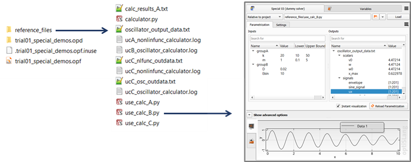
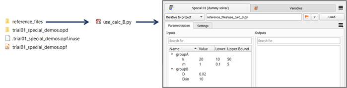
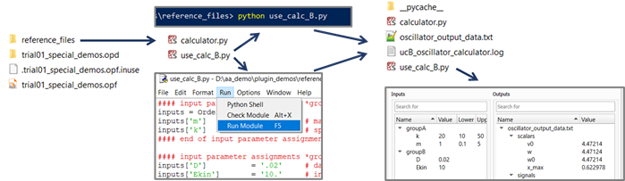
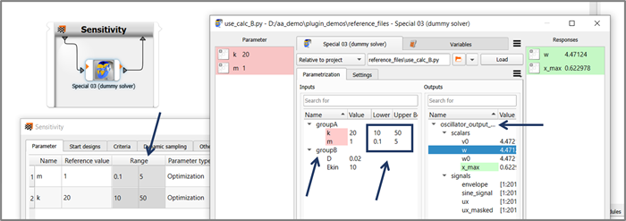
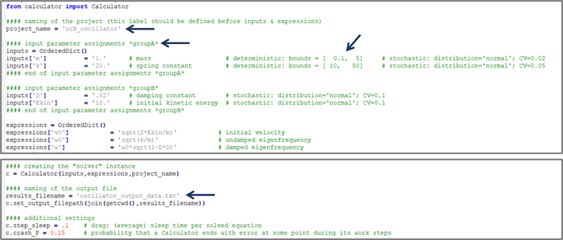
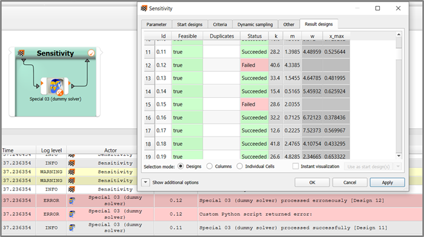
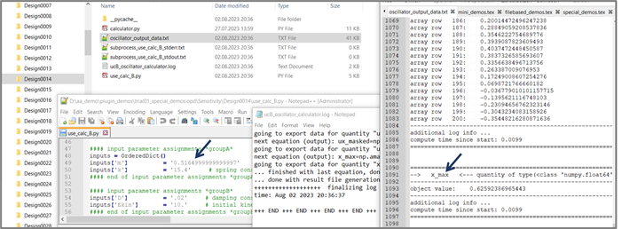

# Special demos
While the other two demonstrator subseries are aimed at hosting mainly minimalistic and shallow demos, this series of demonstrators includes deep showcases around special topics.

- [Special demo 1 (configuration file reference)](#special-demo-1-configuration-file-reference)
- [Special demo 2 (QML reference)](#special-demo-2-qml-reference)
- [Special demo 3 (dummy solver)](#special-demo-3-dummy-solver)
    - [Node setup: parametrization based on present reference files](#node-setup-parametrization-based-on-present-reference-files)
    - [Plugin in action: configuration time](#plugin-in-action-configuration-time)
    - [Plugin in action: evaluation time (run time)](#plugin-in-action-evaluation-time-run-time)
    - [Plugin in action: plugin code in context](#plugin-in-action-plugin-code-in-context)

## Special demo 1 (configuration file reference)
The relevant piece of this demo is the JSON configuration file. It is extended with a lot of comment text, the goal being that all flags and switches offered by the plugin interface are exhaustively listed and accompanied with a short description. In all other aspects the demo is identical with the [Mini demo 1](opti_api_python_nodes_integration_demos_mini.md).

It should be noted that some flags in this extended config file are commented out and thus inactive, and that it is even impossible to make some flags active without ending up with errors and a dysfunctional plugin. It is impossible to maintain a plugin demo at low complexity and at the same time make all config flags active or even usefully switchable. Experimentation with the flags and switches is very much recommended, but some suitable demonstrator should be picked. For example, if you want to experiment with the slots declarations in the config file, the corresponding mini demo introducing extra slot connections is a much more suitable starting point.

## Special demo 2 (QML reference)
The focus here is on the one hand to provide a comprehensive illustration of most commonly used GUI element types (like check boxes, radio buttons, drop-down lists, and so on) and on the other hand to showcase a suitcase full of tips and tricks that are deemed to be useful or are already usefully employed in productive plugin nodes.

If you are looking for a starting point for your own QML widget, while you can start with the mini demo introducing QML and continue from there a in additive manner, you may use this comprehensive special demo and proceed in subtractive manner, erasing functionality that you do not need, in order to achieve a level of complexity and structure which you deem ideal for the GUI of your plugin.

## Special demo 3 (dummy solver)
The other demos in this suite are mostly following the approach of spotlighting features, functions, tips, and tricks in isolation and maximal abstraction. This will surely help in all situations where you want to learn in the quickest way how to achieve a specific desired effect most cleanly. But there may be the disadvantage felt by some readers that the motivating context is lacking for many implementation features, that questions of the kind "why is it done or should it be done like that?" very often have no answers.

In contrast to other demos, this demo plugin based on a dummy solver is following a completely different approach, namely to show the various functionality elements in context, the consequences of one implementation detail motivating the way other code elements are designed. The goal is to put implementation details in context. This demo wants to be much closer to a real-world-worthy integration plugin in productive use.

The dummy solver contributes its part by being more quirky, strange, and unreliable than seems necessary at first glance. It has weird file formats on the input and even more so on the output side, it can crash or hang up, or even do so after delivering a partial set of results. This quirkiness is programmed into the dummy solver on purpose, in order to motivate the level of complexity and number of safety catch layers a productive plugin will often turn out to exhibit when developers and users are dealing with a capable, versatile, heavy-duty numerical solver program suite to be automated for parametric studies in optiSLang.

### Node setup: parametrization based on present reference files

Any integration node configured as **file-based** can only display parametrizable input parameters and output quantities if linked to a reference file. In many cases it is a solver project file. A listing of available solver output data structures can often only be generated based on the reference project being already in a solved state with solution data present. The dummy solver integration demo is designed to be able to replicate this often encountered real-world pattern. You can provide a solved reference project in the reference folder or just a plain input deck by erasing (or not putting in place) the rest. Each time you trigger the reference project re-scan via the **load** button, you will be able to see the difference it makes: parametrizable input variables will always be listed if a valid input deck is referenced, but collectable output objects can only be listed if result data are present in the reference folder.

In fact, you can conduct a first experiment of how the plugin code implementation can influence the user experience if you modify the switch `tolerate_file_missing` in the call to the function `scan_project_parametrization` in the API function `load`. If you deactivate the tolerance with respect to missing result data, the plugin node will react with an error message if it is triggered to load a dummy solver project with no associated result data present. Remember, verbose and helpful error messages are a valuable means of communication. By its error messages, an integration plugin can help useres to achieve a working setup. Carefully designed GUI feedback and error messages at configuration time can prevent frustrating error searches after failed run attempts. Tolerance and flexibility are nice-sounding words in general, but too much of it in the wrong place can make software confusing and hard to work with.

With that said, let us discuss the two alternative ways of putting in place a set of reference files to become able to use the integration node and play with it. If you have no time to lose, simply copy the entire example files folder representing a handful of solved dummy solver projects with output data. A node pointed to a project file will be able to detect and display input and output objects right out of the box. A possible folder structure with a freshly created optiSLang project besides the full reference folder can look like this:

If however you seek bringing to awareness the little chicken-and-egg problem that may or may not represent a frustration hurdle for future users of your future plugin, then you should only copy a plain project file (input deck) in which case your starting point will rather look like this:

With that starting point, you are challenging yourself to "bootstrap" your work folder "from scratch", and this puts you in the shoes of normal optiSLang users. In order to get from this state to the complete state with result files being present, the dummy solver project has to be solved. While your future plugin users may lazily resort to using a working integration node and simply clicking the run button in optiSLang and copying result data from a finished design folder over to the reference folder, you as plugin author should consider this shortcut as cheating. You have to become acquainted with the various ways of driving your solver program anyway. 

In the case of this demo, the dummy solver is a module called **calculator** containing a class definition `Calculator` and requiring a Python 3 environment including besides the Python Standard Library only the scientific library NumPy. Therefore, you can use any system shell command line, or any Python-capable IDE console, or an associated Python installation like the one shipped as part of optiSLang, after having ensured that NumPy is provided. At the outset you need to provide a copy of the script calculator.py next to the dummy solver project script. Next, you need to execute the dummy solver project script. The image below illustrates reference folder snapshots before and after solving the dummy solver project represented in the input deck `use_calc_B.py`.

By the way, you do not need to feel restricted by the given set of dummy solver projects. You are free to create entirely new dummy solver projects (or even extend the `Calculator` class) if this helps you, e. g. if it allows for more similarity between the dummy solver and the real solver for which you are undertaking to provide a new plugin.

As mentioned already, repeating the click on the **load** button of the node edit dialog or the entire act of instantiating a new node and linking it with its reference file will reveal that the output listing stays empty if the reference project has no associated result data files present. optiSLang can fill the output listing display as soon as the dummy solver project is solved and result data become present.

Let us summarize and compare the two approaches again. Copying the complete ready-made set of reference files is the quickest way to create the needed work folder sandbox and getting to see the node edit dialog and both parametrization listings, input and output, filled with content. By contrast, if you set out only with the file `calculator.py` plus a **dummy solver input deck** and solve it yourself invoking a Python interpreter via command line or an IDE function, if you watch the solver log and data output being generated in the work folder before pulling up an integration node and its parametrization view, then you are putting yourself into the shoes of a simulation engineer who masters running and using the numerical solver before being tempted to go to optiSLang for advanced parametric studies.

Python takes milliseconds to run through a dummy solver project, but your taking the extra minutes and explicitly working through such preparation steps in order to come to a functioning setup while working through the tutorial can help you become better aware of what an integration plugin actually does. Better awareness and perspective can help you in making good design decisions later for your own plugin. Being able to adopt the different perspectives of solver user, optiSLang user, and plugin programmer will allow you to come up with the most elegant programming solutions for serving your plugin user community in the most helpful way and to avoid facing them with unnecessary frustration hurdles.

### Plugin in action: configuration time

After having linked a node to its reference file, we can observe how the listings of parametrizable input and output objects are populated. Make sure that the tree view is activated in optiSLang global settings via **Edit > Settings > Customization > Customized integrations use treeview**, so you can see how this demo node supports the feature. Drop the node in a sensitivity system and register some or all detected input variables as parameters, and you can check in the parameter manager tab of the sensitivity system how the ready-made parameter space bounds have been picked up in the reference file and forwarded to become visible right here

With a glance at the dummy solver input deck we can see that it is not only consisting of pure Python code. There are additional pieces of meta info present in decorating comments. We have invented these additional decorations, these format patterns and conventions deliberately in order to showecase how the plugin is picking up the info by parsing the text file. Some of these are indicated by arrows in the image below.

Indeed, all this adds complexity to this demonstrator. The complexity drag is accepted in this special deep demo because it can provide a vast sandbox for anybody working on integration plugins. We would like to invite you to delve right into hands-on experiments, so, just go ahead, manipulate the files on both sides, solver and plugin, modify the values, and why refrain from breaking the patterns? Check out how the node edit dialog reacts when repeating the reference file reload. Instead of repairing a modified pattern by restoring the old scheme, why not modify and "repair" the plugin code parsing the file with the "new" pattern?

### Plugin in action: evaluation time (run time)

The next step is to complete the setup of the demo node inside the sensitivity system, and to run a few designs. As a new habit, set *Maximum in parallel* to "3" under **Additional options** or **Run options** of the node, set *Multi-designs* to "4" under **Advanced options** of the node, and check the box *Never auto-save under Project settings*. Save the project with **Ctrl+S**, start the evaluation run with **Ctrl+Shift+R**, and then watch:

See how the quirky instable dummy solver and the robust forgiving plugin are filling the result designs table and the main message queue with green and red entries. You can also sift through design folders, in order to check the correspondance between what optiSLang shows on the surface and the text file content being created in the optiSLang project directory (OPD).

### Plugin in action: plugin code in context

If we have a multi-design bundle size of four, and we do not want that one failed design destroys all four of its group, then we need to handle failed designs, e. g. with try-except, in the plugin code. If we want to challenge ourselves to make the plugin robust and forgiving, we let the dummy solver fail. And we have it fail in different ways: not doing any work, or yielding only some result files, or only some parts of some files. Enabling the maximum runtime enforcement in the configuration file lets the max runtime spinbox appear in the node edit dialog. Activating it there and at the same time increasing the time drag in the dummy solver or allowing infinite hang-up enables us watching those features of optiSLang and the plugin code in action. From designs where the max runtime enforcement kicked in before all computations were done, did the plugin conservatively collect partial results or nothing? How does it work in the code? How would we change the code if we wanted to see a different behavior?

This demo wants to provide a vast sandbox for plugin authors by combining and putting in context many aspects:

- the solver is called in a subprocess
- for the solver subprocess, any Python installation of your choice can be configured, the subprocess can really be outside optiSLang's built-in Python
- the solver can crash or hang up
- the plugin supports degree of parallelism (DoP) and multi-design bundles
- the solver input deck exhibits complex format features which have to be parsed
- output data structures have to be looked up and parsed from result files correspondingly
- the integration node forwards output data in the form of scalars, vectors, and signals
- there is QML code providing a settings GUI widget, the settings have meaning, context, real effects
- both modifying and non-modifying settings are present, non-modifying means that optiSLang waives on the node reset when such a setting is changed, the dissection of the two categories is not random or artificial, but really based on answering the motivating question: would design result data be different under these new settings?
- the QML code uses the `backend.executeCustom` functionality to trigger work in the Python layer,
- setup and settings sanity is enforced in the QML code and the Python layer, a prerun check implementation is part of it
- the feature bundle around read mode and re-evaluation is supported
- the plugin code is organized in a modular library, the node-providing top-level `_ci.py` file imports the library
- the code collection includes plain Python test scripts, small or large subroutines can thus be run in your IDE console
- hands-on experiments in optiSLang with ease in conjunction with hands-on experiments outside optiSLang with test scripts in your IDE console, this can show a way towards efficient test-driven user-centric development habits in case learning plugin authors are at the same time newcomer programmers,
- like a real solver, the dummy solver allows for free creation of new projects solving new numerical computation tasks
- the dummy solver computes real stuff, math is math, you can plug a real problem of interest into its frame
- having a real problem of interest represented in a new project, you can usefully explore optiSLang features (sensitivity, MOP, optimizers, postprocessing views) with the advantage of a fast and light-weight anlysis target.

Yet, this demo still represents a raw, simplified, and inefficient integration plugin because of these facts:

- The code consists mainly of atomic subroutines, a more powerful solver handler class is lacking.
- Many elementary tasks are solved in small subroutines. The wheel is reinvented in many places.
- A better plugin code practice would outsource basic and frequent tasks into a tools library able to benefit many people authoring many diverse plugins. Exemplary basic tasks to think of: unpacking data from designs picked from incoming kwargs, packing data into return designs.
- There are no unit tests.
- Solver project investigation results are not cached. If the node wants to reload the parametrization listings, the plugin will go through the complete reference project inquiry even if the reference file has not been modified since the last time.
- There is no managing of persistent solver instances with the help of all API callback functions including initialize and shutdown.
- Reset is not supported.
- There is no true multi-design treatment; the plugin works through the heap in a simple loop. The dummy solver in this state has no multi-design capability yet, although NumPy arrays offer themselves as powerful tool.

Please refer to the most current state of the integration demo suite or ask the optiSLang team directly to learn about those further aspects.