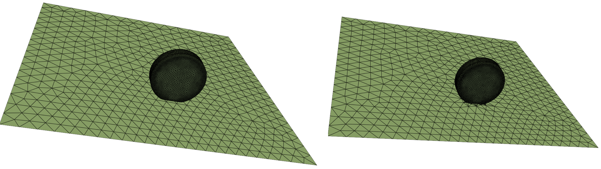
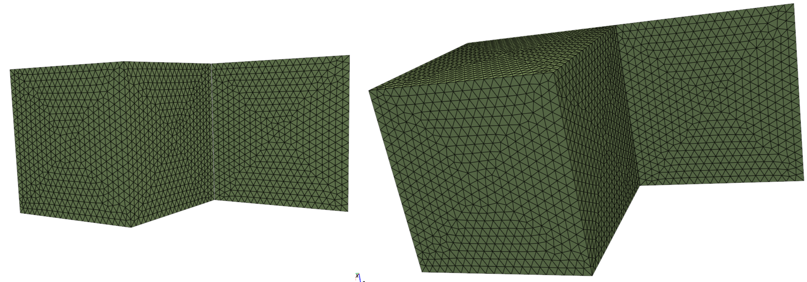
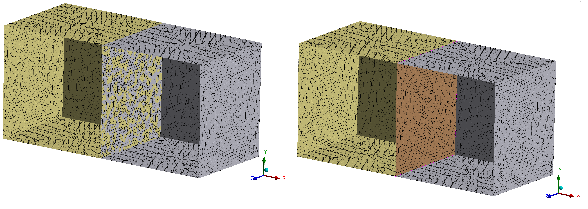
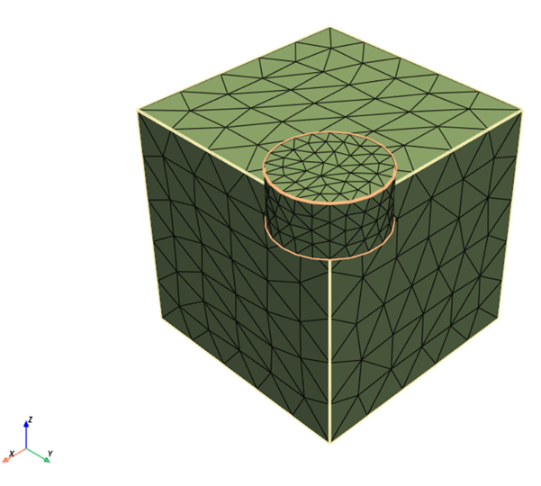
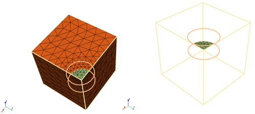
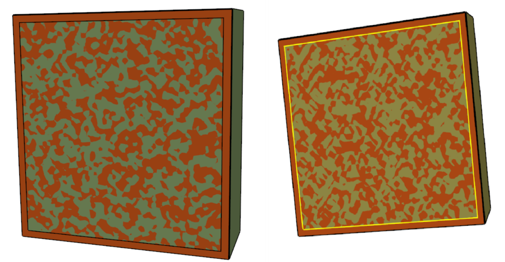

# Connections

<a id="zonelet-connection"></a>

## Zonelet connection

Connect operations help you to create a watertight, fully connected surface mesh for successful volume mesh generation.
Connect operations conformally connect multiple watertight volumes providing shared zonelets (and therefore connected
volume mesh) between them. The [`Connect`](../api/_autosummary/ansys.meshing.prime.Connect.md#ansys.meshing.prime.Connect) class allows you to connect the face zonelets
in a part, volume, or model using various connect algorithms.

There are three major operations for zonelet connections:

- The [`Connect.intersect_face_zonelets()`](../api/_autosummary/ansys.meshing.prime.Connect.intersect_face_zonelets.md#ansys.meshing.prime.Connect.intersect_face_zonelets) function allows you
  to intersect the face zonelets of the part along the intersecting faces.



- The [`Connect.stitch_face_zonelets()`](../api/_autosummary/ansys.meshing.prime.Connect.stitch_face_zonelets.md#ansys.meshing.prime.Connect.stitch_face_zonelets) function allows you to
  stitch a set of face zonelets to another set of face zonelets along the boundary of zonelets.




- The [`Connect.join_face_zonelets()`](../api/_autosummary/ansys.meshing.prime.Connect.join_face_zonelets.md#ansys.meshing.prime.Connect.join_face_zonelets) function allows you to join
  a set of face zonelets to another set of face zonelets along the overlapping faces.

 

- The [`Connect.fuse_face_zonelets()`](../api/_autosummary/ansys.meshing.prime.Connect.fuse_face_zonelets.md#ansys.meshing.prime.Connect.fuse_face_zonelets) function allows you to
  perform fuse operation between overlapping face zonelets within a single part.
- The [`Connect.merge_boundary_nodes()`](../api/_autosummary/ansys.meshing.prime.Connect.merge_boundary_nodes.md#ansys.meshing.prime.Connect.merge_boundary_nodes) function allows you
  to merge boundary nodes of source face zonelets with boundary nodes of target face zonelets with the given parameters.

#### NOTE
Connect operations support only computational mesh, which is mesh with reasonable size changes and quality.
Faceted geometry, which is STL-like mesh that can have extreme size changes and many sliver elements, is not supported.

The following example shows how to accomplish these tasks:

* Import the model and delete geometry topology from each part.
* Merge the parts and verify the surface mesh connectivity.
* Perform the join or intersect operation on face zonelets.

1. Import the model and delete topo-geometric entities from each part:
   ```python
   prime.FileIO(model).read_pmdat(
       "D:/Temp/mesh.pmdat", file_read_params=prime.FileReadParams(model)
   )
   for part in model.parts:
       topofaces = part.get_topo_faces()
       if topofaces:
           params = prime.DeleteTopoEntitiesParams(
               model, delete_geom_zonelets=True, delete_mesh_zonelets=False
           )
           part.delete_topo_entities(params)
   ```
2. Merge the parts.
   ```python
   model.merge_parts(
       part_ids=[part.id for part in model.parts], params=prime.MergePartsParams(model)
   )
   ```
3. Check the surface before performing the connect operation.
   ```python
   diag = prime.SurfaceSearch(model)
   diag_res = diag.get_surface_diagnostic_summary(
       prime.SurfaceDiagnosticSummaryParams(
           model,
           scope=prime.ScopeDefinition(model=model, part_expression="*"),
           compute_free_edges=True,
           compute_multi_edges=True,
       )
   )
   ```

   For more information on checking the surface mesh connectivity, see [Mesh diagnostics](mesh_diagnostics.md).

4. Print the results of the surface mesh connectivity before performing the connect operation:
   ```pycon
   >>> print(diag_res)

   error_code :  ErrorCode.NOERROR
   n_self_intersections :  342
   n_free_edges :  564
   n_multi_edges :  0
   n_duplicate_faces :  0
   ```
5. Connect face zonelets in the model:

   #### NOTE
   Only triangular faces are supported.

   ```python
   join_params = prime.JoinParams(model)
   inter_params = prime.IntersectParams(model)
   join_params.tolerance = 0.1
   part_id = model.parts[0].id
   faces = model.parts[0].get_face_zonelets()

   for face in faces:
       other_faces = [other for other in faces if face != other]
       prime.Connect(model).intersect_face_zonelets(
           part_id=part_id,
           face_zonelet_ids=[face],
           with_face_zonelet_ids=other_faces,
           params=inter_params,
       )
       prime.Connect(model).join_face_zonelets(
           part_id=part_id,
           face_zonelet_ids=[face],
           with_face_zonelet_ids=other_faces,
           params=join_params,
       )
   ```
6. Check the surface after performing the connect operation:
   ```python
   diag_res = diag.get_surface_diagnostic_summary(diag_params)
   ```
7. Print the results of the surface mesh connectivity after performing the connect operation:
   ```pycon
   >>> print(diag_res)

   error_code :  ErrorCode.NOERROR
   n_self_intersections :  0
   n_free_edges :  448
   n_multi_edges :  9
   n_duplicate_faces :  0
   ```

To perform Fuse operation,

1. Connect face zonelets in the model using fuse operation. You can apply Fuse operation on overlapping faces within a single part. You can co-locate, merge, or remove fused surfaces as per your requirement.



2. Enable the fuse parameters as per your requirement. When use_absolute_tolerance is True,
   provides the gap tolerance or side tolerance value as absolute value.
   ```python
   connect = prime.Connect(model)
   params = prime.FuseParams(model=model)
   params.use_absolute_tolerance = True
   params.gap_tolerance = 20
   params.fuse_option = prime.FuseOption.TRIMONESIDE
   params.check_interior = True
   params.check_orientation = False
   params.local_remesh = True
   params.separate = True
   params.dump_mesh = False
   params.n_layers = 2
   params.angle = 45
   ```

The fuse_option parameter specifies how to treat the surface when performing fuse operation.
Here, TRIMONESIDE option deletes the faces to be fused on one side and merges the nodes in the middle location.
When local_remesh parameter is True, the fused region is meshed after performing fuse operation.
n_layers parameter specifies the number of layers around the region to be fused.
When separate is True, the fused region is separated.

3. Fuse the face zonelets using the given parameters.

> > ```python
> > result = connect.fuse_face_zonelets(
> >     part.id, source_face_zonelet_ids, target_face_zonelet_ids, params
> > )
> > g = Graphics(model)
> > g()
> > ```




<a id="topology-based-connection"></a>

## Topology-based connection

The [`Scaffolder`](../api/_autosummary/ansys.meshing.prime.Scaffolder.md#ansys.meshing.prime.Scaffolder) class allows you to provide connection
using faceted geometry and topology. This class also handles the gaps and mismatches in the geometry.

Topology-based connection creates shared topoedges between neighboring topofaces. Hence, you can
create connected mesh between topofaces.

#### NOTE

Connectivity cannot be shared across multiple parts.



Here, the yellow edges denote multiple connections between the four topofaces.
The model has a single topoface containing an interior edge loop and an overlapping topoface on the central portion.
You may separate the large topoface by the interior edge loop and delete the shadow or merge the topoface to
achieve the desired state.

This code merges parts and scaffold topofaces:

```python
# Merge parts
model.merge_parts(
    part_ids=[part.id for part in model.parts], params=prime.MergePartsParams(model)
)

# Scaffold TopoFaces
params = prime.ScaffolderParams(
    model=model,
    absolute_dist_tol=0.01,
    intersection_control_mask=prime.IntersectionMask.FACEFACEANDEDGEEDGE,
    constant_mesh_size=0.1,
)

scaffolder = prime.Scaffolder(model, part.id)
res = scaffolder.scaffold_topo_faces_and_beams(
    topo_faces=part.get_topo_faces(), topo_beams=[], params=params
)
```

This code prints the results so that you can verify the number of topofaces that failed
in the scaffold operation:

```pycon
>>> print(res)

n_incomplete_topo_faces :  0
error_code :  ErrorCode.NOERROR
```
