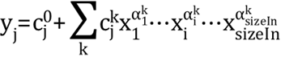

# PolynomialTable

Corresponding ID: `CS_PolynomialTable`

Create a polynomial relation between `sizeIn` inputs and `sizeOut` outputs
using the following function:

Where i denotes the index of input and goes from 1 to n (`sizeIn`), j denotes
the index of output (from 1 to `sizeOut`).

### Member functions

`CS_PolynomialTable()`

Creates an empty polynomial table.

`Initialize(constant)`

Specialized for 1x1 table. Initializes the table to be a 1 input, 1 output
table, and sets the constant term (constant is a float value).

`Initialize(sizeIn,sizeOut,constantValues)`

(generic version) Initializes the table with `sizeIn` inputs and `sizeOut`
outputs and sets the constant terms. `sizeIn` and `sizeOut` are two integer
values, and `constantValues` is an array of `sizeOut` float values.

`AddTerm(coefficient,order)`

Specialized for 1x1 table. Adds one monomial term to the table. The
coefficient is a float value and order is an integer value giving the power of
the input.

`AddTerm(coefficients,orders)`

(generic version) Adds one monomial term to the table. The coefficients are
given by a `sizeOut` float array and the power for each input by an array of
`sizeIn` integers.
