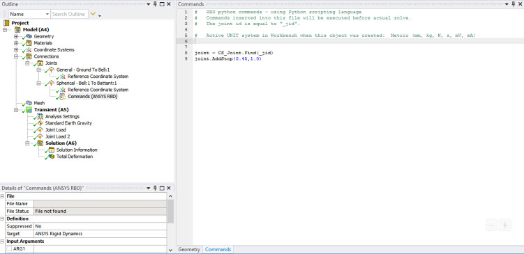
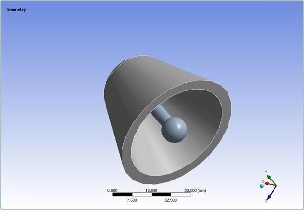
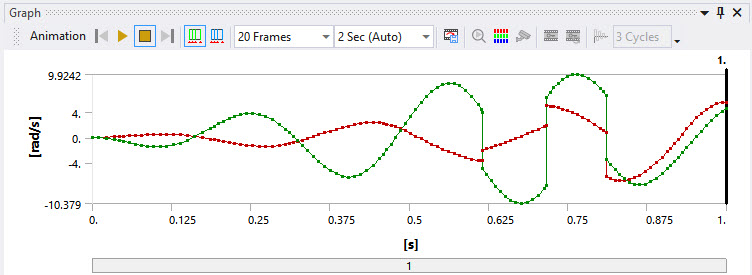

# Spherical stop

This example describes the implementation of a spherical stop. A spherical
stop is a joint that has 3 rotations (joints include spherical, slot, bushing,
free and general joints). This specific type of stop creates a limit to the
angle between the z-axis of the reference frame and the z-axis of the moving
frame. This functionality is available using the following command:

    AddStop(angle_max, restitution_factor)

For example, to add a spherical stop for an angle value equal to 0.45 radians
and a restitution factor equal to 1.0, the following command would be issued:

    Joint.AddStop(0.45,1.0)

An example of the model and the results of this command are shown below.

