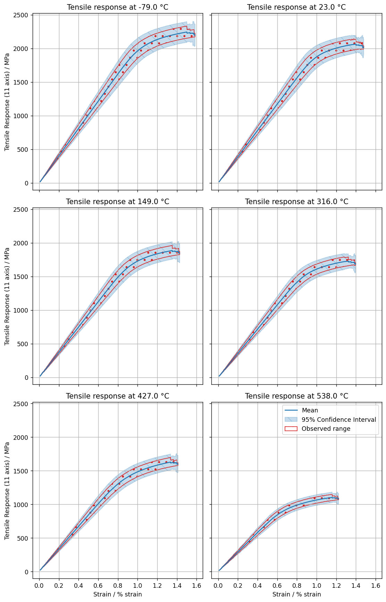

# Calculate statistics for functional data attributes

Calculate statistical data, such as mean tensile response curves and confidence intervals, from functional data
attributes in test records. Import the roll-up data into Granta MI.

## Get test data from Granta MI

Connect to Granta MI and specify a database and tables.


```python
from GRANTA_MIScriptingToolkit import granta as mpy

mi = mpy.connect("http://my.server.name/mi_servicelayer", autologon=True)

db = mi.get_db(db_key="MI_Training")
test_table = db.get_table("Tensile Test Data")
statistics_table = db.get_table("Tensile Statistical Data")
```

Records in these tables are organised by test temperature, so we can fetch all children of a carefully selected folder
in *Tensile Test Data*.

Use `table.bulk_fetch()` to efficiently populate the attributes for each test record and filter out records that do
not have values for the attributes required by this analysis.


```python
def bulk_fetch_attributes_and_return_populated_records(table, records, attributes):
    table.bulk_fetch(records, attributes)
    populated_records = [
        record for record in records
        if not any([record.attributes[attr].is_empty() for attr in attributes])
    ]
    return populated_records


material_form_folders = test_table.get_records_from_path(
    starting_node=None,
    tree_path=["High Alloy Steels", "AMS 6520"],
)
plate_folder = next(folder for folder in material_form_folders if folder.name == "Plate")

test_records = plate_folder.get_descendants()
test_records = bulk_fetch_attributes_and_return_populated_records(
    table=test_table,
    records=test_records,
    attributes=[
        "Specimen ID",
        "Tensile Response (11 axis)",
        "Test Temperature"
    ]
)
temperature_unit = test_table.attributes["Test Temperature"].unit
temperature_column_name = f"Test Temperature [{temperature_unit}]"
```

Create a `pandas` DataFrame and populate it with data from the functional attribute *Tensile Response (11 axis)*, as
well as *Specimen ID* and *Test Temperature*.

To produce a usable DataFrame, the functional data must:

1. Have the headers removed
2. Be converted from a range into a single value


```python
import pandas as pd

df_response = pd.DataFrame()
for record in test_records:
    response_attr = record.attributes["Tensile Response (11 axis)"]
    specimen_id = record.attributes["Specimen ID"].value
    test_temperature = record.attributes["Test Temperature"].value

    df_functional_data = pd.DataFrame(response_attr.value[1:], columns=response_attr.value[0])

    df_current = pd.concat(
        [
            df_functional_data["Strain [% strain]"],
            df_functional_data[
                [
                    "Y min (Tensile Response (11 axis) [MPa])",
                    "Y max (Tensile Response (11 axis) [MPa])",
                ]
            ]
            .mean(axis=1)
            .rename("Tensile Response (11 axis) [MPa]")
        ],
        axis=1,
    )
    df_current["Specimen ID"] = specimen_id
    df_current[temperature_column_name] = round(test_temperature, 1)
    df_response = pd.concat([df_response, df_current])
```

## Process the data and calculate statistics

For easier plotting, interpolate each series onto the union of all the parameter values (`pandas` uses the strain
parameter as an index for the union). Any `NaN` inside the populated area for this column is interpolated by the
`interpolate()` method with `limit_area="inside"`.

Group the data by *Test Temperature*, then use `scipy` to calculate the 95% confidence intervals by passing the count,
mean and standard deviation of the grouped data.

Use the `.T` property to transpose the data frame before the `.groupby()` operation and after the `.count()`,
`.mean()`, and `.std()` operations.


```python
import scipy.stats as st

df_interpolated = (
    df_response
    .pivot(
        index="Strain [% strain]",
        values="Tensile Response (11 axis) [MPa]",
        columns=["Specimen ID", temperature_column_name]
    )
    .interpolate(method="index", limit_direction="both", limit_area="inside")
)

grouped_by = df_interpolated.T.groupby(level=temperature_column_name)
confidence_intervals = st.t.interval(
    0.95,
    grouped_by.count().T,
    loc=grouped_by.mean().T,
    scale=grouped_by.std(numeric_only=True).T,
)
```

Convert the transformed data into an aggregate DataFrame for plotting and import, taking the minimum, maximum,
confidence intervals and mean at each strain value and temperature.


```python
df_all_plots = pd.DataFrame()

for temperature_index, temperature in enumerate(grouped_by.groups):
    # Convert the confidence intervals into a DataFrame
    df_cis = (
        pd.DataFrame(
            data=zip(
                *[
                    [row[temperature_index] for row in confidence_intervals[0]],
                    [row[temperature_index] for row in confidence_intervals[1]]
                ],
            ),
            index=df_interpolated.index,
        )
        .rename(columns={0: "lower_ci", 1: "upper_ci"})
    )
    # Combine with the other derived quantities
    df_plot = pd.concat(
        [
            grouped_by.mean().T[temperature].rename("mean"),
            grouped_by.min().T[temperature].rename("min"),
            grouped_by.max().T[temperature].rename("max"),
            df_cis
        ],
        axis=1,
    ).dropna()

    # Polish up the DataFrame for aggregation
    df_plot["temperature"] = temperature
    df_plot = df_plot.rename_axis("strain")
    df_all_plots = pd.concat([df_all_plots, df_plot.reset_index()])
```

Plot the aggregated data using `matplotlib`, creating a grid of subplots with identical (shared) axes to easily
compare the tensile response at different temperatures.


```python
import matplotlib.pyplot as plt

plt.rcParams["figure.dpi"] = 125

fig, axs = plt.subplots(3, 2, figsize=(9, 14), sharex="all", sharey="all")

for plot_index, temperature in enumerate(grouped_by.groups):
    ax = axs[plot_index // 2][plot_index % 2]

    # Get the rows corresponding to the current temperature
    df_plot = df_all_plots.loc[df_all_plots["temperature"] == temperature]

    ax.plot(df_plot["strain"], df_plot["mean"], label="Mean")
    ax.fill_between(
        df_plot["strain"],
        df_plot["lower_ci"],
        df_plot["upper_ci"],
        label="95% Confidence Interval",
        hatch="\\",
        facecolor="C0",
        edgecolor="C0",
        alpha=0.25,
    )
    ax.fill_between(
        df_plot["strain"],
        df_plot["min"],
        df_plot["max"],
        label="Observed range",
        hatch=".",
        facecolor="none",
        edgecolor="C3",
    )

    ax.set_title(f"Tensile response at {round(temperature, 0)} {temperature_unit}")
    ax.grid("major")

plt.setp(axs[-1, :], xlabel="Strain / % strain")
plt.setp(axs[:, 0], ylabel="Tensile Response (11 axis) / MPa")
plt.legend()
plt.tight_layout()
plt.show()
```


    

    


## Import roll-up data into Granta MI

Define two helper functions: one that resamples a DataFrame linearly based on a target column's values, and one that
appends a series of range values to a `FloatFunctionalAttributeValue`, skipping any `NaN` values.

(Although `pandas` has a built-in `resample()` function, it only operates on time-series data.)


```python
import numpy as np

def subsample_dataframe(df, x_axis, n_samples):
    new_index = np.linspace(df[x_axis].min(), df[x_axis].max(), n_samples)
    df.index = df[x_axis]
    df_subsampled = (
        df
        .reindex(df.index.union(new_index))
        .interpolate("index")
        .reindex(index=new_index)
    )
    df_subsampled.index = range(n_samples)
    return df_subsampled


def append_series(functional_attribute, x_data, y_low_data, y_high_data=None, data_type=None):
    if y_high_data is None:
        y_high_data = y_low_data
    for x, y_low, y_high in zip(x_data, y_low_data, y_high_data):
        if pd.isna(y_low) or pd.isna(y_high):
            continue
        functional_attribute.value.append([y_low, y_high, x, data_type, False])
```

Import the roll-up data into a Granta MI database. Use `path_from()` to create a folder path, and then create a
statistical data record as a child of the final folder. Populate the *Test Temperature* and *Tensile Response Analysis
(11 axis)* attributes using the helper functions.

Write the new record into a Granta MI database using `Session.update()`, then link the newly-created attribute to the
relevant test results. Finally, write the new links to the Granta MI database using `Session.update_links()`.


```python
import datetime

t_stats = db.get_table("Tensile Statistical Data")
timestamp = datetime.datetime.now().isoformat()

for plot_index, temperature in enumerate(grouped_by.groups):
    # Create a record to store the imported data
    folder = t_stats.path_from(
        starting_node=None,
        tree_path=["Data Analytics", timestamp],
        color=mpy.RecordColor.Olive,
    )
    rec = t_stats.create_record(
        name=f"Functional Rollup ({round(temperature, 0)} {temperature_unit})",
        parent=folder,
    )
    
    temp_attribute = rec.attributes["Test Temperature"]
    temp_attribute.value = temperature
    temp_attribute.unit = temperature_unit

    func_attr = rec.attributes["Tensile Response Analysis (11 axis)"]
    func_attr.unit = "MPa"

    # Get the rows corresponding to the current temperature
    df_current = df_all_plots.loc[df_all_plots["temperature"] == temperature]

    df_current = subsample_dataframe(df_current, "strain", 101)
    append_series(
        func_attr,
        df_current["strain"],
        df_current["mean"],
        data_type="Mean",
    )
    append_series(
        func_attr,
        df_current["strain"],
        df_current["lower_ci"],
        df_current["upper_ci"],
        data_type="95% Confidence Interval",
    )
    append_series(
        func_attr,
        df_current["strain"],
        df_current["min"],
        df_current["max"],
        data_type="Range",
    )

    rec.set_attributes([temp_attribute, func_attr])
    rec = mi.update([rec])[0]

    associated_test_records = [
        test_record for test_record in test_records
        if round(test_record.attributes["Test Temperature"].value, 1) == temperature
    ]
    rec.set_links("Tensile Test Data", associated_test_records)
    mi.update_links([rec])
```
