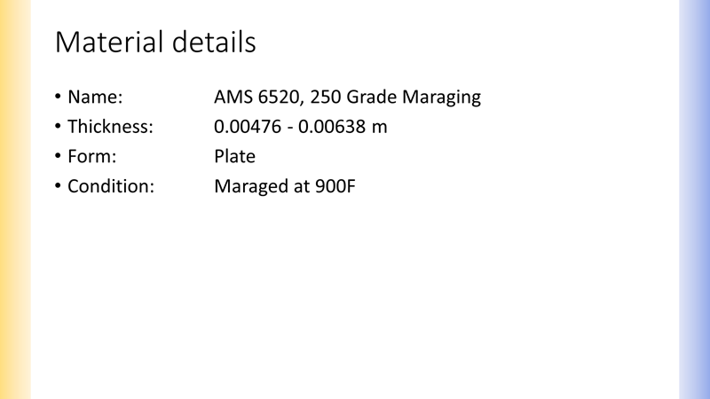
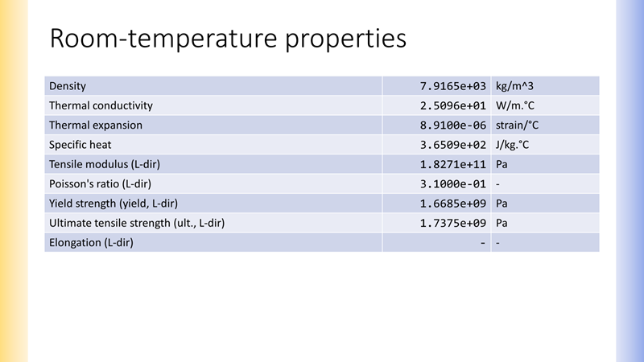
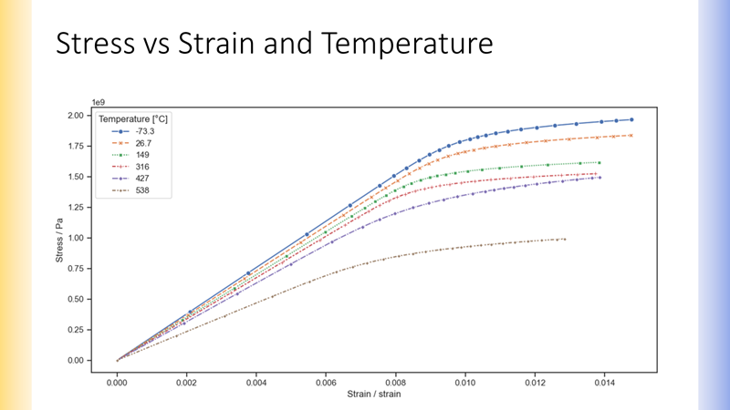

# Generate a Material Summary Presentation using MI Scripting Toolkit and `python-pptx`

This example shows how to use the `python-pptx` library to generate a Microsoft PowerPoint
presentation. At a high level, the notebook goes through the following steps:

1. Define the data to be included in the presentation
2. Export the data
3. Load the presentation template
4. Add single-valued attributes to the presentation
5. Add functional data to the presentation
6. Save the presentation

## 1. Define the data to be included in the presentation

First, define some constants that identify the record and attributes to be included in the
presentation. The following cell identifies a record by Database Key, Table name, and Record
History GUID, but an alternative technique could be used to identify a record, for example
searching.


```python
DATABASE = "MI_Training"
TABLE = "Design Data"
RECORD_HISTORY_GUID = "5b1df472-a92e-4317-b9a8-e1672335bc2e"
UNIT_SYSTEM = "SI (Consistent)"
```

The next cells define the attributes to be included in each section of the presentation. Apart
from the Presentation Title attribute, these are dictionaries which map an attribute name to a
label included in the presentation.


```python
PRESENTATION_TITLE_ATTRIBUTE = "Common Name"
```


```python
DESCRIPTION_ATTRIBUTES = {
    "Common Name": "Name",
    "Thickness": "Thickness",
    "Product Form": "Form",
    "Condition": "Condition",
}
```


```python
SINGLE_VALUED_PROPERTIES = {
    "Density": "Density",
    "Thermal Conductivity": "Thermal conductivity",
    "Thermal Expansion": "Thermal expansion",
    "Specific Heat": "Specific heat",
    "Modulus, L": "Tensile modulus (L-dir)",
    "Poisson's Ratio, L": "Poisson's ratio (L-dir)",
    "Yield Strength, L": "Yield strength (yield, L-dir)",
    "Ultimate Tensile Strength, L": "Ultimate tensile strength (ult., L-dir)",
    "Elongation, L": "Elongation (L-dir)",
}
```

The `GRAPHS` dictionary maps functional attributes to a 4-tuple, where each element of the tuple
refers to:

1. The chart title
2. The y-axis label
3. The x-axis label
4. Optional: For multiple-series plots, a 2-tuple of the Parameter name and the title of the
   legend in the report


```python
GRAPHS = {
    "Thermal Conductivity with Temp.": ("Thermal conductivity vs Temperature", "Thermal conductivity", "Temperature", None),
    "Thermal Expansion with Temp.": ("Thermal expansion vs Temperature", "Thermal expansion", "Temperature", None),
    "Specific Heat with Temp.": ("Specific heat vs Temperature", "Specific heat", "Temperature", None),
    "Tensile Stress/Strain, L": ("Stress vs Strain and Temperature", "Stress", "Strain", ("Temperature", "Temperature")),
}
```

## 2. Export the data

Export the data for all the required attributes for the 'released' version of the record.


```python
from GRANTA_MIScriptingToolkit import granta as mpy

mi = mpy.connect("http://my.server.name/mi_servicelayer", autologon=True)

db = mi.get_db(db_key=DATABASE)
db.unit_system = UNIT_SYSTEM

table = db.get_table(TABLE)
record = db.get_record_by_id(hguid=RECORD_HISTORY_GUID)

# To get the released version of the record, iterate through all versions of the record
# and keep only the version which has the 'Released' `release_state`.
for record_version in record.all_versions.values():
    if record_version.release_state == "Released":
        released_record = record_version

# Create a list of all attributes by appending the keys of the three dictionaries defined above to
# the datasheet title attribute
all_attributes = (
    [PRESENTATION_TITLE_ATTRIBUTE] +
    list(DESCRIPTION_ATTRIBUTES.keys()) +
    list(SINGLE_VALUED_PROPERTIES.keys()) +
    list(GRAPHS.keys())
)

table.bulk_fetch(attributes=all_attributes, records=[released_record])
```

## 3. Load the presentation template

The report template is created in Microsoft PowerPoint, and the 'python-pptx' library is used to
populate the template with data exported from Granta MI.

Import the `python-pptx` library and create a `Presentation` object using the `pptx.Presentation`
function. The function accepts an optional string as the relative path to a template file, which
is used to create the `Presentation` object. In this example the relative path to the template
file is `"supporting_files/presentation_template.pptx"`, and the `Presentation` object is stored
in the `prs` variable.

`pptx.Presentation` can also be called without arguments, which creates an empty Presentation
instead.


```python
from pptx import Presentation

prs = Presentation(pptx="supporting_files/11_presentation_template.pptx")
```

<div class="alert alert-info">

**Info:**

As `python-pptx` does not implement all the layout and style functionality in Microsoft
PowerPoint, specifying a pre-defined template allows greater control over the layout of the
presentation and more concise code overall.
</div>

The presentation file used above is an empty `pptx` file, not a `potx` file.
The presentation file contains no slides, but does contain a PowerPoint
theme, which will be used throughout this example.

## 4. Add single-valued attributes to the presentation

This section covers adding single-valued and range attributes to the presentation.
The presentation makes use of a combination of bulleted lists and tables to present
single-valued data, and each approach will be handled separately.

## Create and populate a title slide

The `Presentation` object currently refers to an empty PowerPoint presentation.
First, create a new slide based on the 'Title' slide layout, and then
populate the title and sub-title content shapes.

The `Presentation.slide_layouts` list contains the slide layouts in the same
order as they appear in the 'Slide Master' view in PowerPoint. There is no
convenient way to determine the required layout programmatically, so instead
get the slide layout from PowerPoint and hardcode it here. Then add a new
slide based on that layout.


```python
TITLE_LAYOUT_POSITION = 0
title_layout = prs.slide_layouts[TITLE_LAYOUT_POSITION]
title_slide = prs.slides.add_slide(title_layout)
```

Next, populate the values on the new slide. In PowerPoint, all content is contained
within a shape. When editing a new slide, most shapes are *placeholders*, which means
their content is undefined. Generally, adding content to a placeholder will turn it
into a full shape.

To add text to a placeholder, simply use the `text` property.


```python
material_name = released_record.attributes[PRESENTATION_TITLE_ATTRIBUTE].value
record_version_number = released_record.version_number

title = f"{material_name} [v{record_version_number}]"
# Since the title placeholder is so commonly used, it is available via the title property
title_slide.shapes.title.text = title

# The subtitle placeholder does not have a dedicated property. To determine the 
# correct placeholder shape, iterate through each one and identify it by name.
# If the same placeholder is used multiple times, the idx value is static for
# each layout and can be used directly once identified.
subtitle = placeholder_idx = None
for shape in title_slide.placeholders:
    print('%d %s' % (shape.placeholder_format.idx, shape.name))
    if shape.name.startswith("Subtitle"):
        placeholder_idx = shape.placeholder_format.idx
        subtitle = shape
# subtitle = placeholders[placeholder_idx] would return the same placeholder shape object
subtitle.text = "Design Review"
```
*Previous cell output:*
```output
0 Title 1
1 Subtitle 2
```
Modifying the `Presentation` object does not provide any feedback. The `prs` variable can be
saved to disk as a `pptx` file at any point by using the `Presentation.save` method.

First, ensure the output directory exists. This directory will already exist if a notebook
was run previously that saved a file to disk.


```python
from pathlib import Path
output_folder = Path("./output")
output_folder.mkdir(exist_ok=True)
```

Next, save the presentation.


```python
prs.save("output/11_presentation_title_only.pptx")
```

Open the `presentation_title_only.pptx` file to see the presentation template populated with
the `PRESENTATION_TITLE_ATTRIBUTE` attribute value. A screenshot of the presentation title
slide is shown below:


The presentation will not be saved to disk again until the report is complete. If you want to see
the effects of individual operations on the presentation, use the ``prs.save`` method to save the
presentation to disk.

## Modify the presentation properties

PowerPoint presentations contain metadata describing the presentation
content. These are exposed in the `Presentation.core_properties`
property, and are modified below to specify values for the title,
version, author, and comments.


```python
prs.core_properties.title = f"{material_name} Design Review"
prs.core_properties.version = f"Version {record_version_number}"
prs.core_properties.author = "Granta MI"
prs.core_properties.comments = "Autogenerated by MI Scripting Toolkit and python-pptx"
```

## Material details slide

The material description attributes will be written to a general content slide layout,
with each separate attribute formatted as an entry in a bulleted list. The same
high-level process will be followed as with the title slide: identify the layout,
create the slide, and then populate the slide with the exported data.

First however, define a function that formats an attribute value to a suitable string format
depending on the attribute type. The default format specifier `:.3g` uses a general format with at
most 3 digits of precision.


```python
from typing import Optional

def format_attribute(
    attribute: mpy.AttributeValue,
    format_spec: str = ".3g",
    include_unit: bool = False,
) -> Optional[str]:

    value = attribute.value
    # A null value may either be None or an empty list
    if not value and value != 0:
        return None

    # Switch based on the attribute type
    if attribute.type == "RNGE":
        formatted_value = f"{value['low']:{format_spec}} - {value['high']:{format_spec}}"
    elif attribute.type == "POIN":
        # Single-valued point only
        if isinstance(attribute.value, (float, int)):
            formatted_value = f"{value:{format_spec}}"
        else:
            raise NotImplementedError("Multi-valued point attribute not supported.")
    elif attribute.type in ["STXT", "LTXT"]:
        formatted_value = value
    else:
        raise NotImplementedError(f'Attribute type "{attribute.type}" not supported.')

    # Include the unit in the output if requested and if it exists
    if include_unit and attribute.unit:
        return f"{formatted_value} {attribute.unit}"
    else:
        return formatted_value
```

Next, create the content slide and populate with the exported data.


```python
# Create a new slide based on the 'Title and content' layout
TITLE_AND_CONTENT_LAYOUT_POSITION = 1
title_and_content_layout = prs.slide_layouts[TITLE_AND_CONTENT_LAYOUT_POSITION]
material_details_slide = prs.slides.add_slide(title_and_content_layout)

# Add the slide title
material_details_slide.shapes.title.text = "Material details"

# The main placeholder on this slide is the second placeholder, so access
# directly using the idx.
content_placeholder = material_details_slide.placeholders[1]

# A content placeholder is a general placeholder that can contain any type of
# content. In this case we will add text content, so accessing the text_frame
# property converts it to a text shape.
text_frame = content_placeholder.text_frame

# Empty the text frame, so we know there is no content present
text_frame.clear()

# The first attribute will be handled slightly differently, so use this
# variable to track if we are processing the first attribute or not.
is_first_attribute = True

# The DESCRIPTION_ATTRIBUTES dictionary contains pairs of attribute names and labels.
for idx, (attribute_name, label) in enumerate(DESCRIPTION_ATTRIBUTES.items()):
    # Format the attribute value as a string with the unit included
    attribute = released_record.attributes[attribute_name]
    value = format_attribute(attribute, include_unit=True)

    # The bullet point text is the label, two tab characters, and the formatted value
    bullet_text = f"{label}:\t\t{value}"

    # An empty text frame always contains exactly one paragraph
    # For the first attribute, write the value to this paragraph
    if is_first_attribute:
        text_frame.text = bullet_text
        is_first_attribute = False
    # For subsequent attributes, add a new paragraph, which creates a new bullet point
    # Then write the value to this newly created paragraph.
    else:
        p = text_frame.add_paragraph()
        p.text = bullet_text
```

A screenshot of the generated slide is shown below.



## Room temperature properties slide

Next, write the room-temperature material properties to the presentation. This step is similar
to the material detail attributes above, except the data is written to a table with separate
label, value, and unit columns.

First, create the new slide as before, but this time populate the table placeholder with a
table containing 3 columns and a number of rows equal to the number of exported attributes.
Then set the width of the columns in inches, based on some pre-computed sensible values.


```python
from pptx.util import Mm
from pptx.enum.text import PP_ALIGN

# The presentation template contains a custom 'Room-temperature properties' layout
# This custom layout is at position 10 in PowerPoint
ROOM_TEMP_LAYOUT_POSITION = 9
room_temp_prop_layout = prs.slide_layouts[ROOM_TEMP_LAYOUT_POSITION]
room_temp_prop_slide = prs.slides.add_slide(room_temp_prop_layout)
room_temp_prop_slide.shapes.title.text = "Room-temperature properties"

table_placeholder = None
for p in room_temp_prop_slide.placeholders:
    if p.name.startswith("Table Placeholder"):
        table_placeholder = p

# Convert the table placeholder to a full table, and specify the number of
# rows and columns required.
row_count = len(SINGLE_VALUED_PROPERTIES)
graphic_frame = table_placeholder.insert_table(rows=row_count, cols=3)
property_table = graphic_frame.table

# The 'first_row' and 'first_col' properties define whether the first row and
# first column of the table are formatted distinctively, typically for header
# rows and columns. This table has no header rows or columns, so set these
# properties to False.
property_table.first_row = property_table.first_col = False

# The first column contains the property label. Set to 177.8 mm (7 in) wide
property_table.columns[0].width = Mm(177.8)
# The second and third columns contains the value and unit. Set both to 57.15 (2.25 in) wide
property_table.columns[1].width = property_table.columns[2].width = Mm(57.15)
```

Next, iterate through each property, format the value appropriately, and write the label,
value, and unit to the table.


```python
for (attribute_name, label), row in zip(SINGLE_VALUED_PROPERTIES.items(), property_table.rows):
    attribute = released_record.attributes[attribute_name]
    
    # Use standard form for numeric attributes
    value = format_attribute(attribute, format_spec=".4e", include_unit=False)
    unit = attribute.unit

    # If there is no value for this attribute, set the value and unit to a dash
    if value is None:
        value = unit = "-"
    elif unit == "":
        unit = "-"

    # Write the label to the cell in the leftmost column (column 0 or 3) with the style "Property Label"
    row.cells[0].text = label

    # Write the value to the cell in the center column (column 1 or 4) with the style "Property Value"
    value_cell = row.cells[1]
    value_cell.text = value
    value_cell.text_frame.paragraphs[0].font.name = "Consolas"
    value_cell.text_frame.paragraphs[0].alignment = PP_ALIGN.RIGHT

    # Write the unit to the cell in the rightmost column (column 2 or 5) with the style "Property Unit"
    unit_cell = row.cells[2]
    unit_cell.text = unit
```

A screenshot of the generated slide is shown below.



## 5. Add functional data to the presentation

Plot functional attributes with `seaborn` and `matplotlib`, convert the plots to image files, and
then embed these in the presentation. Note: This section assumes the user is familiar with
`seaborn` and `matplotlib`. For more examples and guidance in using these libraries see the
previous Data Analytics examples.

First, define a helper function to convert a `matplotlib` plot to a `png` file.


```python
import io
from matplotlib import pyplot

def convert_plot_to_png(plt: pyplot) -> io.BytesIO:
    fig = plt.get_figure()
    buffer = io.BytesIO()
    # transparent=True means the chart background is transparent, not white
    # This is useful when inserting content into a presentation
    fig.savefig(buffer, format="png", transparent=True)
    fig.clf()
    buffer.seek(0)
    return buffer
```

Next, import `seaborn` and set the plot style.


```python
import seaborn as sns

sns.set_theme(
    rc={"figure.figsize": (13.33, 6.29)}  # The size in inches of the image placeholder in the PowerPoint template
)
sns.set_style("ticks")  # Include tickmarks on axes
```

Now, define a function to create a plot for a functional attribute with specified axis
labels and optional constraint information.


```python
import io

import pandas as pd

def make_graph(
    attribute: mpy.AttributeFunctional,
    y_label: str,
    x_label: str,
    constraint_param_name: Optional[str] = None,
    constraint_label: Optional[str] = None,
) -> io.BytesIO:
    
    value = attribute.value

    # This dictionary will be used to construct a dataframe
    data = {"y": list(), "x": list(), "constraint": list()}
    
    # If a constraint_param_name was provided, set a CONSTRAINT flag to True
    if constraint_param_name:
        CONSTRAINT = True
    else:
        CONSTRAINT = False

    # Get the position of the constraint parameter in the functional data value object
    if CONSTRAINT:
        param_idx = attribute.constraint_column_index[constraint_param_name]
    else:
        param_idx = None
        parameter_unit = None

    # Add the functional data to the dataframe dictionary
    for row in value[1:]:
        data["y"].append(row[0])
        data["x"].append(row[2])
        if CONSTRAINT:
            data["constraint"].append(f"{row[param_idx]:.3g}")

    if not CONSTRAINT:
        # Remove the constraint key from the dictionary before converting to a dataframe
        data.pop("constraint")

    # Create the dataframe
    df = pd.DataFrame(data)

    # The commands to create a plot are slightly different if there are multiple series
    if CONSTRAINT:
        plt = sns.lineplot(
            data=df,
            x="x",
            y="y",
            style="constraint",
            hue="constraint",
            markers=True,
        )
    else:
        plt = sns.lineplot(
            data=df,
            x="x",
            y="y",
            marker="o",
        )
    
    x_unit = attribute.xaxis_parameter.unit
    y_unit = attribute.unit
    plt.set(
        xlabel=f"{x_label} / {x_unit}",
        ylabel=f"{y_label} / {y_unit}",
    )
    
    # If we have a constraint, add a legend
    if CONSTRAINT:
        parameter_unit = attribute.parameters[constraint_param_name].unit
        legend_title = f"{constraint_label} [{parameter_unit}]"
        plt.legend(title=legend_title)
    
    png = convert_plot_to_png(plt)
    return png
```

Finally, use this function to create a plot image for each functional attribute and add it to the
presentation. Each plot is added to a separate slide based on a custom slide layout designed for
representing ``seaborn`` plots.


```python
# The presentation template contains a custom 'Graph' layout
# This custom layout is at position 11 in PowerPoint
GRAPH_LAYOUT_POSITION = 10
graph_layout = prs.slide_layouts[GRAPH_LAYOUT_POSITION]

for attribute_name, (title, y_label, x_label, constraint_info) in GRAPHS.items():
    attribute = released_record.attributes[attribute_name]
    png = make_graph(
        attribute=attribute,
        y_label=y_label,
        x_label=x_label,
        # Use a ternary expression to only access the constraint_info tuple if it is not None
        constraint_param_name=constraint_info[0] if constraint_info else None,
        constraint_label=constraint_info[1] if constraint_info else None,
    )
    # Create a new slide based on the graph layout
    graph_slide = prs.slides.add_slide(graph_layout)
    
    # Set the title of the slide to be the graph title
    graph_slide.shapes.title.text = title
    for shape in graph_slide.placeholders:
        if shape.name.startswith("Picture Placeholder"):
            # Add the graph to the Picture Placeholder
            shape.insert_picture(png)
```

*Previous cell output:*
```output
<Figure size 1333x629 with 0 Axes>
```

A screenshot of the stress-strain slide is shown below.



## 6. Save the presentation

Save a final version of the presentation at the path specified.


```python
prs.save("output/11_presentation.pptx")
```
