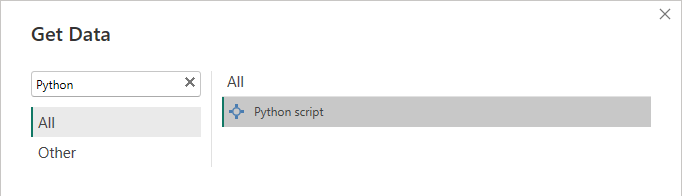
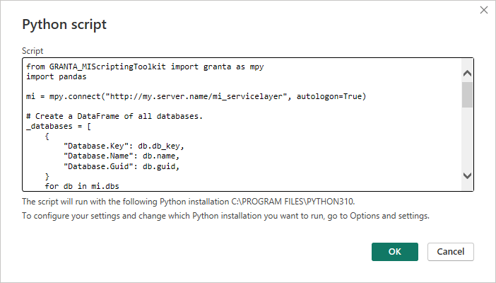
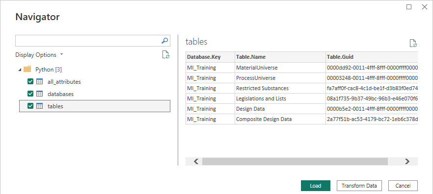

# Preparing data for Power BI

This notebook illustrates using the MI Scripting Toolkit in a Power BI project. It provides two example code snippets.
The first one can be used as a starting point and shows how to extract the following datasets:

- Databases
- Tables
- Attributes and associated revision information

The data provided in these datasets can be used to determine:

- What attributes have been created in a table over a time period?
- What attributes have been modified in a table over a time period?

The second snippet is detailed further down the example.

## Basic usage

### Pre-requisites

* A valid Python interpreter as defined by the
  [Microsoft documentation](https://learn.microsoft.com/en-us/power-bi/connect-data/desktop-python-scripts).
* The MI Scripting Toolkit must be installed for the configured Python interpreter selected in Power BI's Python
  Scripting options.

### Security

When adding a Python script to Power BI, the script is persisted in the Power BI project. When using Power BI in a
production environment, do not store credentials in plain text within the script. If possible, use methods of
authentication that do not require storing sensitive information (such as using Windows Authentication via
`autologon=True`) or refer to the `Authentication` section of the user guide.

### Dataset relationships

Power BI automatically attempts to define relationships between datasets based on the column names. For example, both
the DataFrames ``databases`` and ``tables`` include a column ``Database.Key``, which is automatically recognized as a
relationship.

In Granta MI, it is possible for some identifiers to not be unique across the whole system: for example, two tables
in different databases may share the same name or GUID. This is common occurrence in cases where databases have been
duplicated. As a result, it is sometimes necessary to build a new unique identifier by concatenating existing columns
for dataset relationship to be successfully established.

### Access control

Granta MI schema definition and data held in Granta MI might be subject to access control rules. Be aware of the
access control rules applicable within your organization before exporting data and publishing it through a Power BI
report, to avoid breaching organizational data confidentiality policies.

### Configuration steps

1. Create a new ``Python Script`` Source in Power BI via the ``Get Data`` button.

    

2. Copy the content of the script cell below into the ``Script`` input.

    

3. Update the connection URL and authentication method appropriately.
4. Click `OK` to validate the script definition. Power BI will execute the script and report errors, if any.
5. Select which DataFrames to import as datasets. Click the `Load` button to confirm.

    

6. Verify that column types and dataset relationships are correctly defined.
7. Build your report visualizations.

At the time of writing, Power BI can only import ``pandas.DataFrame`` objects from the script as datasets. If you
modify the provided code snippet, ensure that all data to be imported into Power BI is in a DataFrame, and that all
DataFrames have unique variable names.


```python
from GRANTA_MIScriptingToolkit import granta as mpy
import pandas

mi = mpy.connect("http://my.server.name/mi_servicelayer", autologon=True)

# Create a DataFrame of all databases.
_databases = [
    {
        "Database.Key": db.db_key,
        "Database.Name": db.name,
        "Database.Guid": db.guid,
    }
    for db in mi.dbs
]
databases = pandas.DataFrame.from_records(_databases)

# Create a DataFrame of all tables in all databases.
_tables = [
    {
        "Database.Key": table.db_key,
        "Table.Name": table.name,
        "Table.Guid": table.guid,
    }
    for db in mi.dbs for table in db.tables
]
tables = pandas.DataFrame.from_records(_tables)

# Create a DataFrame of all attributes in all tables in all databases.
_all_attributes = [
    {
        "Database.Key": table.db_key,
        "Table.Guid": table.guid,
        "Attribute.Name": attribute.name,
        "Attribute.Type": attribute.type,
        "Attribute.Unit": attribute.unit,
        "Attribute.Created": attribute.history.created_at,
        "Attribute.LastModified": attribute.history.last_modified_at,
    }
    for db in mi.dbs for table in db.tables for attribute in table.attributes.values()
]
all_attributes = pandas.DataFrame.from_records(_all_attributes)
```

## Advanced usage

The following code snippet illustrates how to retrieve additional revision information from Granta MI. Unlike the
previous code snippet, these operations are specific to a database and table. The ``MI Training`` database and
``MaterialUniverse`` table are used as examples.

Record revision information and data revision information for all records in the table can be used to determine:
    * How many records have been created in a table in a set time period?
    * What records have been updated?
    * What attribute values have been updated in a set time period?
    * What attributes are most populated in the table?
    * Whether an attribute is being used?

The first script provided in this example notebook does not perform intensive operations, and therefore performance
considerations are not necessary. However, the second snippet is likely to be a time expensive operation: it scales
with the number of attributes and the number of records. For large databases, it might require a few minutes to
complete. See the next section for performance considerations and guidance.


```python
# Create a DataFrame with all records from the configured target table, including their revision information.
DB_KEY = "MI_Training"
TABLE_NAME = "MaterialUniverse"

example_table = mi.get_db(db_key=DB_KEY).get_table(TABLE_NAME)
example_records = example_table.all_records()

example_table.bulk_fetch(
    example_records,
    attributes=[
        mpy.RecordProperties.short_name,
        mpy.RecordProperties.name,
        mpy.RecordProperties.table_name,
        mpy.RecordProperties.created_on,
        mpy.RecordProperties.last_modified_on,
        mpy.RecordProperties.created_by,
        mpy.RecordProperties.last_modified_by,
    ]
)
_example_records_properties = [
    {
        "Database.Key": record.db_key,
        "Table.Name": record.table_name,
        "Record.Guid": record.record_guid,
        "Record.Name": record.name,
        "Record.Created": record.created_on,
        "Record.Creator": record.created_by,
        "Record.LastModified": record.last_modified_on,
        "Record.LastModifier": record.last_modified_by,
    }
    for record in example_records
]
example_records_revision = pandas.DataFrame.from_records(_example_records_properties)

# Create a DataFrame with the data revision information for all attributes for all records in the example table.
example_table.bulk_fetch_data_revision_history(example_records)
_example_records_data_revision = [
    {
        "Record.Guid": record.record_guid,
        "Attribute.Name": attribute_name,
        "Data.IsPopulated": attribute_revision.is_populated,
        "Data.VersionNumber": attribute_revision.data_version_number,
        "Data.CreatedInRecordVersion": attribute_revision.created_in_record_version,
        "Data.RetiredInRecordVersion": attribute_revision.retired_in_record_version,
        "Data.Created": attribute_revision.history.created_at if attribute_revision.history is not None else None,
        "Data.Creator": attribute_revision.history.created_by if attribute_revision.history is not None else None,
        "Data.NumberOfUpdates": attribute_revision.history.update_count if attribute_revision.history is not None else None,
        "Data.LastModified": attribute_revision.history.last_modified_at if attribute_revision.history is not None else None,
        "Data.LastModifier": attribute_revision.history.last_modified_by if attribute_revision.history is not None else None,
    }
    for record in example_records for attribute_name, attribute_revision in record.data_revision_history.items()
]
example_records_data_revision = pandas.DataFrame.from_records(_example_records_data_revision)
```

### Performance considerations

It is important to note that Power BI evaluates Python script queries multiple times:
* First to validate the source when it is first defined
* Then to display the preview of DataFrames that can be loaded
* Then, when refreshing the report data, the Python script is evaluated again for each DataFrame loaded as a query

This has an impact on the overall report performance and this section aims to help users understand common pitfalls
and to list possible areas of performance optimization. There is no universal advice that could apply to all Power BI
projects, and it is required to identify the factors that might affect performance in specific use cases.

#### Factors impacting report performance
There are a number of factors to take into account when choosing a strategy to get data into Power BI from Python
scripts using the MI Scripting Toolkit:

* **Time cost associated with an operation:** Some operations (here defined as a sequence of steps that results in a
  DataFrame) require a longer time to process. For example, exporting data for multiple attributes for all records in
  a table is likely to be lengthy. On the other hand, the first code snippet included in this example is likely to run
  quickly for most users.
* **Database and table size:** Some MI Scripting Toolkit operations scale with the number of records, for example
  exporting data for records.
* **Number of different datasets to extract:** When loading DataFrames from a Python script, Power BI duplicates the
  script in each resulting query. Upon refreshing the project's data, all queries are re-run. The more DataFrames are
  loaded from a script, the more times the script is re-run. For example, if the snippet above is added to a project
  and both the ``example_records_revision`` and ``example_records_data_revision`` DataFrames are loaded as queries,
  then refreshing the project will run the script twice, each time running the two operations. If a third operation is
  added to the script and the computed DataFrame is loaded as a new query, then refreshing the project will run the
  script three times, each performing the three operations, etc.

#### Other concerns
* **Content of the report:** Depending on the type of reporting performed in Power BI, it might not be necessary to
  retrieve data for all records. For example, if the aim of the report is to display metrics of record modifications
  from the last week only, the list of relevant records can be obtained by performing a criteria search on the
  ``lastModified`` pseudo-attribute, instead of relying on the method ``Table.all_records()``. The added expense of
  the search operation is likely to be negligeable compared to the cost associated with exporting unnecessary record
  data.
* **Frequency at which the report requires updating:** the more frequently data needs to be refreshed, the less
  tolerance there is for poor performance. On one end of the spectrum, if the report is an one-off operation, it can
  be best to avoid using Python script sources in Power BI. The script can be run separately in Python, DataFrames
  persisted to disk using ``.to_csv()`` and loaded into Power BI using a ``Text\CSV`` source. This approach ensures
  the script is only run once.
* **Report publication:** Whether the Power BI report is published to the online Power BI service, whether it needs to
  be shared with other users, whether the other users need to be able to refresh the data has consequences on which
  connectors can be used.

#### Mitigation options
Demonstrating how these can be implemented is beyond the scope of this example, but below are options to explore:

* **Using a distinct Python source query per operation:** Because Power BI runs the Python script for each extracted
  DataFrame, it can be more efficient to have separate scripts, each responsible for generating a single DataFrame.
  There will be some repetition, such as creating a session, and identifying the correct database and table, but the
  overall performance can be improved, as lengthy operations are not repeated.
* **Writing data to files:** In some circumstances, using Python to write data to a file (for example via
  ``DataFrame.to_csv()``) and loading the file in Power BI might be more efficient. However this affects data can be
  refreshed, as in this scenario Power BI cannot re-run the script.
* **Disabling parallel refresh of queries:** Power BI settings include the ability to disable ``Parallel loading of
  tables``. Doing so does not prevent unnecessary script re-runs, but it prevents the concurrent execution of many
  scripts, which could degrade performance for all queries by overloading the Granta MI server.
