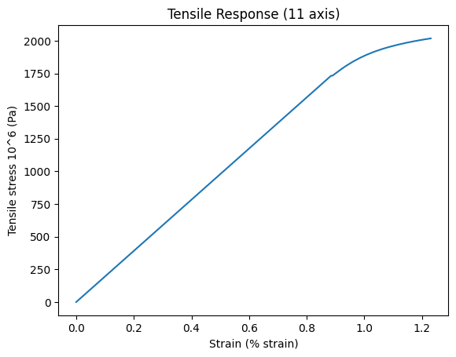
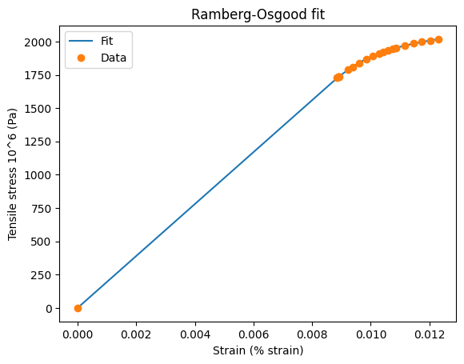

# Functional data and importing data

Export tensile stress-strain data from the MI_Training database, and fit a curve to the exported data. Create a new
record using parameter values extracted from the fitted curve, and upload this record to the database.

This example demonstrates:

- Browsing for records
- Extracting functional data from a Granta MI database
- Importing a new record to a Granta MI database

## Create a Granta MI Session

Import the GRANTA_MIScriptingToolkit package, and create a connection to a Granta MI server.


```python
from datetime import datetime
import sys
import GRANTA_MIScriptingToolkit as gdl

session = gdl.GRANTA_MISession("http://my.server.name/mi_servicelayer", autoLogon=True)
```

## Browse for records

Browse for a record located within the Tensile Statistical Data table in the MI_Training database.

Set the folder path for the record to browse to as: High Alloy Steel / AMS 6520 / Plate / Room Temperature °F.


```python
dbKey = "MI_Training"
table = "Tensile Statistical Data"
folderPath = ["High Alloy Steel", "AMS 6520", "Plate", "Room Temperature °F"]
```

Get the root node of the table of interest.


```python
tableReference = gdl.TableReference(DBKey=dbKey, name=table)
treeRecord = session.browseService.GetRootNode(gdl.GetRootNode(tableReference)).rootNode
```

Find the record of interest, *AMS 6520, Plate, Room Temperature °F*.


```python
for folder in folderPath:
    treeRecords = session.browseService.GetChildNodes(gdl.GetChildNodes(parent=treeRecord.recordReference)).treeRecords
    treeRecord = next((r for r in treeRecords if r.shortName == folder), None)
    if treeRecord:
        print(f"Found treeRecord: {treeRecord.shortName}")
    else:
        raise ValueError(f"Unable to find folder: {folder}")
```
*Previous cell output:*
```output
Found treeRecord: High Alloy Steel
Found treeRecord: AMS 6520
Found treeRecord: Plate
Found treeRecord: Room Temperature °F
```
## Exporting data

Export *Tensile Response (11 axis)* data from the record of interest.


```python
attribute = "Tensile Response (11 axis)"

partialTableRef = gdl.PartialTableReference(tableName=table)
attrRef = gdl.AttributeReference(
    name=attribute,
    DBKey=dbKey,
    partialTableReference=partialTableRef,
)
request = gdl.GetRecordAttributesByRefRequest(
    recordReferences=[treeRecord.recordReference],
    attributeReferences=[attrRef],
)

data = session.dataExportService.GetRecordAttributesByRef(request).recordData[0]
```

Check the data type of the *Tensile Response (11 axis)* attribute is FLOAT_FUNCTIONAL_SERIES.


```python
value = data.attributeValues[0]
print(f"Attribute Name: {value.attributeName}, Type {value.dataType}")
```
*Previous cell output:*
```output
Attribute Name: Tensile Response (11 axis), Type FLOAT_FUNCTIONAL_SERIES
```
Extract the data from each curve into a list.


```python
graph = value.floatFunctionalSeriesDataType.graph
series = graph.series

curves = []

for curve in series:
    points = curve.XYPoints.XYPoints
    x = [point.parameterValue.numericValue for point in points]
    y = [point.Y for point in points]
    curves.append([x,y])
    
print(curves)
```
*Previous cell output:*
```output
[[[0.0, 0.884463, 0.889755, 0.890251, 0.890748, 0.891246, 0.922673, 0.937986, 0.96068, 0.986228, 1.00829, 1.02755, 1.0414, 1.05956, 1.07409, 1.08701, 1.11642, 1.14737, 1.17464, 1.20351, 1.23038], [0.0, 1731.86, 1733.01, 1733.87, 1734.72, 1735.58, 1786.9, 1809.62, 1840.22, 1870.26, 1892.73, 1910.05, 1921.33, 1934.84, 1944.71, 1952.89, 1969.64, 1984.99, 1996.96, 2008.33, 2017.92]]]
```
Plot the curves using the matplotlib package.


```python
import matplotlib.pyplot as plt

x_label = f"{graph.XAxisParameter.name} ({graph.XAxisParameter.unit.unitSymbol})"
y_label = "Tensile stress 10^6 (Pa)"

fig = plt.figure()
ax = fig.add_subplot(111)
ax.set_xlabel(x_label)
ax.set_ylabel(y_label)
ax.set_title("Tensile Response (11 axis)")

for curve in curves:
    ax.plot(curve[0], curve[1])
```


    

    


Fit a Ramberg-Osgood function to the data.


```python
import matplotlib.pyplot as plt
from scipy.optimize import leastsq
import numpy as np


def ramberg_osgood(p, stress):
    return (stress/p[0])*(1.0 + p[1]*(stress/p[2])**(p[3]-1))


def error_function(p, stress, strain):
    return ramberg_osgood(p, stress) - strain


strain = 0.01 * np.array(curves[0][0])
stress = np.array(curves[0][1])

p0 = (2.0e5, 0.0, 1.0, 24.0)

plsq = leastsq(error_function, p0[:], args=(stress, strain))

fig = plt.figure()
ax = fig.add_subplot(111)
ax.set_xlabel(x_label)
ax.set_ylabel(y_label)

ax.plot(ramberg_osgood(plsq[0], stress), stress, label="Fit")
ax.plot(strain, stress, marker='o', linestyle=' ', label="Data")

ax.set_title("Ramberg-Osgood fit")
ax.legend()
```


*Previous cell output:*
```output
<matplotlib.legend.Legend at 0x7f391e6ac380>
```


    

    


## Importing data

Create a new record using the attribute values for Young's modulus obtained from the fitted curve, and import this
record into the database.

Identify the folder to upload the new record to. Browse the record tree to get the record reference for that folder.


```python
importDBKey = "MI_Training"
importTableName = "Tensile Statistical Data"
importFolders = ["High Alloy Steel", "AMS 6520"]
now = datetime.now().strftime("%c")
importRecordName = f"Scripting toolkit foundation layer example 05:{now}"

importTableReference = gdl.TableReference(DBKey=importDBKey, name=importTableName)
treeRecord = session.browseService.GetRootNode(gdl.GetRootNode(table=importTableReference)).rootNode

for folder in importFolders:
    treeRecords = session.browseService.GetChildNodes(gdl.GetChildNodes(parent=treeRecord.recordReference)).treeRecords
    treeRecord = next((r for r in treeRecords if r.shortName == folder), None)
    if treeRecord:
        print(f"Found treeRecord folder: {treeRecord.shortName}")
    else:
        raise ValueError(f"Unable to find import folder: {folder}")
```
*Previous cell output:*
```output
Found treeRecord folder: High Alloy Steel
Found treeRecord folder: AMS 6520
```
Define the record attribute to include in the new record.


```python
modulusAttributeReference = gdl.AttributeReference(
    name="Young's Modulus (11-axis)",
    DBKey=importDBKey,
    partialTableReference=gdl.PartialTableReference(tableName=importTableName)
)
```

Set values and units for the attributes of the new record.


```python
fittedEValue = plsq[0][0]
modulusValue = gdl.PointValueWithParameters(value=fittedEValue)
modulusPointValue = gdl.PointDataType(unitSymbol="psi", points=[modulusValue])
importModulusValue = gdl.ImportAttributeValue(
    attributeReference=modulusAttributeReference,
    pointDataValue=modulusPointValue,
)
```

Create a reference to the subset that the new record will be added to.


```python
subsetReference = gdl.SubsetReference(
    name="Statistical Test Data",
    DBKey=importDBKey,
    partialTableReference=gdl.PartialTableReference(tableName=importTableName)
)
```

Import the record to the Granta MI database.


```python
importRecord = gdl.ImportRecord(
    recordName=importRecordName,
    existingRecord=treeRecord.recordReference,
    subsetReferences=[subsetReference],
    importAttributeValues=[importModulusValue],
)

setRecordAttributesRequest = gdl.SetRecordAttributesRequest(importRecords=[importRecord])
setRecordAttributesResponse = session.dataImportService.SetRecordAttributes(setRecordAttributesRequest)

for record in setRecordAttributesResponse.recordsImported:
    print(f"Imported record {record.shortName} to Granta MI database")
```
*Previous cell output:*
```output
Imported record Scripting toolkit foundation layer example 05:Thu Apr 24 22:57:51 2025 to Granta MI database
```