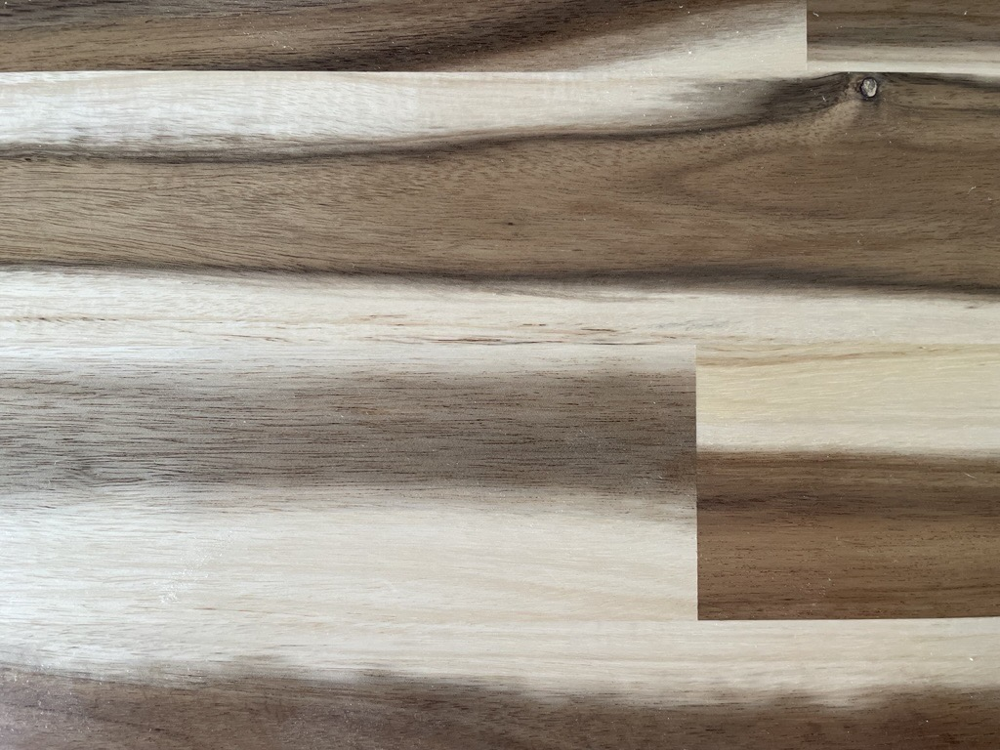

# Add Files, Pictures, and Hyperlinks
Add File, Picture, and Hyperlink attribute types to MI.

## Connect to MI
Specify a database and table.


```python
from datetime import datetime
import pathlib
from GRANTA_MIScriptingToolkit import granta as mpy

mi = mpy.connect("http://my.server.name/mi_servicelayer", autologon=True)
db = mi.get_db(db_key="MI_Training")
tab = db.get_table("Tensile Test Data")
```

## Create a new record 
Define a path in the table from a starting folder (in this case the top level folder) using `path_from()`.
If the path does not exist, the required folders will be created.
Create a new **Record** object at the end of the path.


```python
now = datetime.now().strftime("%c")
record_name = f"Scripting Toolkit Example 11:{now}"
folder = tab.path_from(None, tree_path=["High Alloy Steels", "AMS 6520", "Plate", "300°F"])
record = tab.create_record(name=record_name, parent=folder)
record, folder
```


*Previous cell output:*
```output
(<Record long name: Scripting Toolkit Example 11:Mon May 12 16:14:51 2025>,
 <Record long name: 300°F>)
```


Access the empty **AttributeFile**, **AttributePicture**, and **AttributeHyperlink** objects.


```python
new_file = record.attributes["Test File 1"]
new_pict = record.attributes["Image 2"]
test_method_link = record.attributes["Standard Tension Testing Method"]
test_method_link
```


*Previous cell output:*
```output
<HyperlinkValue name: Standard Tension Testing Method, url: None>
```


## Add files to the record
To add a file to a file attribute (or a picture to a picture attribute) there are two approaches.

Create a **File** or **Picture** object, and set the `binary_data` property directly with either a file buffer or
bytes object. (Useful when you have a file already loaded in your script.)


```python
file_object = mpy.File()
file_path = pathlib.Path("supporting_files/11_example_file_for_import.txt")
with open(file_path, "rb") as file_buffer:
    file_object.binary_data = file_buffer.read()
file_object.file_name = file_path.name
file_object.description = "This is an example file"
new_file.object = file_object
new_file
```


*Previous cell output:*
```output
<FileValue name: Test File 1, file_name: 11_example_file_for_import.txt, description: This is an exampl...>
```


Use the **AttributePicture.load()** method to load a file from disk with a provided file name. (Useful when you have
a file saved to disk).


```python
picture = pathlib.Path("supporting_files/11_example_image_for_import.jpg")
new_pict.load(picture)
new_pict
```


*Previous cell output:*
```output
<PictureValue name: Image 2, populated: True>
```


## Add hyperlinks to the record
To add a hyperlink to a hyperlink attribute, set the `value` property. Optionally, you can also set the `hyperlink_display`
and/or `hyperlink_description` properties.


```python
test_method_link.value = "https://www.astm.org/Standards/E8"
test_method_link.hyperlink_display = "New"
test_method_link.hyperlink_description = "Specification"
test_method_link
```


*Previous cell output:*
```output
<HyperlinkValue name: Standard Tension Testing Method, url: https://www.astm.org/Standards/E8>
```


Set the new attributes to update, and write the changes to MI. Specifying `include_binary_data_in_refresh = True`
means that the picture data will be included in the resulting `Record` object, rather than a URL reference to the
picture data.


```python
record.set_attributes([new_file, new_pict, test_method_link])
record = mi.update([record], include_binary_data_in_refresh=True)[0]
```

## Save files attached to a record
Verify your changes by first extracting the new image from the record, then saving it to disk.
You can either access the `value` directly or provide a file path to the `save()` method.

First, ensure the output directory exists. This directory will already exist if a notebook
was run previously that saved a file to disk.


```python
from pathlib import Path
output_folder = Path("./output")
output_folder.mkdir(exist_ok=True)
```

Next, save the picture to disk.


```python
new_pict = record.attributes["Image 2"]
from IPython.display import Image
Image(new_pict.value)
```


    

    


```python
new_pict.save(path="output/11_exported_picture.jpg")
```
