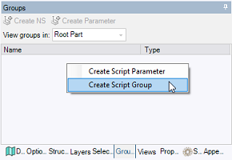
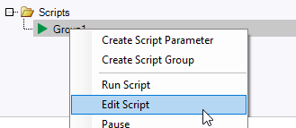

# Creating a script

This page shows how to create a script group in Speos. A script group has to be created to use Speos APIs.

To create a Script Group:

1.  Access the **Groups** panel.
2.  Right-click in the panel and click **Create Script Group**.

    *The Group appears in the panel under the Scripts folder.*

    **Note:** Scripts Groups can be created on the root part or on the active part level.

    

3.  Right-click the **Group** and click **Edit Script** top open the built-in script editor.

    

4.  From the **Script Editor**, if you want to use the new SpaceClaim methods available, select the latest SpaceClaim API version available.

    _API_V20_Beta.png)

    **Note:** Do not confuse the SpaceClaim API version and the Speos API version. Unlike the SpaceClaim API version, the Speos API version is always the latest version available.

    **Note:** If your script version is not the latest version available, and you want to use geometry objects
    retrieved from a Speos object selection attribute (i.e. Items, LinkedObjects), you need to convert the
    retrieved geometry objects thanks to the method ConvertToScriptVersion.

*The Script Group is created and ready to be used. You can now load an existing script or create a script from
scratch using the **Speos API**.*

**Note:**

When you run a script on SpaceClaim in headless mode \(without User Interface\), the rendering calculations are performed in all cases.

If you do not want to perform the rendering calculations in headless mode, create the environment variable **SPEOS\_DISABLE\_RENDERING\_WHEN\_HEADLESS**, and set it to **1**.
