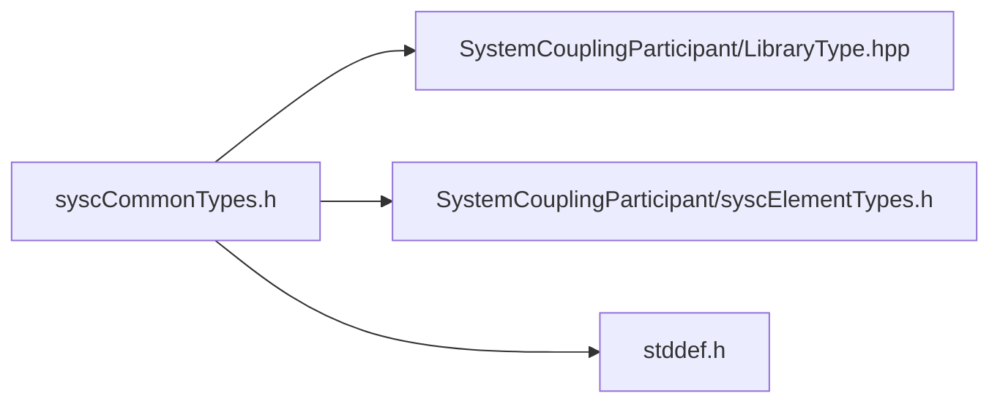

# File syscCommonTypes.h

![][C]

**Location**: `syscCommonTypes.h`


## Classes

* [SyscDimensionality](structSyscDimensionality.md#structSyscDimensionality)
* [SyscTimeStep](structSyscTimeStep.md#structSyscTimeStep)
* [SyscSolutionControl](structSyscSolutionControl.md#structSyscSolutionControl)
* [SyscError](structSyscError.md#structSyscError)
* [SyscSetupInfo](structSyscSetupInfo.md#structSyscSetupInfo)
* [SyscSetupFileInfo](structSyscSetupFileInfo.md#structSyscSetupFileInfo)
* [SyscResultsInfo](structSyscResultsInfo.md#structSyscResultsInfo)
* [SyscParticipantInfo](structSyscParticipantInfo.md#structSyscParticipantInfo)

## Includes

* SystemCouplingParticipant/LibraryType.hpp
* SystemCouplingParticipant/syscElementTypes.h
* <stddef.h>



## Macros

<a id="group__SyscParticipantLibraryCAPI_1gab4cd55b5b37dd76c5755020302086b15"></a>
### Macro SYSC\_STRING\_LENGTH

![][public]

```
#define SYSC_STRING_LENGTH 256
```

Define maximum string length.


## Enumeration types

<a id="group__SyscParticipantLibraryCAPI_1gade42aba1a68acbbf5956edcd388cdcda"></a>
### Enumeration type SyscLocation

![][public]

**Definition**: `syscCommonTypes.h` (line 26)

```
enum SyscLocation {
  SyscNode = 0,
  SyscElement = 1
}
```

Provide an enum for variable mesh locations.


<a id="group__SyscParticipantLibraryCAPI_1ggade42aba1a68acbbf5956edcd388cdcdaae4692f269a846a3f5bec23a9e61f0b8b"></a>
#### Enumerator SyscNode


Nodal data.

<a id="group__SyscParticipantLibraryCAPI_1ggade42aba1a68acbbf5956edcd388cdcdaa0a0e08aa104422e8676637671cf2a482"></a>
#### Enumerator SyscElement


Data on elements.

<a id="group__SyscParticipantLibraryCAPI_1ga007e2fd66e7263a63c114a6d12b3808d"></a>
### Enumeration type SyscTensorType

![][public]

**Definition**: `syscCommonTypes.h` (line 32)

```
enum SyscTensorType {
  SyscScalar = 0,
  SyscVector = 1
}
```

Provide an enum for variable tensor type.


<a id="group__SyscParticipantLibraryCAPI_1gga007e2fd66e7263a63c114a6d12b3808dacb8fa2f95d3959accf13d5f9da32bec2"></a>
#### Enumerator SyscScalar


Scalar

<a id="group__SyscParticipantLibraryCAPI_1gga007e2fd66e7263a63c114a6d12b3808da7b45d832dc633190003739983e661ea1"></a>
#### Enumerator SyscVector


Vector

<a id="group__SyscParticipantLibraryCAPI_1gabf36499a0f333dc9b856c4bcbb25385a"></a>
### Enumeration type SyscTopology

![][public]

**Definition**: `syscCommonTypes.h` (line 38)

```
enum SyscTopology {
  SyscSurface = 2,
  SyscVolume = 3
}
```

Provide an enum for region topologies.


<a id="group__SyscParticipantLibraryCAPI_1ggabf36499a0f333dc9b856c4bcbb25385aa8247153584a945a1be42cfea251acbdb"></a>
#### Enumerator SyscSurface


Surface topology.

<a id="group__SyscParticipantLibraryCAPI_1ggabf36499a0f333dc9b856c4bcbb25385aa38f18def976473946d3405a115fbd6d0"></a>
#### Enumerator SyscVolume


Volume topology.

<a id="group__SyscParticipantLibraryCAPI_1ga83942e23c7ff51ec76e4632612a34d45"></a>
### Enumeration type SyscRegionDiscretizationType

![][public]

**Definition**: `syscCommonTypes.h` (line 44)

```
enum SyscRegionDiscretizationType {
  SyscMeshRegion = 0,
  SyscPointCloudRegion = 1
}
```

Provide an enum for region mesh type.


<a id="group__SyscParticipantLibraryCAPI_1gga83942e23c7ff51ec76e4632612a34d45a8693102131c222ff51685d060bc8d1d3"></a>
#### Enumerator SyscMeshRegion


Mesh region discretization.

<a id="group__SyscParticipantLibraryCAPI_1gga83942e23c7ff51ec76e4632612a34d45a72b4ce23e1c7d4a5981f5ffe6a1928b6"></a>
#### Enumerator SyscPointCloudRegion


Point cloud region discretization.

<a id="group__SyscParticipantLibraryCAPI_1gacf32f1d9c1566f28bee2b348b2dcd9f5"></a>
### Enumeration type SyscInterfaceSide

![][public]

**Definition**: `syscCommonTypes.h` (line 50)

```
enum SyscInterfaceSide {
  SyscInterfaceSide_One = 1,
  SyscInterfaceSide_Two = 2
}
```

Provide enum for coupling interface side.


<a id="group__SyscParticipantLibraryCAPI_1ggacf32f1d9c1566f28bee2b348b2dcd9f5a7c5c48f8ed70c17f777260b3d5963ea3"></a>
#### Enumerator SyscInterfaceSide\_One


<a id="group__SyscParticipantLibraryCAPI_1ggacf32f1d9c1566f28bee2b348b2dcd9f5aca2e8fc2e6fa8407ae40a13bfbedb3ff"></a>
#### Enumerator SyscInterfaceSide\_Two


<a id="group__SyscParticipantLibraryCAPI_1gac5a5f66ee72fd8015eab632a642cf26d"></a>
### Enumeration type SyscDimension

![][public]

**Definition**: `syscCommonTypes.h` (line 56)

```
enum SyscDimension {
  SyscD2 = 2,
  SyscD3 = 3
}
```

Provide enum for system coupling dimension.


<a id="group__SyscParticipantLibraryCAPI_1ggac5a5f66ee72fd8015eab632a642cf26da0c9eff9b65e904d28255b8b08777b297"></a>
#### Enumerator SyscD2


<a id="group__SyscParticipantLibraryCAPI_1ggac5a5f66ee72fd8015eab632a642cf26da322819738b608cfda776ab25cf6a5200"></a>
#### Enumerator SyscD3


<a id="group__SyscParticipantLibraryCAPI_1gaedf008f34febb068e44cb21292dc167f"></a>
### Enumeration type SyscTimeIntegration

![][public]

**Definition**: `syscCommonTypes.h` (line 62)

```
enum SyscTimeIntegration {
  SyscImplicit = 0,
  SyscExplicit = 1
}
```

Provide an enum for time integration.


<a id="group__SyscParticipantLibraryCAPI_1ggaedf008f34febb068e44cb21292dc167fa593d91cbed6aa180b936b20b74a54b71"></a>
#### Enumerator SyscImplicit


<a id="group__SyscParticipantLibraryCAPI_1ggaedf008f34febb068e44cb21292dc167faadc57672e0587e6a52b44f367095b500"></a>
#### Enumerator SyscExplicit


<a id="group__SyscParticipantLibraryCAPI_1gaa28a3de6c7c91003a8a15721a5301f12"></a>
### Enumeration type SyscQuantityType

![][public]

**Definition**: `syscCommonTypes.h` (line 91)

```
enum SyscQuantityType {
  SyscUnspecified = 0,
  SyscForce = 1,
  SyscIncrementalDisplacement = 2,
  SyscTemperature = 3,
  SyscHeatRate = 4,
  SyscHeatTransferCoefficient = 5,
  SyscConvectionReferenceTemperature = 6,
  SyscModeShape = 7,
  SyscElectricalConductivity = 8
}
```

Provide an enum for supported quantity types.

Quantity type provides information about the physical meaning of the variable. This can be useful for detecting validation errors during the coupled analysis setup. If the variable does not match any of the provided quantity types, quantity type can be set to unspecified.


<a id="group__SyscParticipantLibraryCAPI_1ggaa28a3de6c7c91003a8a15721a5301f12af38a3461bab7f9a97b75952b43b40e59"></a>
#### Enumerator SyscUnspecified


<a id="group__SyscParticipantLibraryCAPI_1ggaa28a3de6c7c91003a8a15721a5301f12ae6aa8fd95dcfbbbbc5c31a6c25f64bd5"></a>
#### Enumerator SyscForce


<a id="group__SyscParticipantLibraryCAPI_1ggaa28a3de6c7c91003a8a15721a5301f12acc64cea65ff9ea214fefb2308a5b0b80"></a>
#### Enumerator SyscIncrementalDisplacement


<a id="group__SyscParticipantLibraryCAPI_1ggaa28a3de6c7c91003a8a15721a5301f12ac04825292451f0435241336e6bf9d586"></a>
#### Enumerator SyscTemperature


<a id="group__SyscParticipantLibraryCAPI_1ggaa28a3de6c7c91003a8a15721a5301f12ad3ae742f14341f0cab7b7866aea51dac"></a>
#### Enumerator SyscHeatRate


<a id="group__SyscParticipantLibraryCAPI_1ggaa28a3de6c7c91003a8a15721a5301f12ab27e48f0cf93d6e42aaabf065e51c0ae"></a>
#### Enumerator SyscHeatTransferCoefficient


<a id="group__SyscParticipantLibraryCAPI_1ggaa28a3de6c7c91003a8a15721a5301f12a249378fcb9803c0d94fa56b9db0e0136"></a>
#### Enumerator SyscConvectionReferenceTemperature


<a id="group__SyscParticipantLibraryCAPI_1ggaa28a3de6c7c91003a8a15721a5301f12ac67477bfe4fbe7f99b4ceb8e00ba679e"></a>
#### Enumerator SyscModeShape


<a id="group__SyscParticipantLibraryCAPI_1ggaa28a3de6c7c91003a8a15721a5301f12aa1b2cf043f26c7e4b42a86fd62c0ab58"></a>
#### Enumerator SyscElectricalConductivity


<a id="group__SyscParticipantLibraryCAPI_1ga1e750bcf34a1c16aed218b03a95ee7ed"></a>
### Enumeration type SyscDataType

![][public]

**Definition**: `syscCommonTypes.h` (line 103)

```
enum SyscDataType {
  SyscDataType_Real = 0,
  SyscDataType_Complex = 1
}
```


<a id="group__SyscParticipantLibraryCAPI_1gga1e750bcf34a1c16aed218b03a95ee7eda6b75c7944f0ea0fb9185ffe4f405e45e"></a>
#### Enumerator SyscDataType\_Real


<a id="group__SyscParticipantLibraryCAPI_1gga1e750bcf34a1c16aed218b03a95ee7edacff35d3f643883c35a2390b28e4f73a1"></a>
#### Enumerator SyscDataType\_Complex


<a id="group__SyscParticipantLibraryCAPI_1ga10ce3774353dfbc811147a9ad211b3cd"></a>
### Enumeration type SyscConvergenceStatus

![][public]

**Definition**: `syscCommonTypes.h` (line 109)

```
enum SyscConvergenceStatus {
  SyscDiverging = -1,
  SyscNotYetConverged = 0,
  SyscConverged = 1,
  SyscComplete = 2,
  SyscNotEvaluated = 3
}
```

Provide enum for participant's solver convergence status.


<a id="group__SyscParticipantLibraryCAPI_1gga10ce3774353dfbc811147a9ad211b3cda7466043ed7106086c08d595333e17f52"></a>
#### Enumerator SyscDiverging


<a id="group__SyscParticipantLibraryCAPI_1gga10ce3774353dfbc811147a9ad211b3cdac97f645aa14099d533bbaea696aae752"></a>
#### Enumerator SyscNotYetConverged


<a id="group__SyscParticipantLibraryCAPI_1gga10ce3774353dfbc811147a9ad211b3cda90e0d458e61026cacc99e563aae9bf5e"></a>
#### Enumerator SyscConverged


<a id="group__SyscParticipantLibraryCAPI_1gga10ce3774353dfbc811147a9ad211b3cda69c6ee0eaef6f36ff519c6386cbb33fc"></a>
#### Enumerator SyscComplete


<a id="group__SyscParticipantLibraryCAPI_1gga10ce3774353dfbc811147a9ad211b3cdae11a117c36c99017d0ab07b5f3ba20e0"></a>
#### Enumerator SyscNotEvaluated


<a id="group__SyscParticipantLibraryCAPI_1ga7d5b3786948265c902f7231abe6d79b5"></a>
### Enumeration type SyscAnalysisType

![][public]

**Definition**: `syscCommonTypes.h` (line 118)

```
enum SyscAnalysisType {
  SyscSteady = 0,
  SyscTransient = 1
}
```

Provide an enum for coupled analysis type.


<a id="group__SyscParticipantLibraryCAPI_1gga7d5b3786948265c902f7231abe6d79b5ad0d53c33e61857fdfe41e2501eebc8dd"></a>
#### Enumerator SyscSteady


Steady analysis type.

<a id="group__SyscParticipantLibraryCAPI_1gga7d5b3786948265c902f7231abe6d79b5ac22067ff2e9230dd35621612f4ab4365"></a>
#### Enumerator SyscTransient


Transient (unsteady) analysis type.

<a id="group__SyscParticipantLibraryCAPI_1gade3becc3625d881bdd988111e0895a3c"></a>
### Enumeration type SyscPrimitiveType

![][public]

**Definition**: `syscCommonTypes.h` (line 147)

```
enum SyscPrimitiveType {
  SyscFloat = 0,
  SyscDouble = 1,
  SyscInt32 = 2,
  SyscInt64 = 3,
  SyscUnsignedInt16 = 4,
  SyscUnsignedInt64 = 5
}
```

Provide an enum for supported primitive types.


<a id="group__SyscParticipantLibraryCAPI_1ggade3becc3625d881bdd988111e0895a3ca6ecfee4aefddc0fd0e974f4949883f0f"></a>
#### Enumerator SyscFloat


Single-precision floating point type.

<a id="group__SyscParticipantLibraryCAPI_1ggade3becc3625d881bdd988111e0895a3ca3c8390a23ce87c17dcaffccfd72fe344"></a>
#### Enumerator SyscDouble


Double-precision floating point type.

<a id="group__SyscParticipantLibraryCAPI_1ggade3becc3625d881bdd988111e0895a3ca21752be8ce378ed3c47cddd1210657f2"></a>
#### Enumerator SyscInt32


Signed 32-bit integer.

<a id="group__SyscParticipantLibraryCAPI_1ggade3becc3625d881bdd988111e0895a3cad2b2abd943a30d3ec7509f53cb5b1239"></a>
#### Enumerator SyscInt64


Signed 64-bit integer.

<a id="group__SyscParticipantLibraryCAPI_1ggade3becc3625d881bdd988111e0895a3cadd05bd1ee15d3dd17e7836e2a96c4f52"></a>
#### Enumerator SyscUnsignedInt16


Unsigned 16-bit integer.

<a id="group__SyscParticipantLibraryCAPI_1ggade3becc3625d881bdd988111e0895a3caba28d71a9abf40c318a16365a2eb091c"></a>
#### Enumerator SyscUnsignedInt64


Unsigned 64-bit integer.

<a id="group__SyscParticipantLibraryCAPI_1gab997855544b4c0ac77104b89faffae5d"></a>
### Enumeration type SyscParticipantType

![][public]

**Definition**: `syscCommonTypes.h` (line 156)

```
enum SyscParticipantType {
  SyscDEFAULT = 0,
  SyscCFX = 1,
  SyscFLUENT = 2,
  SyscMAPDL = 3,
  SyscAEDT = 4,
  SyscFMU = 5,
  SyscFMU_PROXY = 6,
  SyscEXTERNALDATA = 7,
  SyscFORTE = 8,
  SyscDEFAULT_SRV = 9,
  SyscMECH_SRV = 10,
  SyscCFD_SRV = 11,
  SyscSCDT_SRV = 12,
  SyscTHERMAL_DESKTOP = 13,
  SyscLS_DYNA = 14,
  SyscROCKY = 15
}
```


<a id="group__SyscParticipantLibraryCAPI_1ggab997855544b4c0ac77104b89faffae5da1f314de13dbd0c48f0339c633203741e"></a>
#### Enumerator SyscDEFAULT


<a id="group__SyscParticipantLibraryCAPI_1ggab997855544b4c0ac77104b89faffae5da6e0f41b213afb0edc478f680075324cc"></a>
#### Enumerator SyscCFX


<a id="group__SyscParticipantLibraryCAPI_1ggab997855544b4c0ac77104b89faffae5dac8857c92c41c39b56581f08cc236f176"></a>
#### Enumerator SyscFLUENT


<a id="group__SyscParticipantLibraryCAPI_1ggab997855544b4c0ac77104b89faffae5dabd0c957458ea1368773e54818d15435c"></a>
#### Enumerator SyscMAPDL


<a id="group__SyscParticipantLibraryCAPI_1ggab997855544b4c0ac77104b89faffae5daf1b337725648c27ffc0f7ade76d2a6cc"></a>
#### Enumerator SyscAEDT


<a id="group__SyscParticipantLibraryCAPI_1ggab997855544b4c0ac77104b89faffae5da0f20720c60a86e4a909a46820586334c"></a>
#### Enumerator SyscFMU


<a id="group__SyscParticipantLibraryCAPI_1ggab997855544b4c0ac77104b89faffae5dade3420bdc27918d3c2c70518f7c9cc19"></a>
#### Enumerator SyscFMU\_PROXY


<a id="group__SyscParticipantLibraryCAPI_1ggab997855544b4c0ac77104b89faffae5daf45662ff29c501232068091a5e19a336"></a>
#### Enumerator SyscEXTERNALDATA


<a id="group__SyscParticipantLibraryCAPI_1ggab997855544b4c0ac77104b89faffae5da87d294213bc3285652129a5a97a24d21"></a>
#### Enumerator SyscFORTE


<a id="group__SyscParticipantLibraryCAPI_1ggab997855544b4c0ac77104b89faffae5da5d362f01300701305b1a228eccac06f0"></a>
#### Enumerator SyscDEFAULT\_SRV


<a id="group__SyscParticipantLibraryCAPI_1ggab997855544b4c0ac77104b89faffae5da0932e47107334a3c6e520b74dd2279b9"></a>
#### Enumerator SyscMECH\_SRV


<a id="group__SyscParticipantLibraryCAPI_1ggab997855544b4c0ac77104b89faffae5dad4851acec7cfe371b4a6b9a9d8e8a6ac"></a>
#### Enumerator SyscCFD\_SRV


<a id="group__SyscParticipantLibraryCAPI_1ggab997855544b4c0ac77104b89faffae5da38d1e472e60e35f9a8044ccb93a5e5b3"></a>
#### Enumerator SyscSCDT\_SRV


<a id="group__SyscParticipantLibraryCAPI_1ggab997855544b4c0ac77104b89faffae5dacf58fe46486ad60bb7b0930cbe29826c"></a>
#### Enumerator SyscTHERMAL\_DESKTOP


<a id="group__SyscParticipantLibraryCAPI_1ggab997855544b4c0ac77104b89faffae5da154ed7cf7815e00c77d7239ea0cfe184"></a>
#### Enumerator SyscLS\_DYNA


<a id="group__SyscParticipantLibraryCAPI_1ggab997855544b4c0ac77104b89faffae5dad9bcd21c67d707283ef0a44e57b69f22"></a>
#### Enumerator SyscROCKY


## Typedefs

<a id="group__SyscParticipantLibraryCAPI_1gaaabd83bdde051f257f11c5c0cdd73990"></a>
### Typedef SyscSolutionControl

![][public]

**Definition**: `syscCommonTypes.h` (line 134)

```
typedef struct SyscSolutionControl SyscSolutionControl
```

Provide a structure containing solution control.


**Return type**: struct [SyscSolutionControl](structSyscSolutionControl.md#structSyscSolutionControl)

<a id="group__SyscParticipantLibraryCAPI_1ga17ef60969b3c919163ba2471eb95a28b"></a>
### Typedef SyscOpaqueDataAccess

![][public]

**Definition**: `syscCommonTypes.h` (line 175)

```
typedef void* SyscOpaqueDataAccess
```


Declare an opaque pointer type.


**Return type**: void *

<a id="group__SyscParticipantLibraryCAPI_1ga80be2caaea1dd7e82a2da155c7283875"></a>
### Typedef SyscSetupInfo

![][public]

**Definition**: `syscCommonTypes.h` (line 197)

```
typedef struct SyscSetupInfo SyscSetupInfo
```

Provide a structure for System Coupling setup information.

To create and/or initialize the [SyscSetupInfo](structSyscSetupInfo.md#structSyscSetupInfo) struct, it is highly recommended to use one of the functions with names starting with <code>syscGetSetupInfo</code>. These functions will initialize all members to the correct values and will help to avoid back-compatibility issues in the future. For example:


```
SyscSetupInfo setupInfo = syscGetSetupInfoA(SyscSteady); 
```


**Return type**: struct [SyscSetupInfo](structSyscSetupInfo.md#structSyscSetupInfo)

<a id="group__SyscParticipantLibraryCAPI_1ga97036eb61b15d6efd5f9602bd19bb562"></a>
### Typedef SyscSetupFileInfo

![][public]

**Definition**: `syscCommonTypes.h` (line 297)

```
typedef struct SyscSetupFileInfo SyscSetupFileInfo
```

Provide a structure for writing System Coupling setup files.

To create and/or initialize the [SyscSetupFileInfo](structSyscSetupFileInfo.md#structSyscSetupFileInfo) struct, it is highly recommended to use <code>syscGetSetupFileInfo</code> function. This function will initialize all members to the correct values and will help to avoid back-compatibility issues in the future. For example:


```
SyscSetupFileInfo setupFileInfo = syscGetSetupFileInfo("setup.scp");
```


**Return type**: struct [SyscSetupFileInfo](structSyscSetupFileInfo.md#structSyscSetupFileInfo)

<a id="group__SyscParticipantLibraryCAPI_1gacab0987c6f6f3da0ae499505c3f67d9e"></a>
### Typedef SyscResultsInfo

![][public]

**Definition**: `syscCommonTypes.h` (line 316)

```
typedef struct SyscResultsInfo SyscResultsInfo
```

Provide a structure for writing results files.


**Return type**: struct [SyscResultsInfo](structSyscResultsInfo.md#structSyscResultsInfo)

<a id="syscCommonTypes_8h_1a29cac2a7bcb30e8f76c639e8aa8316bf"></a>
### Typedef SyscParticipantInfo

![][public]

**Definition**: `syscCommonTypes.h` (line 359)

```
typedef struct SyscParticipantInfo SyscParticipantInfo
```


**Return type**: struct [SyscParticipantInfo](structSyscParticipantInfo.md#structSyscParticipantInfo)

## Functions

<a id="group__SyscParticipantLibraryCAPI_1ga22ab81fcb82b1eb1b58bac1dd3fbcf0d"></a>
### Function syscGetDimensionality

![][public]

```
SyscDimensionality syscGetDimensionality()
```

Get dimensionality.


**Return type**: [SyscDimensionality](structSyscDimensionality.md#structSyscDimensionality)

<a id="group__SyscParticipantLibraryCAPI_1ga1d656df31d1a737654883968e029eb72"></a>
### Function syscGetSyscError

![][public]

```
SyscError syscGetSyscError(int retcode, const char *message)
```

Provide a function to return [SyscError](structSyscError.md#structSyscError) struct.


**Parameters**:

* int **retcode**
* const char * **message**

**Return type**: [SyscError](structSyscError.md#structSyscError)

<a id="group__SyscParticipantLibraryCAPI_1ga65a1735a49d0e0ab7f32d03f27f325a3"></a>
### Function syscGetSetupInfo

![][public]

```
SyscSetupInfo syscGetSetupInfo()
```

Create a setup info struct.

Analysis type will be set to steady. Restarts supported flag will be set to false.


**Return type**: [SyscSetupInfo](structSyscSetupInfo.md#structSyscSetupInfo)

<a id="group__SyscParticipantLibraryCAPI_1gae399cbc645966a48cc2928bb51018d9b"></a>
### Function syscGetSetupInfoA

![][public]

```
SyscSetupInfo syscGetSetupInfoA(enum SyscAnalysisType analysisType)
```

Create a setup info struct.

**Parameters**:

* **analysisType**: - analysis type.

Restarts supported flag will be set to false.


**Parameters**:

* enum [SyscAnalysisType](syscCommonTypes_8h.md#group__SyscParticipantLibraryCAPI_1ga7d5b3786948265c902f7231abe6d79b5) **analysisType**

**Return type**: [SyscSetupInfo](structSyscSetupInfo.md#structSyscSetupInfo)

<a id="group__SyscParticipantLibraryCAPI_1ga49c86c342e0c0d2881958a7a752eb99b"></a>
### Function syscGetSetupInfoAR

![][public]

```
SyscSetupInfo syscGetSetupInfoAR(enum SyscAnalysisType analysisType, int restartsSupported)
```

Create a setup info struct.

**Parameters**:

* **analysisType**: - analysis type.
* **restartsSupported**: - flag indicating whether restarts are supported.


**Parameters**:

* enum [SyscAnalysisType](syscCommonTypes_8h.md#group__SyscParticipantLibraryCAPI_1ga7d5b3786948265c902f7231abe6d79b5) **analysisType**
* int **restartsSupported**

**Return type**: [SyscSetupInfo](structSyscSetupInfo.md#structSyscSetupInfo)

<a id="group__SyscParticipantLibraryCAPI_1gae3a34c9ed638c50c65e1d87dabe66737"></a>
### Function syscGetSetupInfoARD

![][public]

```
SyscSetupInfo syscGetSetupInfoARD(enum SyscAnalysisType analysisType, int restartsSupported, enum SyscDimension dimension)
```

Create a setup info struct.

**Parameters**:

* **analysisType**: - analysis type.
* **restartsSupported**: - flag indicating whether restarts are supported.
* **dimension**: - dimension of the participant.


**Parameters**:

* enum [SyscAnalysisType](syscCommonTypes_8h.md#group__SyscParticipantLibraryCAPI_1ga7d5b3786948265c902f7231abe6d79b5) **analysisType**
* int **restartsSupported**
* enum [SyscDimension](syscCommonTypes_8h.md#group__SyscParticipantLibraryCAPI_1gac5a5f66ee72fd8015eab632a642cf26d) **dimension**

**Return type**: [SyscSetupInfo](structSyscSetupInfo.md#structSyscSetupInfo)

<a id="group__SyscParticipantLibraryCAPI_1gaf3b03ee2974bbd198008e70e15dd1d1a"></a>
### Function syscGetSetupInfoARDT

![][public]

```
SyscSetupInfo syscGetSetupInfoARDT(enum SyscAnalysisType analysisType, int restartsSupported, enum SyscDimension dimension, enum SyscTimeIntegration timeIntegration)
```

Create a setup info struct.

**Parameters**:

* **analysisType**: - analysis type.
* **restartsSupported**: - flag indicating whether restarts are supported.
* **dimension**: - dimension of the participant.
* **timeIntegration**: - Time integration method


**Parameters**:

* enum [SyscAnalysisType](syscCommonTypes_8h.md#group__SyscParticipantLibraryCAPI_1ga7d5b3786948265c902f7231abe6d79b5) **analysisType**
* int **restartsSupported**
* enum [SyscDimension](syscCommonTypes_8h.md#group__SyscParticipantLibraryCAPI_1gac5a5f66ee72fd8015eab632a642cf26d) **dimension**
* enum [SyscTimeIntegration](syscCommonTypes_8h.md#group__SyscParticipantLibraryCAPI_1gaedf008f34febb068e44cb21292dc167f) **timeIntegration**

**Return type**: [SyscSetupInfo](structSyscSetupInfo.md#structSyscSetupInfo)

<a id="group__SyscParticipantLibraryCAPI_1ga34fa5345c4ca947eca11bd6ee25f09ab"></a>
### Function syscGetSetupInfoARDTP

![][public]

```
SyscSetupInfo syscGetSetupInfoARDTP(enum SyscAnalysisType analysisType, int restartsSupported, enum SyscDimension dimension, enum SyscTimeIntegration timeIntegration, enum SyscParticipantType participantType)
```

Create a setup info struct.

**Parameters**:

* **analysisType**: - analysis type.
* **restartsSupported**: - flag indicating whether restarts are supported.
* **dimension**: - dimension of the participant.
* **timeIntegration**: - Time integration method
* **participantType**: - Participant type


**Parameters**:

* enum [SyscAnalysisType](syscCommonTypes_8h.md#group__SyscParticipantLibraryCAPI_1ga7d5b3786948265c902f7231abe6d79b5) **analysisType**
* int **restartsSupported**
* enum [SyscDimension](syscCommonTypes_8h.md#group__SyscParticipantLibraryCAPI_1gac5a5f66ee72fd8015eab632a642cf26d) **dimension**
* enum [SyscTimeIntegration](syscCommonTypes_8h.md#group__SyscParticipantLibraryCAPI_1gaedf008f34febb068e44cb21292dc167f) **timeIntegration**
* enum SyscParticipantType **participantType**

**Return type**: [SyscSetupInfo](structSyscSetupInfo.md#structSyscSetupInfo)

<a id="group__SyscParticipantLibraryCAPI_1gac80fa7c7f1ebe9a8d9ef3c4f90d274eb"></a>
### Function syscGetSetupFileInfo

![][public]

```
SyscSetupFileInfo syscGetSetupFileInfo(const char *setupFileName)
```

Provide a function to create SetupFileInfo struct.

**Parameters**:

* **setupFileName**: Setup file name.

Restarts supported flag will be set to false.


**Parameters**:

* const char * **setupFileName**

**Return type**: [SyscSetupFileInfo](structSyscSetupFileInfo.md#structSyscSetupFileInfo)

<a id="group__SyscParticipantLibraryCAPI_1gabf49efc0bc2492b1c8198ba9bd3dab06"></a>
### Function syscGetResultsInfo

![][public]

```
SyscResultsInfo syscGetResultsInfo(const char *baseFileName)
```

Provide a function to create SetupFileInfo struct.

**Parameters**:

* **baseFileName**: - base results file name.


**Parameters**:

* const char * **baseFileName**

**Return type**: [SyscResultsInfo](structSyscResultsInfo.md#structSyscResultsInfo)

<a id="syscCommonTypes_8h_1a9071ddbfc5cf54e03c28c0747e924fa1"></a>
### Function syscGetParticipantInfo

![][public]

```
SyscParticipantInfo syscGetParticipantInfo(const char *scHost, unsigned short scPort, const char *participantName)
```

Provide a function to get & construct a [SyscParticipantInfo](structSyscParticipantInfo.md#structSyscParticipantInfo) struct if it doesn't exist.

**Parameters**:

* **scHost**: Name of the host on which System Coupling is running.
* **scPort**: Port number on which System Coupling is listening for participant connections.
* **participantName**: Name of this participant (e.g. "MAPDL-1").
* **buildInformation**: Information about the build of this participant solver.
* **isCosimulation**: Flag signifying if the simulation is a cosimulation.
* **transcriptFilename**: The filename to be given to the output participant transcript.


**Returns**:

[SyscParticipantInfo](structSyscParticipantInfo.md#structSyscParticipantInfo) A [SyscParticipantInfo](structSyscParticipantInfo.md#structSyscParticipantInfo) containing minimal attributes to connect to System Coupling


**Parameters**:

* const char * **scHost**
* unsigned short **scPort**
* const char * **participantName**

**Return type**: [SyscParticipantInfo](structSyscParticipantInfo.md#structSyscParticipantInfo)

<a id="syscCommonTypes_8h_1a1bfc8232912e47178cbc2f6f28997e2b"></a>
### Function syscGetParticipantInfoB

![][public]

```
SyscParticipantInfo syscGetParticipantInfoB(const char *scHost, unsigned short scPort, const char *participantName, const char *buildInformation)
```


**Parameters**:

* const char * **scHost**
* unsigned short **scPort**
* const char * **participantName**
* const char * **buildInformation**

**Return type**: [SyscParticipantInfo](structSyscParticipantInfo.md#structSyscParticipantInfo)

<a id="syscCommonTypes_8h_1ac22d0523ec1309af395e2f852afbf173"></a>
### Function syscGetParticipantInfoBT

![][public]

```
SyscParticipantInfo syscGetParticipantInfoBT(const char *scHost, unsigned short scPort, const char *participantName, const char *buildInformation, const char *transcriptFileName)
```


**Parameters**:

* const char * **scHost**
* unsigned short **scPort**
* const char * **participantName**
* const char * **buildInformation**
* const char * **transcriptFileName**

**Return type**: [SyscParticipantInfo](structSyscParticipantInfo.md#structSyscParticipantInfo)

## Source

```
/*
* Copyright ANSYS, Inc. Unauthorized use, distribution, or duplication is prohibited.
*/

#pragma once

#include "SystemCouplingParticipant/LibraryType.hpp"

#include "SystemCouplingParticipant/syscElementTypes.h"

#include <stddef.h>

#ifdef __cplusplus
extern "C" {
#endif

#define SYSC_STRING_LENGTH 256

enum SyscLocation {
  SyscNode = 0,   
  SyscElement = 1 
};

enum SyscTensorType {
  SyscScalar = 0, 
  SyscVector = 1  
};

enum SyscTopology {
  SyscSurface = 2, 
  SyscVolume = 3   
};

enum SyscRegionDiscretizationType {
  SyscMeshRegion = 0,      
  SyscPointCloudRegion = 1 
};

enum SyscInterfaceSide {
  SyscInterfaceSide_One = 1,
  SyscInterfaceSide_Two = 2
};

enum SyscDimension {
  SyscD2 = 2,
  SyscD3 = 3
};

enum SyscTimeIntegration {
  SyscImplicit = 0,
  SyscExplicit = 1
};

typedef struct {
  double length;            
  double time;              
  double mass;              
  double temperature;       
  double amountOfSubstance; 
  double current;           
  double luminousIntensity; 
  double angle;             
} SyscDimensionality;

SyscDimensionality syscGetDimensionality();

enum SyscQuantityType {
  SyscUnspecified = 0,
  SyscForce = 1,
  SyscIncrementalDisplacement = 2,
  SyscTemperature = 3,
  SyscHeatRate = 4,
  SyscHeatTransferCoefficient = 5,
  SyscConvectionReferenceTemperature = 6,
  SyscModeShape = 7,
  SyscElectricalConductivity = 8
};

enum SyscDataType {
  SyscDataType_Real = 0,
  SyscDataType_Complex = 1
};

enum SyscConvergenceStatus {
  SyscDiverging = -1,
  SyscNotYetConverged = 0,
  SyscConverged = 1,
  SyscComplete = 2,
  SyscNotEvaluated = 3
};

enum SyscAnalysisType {
  SyscSteady = 0,   
  SyscTransient = 1 
};

typedef struct {
  int timeStepNumber;  
  double startTime;    
  double timeStepSize; 
} SyscTimeStep;

typedef struct SyscSolutionControl {
  int minimumIterations; 
  int maximumIterations; 
} SyscSolutionControl;

typedef struct {
  int retcode;                      
  char message[SYSC_STRING_LENGTH]; 
} SyscError;

SyscError syscGetSyscError(int retcode, const char* message);

enum SyscPrimitiveType {
  SyscFloat = 0,         
  SyscDouble = 1,        
  SyscInt32 = 2,         
  SyscInt64 = 3,         
  SyscUnsignedInt16 = 4, 
  SyscUnsignedInt64 = 5  
};

enum SyscParticipantType {
  SyscDEFAULT = 0,
  SyscCFX = 1,
  SyscFLUENT = 2,
  SyscMAPDL = 3,
  SyscAEDT = 4,
  SyscFMU = 5,
  SyscFMU_PROXY = 6,
  SyscEXTERNALDATA = 7,
  SyscFORTE = 8,
  SyscDEFAULT_SRV = 9,
  SyscMECH_SRV = 10,
  SyscCFD_SRV = 11,
  SyscSCDT_SRV = 12,
  SyscTHERMAL_DESKTOP = 13,
  SyscLS_DYNA = 14,
  SyscROCKY = 15
};

typedef void* SyscOpaqueDataAccess; 
/******************************* Setup info **********************************/

typedef struct SyscSetupInfo {
  enum SyscAnalysisType analysisType;       
  int restartsSupported;                    
  enum SyscDimension dimension;             
  enum SyscTimeIntegration timeIntegration; 
  enum SyscParticipantType participantType; 
} SyscSetupInfo;

SyscSetupInfo syscGetSetupInfo();

SyscSetupInfo syscGetSetupInfoA(
  enum SyscAnalysisType analysisType);

SyscSetupInfo syscGetSetupInfoAR(
  enum SyscAnalysisType analysisType,
  int restartsSupported);

SyscSetupInfo syscGetSetupInfoARD(
  enum SyscAnalysisType analysisType,
  int restartsSupported,
  enum SyscDimension dimension);

SyscSetupInfo syscGetSetupInfoARDT(
  enum SyscAnalysisType analysisType,
  int restartsSupported,
  enum SyscDimension dimension,
  enum SyscTimeIntegration timeIntegration);

SyscSetupInfo syscGetSetupInfoARDTP(
  enum SyscAnalysisType analysisType,
  int restartsSupported,
  enum SyscDimension dimension,
  enum SyscTimeIntegration timeIntegration,
  enum SyscParticipantType participantType);

/**************************** Setup file info ********************************/

typedef struct SyscSetupFileInfo {
  char setupFileName[SYSC_STRING_LENGTH]; 
  int restartsSupported;                  
} SyscSetupFileInfo;

SyscSetupFileInfo syscGetSetupFileInfo(
  const char* setupFileName);

/***************************** Results info **********************************/

typedef struct SyscResultsInfo {
  char baseFileName[SYSC_STRING_LENGTH]; 
} SyscResultsInfo;

SyscResultsInfo syscGetResultsInfo(const char* baseFileName);

typedef struct SyscParticipantInfo {
  char scHost[SYSC_STRING_LENGTH];
  unsigned short scPort;
  char participantName[SYSC_STRING_LENGTH];
  char buildInformation[SYSC_STRING_LENGTH];
  char transcriptFilename[SYSC_STRING_LENGTH];
} SyscParticipantInfo;

SyscParticipantInfo syscGetParticipantInfo(
  const char* scHost,
  unsigned short scPort,
  const char* participantName);


SyscParticipantInfo syscGetParticipantInfoB(
  const char* scHost,
  unsigned short scPort,
  const char* participantName,
  const char* buildInformation);


SyscParticipantInfo syscGetParticipantInfoBT(
  const char* scHost,
  unsigned short scPort,
  const char* participantName,
  const char* buildInformation,
  const char* transcriptFileName);

#ifdef __cplusplus
}
#endif
```

[public]: https://img.shields.io/badge/-public-brightgreen (public)
[C]: https://img.shields.io/badge/language-C-blue (C)