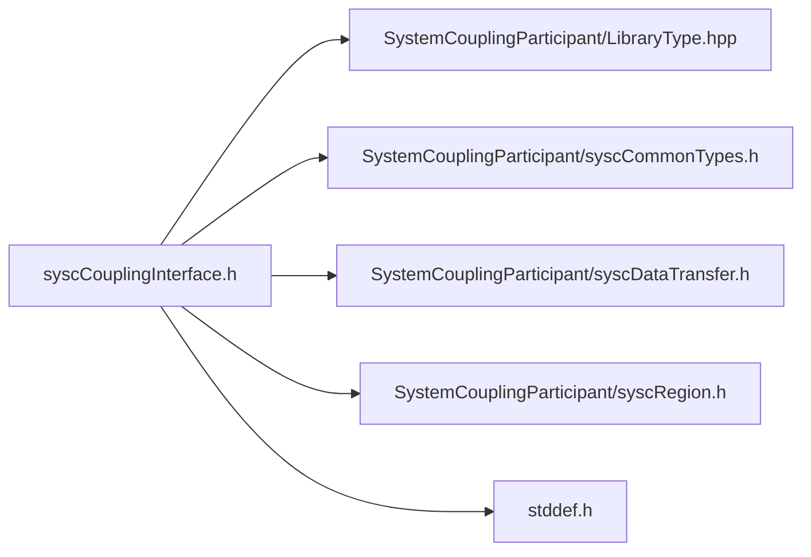

# File syscCouplingInterface.h

![][C]

**Location**: `syscCouplingInterface.h`


## Classes

* [SyscCouplingInterface](structSyscCouplingInterface.md#structSyscCouplingInterface)

## Includes

* SystemCouplingParticipant/LibraryType.hpp
* SystemCouplingParticipant/syscCommonTypes.h
* SystemCouplingParticipant/syscDataTransfer.h
* SystemCouplingParticipant/syscRegion.h
* <stddef.h>



## Typedefs

<a id="group__SyscParticipantLibraryCAPI_1ga828a191dd9fffcb117c398848b9ad10b"></a>
### Typedef SyscCouplingInterface

![][public]

**Definition**: `syscCouplingInterface.h` (line 47)

```
typedef struct SyscCouplingInterface SyscCouplingInterface
```

Provide a struct for a coupling interface.

Coupling interface can be used to set up the transfers of data between different regions within the same participant solver. Interface contains two sides and each side can contain one or more regions. Data transfers are automatically defined: if a variable is defined as an output on all regions on one side of the interface and as an input on all regions on the opposide side of the interface, then it will be mapped from the former side to the latter side.


All regions on one side of the interface must have the same topology.


To create and/or initialize the [SyscCouplingInterface](structSyscCouplingInterface.md#structSyscCouplingInterface) struct, it is highly recommended to use the <code>syscGetCouplingInterface</code> function. This function will initialize all members to the correct values and will help to avoid back-compatibility issues in the future. For example:


```
SyscCouplingInterface reg = syscGetCouplingInterface("FSI"); 
```


**Return type**: struct [SyscCouplingInterface](structSyscCouplingInterface.md#structSyscCouplingInterface)

## Functions

<a id="group__SyscParticipantLibraryCAPI_1gae356c9cb4c0dd69f5e1ea9eef6a7c63b"></a>
### Function syscGetCouplingInterface

![][public]

```
SyscCouplingInterface syscGetCouplingInterface(const char *name)
```

Create a coupling interface.

**Parameters**:

* **name**: - Unique name for this interface. String length should not exceed SYSC_STRING_LENGTH.


**Parameters**:

* const char * **name**

**Return type**: [SyscCouplingInterface](structSyscCouplingInterface.md#structSyscCouplingInterface)

<a id="group__SyscParticipantLibraryCAPI_1gaa8401af709fa7638f76f168aa05784a3"></a>
### Function syscAddSideOneRegion

![][public]

```
SyscError syscAddSideOneRegion(const SyscCouplingInterface couplingInterface, const SyscRegion region)
```

Add region to side one of the interface.

If this region has already been added to the interface on side one, then this call will have no effect.


If a different region with the same name has already been added to the interface on side one, then a runtime error will be thrown.


If a region with the same name has already been added to the interface on side two, then a runtime error will be thrown.


If the region name contains invalid characters, a runtime error will be thrown.


**Parameters**:

* **couplingInterface**: Coupling interface to which the output variable is to be added.
* **region**: Region to be added to side one of the interface.


**Parameters**:

* const [SyscCouplingInterface](structSyscCouplingInterface.md#structSyscCouplingInterface) **couplingInterface**
* const [SyscRegion](structSyscRegion.md#structSyscRegion) **region**

**Return type**: [SyscError](structSyscError.md#structSyscError)

<a id="group__SyscParticipantLibraryCAPI_1ga3bbbec8ccb73b5da2997d2cdcd7abb6b"></a>
### Function syscAddSideTwoRegion

![][public]

```
SyscError syscAddSideTwoRegion(const SyscCouplingInterface couplingInterface, const SyscRegion region)
```

Add region to side two of the interface.

If this region has already been added to the interface on side two, then this call will have no effect.


If a different region with the same name has already been added to the interface on side two, then a runtime error will be thrown.


If a region with the same name has already been added to the interface on side one, then a runtime error will be thrown.


If the region name contains invalid characters, a runtime error will be thrown.


**Parameters**:

* **couplingInterface**: Coupling interface to which the output variable is to be added.
* **region**: Region to be added to side two of the interface.


**Parameters**:

* const [SyscCouplingInterface](structSyscCouplingInterface.md#structSyscCouplingInterface) **couplingInterface**
* const [SyscRegion](structSyscRegion.md#structSyscRegion) **region**

**Return type**: [SyscError](structSyscError.md#structSyscError)

<a id="group__SyscParticipantLibraryCAPI_1gaec7e1373da295e5fb0c7ecfc52409888"></a>
### Function syscAddDataTransfer

![][public]

```
SyscError syscAddDataTransfer(SyscCouplingInterface couplingInterface, SyscDataTransfer dataTransfer)
```

Add the data transfer to the coupling interface.


**Parameters**:

* [SyscCouplingInterface](structSyscCouplingInterface.md#structSyscCouplingInterface) **couplingInterface**
* [SyscDataTransfer](structSyscDataTransfer.md#structSyscDataTransfer) **dataTransfer**

**Return type**: [SyscError](structSyscError.md#structSyscError)

<a id="group__SyscParticipantLibraryCAPI_1gade11af63d2e79ab75e7db7919998e6b5"></a>
### Function syscCouplingInterfaceGetNumDataTransfers

![][public]

```
size_t syscCouplingInterfaceGetNumDataTransfers(SyscCouplingInterface couplingInterface)
```

Get number of data transfer for a given coupling interface.


**Parameters**:

* [SyscCouplingInterface](structSyscCouplingInterface.md#structSyscCouplingInterface) **couplingInterface**

**Return type**: size_t

<a id="group__SyscParticipantLibraryCAPI_1ga13eed5fd3144989e2f7dc2265f6a199e"></a>
### Function syscCouplingInterfaceGetNumSideOneRegions

![][public]

```
size_t syscCouplingInterfaceGetNumSideOneRegions(SyscCouplingInterface couplingInterface)
```

Get number of side one regions for a given coupling interface.


**Parameters**:

* [SyscCouplingInterface](structSyscCouplingInterface.md#structSyscCouplingInterface) **couplingInterface**

**Return type**: size_t

<a id="group__SyscParticipantLibraryCAPI_1gaf2e509aada51179b4ddab8d343f5e392"></a>
### Function syscCouplingInterfaceGetNumSideTwoRegions

![][public]

```
size_t syscCouplingInterfaceGetNumSideTwoRegions(SyscCouplingInterface couplingInterface)
```

Get number of side two regions for a given coupling interface.


**Parameters**:

* [SyscCouplingInterface](structSyscCouplingInterface.md#structSyscCouplingInterface) **couplingInterface**

**Return type**: size_t

<a id="group__SyscParticipantLibraryCAPI_1ga40ed5be0892f1d14a520221f8b439a45"></a>
### Function syscCouplingInterfaceGetDataTransfer

![][public]

```
SyscDataTransfer syscCouplingInterfaceGetDataTransfer(SyscCouplingInterface couplingInterface, size_t index)
```

Get the data transfer at specified index for a given coupling interface.


**Parameters**:

* [SyscCouplingInterface](structSyscCouplingInterface.md#structSyscCouplingInterface) **couplingInterface**
* size_t **index**

**Return type**: [SyscDataTransfer](structSyscDataTransfer.md#structSyscDataTransfer)

<a id="group__SyscParticipantLibraryCAPI_1ga7ab5c93d920b15c8d2e7ba6baddddb28"></a>
### Function syscCouplingInterfaceGetSideOneRegion

![][public]

```
SyscRegion syscCouplingInterfaceGetSideOneRegion(SyscCouplingInterface couplingInterface, size_t index)
```

Get the side one region at specified index for a given coupling interface.


**Parameters**:

* [SyscCouplingInterface](structSyscCouplingInterface.md#structSyscCouplingInterface) **couplingInterface**
* size_t **index**

**Return type**: [SyscRegion](structSyscRegion.md#structSyscRegion)

<a id="group__SyscParticipantLibraryCAPI_1ga1747f6ce3729ff459e26175ded7059f0"></a>
### Function syscCouplingInterfaceGetSideTwoRegion

![][public]

```
SyscRegion syscCouplingInterfaceGetSideTwoRegion(SyscCouplingInterface couplingInterface, size_t index)
```

Get the side two region at specified index for a given coupling interface.


**Parameters**:

* [SyscCouplingInterface](structSyscCouplingInterface.md#structSyscCouplingInterface) **couplingInterface**
* size_t **index**

**Return type**: [SyscRegion](structSyscRegion.md#structSyscRegion)

## Source

```
/*
* Copyright ANSYS, Inc. Unauthorized use, distribution, or duplication is prohibited.
*/

#pragma once

#include "SystemCouplingParticipant/LibraryType.hpp"

#include "SystemCouplingParticipant/syscCommonTypes.h"
#include "SystemCouplingParticipant/syscDataTransfer.h"
#include "SystemCouplingParticipant/syscRegion.h"

#include <stddef.h>

#ifdef __cplusplus
extern "C" {
#endif

typedef struct SyscCouplingInterface {
  char name[SYSC_STRING_LENGTH]; 
} SyscCouplingInterface;

SyscCouplingInterface syscGetCouplingInterface(const char* name);

SyscError syscAddSideOneRegion(
  const SyscCouplingInterface couplingInterface,
  const SyscRegion region);

SyscError syscAddSideTwoRegion(
  const SyscCouplingInterface couplingInterface,
  const SyscRegion region);

SyscError syscAddDataTransfer(
  SyscCouplingInterface couplingInterface,
  SyscDataTransfer dataTransfer);

size_t syscCouplingInterfaceGetNumDataTransfers(
  SyscCouplingInterface couplingInterface);

size_t syscCouplingInterfaceGetNumSideOneRegions(
  SyscCouplingInterface couplingInterface);

size_t syscCouplingInterfaceGetNumSideTwoRegions(
  SyscCouplingInterface couplingInterface);

SyscDataTransfer syscCouplingInterfaceGetDataTransfer(
  SyscCouplingInterface couplingInterface,
  size_t index);

SyscRegion syscCouplingInterfaceGetSideOneRegion(
  SyscCouplingInterface couplingInterface,
  size_t index);

SyscRegion syscCouplingInterfaceGetSideTwoRegion(
  SyscCouplingInterface couplingInterface,
  size_t index);

#ifdef __cplusplus
}
#endif
```

[public]: https://img.shields.io/badge/-public-brightgreen (public)
[C]: https://img.shields.io/badge/language-C-blue (C)