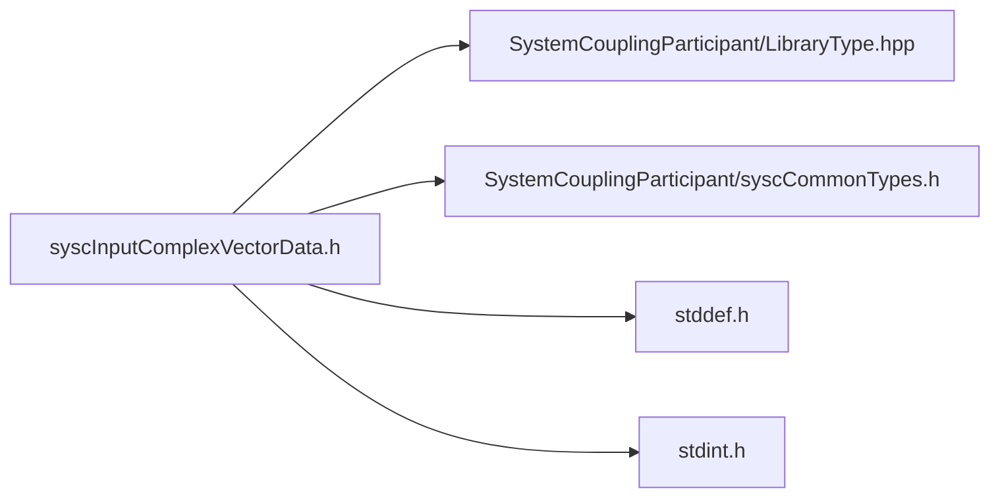

# File syscInputComplexVectorData.h

![][C]

**Location**: `syscInputComplexVectorData.h`


## Classes

* [SyscInputComplexVectorData](structSyscInputComplexVectorData.md#structSyscInputComplexVectorData)

## Includes

* SystemCouplingParticipant/LibraryType.hpp
* SystemCouplingParticipant/syscCommonTypes.h
* <stddef.h>
* <stdint.h>



## Functions

<a id="group__SyscParticipantLibraryCAPI_1gaa7291e96ae240db79de4b35ad82c4cc0"></a>
### Function syscGetInputComplexVectorData

![][public]

```
SyscInputComplexVectorData syscGetInputComplexVectorData()
```

Create an empty input complex vector data access struct.

Primitive type will default to double-precision. Data size will be set to zero. Data pointers will be set to null.


**Return type**: [SyscInputComplexVectorData](structSyscInputComplexVectorData.md#structSyscInputComplexVectorData)

<a id="group__SyscParticipantLibraryCAPI_1ga311e2b750be4212f60557b49870f1eac"></a>
### Function syscGetInputCompactComplexCompactVectorDataDouble

![][public]

```
SyscInputComplexVectorData syscGetInputCompactComplexCompactVectorDataDouble(double *const data, size_t dataSize)
```

Create a 3D complex input vector data access struct.

**Parameters**:

* **data**: - pointer to the double-precision complex data.
* **dataSize**: - data size.


**Parameters**:

* double *const **data**
* size_t **dataSize**

**Return type**: [SyscInputComplexVectorData](structSyscInputComplexVectorData.md#structSyscInputComplexVectorData)

<a id="group__SyscParticipantLibraryCAPI_1ga5396c1513b3448bfd783c2db743606d2"></a>
### Function syscGetInputCompactComplexCompactVectorDataFloat

![][public]

```
SyscInputComplexVectorData syscGetInputCompactComplexCompactVectorDataFloat(float *const data, size_t dataSize)
```

Create a 3D complex input vector data access struct.

**Parameters**:

* **data**: - pointer to the single-precision complex data.
* **dataSize**: - data size.


**Parameters**:

* float *const **data**
* size_t **dataSize**

**Return type**: [SyscInputComplexVectorData](structSyscInputComplexVectorData.md#structSyscInputComplexVectorData)

<a id="group__SyscParticipantLibraryCAPI_1ga8cce8fbb7655b448cd3c6c08772e1766"></a>
### Function syscGetInputSplitComplexCompactVectorDataDouble

![][public]

```
SyscInputComplexVectorData syscGetInputSplitComplexCompactVectorDataDouble(double *const dataReal, double *const dataImag, size_t dataSize)
```

Create a 3D complex input vector data access struct.

**Parameters**:

* **dataReal**: - pointer to the double-precision complex data (real components).
* **dataImag**: - pointer to the double-precision complex data (imaginary components).
* **dataSize**: - data size.


**Parameters**:

* double *const **dataReal**
* double *const **dataImag**
* size_t **dataSize**

**Return type**: [SyscInputComplexVectorData](structSyscInputComplexVectorData.md#structSyscInputComplexVectorData)

<a id="group__SyscParticipantLibraryCAPI_1ga0c9104179a6e98a7a043e4412f1dafd5"></a>
### Function syscGetInputSplitComplexCompactVectorDataFloat

![][public]

```
SyscInputComplexVectorData syscGetInputSplitComplexCompactVectorDataFloat(float *const dataReal, float *const dataImag, size_t dataSize)
```

Create a 3D complex input vector data access struct.

**Parameters**:

* **dataReal**: - pointer to the single-precision complex data (real components).
* **dataImag**: - pointer to the single-precision complex data (imaginary components).
* **dataSize**: - data size.


**Parameters**:

* float *const **dataReal**
* float *const **dataImag**
* size_t **dataSize**

**Return type**: [SyscInputComplexVectorData](structSyscInputComplexVectorData.md#structSyscInputComplexVectorData)

<a id="group__SyscParticipantLibraryCAPI_1ga7eefc4444dbdf8924e4074046de5eba2"></a>
### Function syscGetInputCompactComplexSplitVectorDataDouble

![][public]

```
SyscInputComplexVectorData syscGetInputCompactComplexSplitVectorDataDouble(double *const data1, double *const data2, double *const data3, size_t dataSize)
```

Create a 3D complex input vector data access struct.

**Parameters**:

* **data1**: - pointer to the double-precision complex data (first component).
* **data2**: - pointer to the double-precision complex data (second component).
* **data3**: - pointer to the double-precision complex data (third component).
* **dataSize**: - data size.


**Parameters**:

* double *const **data1**
* double *const **data2**
* double *const **data3**
* size_t **dataSize**

**Return type**: [SyscInputComplexVectorData](structSyscInputComplexVectorData.md#structSyscInputComplexVectorData)

<a id="group__SyscParticipantLibraryCAPI_1ga513ecaae813a2904f6926c5839cc11a1"></a>
### Function syscGetInputCompactComplexSplitVectorDataFloat

![][public]

```
SyscInputComplexVectorData syscGetInputCompactComplexSplitVectorDataFloat(float *const data1, float *const data2, float *const data3, size_t dataSize)
```

Create a 3D complex input vector data access struct.

**Parameters**:

* **data1**: - pointer to the single-precision complex data (first component).
* **data2**: - pointer to the single-precision complex data (second component).
* **data3**: - pointer to the single-precision complex data (third component).
* **dataSize**: - data size.


**Parameters**:

* float *const **data1**
* float *const **data2**
* float *const **data3**
* size_t **dataSize**

**Return type**: [SyscInputComplexVectorData](structSyscInputComplexVectorData.md#structSyscInputComplexVectorData)

<a id="group__SyscParticipantLibraryCAPI_1ga1fd576a79df5e1b27247f4b71e2afbf0"></a>
### Function syscGetInputSplitComplexSplitVectorDataDouble

![][public]

```
SyscInputComplexVectorData syscGetInputSplitComplexSplitVectorDataDouble(double *const data1Real, double *const data1Imag, double *const data2Real, double *const data2Imag, double *const data3Real, double *const data3Imag, size_t dataSize)
```

Create a 3D complex input vector data access struct.

**Parameters**:

* **data1Real**: - pointer to the double-precision complex data (first real component).
* **data1Imag**: - pointer to the double-precision complex data (first imagindary component).
* **data2Real**: - pointer to the double-precision complex data (second real component).
* **data2Imag**: - pointer to the double-precision complex data (second imagindary component).
* **data3Real**: - pointer to the double-precision complex data (third real component).
* **data3Imag**: - pointer to the double-precision complex data (third imagindary component).
* **dataSize**: - data size.


**Parameters**:

* double *const **data1Real**
* double *const **data1Imag**
* double *const **data2Real**
* double *const **data2Imag**
* double *const **data3Real**
* double *const **data3Imag**
* size_t **dataSize**

**Return type**: [SyscInputComplexVectorData](structSyscInputComplexVectorData.md#structSyscInputComplexVectorData)

<a id="group__SyscParticipantLibraryCAPI_1ga6b650f50fa53c996a07147474343f55f"></a>
### Function syscGetInputSplitComplexSplitVectorDataFloat

![][public]

```
SyscInputComplexVectorData syscGetInputSplitComplexSplitVectorDataFloat(float *const data1Real, float *const data1Imag, float *const data2Real, float *const data2Imag, float *const data3Real, float *const data3Imag, size_t dataSize)
```

Create a 3D complex input vector data access struct.

**Parameters**:

* **data1Real**: - pointer to the single-precision complex data (first real component).
* **data1Imag**: - pointer to the single-precision complex data (first imagindary component).
* **data2Real**: - pointer to the single-precision complex data (second real component).
* **data2Imag**: - pointer to the single-precision complex data (second imagindary component).
* **data3Real**: - pointer to the single-precision complex data (third real component).
* **data3Imag**: - pointer to the single-precision complex data (third imagindary component).
* **dataSize**: - data size.


**Parameters**:

* float *const **data1Real**
* float *const **data1Imag**
* float *const **data2Real**
* float *const **data2Imag**
* float *const **data3Real**
* float *const **data3Imag**
* size_t **dataSize**

**Return type**: [SyscInputComplexVectorData](structSyscInputComplexVectorData.md#structSyscInputComplexVectorData)

<a id="group__SyscParticipantLibraryCAPI_1ga93d5fd27a2899ea57f88958aa29506cd"></a>
### Function syscGetInputCompactComplexCompactVectorDataDoubleDim

![][public]

```
SyscInputComplexVectorData syscGetInputCompactComplexCompactVectorDataDoubleDim(double *const data, size_t dataSize, enum SyscDimension dimension)
```

Create a complex input vector data access struct based on dimension.

**Parameters**:

* **data**: - pointer to the double-precision complex data.
* **dataSize**: - data size.
* **dimension**: - dimension of complex vector data.


**Parameters**:

* double *const **data**
* size_t **dataSize**
* enum [SyscDimension](syscCommonTypes_8h.md#group__SyscParticipantLibraryCAPI_1gac5a5f66ee72fd8015eab632a642cf26d) **dimension**

**Return type**: [SyscInputComplexVectorData](structSyscInputComplexVectorData.md#structSyscInputComplexVectorData)

<a id="group__SyscParticipantLibraryCAPI_1ga6fa6c5f2890928560f68ebb6d45cabc9"></a>
### Function syscGetInputCompactComplexCompactVectorDataFloatDim

![][public]

```
SyscInputComplexVectorData syscGetInputCompactComplexCompactVectorDataFloatDim(float *const data, size_t dataSize, enum SyscDimension dimension)
```

Create a complex input vector data access struct based on dimension.

**Parameters**:

* **data**: - pointer to the single-precision complex data.
* **dataSize**: - data size.
* **dimension**: - dimension of complex vector data.


**Parameters**:

* float *const **data**
* size_t **dataSize**
* enum [SyscDimension](syscCommonTypes_8h.md#group__SyscParticipantLibraryCAPI_1gac5a5f66ee72fd8015eab632a642cf26d) **dimension**

**Return type**: [SyscInputComplexVectorData](structSyscInputComplexVectorData.md#structSyscInputComplexVectorData)

## Source

```
/*
* Copyright ANSYS, Inc. Unauthorized use, distribution, or duplication is prohibited.
*/

#pragma once

#include "SystemCouplingParticipant/LibraryType.hpp"

#include "SystemCouplingParticipant/syscCommonTypes.h"

#include <stddef.h>
#include <stdint.h>

#ifdef __cplusplus
extern "C" {
#endif

typedef struct {
  enum SyscPrimitiveType primitiveType; 
  void* data1;                          
  void* data2;                          
  void* data3;                          
  void* data4;                          
  void* data5;                          
  void* data6;                          
  size_t size;                          
  enum SyscDimension dimension;         
} SyscInputComplexVectorData;

SyscInputComplexVectorData syscGetInputComplexVectorData();

SyscInputComplexVectorData syscGetInputCompactComplexCompactVectorDataDouble(
  double* const data,
  size_t dataSize);

SyscInputComplexVectorData syscGetInputCompactComplexCompactVectorDataFloat(
  float* const data,
  size_t dataSize);

SyscInputComplexVectorData syscGetInputSplitComplexCompactVectorDataDouble(
  double* const dataReal,
  double* const dataImag,
  size_t dataSize);

SyscInputComplexVectorData syscGetInputSplitComplexCompactVectorDataFloat(
  float* const dataReal,
  float* const dataImag,
  size_t dataSize);

SyscInputComplexVectorData syscGetInputCompactComplexSplitVectorDataDouble(
  double* const data1,
  double* const data2,
  double* const data3,
  size_t dataSize);

SyscInputComplexVectorData syscGetInputCompactComplexSplitVectorDataFloat(
  float* const data1,
  float* const data2,
  float* const data3,
  size_t dataSize);

SyscInputComplexVectorData syscGetInputSplitComplexSplitVectorDataDouble(
  double* const data1Real,
  double* const data1Imag,
  double* const data2Real,
  double* const data2Imag,
  double* const data3Real,
  double* const data3Imag,
  size_t dataSize);

SyscInputComplexVectorData syscGetInputSplitComplexSplitVectorDataFloat(
  float* const data1Real,
  float* const data1Imag,
  float* const data2Real,
  float* const data2Imag,
  float* const data3Real,
  float* const data3Imag,
  size_t dataSize);

SyscInputComplexVectorData syscGetInputCompactComplexCompactVectorDataDoubleDim(
  double* const data,
  size_t dataSize,
  enum SyscDimension dimension);

SyscInputComplexVectorData syscGetInputCompactComplexCompactVectorDataFloatDim(
  float* const data,
  size_t dataSize,
  enum SyscDimension dimension);

#ifdef __cplusplus
}
#endif
```

[public]: https://img.shields.io/badge/-public-brightgreen (public)
[C]: https://img.shields.io/badge/language-C-blue (C)