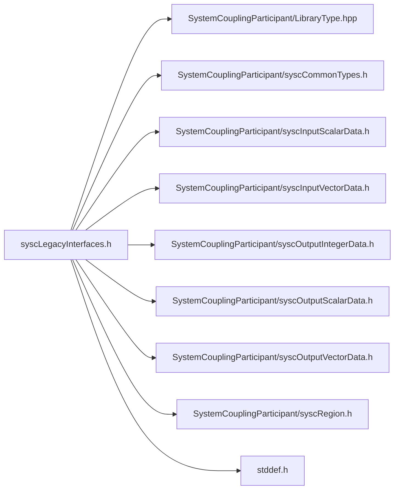

# File syscLegacyInterfaces.h

![][C]

**Location**: `syscLegacyInterfaces.h`


## Includes

* SystemCouplingParticipant/LibraryType.hpp
* SystemCouplingParticipant/syscCommonTypes.h
* SystemCouplingParticipant/syscInputScalarData.h
* SystemCouplingParticipant/syscInputVectorData.h
* SystemCouplingParticipant/syscOutputIntegerData.h
* SystemCouplingParticipant/syscOutputScalarData.h
* SystemCouplingParticipant/syscOutputVectorData.h
* SystemCouplingParticipant/syscRegion.h
* <stddef.h>



## Typedefs

<a id="syscLegacyInterfaces_8h_1a4c9447d8bf1f2ff342d3106ca6354fc8"></a>
### Typedef SyscInputScalarVariableAccess

![][public]

**Definition**: `syscLegacyInterfaces.h` (line 30)

```
typedef SyscError(* SyscInputScalarVariableAccess) (const char *regionName, const char *variableName, SyscInputScalarData *varData)
```


**Return type**: [SyscError](structSyscError.md#structSyscError)(*

<a id="syscLegacyInterfaces_8h_1af9a8c22052da26bc0a1f59cae3b10c49"></a>
### Typedef SyscInputVectorVariableAccess

![][public]

**Definition**: `syscLegacyInterfaces.h` (line 40)

```
typedef SyscError(* SyscInputVectorVariableAccess) (const char *regionName, const char *variableName, SyscInputVectorData *varData)
```


**Return type**: [SyscError](structSyscError.md#structSyscError)(*

<a id="syscLegacyInterfaces_8h_1a5a048dafdcd30450abd59ba8efce06a4"></a>
### Typedef SyscOutputScalarVariableAccess

![][public]

**Definition**: `syscLegacyInterfaces.h` (line 51)

```
typedef SyscError(* SyscOutputScalarVariableAccess) (const char *regionName, const char *variableName, SyscOutputScalarData *varData)
```


**Return type**: [SyscError](structSyscError.md#structSyscError)(*

<a id="syscLegacyInterfaces_8h_1a28c4453b0889a06dc227190145fa1324"></a>
### Typedef SyscOutputVectorVariableAccess

![][public]

**Definition**: `syscLegacyInterfaces.h` (line 62)

```
typedef SyscError(* SyscOutputVectorVariableAccess) (const char *regionName, const char *variableName, SyscOutputVectorData *varData)
```


**Return type**: [SyscError](structSyscError.md#structSyscError)(*

## Functions

<a id="syscLegacyInterfaces_8h_1a783cf517609f48fb1a26c57bf9f7ee8b"></a>
### Function syscCompleteCouplingSetup

![][public]

```
SyscError syscCompleteCouplingSetup()
```


**Return type**: [SyscError](structSyscError.md#structSyscError)

<a id="syscLegacyInterfaces_8h_1a363a9d7573b36139a2fdda8814d1211d"></a>
### Function syscCompleteCouplingSetupTransient

![][public]

```
SyscError syscCompleteCouplingSetupTransient()
```


**Return type**: [SyscError](structSyscError.md#structSyscError)

<a id="syscLegacyInterfaces_8h_1a92307cea739c9c0c140d0855b2824b18"></a>
### Function syscRegisterInputScalarVariableAccess

![][public]

```
SyscError syscRegisterInputScalarVariableAccess(SyscInputScalarVariableAccess dataAccess)
```


**Parameters**:

* SyscInputScalarVariableAccess **dataAccess**

**Return type**: [SyscError](structSyscError.md#structSyscError)

<a id="syscLegacyInterfaces_8h_1a27db89b4e6b29d28a5a6ccf28bdf747a"></a>
### Function syscRegisterInputVectorVariableAccess

![][public]

```
SyscError syscRegisterInputVectorVariableAccess(SyscInputVectorVariableAccess dataAccess)
```


**Parameters**:

* SyscInputVectorVariableAccess **dataAccess**

**Return type**: [SyscError](structSyscError.md#structSyscError)

<a id="syscLegacyInterfaces_8h_1a8253ec6d984411829f920f966776bab9"></a>
### Function syscRegisterOutputScalarVariableAccess

![][public]

```
SyscError syscRegisterOutputScalarVariableAccess(SyscOutputScalarVariableAccess dataAccess)
```


**Parameters**:

* SyscOutputScalarVariableAccess **dataAccess**

**Return type**: [SyscError](structSyscError.md#structSyscError)

<a id="syscLegacyInterfaces_8h_1a8768de1fab6089b7eaf134818027ded6"></a>
### Function syscRegisterOutputVectorVariableAccess

![][public]

```
SyscError syscRegisterOutputVectorVariableAccess(SyscOutputVectorVariableAccess dataAccess)
```


**Parameters**:

* SyscOutputVectorVariableAccess **dataAccess**

**Return type**: [SyscError](structSyscError.md#structSyscError)

<a id="syscLegacyInterfaces_8h_1a21768f0d4d4a65c2aa37727bd4789ccf"></a>
### Function syscGetVolumeMesh

![][public]

```
SyscVolumeMesh syscGetVolumeMesh()
```


**Return type**: [SyscVolumeMesh](structSyscVolumeMesh.md#structSyscVolumeMesh)

## Source

```
/*
* Copyright ANSYS, Inc. Unauthorized use, distribution, or duplication is prohibited.
*/

#pragma once

#include "SystemCouplingParticipant/LibraryType.hpp"

#include "SystemCouplingParticipant/syscCommonTypes.h"
#include "SystemCouplingParticipant/syscInputScalarData.h"
#include "SystemCouplingParticipant/syscInputVectorData.h"
#include "SystemCouplingParticipant/syscOutputIntegerData.h"
#include "SystemCouplingParticipant/syscOutputScalarData.h"
#include "SystemCouplingParticipant/syscOutputVectorData.h"
#include "SystemCouplingParticipant/syscRegion.h"

#include <stddef.h>

#ifdef __cplusplus
extern "C" {
#endif

/* Deprecated - use syscCompleteSetup() */
 SyscError syscCompleteCouplingSetup();

/* Deprecated - use syscCompleteSetup() */
 SyscError syscCompleteCouplingSetupTransient();

/* Deprecated - use SyscInputScalarDataAccess. */
typedef SyscError (*SyscInputScalarVariableAccess)(
  const char* regionName,
  const char* variableName,
  SyscInputScalarData* varData);

/* Deprecated - use syscRegisterIniputScalarDataAccess() */
 SyscError syscRegisterInputScalarVariableAccess(
  SyscInputScalarVariableAccess dataAccess);

/* Deprecated - use SyscInputVectorDataAccess. */
typedef SyscError (*SyscInputVectorVariableAccess)(
  const char* regionName,
  const char* variableName,
  SyscInputVectorData* varData);

/* Deprecated - use syscRegisterInputVectorDataAccess() */

SyscError syscRegisterInputVectorVariableAccess(
  SyscInputVectorVariableAccess dataAccess);

/* Deprecated - use SyscOutputScalarDataAccess. */
typedef SyscError (*SyscOutputScalarVariableAccess)(
  const char* regionName,
  const char* variableName,
  SyscOutputScalarData* varData);

/* Deprecated - use syscRegisterOutputScalarDataAccess() */

SyscError syscRegisterOutputScalarVariableAccess(
  SyscOutputScalarVariableAccess dataAccess);

/* Deprecated - use SyscOutputVectorDataAccess. */
typedef SyscError (*SyscOutputVectorVariableAccess)(
  const char* regionName,
  const char* variableName,
  SyscOutputVectorData* varData);

/* Deprecated - use syscRegisterOutputVectorDataAccess() */

SyscError syscRegisterOutputVectorVariableAccess(
  SyscOutputVectorVariableAccess dataAccess);

/* Deprecated - use syscGetVolumeMeshEmpty() */

SyscVolumeMesh syscGetVolumeMesh();

#ifdef __cplusplus
}
#endif
```

[public]: https://img.shields.io/badge/-public-brightgreen (public)
[C]: https://img.shields.io/badge/language-C-blue (C)