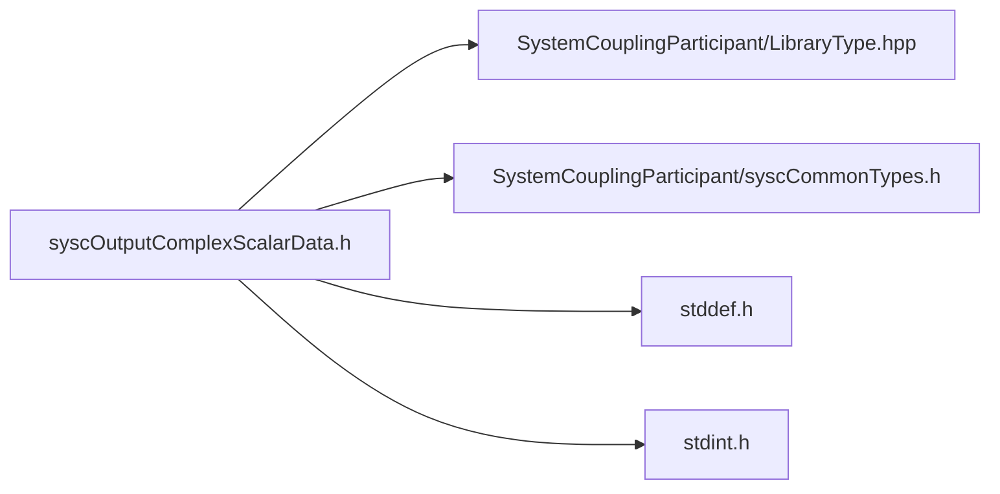

# File syscOutputComplexScalarData.h

![][C]

**Location**: `syscOutputComplexScalarData.h`


## Classes

* [SyscOutputComplexScalarData](structSyscOutputComplexScalarData.md#structSyscOutputComplexScalarData)

## Includes

* SystemCouplingParticipant/LibraryType.hpp
* SystemCouplingParticipant/syscCommonTypes.h
* <stddef.h>
* <stdint.h>



## Functions

<a id="group__SyscParticipantLibraryCAPI_1ga1ed999efcf217211831e6e440c9b6789"></a>
### Function syscGetOutputComplexScalarData

![][public]

```
SyscOutputComplexScalarData syscGetOutputComplexScalarData()
```

Create an empty output complex scalar data access struct.

Primitive type will default to double-precision. Data size will be set to zero. Data pointers will be set to null.


**Return type**: [SyscOutputComplexScalarData](structSyscOutputComplexScalarData.md#structSyscOutputComplexScalarData)

<a id="group__SyscParticipantLibraryCAPI_1ga55ed1d17c6d2f849b9588531d7c516d9"></a>
### Function syscGetOutputComplexScalarDataSplitDouble

![][public]

```
SyscOutputComplexScalarData syscGetOutputComplexScalarDataSplitDouble(const double *const dataReal, const double *const dataImag, size_t dataSize)
```

Create a complex output scalar data access struct.

**Parameters**:

* **dataReal**: - pointer to the double-precision real data component.
* **dataImag**: - pointer to the double-precision imaginary data component.
* **dataSize**: - data size.


**Parameters**:

* const double *const **dataReal**
* const double *const **dataImag**
* size_t **dataSize**

**Return type**: [SyscOutputComplexScalarData](structSyscOutputComplexScalarData.md#structSyscOutputComplexScalarData)

<a id="group__SyscParticipantLibraryCAPI_1ga0e86f0bfb33258007eb2b2ecd6b44dec"></a>
### Function syscGetOutputComplexScalarDataSplitFloat

![][public]

```
SyscOutputComplexScalarData syscGetOutputComplexScalarDataSplitFloat(const float *const dataReal, const float *const dataImag, size_t dataSize)
```

Create a complex output scalar data access struct.

**Parameters**:

* **dataReal**: - pointer to the single-precision real data component.
* **dataImag**: - pointer to the single-precision imaginary data component.
* **dataSize**: - data size.


**Parameters**:

* const float *const **dataReal**
* const float *const **dataImag**
* size_t **dataSize**

**Return type**: [SyscOutputComplexScalarData](structSyscOutputComplexScalarData.md#structSyscOutputComplexScalarData)

<a id="group__SyscParticipantLibraryCAPI_1ga08d88f4495f347260e4678ab6bedbf75"></a>
### Function syscGetOutputComplexScalarDataCompactDouble

![][public]

```
SyscOutputComplexScalarData syscGetOutputComplexScalarDataCompactDouble(const double *const data, size_t dataSize)
```

Create a complex output scalar data access struct.

**Parameters**:

* **data**: - pointer to the double-precision data.
* **dataSize**: - data size.


**Parameters**:

* const double *const **data**
* size_t **dataSize**

**Return type**: [SyscOutputComplexScalarData](structSyscOutputComplexScalarData.md#structSyscOutputComplexScalarData)

<a id="group__SyscParticipantLibraryCAPI_1ga3d806d095d2d333f2a78abb38f7cddf6"></a>
### Function syscGetOutputComplexScalarDataCompactFloat

![][public]

```
SyscOutputComplexScalarData syscGetOutputComplexScalarDataCompactFloat(const float *const data, size_t dataSize)
```

Create a complex output scalar data access struct.

**Parameters**:

* **data**: - pointer to the single-precision data.
* **dataSize**: - data size.


**Parameters**:

* const float *const **data**
* size_t **dataSize**

**Return type**: [SyscOutputComplexScalarData](structSyscOutputComplexScalarData.md#structSyscOutputComplexScalarData)

## Source

```
/*
* Copyright ANSYS, Inc. Unauthorized use, distribution, or duplication is prohibited.
*/

#pragma once

#include "SystemCouplingParticipant/LibraryType.hpp"

#include "SystemCouplingParticipant/syscCommonTypes.h"

#include <stddef.h>
#include <stdint.h>

#ifdef __cplusplus
extern "C" {
#endif

typedef struct {
  enum SyscPrimitiveType primitiveType; 
  const void* data1;                    
  const void* data2;                    
  size_t size;                          
} SyscOutputComplexScalarData;

SyscOutputComplexScalarData syscGetOutputComplexScalarData();

SyscOutputComplexScalarData syscGetOutputComplexScalarDataSplitDouble(
  const double* const dataReal,
  const double* const dataImag,
  size_t dataSize);

SyscOutputComplexScalarData syscGetOutputComplexScalarDataSplitFloat(
  const float* const dataReal,
  const float* const dataImag,
  size_t dataSize);

SyscOutputComplexScalarData syscGetOutputComplexScalarDataCompactDouble(
  const double* const data,
  size_t dataSize);

SyscOutputComplexScalarData syscGetOutputComplexScalarDataCompactFloat(
  const float* const data,
  size_t dataSize);

#ifdef __cplusplus
}
#endif
```

[public]: https://img.shields.io/badge/-public-brightgreen (public)
[C]: https://img.shields.io/badge/language-C-blue (C)