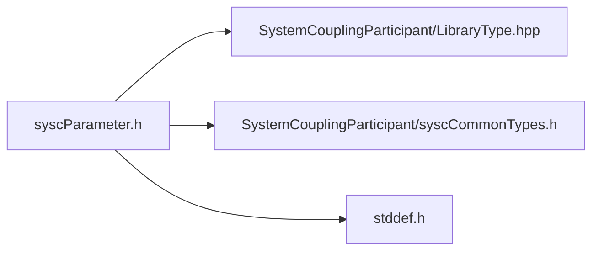

# File syscParameter.h

![][C]

**Location**: `syscParameter.h`


## Classes

* [SyscParameter](structSyscParameter.md#structSyscParameter)

## Includes

* SystemCouplingParticipant/LibraryType.hpp
* SystemCouplingParticipant/syscCommonTypes.h
* <stddef.h>



## Typedefs

<a id="group__SyscParticipantLibraryCAPI_1ga9d97e53f3f34b91249f3002d73dc939e"></a>
### Typedef SyscParameter

![][public]

**Definition**: `syscParameter.h` (line 29)

```
typedef struct SyscParameter SyscParameter
```

Provide a struct for a System Coupling parameter.


**Return type**: struct [SyscParameter](structSyscParameter.md#structSyscParameter)

## Functions

<a id="group__SyscParticipantLibraryCAPI_1gaf44d7cf2e3d05e5cf0990b6fe946c50d"></a>
### Function syscGetParameter

![][public]

```
SyscParameter syscGetParameter(const char *name)
```

Create parameter to be used in a coupled analysis.

**Parameters**:

* **name**: - Unique name for this parameter. String length should not exceed SYSC_STRING_LENGTH.

Display name will default to the same as name.


**Parameters**:

* const char * **name**

**Return type**: [SyscParameter](structSyscParameter.md#structSyscParameter)

<a id="group__SyscParticipantLibraryCAPI_1gafa0e858b9dc47ded43bd3fbf97c25206"></a>
### Function syscGetParameterD

![][public]

```
SyscParameter syscGetParameterD(const char *name, const char *displayName)
```

Create parameter to be used in a coupled analysis.

**Parameters**:

* **name**: - Unique name for this parameter. String length should not exceed SYSC_STRING_LENGTH.
* **displayName**: - parameter display name. String length should not exceed SYSC_STRING_LENGTH.


**Parameters**:

* const char * **name**
* const char * **displayName**

**Return type**: [SyscParameter](structSyscParameter.md#structSyscParameter)

## Source

```
/*
* Copyright ANSYS, Inc. Unauthorized use, distribution, or duplication is prohibited.
*/

#pragma once

#include "SystemCouplingParticipant/LibraryType.hpp"

#include "SystemCouplingParticipant/syscCommonTypes.h"

#include <stddef.h>

#ifdef __cplusplus
extern "C" {
#endif

typedef struct SyscParameter {
  char name[SYSC_STRING_LENGTH];        
  char displayName[SYSC_STRING_LENGTH]; 
} SyscParameter;

 SyscParameter syscGetParameter(
  const char* name);

 SyscParameter syscGetParameterD(
  const char* name,
  const char* displayName);

#ifdef __cplusplus
}
#endif
```

[public]: https://img.shields.io/badge/-public-brightgreen (public)
[C]: https://img.shields.io/badge/language-C-blue (C)