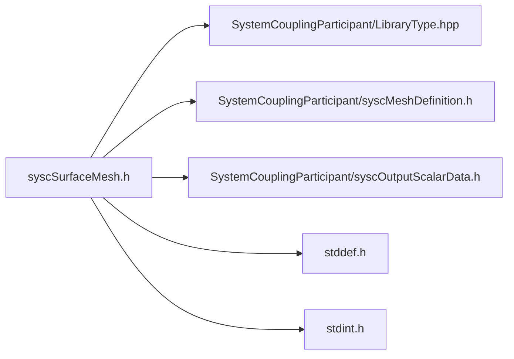

# File syscSurfaceMesh.h

![][C]

**Location**: `syscSurfaceMesh.h`


## Classes

* [SyscSurfaceMesh](structSyscSurfaceMesh.md#structSyscSurfaceMesh)

## Includes

* SystemCouplingParticipant/LibraryType.hpp
* SystemCouplingParticipant/syscMeshDefinition.h
* SystemCouplingParticipant/syscOutputScalarData.h
* <stddef.h>
* <stdint.h>



## Functions

<a id="group__SyscParticipantLibraryCAPI_1ga9f7aaa68f00cc2d98f98c458b5388f3a"></a>
### Function syscGetSurfaceMesh

![][public]

```
SyscSurfaceMesh syscGetSurfaceMesh()
```

Create a surface mesh access struct.

Returns a struct representing empty surface mesh. All member will be assigned default values.


**Return type**: [SyscSurfaceMesh](structSyscSurfaceMesh.md#structSyscSurfaceMesh)

<a id="group__SyscParticipantLibraryCAPI_1gafad33a17c7266f386e1bf42c66a9340f"></a>
### Function syscGetSurfaceMeshNF

![][public]

```
SyscSurfaceMesh syscGetSurfaceMeshNF(SyscNodeData nodes, SyscFaceData faces)
```

Create a surface mesh access struct.

**Parameters**:

* **nodes**: - node data
* **faces**: - face data


**Parameters**:

* [SyscNodeData](structSyscNodeData.md#structSyscNodeData) **nodes**
* [SyscFaceData](structSyscFaceData.md#structSyscFaceData) **faces**

**Return type**: [SyscSurfaceMesh](structSyscSurfaceMesh.md#structSyscSurfaceMesh)

<a id="group__SyscParticipantLibraryCAPI_1gaf61b2f4b29e77812cee161e63ff28e34"></a>
### Function syscGetSurfaceMeshNTCI

![][public]

```
SyscSurfaceMesh syscGetSurfaceMeshNTCI(SyscNodeData nodes, SyscElementTypeData elemTypes, SyscElementNodeCountData elemNodeCounts, SyscElementNodeConnectivityData elemNodeConnectivity)
```

Create a surface mesh access struct.

Both element types and element node counts are provided.


**Parameters**:

* **nodes**: - mesh nodes
* **elemTypes**: - element types
* **elemNodeCounts**: - element node counts
* **elemNodeConnectivity**: - element-to-node connectivity


**Parameters**:

* [SyscNodeData](structSyscNodeData.md#structSyscNodeData) **nodes**
* [SyscElementTypeData](structSyscElementTypeData.md#structSyscElementTypeData) **elemTypes**
* [SyscElementNodeCountData](structSyscElementNodeCountData.md#structSyscElementNodeCountData) **elemNodeCounts**
* [SyscElementNodeConnectivityData](structSyscElementNodeConnectivityData.md#structSyscElementNodeConnectivityData) **elemNodeConnectivity**

**Return type**: [SyscSurfaceMesh](structSyscSurfaceMesh.md#structSyscSurfaceMesh)

<a id="group__SyscParticipantLibraryCAPI_1ga239ac08da048715f5832302851960053"></a>
### Function syscGetSurfaceMeshNCI

![][public]

```
SyscSurfaceMesh syscGetSurfaceMeshNCI(SyscNodeData nodes, SyscElementNodeCountData elemNodeCounts, SyscElementNodeConnectivityData elemNodeConnectivity)
```

Create a surface mesh access struct.

Element node counts are provided, element types are deduced from element node counts.


**Parameters**:

* **nodes**: - mesh nodes
* **elemNodeCounts**: - element node counts
* **elemNodeConnectivity**: - element-to-node connectivity


**Parameters**:

* [SyscNodeData](structSyscNodeData.md#structSyscNodeData) **nodes**
* [SyscElementNodeCountData](structSyscElementNodeCountData.md#structSyscElementNodeCountData) **elemNodeCounts**
* [SyscElementNodeConnectivityData](structSyscElementNodeConnectivityData.md#structSyscElementNodeConnectivityData) **elemNodeConnectivity**

**Return type**: [SyscSurfaceMesh](structSyscSurfaceMesh.md#structSyscSurfaceMesh)

<a id="group__SyscParticipantLibraryCAPI_1ga734facb70a9948732d08eaccf4bb5102"></a>
### Function syscGetSurfaceMeshNCIF

![][public]

```
SyscSurfaceMesh syscGetSurfaceMeshNCIF(SyscNodeData nodes, SyscElementNodeCountData elemNodeCounts, SyscElementNodeConnectivityData elemNodeConnectivity, SyscFaceCellConnectivityData faceCellConnectivty)
```

Create a surface mesh access struct.

Element node counts are provided, element types are deduced from element node counts. Face-to-cell connectivity is provided as well.


**Parameters**:

* **nodes**: - mesh nodes
* **elemNodeCounts**: - element node counts
* **elemNodeConnectivity**: - element-to-node connectivity
* **faceCellConnectivity**: - face-to-cell connectivity


**Parameters**:

* [SyscNodeData](structSyscNodeData.md#structSyscNodeData) **nodes**
* [SyscElementNodeCountData](structSyscElementNodeCountData.md#structSyscElementNodeCountData) **elemNodeCounts**
* [SyscElementNodeConnectivityData](structSyscElementNodeConnectivityData.md#structSyscElementNodeConnectivityData) **elemNodeConnectivity**
* [SyscFaceCellConnectivityData](structSyscFaceCellConnectivityData.md#structSyscFaceCellConnectivityData) **faceCellConnectivty**

**Return type**: [SyscSurfaceMesh](structSyscSurfaceMesh.md#structSyscSurfaceMesh)

<a id="group__SyscParticipantLibraryCAPI_1ga481a20e443f5b245640441f47e455c67"></a>
### Function syscGetSurfaceMeshNTI

![][public]

```
SyscSurfaceMesh syscGetSurfaceMeshNTI(SyscNodeData nodes, SyscElementTypeData elemTypes, SyscElementNodeConnectivityData elemNodeConnectivity)
```

Create a surface mesh access struct.

Element types are provided, element node counts are deduced from element types.


**Parameters**:

* **nodes**: - mesh nodes
* **elemTypes**: - element types
* **elemNodeConnectivity**: - element-to-node connectivity


**Parameters**:

* [SyscNodeData](structSyscNodeData.md#structSyscNodeData) **nodes**
* [SyscElementTypeData](structSyscElementTypeData.md#structSyscElementTypeData) **elemTypes**
* [SyscElementNodeConnectivityData](structSyscElementNodeConnectivityData.md#structSyscElementNodeConnectivityData) **elemNodeConnectivity**

**Return type**: [SyscSurfaceMesh](structSyscSurfaceMesh.md#structSyscSurfaceMesh)

<a id="group__SyscParticipantLibraryCAPI_1ga0241a6779e5c1e1dc0a339893805a9dd"></a>
### Function syscGetSurfaceMeshA

![][public]

```
SyscSurfaceMesh syscGetSurfaceMeshA(SyscOutputScalarData nodeIds, SyscOutputVectorData nodeCoords, SyscOutputScalarData elemNodeCounts, SyscOutputScalarData elemNodeIds)
```

Create a surface mesh access struct.

Note: this function is deprecated. Use syscGetSurfaceMeshNCI instead.


**Parameters**:

* **nodeIds**: - output scalar data access for node ids
* **nodeCoords**: - output vector data access for node coordinates, provided in the same order as node ids
* **elemNodeCounts**: - output scalar data access for element node counts
* **elemNodeIds**: - output scalar data access for element node ids


**Parameters**:

* [SyscOutputScalarData](structSyscOutputScalarData.md#structSyscOutputScalarData) **nodeIds**
* [SyscOutputVectorData](structSyscOutputVectorData.md#structSyscOutputVectorData) **nodeCoords**
* [SyscOutputScalarData](structSyscOutputScalarData.md#structSyscOutputScalarData) **elemNodeCounts**
* [SyscOutputScalarData](structSyscOutputScalarData.md#structSyscOutputScalarData) **elemNodeIds**

**Return type**: [SyscSurfaceMesh](structSyscSurfaceMesh.md#structSyscSurfaceMesh)

<a id="group__SyscParticipantLibraryCAPI_1ga0745adffa475d10edb703906ed5d2772"></a>
### Function syscGetSurfaceMeshB

![][public]

```
SyscSurfaceMesh syscGetSurfaceMeshB(SyscOutputVectorData nodeCoords, SyscOutputScalarData elemNodeCounts, SyscOutputScalarData elemNodeIds)
```

Create a surface mesh access struct.

Note: this function is deprecated. Use syscGetSurfaceMeshNCI instead.


**Parameters**:

* **nodeCoords**: - output vector data access for node coordinates, provided in ascending node ids order
* **elemNodeCounts**: - output scalar data access for element node counts
* **elemNodeIds**: - output scalar data access for element node ids


**Parameters**:

* [SyscOutputVectorData](structSyscOutputVectorData.md#structSyscOutputVectorData) **nodeCoords**
* [SyscOutputScalarData](structSyscOutputScalarData.md#structSyscOutputScalarData) **elemNodeCounts**
* [SyscOutputScalarData](structSyscOutputScalarData.md#structSyscOutputScalarData) **elemNodeIds**

**Return type**: [SyscSurfaceMesh](structSyscSurfaceMesh.md#structSyscSurfaceMesh)

## Source

```
/*
* Copyright ANSYS, Inc. Unauthorized use, distribution, or duplication is prohibited.
*/

#pragma once

#include "SystemCouplingParticipant/LibraryType.hpp"

#include "SystemCouplingParticipant/syscMeshDefinition.h"
#include "SystemCouplingParticipant/syscOutputScalarData.h"

#include <stddef.h>
#include <stdint.h>

#ifdef __cplusplus
extern "C" {
#endif

/* *********** Surface mesh ************************************************ */

typedef struct {
  SyscNodeData nodes;

  SyscFaceData faces;

  char side0[SYSC_STRING_LENGTH];

  char side1[SYSC_STRING_LENGTH];

  int64_t connectivityStamp;

  int64_t coordinatesStamp;

  int64_t partitioningStamp;
} SyscSurfaceMesh;

SyscSurfaceMesh syscGetSurfaceMesh();

SyscSurfaceMesh syscGetSurfaceMeshNF(
  SyscNodeData nodes,
  SyscFaceData faces);

SyscSurfaceMesh syscGetSurfaceMeshNTCI(
  SyscNodeData nodes,
  SyscElementTypeData elemTypes,
  SyscElementNodeCountData elemNodeCounts,
  SyscElementNodeConnectivityData elemNodeConnectivity);

SyscSurfaceMesh syscGetSurfaceMeshNCI(
  SyscNodeData nodes,
  SyscElementNodeCountData elemNodeCounts,
  SyscElementNodeConnectivityData elemNodeConnectivity);

SyscSurfaceMesh syscGetSurfaceMeshNCIF(
  SyscNodeData nodes,
  SyscElementNodeCountData elemNodeCounts,
  SyscElementNodeConnectivityData elemNodeConnectivity,
  SyscFaceCellConnectivityData faceCellConnectivty);

SyscSurfaceMesh syscGetSurfaceMeshNTI(
  SyscNodeData nodes,
  SyscElementTypeData elemTypes,
  SyscElementNodeConnectivityData elemNodeConnectivity);

SyscSurfaceMesh syscGetSurfaceMeshA(
  SyscOutputScalarData nodeIds,
  SyscOutputVectorData nodeCoords,
  SyscOutputScalarData elemNodeCounts,
  SyscOutputScalarData elemNodeIds);

SyscSurfaceMesh syscGetSurfaceMeshB(
  SyscOutputVectorData nodeCoords,
  SyscOutputScalarData elemNodeCounts,
  SyscOutputScalarData elemNodeIds);

#ifdef __cplusplus
}
#endif
```

[public]: https://img.shields.io/badge/-public-brightgreen (public)
[C]: https://img.shields.io/badge/language-C-blue (C)