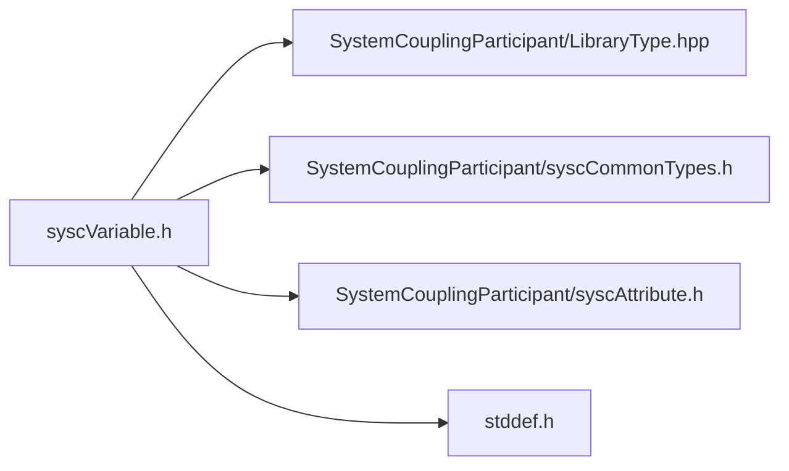

# File syscVariable.h

![][C]

**Location**: `syscVariable.h`


## Classes

* [SyscVariable](structSyscVariable.md#structSyscVariable)

## Includes

* SystemCouplingParticipant/LibraryType.hpp
* SystemCouplingParticipant/syscCommonTypes.h
* SystemCouplingParticipant/syscAttribute.h
* <stddef.h>



## Typedefs

<a id="group__SyscParticipantLibraryCAPI_1ga7a8d294476240d2f3844a608e71efe29"></a>
### Typedef SyscVariable

![][public]

**Definition**: `syscVariable.h` (line 45)

```
typedef struct SyscVariable SyscVariable
```

Provide a struct for a System Coupling variable.

To create and/or initialize the [SyscVariable](structSyscVariable.md#structSyscVariable) struct, it is highly recommended to use one of the functions with names starting with <code>syscGetVariable</code>. These functions will initialize all members to the correct values and will help to avoid back-compatibility issues in the future. For example:


```
SyscVariable var = syscGetVariableTE(
  "Temperature", SyscScalar, 0, SyscNode);
```


**Return type**: struct [SyscVariable](structSyscVariable.md#structSyscVariable)

## Functions

<a id="group__SyscParticipantLibraryCAPI_1ga11cda8cc3f7f76d71b87baabbfe53304"></a>
### Function syscGetVariable

![][public]

```
SyscVariable syscGetVariable(const char *name)
```

Create variable to be used in a coupled analysis.

**Parameters**:

* **name**: - Unique name for this variable. String length should not exceed SYSC_STRING_LENGTH.

Display name will default to the same as name.


Tensor type will default to scalar.


Is extensive flag will default to false (to non-extensive).


Location will default to nodes.


Quantity type will default to unspecified.


**Parameters**:

* const char * **name**

**Return type**: [SyscVariable](structSyscVariable.md#structSyscVariable)

<a id="group__SyscParticipantLibraryCAPI_1ga41420b43584d7b7ab11d94c2c4e4ccdb"></a>
### Function syscGetVariableDTELQD

![][public]

```
SyscVariable syscGetVariableDTELQD(const char *name, const char *displayName, enum SyscTensorType tensorType, int isExtensive, enum SyscLocation location, enum SyscQuantityType quantityType, enum SyscDataType dataType)
```

Create variable to be used in a coupled analysis.

**Parameters**:

* **name**: - Unique name for this variable. String length should not exceed SYSC_STRING_LENGTH.
* **displayName**: - variable display name. String length should not exceed SYSC_STRING_LENGTH.
* **tensorType**: - variable tensor type.
* **isExtensive**: - flag indicating if it's an extensive property.
* **location**: - variable location (e.g element or node).
* **quantityType**: - variable quantity type.
* **dataType**: - variable data type.


**Parameters**:

* const char * **name**
* const char * **displayName**
* enum [SyscTensorType](syscCommonTypes_8h.md#group__SyscParticipantLibraryCAPI_1ga007e2fd66e7263a63c114a6d12b3808d) **tensorType**
* int **isExtensive**
* enum [SyscLocation](syscCommonTypes_8h.md#group__SyscParticipantLibraryCAPI_1gade42aba1a68acbbf5956edcd388cdcda) **location**
* enum [SyscQuantityType](syscCommonTypes_8h.md#group__SyscParticipantLibraryCAPI_1gaa28a3de6c7c91003a8a15721a5301f12) **quantityType**
* enum SyscDataType **dataType**

**Return type**: [SyscVariable](structSyscVariable.md#structSyscVariable)

<a id="group__SyscParticipantLibraryCAPI_1ga3aceb66e0d37a5de11b76fd4c1d7293d"></a>
### Function syscGetVariableTE

![][public]

```
SyscVariable syscGetVariableTE(const char *name, enum SyscTensorType tensorType, int isExtensive, enum SyscLocation location)
```

Create variable to be used in a coupled analysis.

**Parameters**:

* **name**: - Unique name for this variable. String length should not exceed SYSC_STRING_LENGTH.
* **tensorType**: - variable tensor type.
* **isExtensive**: - flag indicating if it's an extensive property.
* **location**: - variable location (e.g element or node).

Display name will default to the same as name.


Quantity type will default to unspecified.


**Parameters**:

* const char * **name**
* enum [SyscTensorType](syscCommonTypes_8h.md#group__SyscParticipantLibraryCAPI_1ga007e2fd66e7263a63c114a6d12b3808d) **tensorType**
* int **isExtensive**
* enum [SyscLocation](syscCommonTypes_8h.md#group__SyscParticipantLibraryCAPI_1gade42aba1a68acbbf5956edcd388cdcda) **location**

**Return type**: [SyscVariable](structSyscVariable.md#structSyscVariable)

<a id="group__SyscParticipantLibraryCAPI_1ga8c3a0f01eb353ffcb981281a76dde4b3"></a>
### Function syscGetVariableTEQ

![][public]

```
SyscVariable syscGetVariableTEQ(const char *name, const char *displayName, enum SyscTensorType tensorType, int isExtensive, enum SyscLocation location, enum SyscQuantityType quantityType)
```

Create variable to be used in a coupled analysis.

**Parameters**:

* **name**: - Unique name for this variable. String length should not exceed SYSC_STRING_LENGTH.
* **displayName**: - variable display name. String length should not exceed SYSC_STRING_LENGTH.
* **tensorType**: - variable tensor type.
* **isExtensive**: - flag indicating if it's an extensive property.
* **location**: - variable location (e.g element or node).
* **quantityType**: - variable quantity type.


**Parameters**:

* const char * **name**
* const char * **displayName**
* enum [SyscTensorType](syscCommonTypes_8h.md#group__SyscParticipantLibraryCAPI_1ga007e2fd66e7263a63c114a6d12b3808d) **tensorType**
* int **isExtensive**
* enum [SyscLocation](syscCommonTypes_8h.md#group__SyscParticipantLibraryCAPI_1gade42aba1a68acbbf5956edcd388cdcda) **location**
* enum [SyscQuantityType](syscCommonTypes_8h.md#group__SyscParticipantLibraryCAPI_1gaa28a3de6c7c91003a8a15721a5301f12) **quantityType**

**Return type**: [SyscVariable](structSyscVariable.md#structSyscVariable)

<a id="group__SyscParticipantLibraryCAPI_1gabcbdf21641e68a17e941a6c8da2afdc9"></a>
### Function syscGetVariableQ

![][public]

```
SyscVariable syscGetVariableQ(const char *name, const char *displayName, enum SyscLocation location, enum SyscQuantityType quantityType)
```

Create variable to be used in a coupled analysis.

**Parameters**:

* **name**: - Unique name for this variable. String length should not exceed SYSC_STRING_LENGTH.
* **displayName**: - variable display name. String length should not exceed SYSC_STRING_LENGTH.
* **location**: - variable location (e.g element or node).
* **quantityType**: - variable quantity type.

The variable tensor type and is extensive properties will be inferred from the quantity type, according to the following rules:


```
Quantity Type                     Tensor Type      Is Extensive
----------------------------------------------------------------
Force                             Vector           True
Incremental Displacement          Vector           False
Temperature                       Scalar           False
Heat Rate                         Scalar           True
Heat Transfer Coefficient         Scalar           False
Convection Reference Temperature  Scalar           False
```


If any other quantity type is specified, tensor type will be set to scalar and is extensive will be set to false.


**Parameters**:

* const char * **name**
* const char * **displayName**
* enum [SyscLocation](syscCommonTypes_8h.md#group__SyscParticipantLibraryCAPI_1gade42aba1a68acbbf5956edcd388cdcda) **location**
* enum [SyscQuantityType](syscCommonTypes_8h.md#group__SyscParticipantLibraryCAPI_1gaa28a3de6c7c91003a8a15721a5301f12) **quantityType**

**Return type**: [SyscVariable](structSyscVariable.md#structSyscVariable)

<a id="group__SyscParticipantLibraryCAPI_1ga36e1b9748fe759040360468c2b863753"></a>
### Function syscVariableAddRealAttribute

![][public]

```
SyscError syscVariableAddRealAttribute(SyscVariable variable, SyscRealAttribute attribute)
```

Add real-valued attribute to the variable.


**Parameters**:

* [SyscVariable](structSyscVariable.md#structSyscVariable) **variable**
* [SyscRealAttribute](structSyscRealAttribute.md#structSyscRealAttribute) **attribute**

**Return type**: [SyscError](structSyscError.md#structSyscError)

<a id="group__SyscParticipantLibraryCAPI_1ga2c8d8b670d660f646fbe0d81dbc7914b"></a>
### Function syscVariableAddIntegerAttribute

![][public]

```
SyscError syscVariableAddIntegerAttribute(SyscVariable variable, SyscIntegerAttribute attribute)
```

Add integer-valued attribute to the variable.


**Parameters**:

* [SyscVariable](structSyscVariable.md#structSyscVariable) **variable**
* [SyscIntegerAttribute](structSyscIntegerAttribute.md#structSyscIntegerAttribute) **attribute**

**Return type**: [SyscError](structSyscError.md#structSyscError)

<a id="group__SyscParticipantLibraryCAPI_1ga3cb95d52ef66ec8339bff5dc9c2c28bb"></a>
### Function syscVariableGetNumRealAttributes

![][public]

```
size_t syscVariableGetNumRealAttributes(SyscVariable variable)
```

Get number of real-valued attributes.


**Parameters**:

* [SyscVariable](structSyscVariable.md#structSyscVariable) **variable**

**Return type**: size_t

<a id="group__SyscParticipantLibraryCAPI_1gae744a1029ca1d356c8ef9a81b6a41df6"></a>
### Function syscVariableGetNumIntegerAttributes

![][public]

```
size_t syscVariableGetNumIntegerAttributes(SyscVariable variable)
```

Get number of integer-valued attributes.


**Parameters**:

* [SyscVariable](structSyscVariable.md#structSyscVariable) **variable**

**Return type**: size_t

<a id="group__SyscParticipantLibraryCAPI_1ga7d8fce6af6169d53f48e92cb90224bff"></a>
### Function syscVariableGetRealAttribute

![][public]

```
SyscRealAttribute syscVariableGetRealAttribute(SyscVariable variable, size_t index)
```

Return the real-valued attribute at the given index.


**Parameters**:

* [SyscVariable](structSyscVariable.md#structSyscVariable) **variable**
* size_t **index**

**Return type**: [SyscRealAttribute](structSyscRealAttribute.md#structSyscRealAttribute)

<a id="group__SyscParticipantLibraryCAPI_1gacd6d89e8e016b12cf558b312619201a4"></a>
### Function syscVariableGetIntegerAttribute

![][public]

```
SyscIntegerAttribute syscVariableGetIntegerAttribute(SyscVariable variable, size_t index)
```

Return the integer-valued attribute at the given index.


**Parameters**:

* [SyscVariable](structSyscVariable.md#structSyscVariable) **variable**
* size_t **index**

**Return type**: [SyscIntegerAttribute](structSyscIntegerAttribute.md#structSyscIntegerAttribute)

## Source

```
/*
* Copyright ANSYS, Inc. Unauthorized use, distribution, or duplication is prohibited.
*/

#pragma once

#include "SystemCouplingParticipant/LibraryType.hpp"

#include "SystemCouplingParticipant/syscCommonTypes.h"
#include "SystemCouplingParticipant/syscAttribute.h"

#include <stddef.h>

#ifdef __cplusplus
extern "C" {
#endif

typedef struct SyscVariable {
  char name[SYSC_STRING_LENGTH];        
  enum SyscQuantityType quantityType;   
  enum SyscLocation location;           
  char displayName[SYSC_STRING_LENGTH]; 
  enum SyscTensorType tensorType;       
  int isExtensive;                      
  enum SyscDataType dataType;           
} SyscVariable;

 SyscVariable syscGetVariable(
  const char* name);

 SyscVariable syscGetVariableDTELQD(
  const char* name,
  const char* displayName,
  enum SyscTensorType tensorType,
  int isExtensive,
  enum SyscLocation location,
  enum SyscQuantityType quantityType,
  enum SyscDataType dataType);

 SyscVariable syscGetVariableTE(
  const char* name,
  enum SyscTensorType tensorType,
  int isExtensive,
  enum SyscLocation location);

 SyscVariable syscGetVariableTEQ(
  const char* name,
  const char* displayName,
  enum SyscTensorType tensorType,
  int isExtensive,
  enum SyscLocation location,
  enum SyscQuantityType quantityType);

 SyscVariable syscGetVariableQ(
  const char* name,
  const char* displayName,
  enum SyscLocation location,
  enum SyscQuantityType quantityType);

SyscError syscVariableAddRealAttribute(
  SyscVariable variable,
  SyscRealAttribute attribute);

SyscError syscVariableAddIntegerAttribute(
  SyscVariable variable,
  SyscIntegerAttribute attribute);

size_t syscVariableGetNumRealAttributes(SyscVariable variable);

size_t syscVariableGetNumIntegerAttributes(SyscVariable variable);

SyscRealAttribute syscVariableGetRealAttribute(
  SyscVariable variable,
  size_t index);

SyscIntegerAttribute syscVariableGetIntegerAttribute(
  SyscVariable variable,
  size_t index);

#ifdef __cplusplus
}
#endif
```

[public]: https://img.shields.io/badge/-public-brightgreen (public)
[C]: https://img.shields.io/badge/language-C-blue (C)