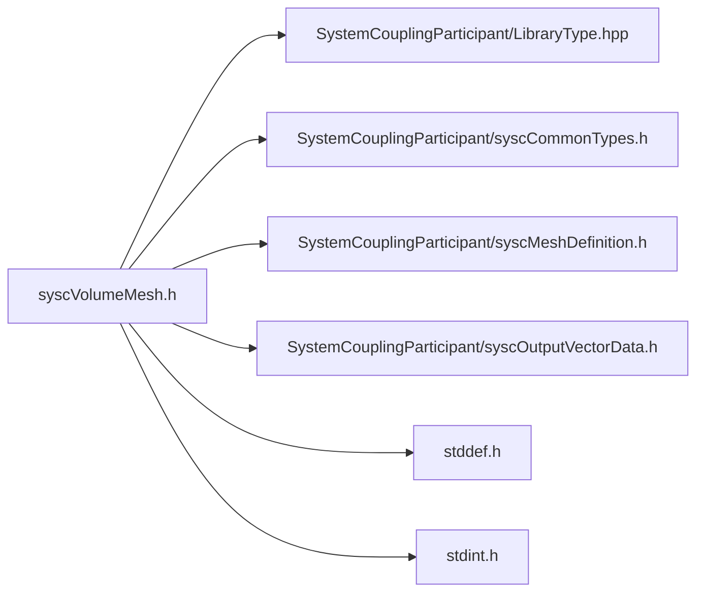

# File syscVolumeMesh.h

![][C]

**Location**: `syscVolumeMesh.h`


## Classes

* [SyscVolumeMesh](structSyscVolumeMesh.md#structSyscVolumeMesh)

## Includes

* SystemCouplingParticipant/LibraryType.hpp
* SystemCouplingParticipant/syscCommonTypes.h
* SystemCouplingParticipant/syscMeshDefinition.h
* SystemCouplingParticipant/syscOutputVectorData.h
* <stddef.h>
* <stdint.h>



## Functions

<a id="group__SyscParticipantLibraryCAPI_1ga44f0210eb99864864b6ea802b5c8c857"></a>
### Function syscGetVolumeMeshEmpty

![][public]

```
SyscVolumeMesh syscGetVolumeMeshEmpty()
```

Create an empty volume mesh access struct.

Returns a struct representing empty volume mesh. All member will be assigned default values.


**Return type**: [SyscVolumeMesh](structSyscVolumeMesh.md#structSyscVolumeMesh)

<a id="group__SyscParticipantLibraryCAPI_1gaa082ad5a3f9a308f6dfb794e8bdcd8cd"></a>
### Function syscGetVolumeMeshNFC

![][public]

```
SyscVolumeMesh syscGetVolumeMeshNFC(SyscNodeData nodes, SyscFaceData faces, SyscCellData cells)
```

Create a volume mesh access struct.

**Parameters**:

* **nodes**: - node data
* **faces**: - face data
* **cells**: - cell data


**Parameters**:

* [SyscNodeData](structSyscNodeData.md#structSyscNodeData) **nodes**
* [SyscFaceData](structSyscFaceData.md#structSyscFaceData) **faces**
* [SyscCellData](structSyscCellData.md#structSyscCellData) **cells**

**Return type**: [SyscVolumeMesh](structSyscVolumeMesh.md#structSyscVolumeMesh)

<a id="group__SyscParticipantLibraryCAPI_1gacdd4cb0f44e5d2e94a0ed34e0dc96bbe"></a>
### Function syscGetVolumeMeshElementBased

![][public]

```
SyscVolumeMesh syscGetVolumeMeshElementBased(SyscNodeData nodes, SyscElementTypeData cellTypes, SyscElementNodeConnectivityData cellNodeConnectivity)
```

Create an element-based volume mesh access struct.

**Parameters**:

* **nodes**: - node data
* **cellTypes**: - cell types
* **cellNodeConnectivity**: - cell-to-node connectivity


**Parameters**:

* [SyscNodeData](structSyscNodeData.md#structSyscNodeData) **nodes**
* [SyscElementTypeData](structSyscElementTypeData.md#structSyscElementTypeData) **cellTypes**
* [SyscElementNodeConnectivityData](structSyscElementNodeConnectivityData.md#structSyscElementNodeConnectivityData) **cellNodeConnectivity**

**Return type**: [SyscVolumeMesh](structSyscVolumeMesh.md#structSyscVolumeMesh)

<a id="group__SyscParticipantLibraryCAPI_1gae426344ef494aa92411c8c3856cdcb7f"></a>
### Function syscGetVolumeMeshFaceBased

![][public]

```
SyscVolumeMesh syscGetVolumeMeshFaceBased(SyscNodeData nodes, SyscElementNodeCountData faceNodeCounts, SyscElementNodeConnectivityData faceNodeConnectivity, SyscFaceCellConnectivityData faceCellConnectivity, SyscCellIdData cellIds)
```

Create a face-based volume mesh access struct.

**Parameters**:

* **nodes**: - node data
* **faceNodeCounts**: - face node counts
* **faceNodeConnectivity**: - face-to-node connectivity
* **faceCellConnectivity**: - face-to-cell connectivity
* **cellIds**: - cell ids


**Parameters**:

* [SyscNodeData](structSyscNodeData.md#structSyscNodeData) **nodes**
* [SyscElementNodeCountData](structSyscElementNodeCountData.md#structSyscElementNodeCountData) **faceNodeCounts**
* [SyscElementNodeConnectivityData](structSyscElementNodeConnectivityData.md#structSyscElementNodeConnectivityData) **faceNodeConnectivity**
* [SyscFaceCellConnectivityData](structSyscFaceCellConnectivityData.md#structSyscFaceCellConnectivityData) **faceCellConnectivity**
* [SyscCellIdData](structSyscCellIdData.md#structSyscCellIdData) **cellIds**

**Return type**: [SyscVolumeMesh](structSyscVolumeMesh.md#structSyscVolumeMesh)

## Source

```
/*
* Copyright ANSYS, Inc. Unauthorized use, distribution, or duplication is prohibited.
*/

#pragma once

#include "SystemCouplingParticipant/LibraryType.hpp"

#include "SystemCouplingParticipant/syscCommonTypes.h"
#include "SystemCouplingParticipant/syscMeshDefinition.h"
#include "SystemCouplingParticipant/syscOutputVectorData.h"

#include <stddef.h>
#include <stdint.h>

#ifdef __cplusplus
extern "C" {
#endif

/* *********** Volume mesh ************************************************ */

typedef struct {
  SyscNodeData nodes;

  SyscFaceData faces;

  SyscCellData cells;

  int64_t connectivityStamp;

  int64_t coordinatesStamp;

  int64_t partitioningStamp;
} SyscVolumeMesh;

SyscVolumeMesh syscGetVolumeMeshEmpty();

SyscVolumeMesh syscGetVolumeMeshNFC(
  SyscNodeData nodes,
  SyscFaceData faces,
  SyscCellData cells);

SyscVolumeMesh syscGetVolumeMeshElementBased(
  SyscNodeData nodes,
  SyscElementTypeData cellTypes,
  SyscElementNodeConnectivityData cellNodeConnectivity);

SyscVolumeMesh syscGetVolumeMeshFaceBased(
  SyscNodeData nodes,
  SyscElementNodeCountData faceNodeCounts,
  SyscElementNodeConnectivityData faceNodeConnectivity,
  SyscFaceCellConnectivityData faceCellConnectivity,
  SyscCellIdData cellIds);

#ifdef __cplusplus
}
#endif
```

[public]: https://img.shields.io/badge/-public-brightgreen (public)
[C]: https://img.shields.io/badge/language-C-blue (C)