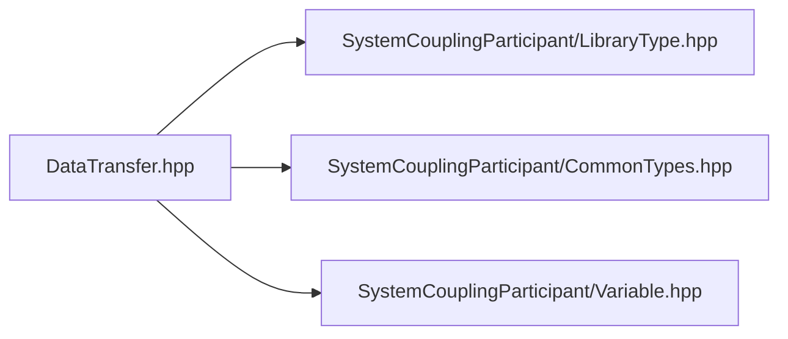

# File DataTransfer.hpp

![][C++]

**Location**: `DataTransfer.hpp`


## Classes

* [sysc::DataTransfer](classsysc_1_1DataTransfer.md#classsysc_1_1DataTransfer)

## Namespaces

* [sysc](namespacesysc.md#namespacesysc)

## Includes

* SystemCouplingParticipant/LibraryType.hpp
* SystemCouplingParticipant/CommonTypes.hpp
* SystemCouplingParticipant/Variable.hpp



## Source

```cpp
/*
 * Copyright ANSYS, Inc. Unauthorized use, distribution, or duplication is prohibited.
 */

#pragma once

#include "SystemCouplingParticipant/LibraryType.hpp"

#include "SystemCouplingParticipant/CommonTypes.hpp"
#include "SystemCouplingParticipant/Variable.hpp"

namespace sysc {

class SYSTEM_COUPLING_PARTICIPANT_DLL DataTransfer {
public:
  DataTransfer(
    Variable sourceVariable,
    Variable targetVariable,
    enum InterfaceSide targetSide);

  const Variable& getSourceVariable() const noexcept;

  const Variable& getTargetVariable() const noexcept;

  const Variable& getSideOneVariable() const noexcept;

  const Variable& getSideTwoVariable() const noexcept;

  InterfaceSide getTargetSide() const noexcept;

  InterfaceSide getSourceSide() const noexcept;

private:
  Variable m_sourceVariable;
  Variable m_targetVariable;
  InterfaceSide m_targetSide;
};

}  // namespace sysc
```

[public]: https://img.shields.io/badge/-public-brightgreen (public)
[C++]: https://img.shields.io/badge/language-C%2B%2B-blue (C++)
[private]: https://img.shields.io/badge/-private-red (private)
[const]: https://img.shields.io/badge/-const-lightblue (const)