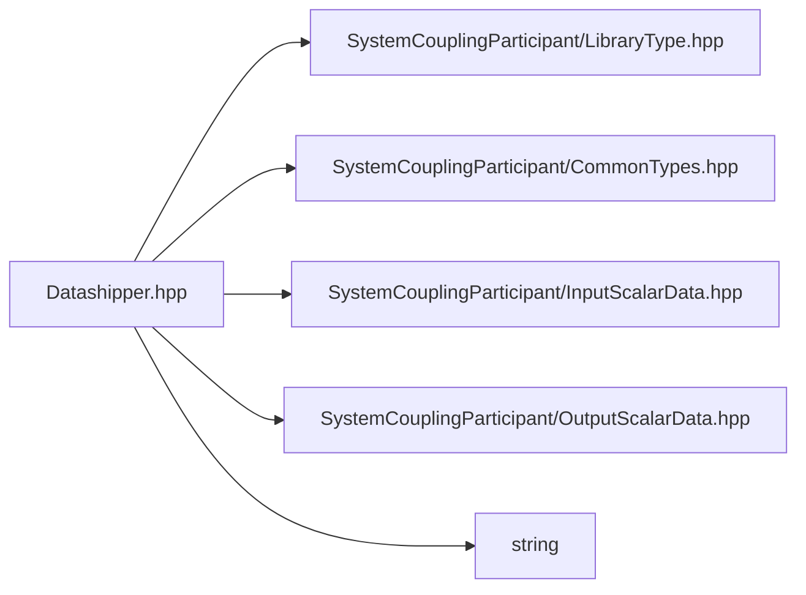

# File Datashipper.hpp

![][C++]

**Location**: `Datashipper.hpp`


## Namespaces

* [sysc](namespacesysc.md#namespacesysc)

## Includes

* SystemCouplingParticipant/LibraryType.hpp
* SystemCouplingParticipant/CommonTypes.hpp
* SystemCouplingParticipant/InputScalarData.hpp
* SystemCouplingParticipant/OutputScalarData.hpp
* <string>



## Source

```cpp
/*
* Copyright ANSYS, Inc. Unauthorized use, distribution, or duplication is prohibited.
*/

#pragma once

#include "SystemCouplingParticipant/LibraryType.hpp"

#include "SystemCouplingParticipant/CommonTypes.hpp"
#include "SystemCouplingParticipant/InputScalarData.hpp"
#include "SystemCouplingParticipant/OutputScalarData.hpp"

#include <string>

namespace sysc {

void SYSTEM_COUPLING_PARTICIPANT_DLL rearrange(
  OutputScalarData source, InputScalarData target);

}  // namespace sysc
```

[public]: https://img.shields.io/badge/-public-brightgreen (public)
[C++]: https://img.shields.io/badge/language-C%2B%2B-blue (C++)
[private]: https://img.shields.io/badge/-private-red (private)
[const]: https://img.shields.io/badge/-const-lightblue (const)