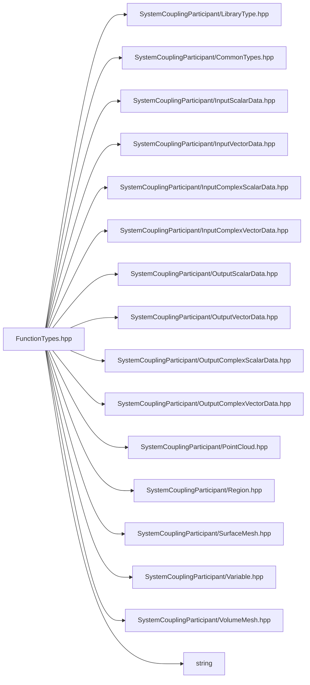

# File FunctionTypes.hpp

![][C++]

**Location**: `FunctionTypes.hpp`


## Namespaces

* [sysc](namespacesysc.md#namespacesysc)

## Includes

* SystemCouplingParticipant/LibraryType.hpp
* SystemCouplingParticipant/CommonTypes.hpp
* SystemCouplingParticipant/InputScalarData.hpp
* SystemCouplingParticipant/InputVectorData.hpp
* SystemCouplingParticipant/InputComplexScalarData.hpp
* SystemCouplingParticipant/InputComplexVectorData.hpp
* SystemCouplingParticipant/OutputScalarData.hpp
* SystemCouplingParticipant/OutputVectorData.hpp
* SystemCouplingParticipant/OutputComplexScalarData.hpp
* SystemCouplingParticipant/OutputComplexVectorData.hpp
* SystemCouplingParticipant/PointCloud.hpp
* SystemCouplingParticipant/Region.hpp
* SystemCouplingParticipant/SurfaceMesh.hpp
* SystemCouplingParticipant/Variable.hpp
* SystemCouplingParticipant/VolumeMesh.hpp
* <string>



## Source

```cpp
/*
* Copyright ANSYS, Inc. Unauthorized use, distribution, or duplication is prohibited.
*/

#pragma once

#include "SystemCouplingParticipant/LibraryType.hpp"

#include "SystemCouplingParticipant/CommonTypes.hpp"
#include "SystemCouplingParticipant/InputScalarData.hpp"
#include "SystemCouplingParticipant/InputVectorData.hpp"
#include "SystemCouplingParticipant/InputComplexScalarData.hpp"
#include "SystemCouplingParticipant/InputComplexVectorData.hpp"
#include "SystemCouplingParticipant/OutputScalarData.hpp"
#include "SystemCouplingParticipant/OutputVectorData.hpp"
#include "SystemCouplingParticipant/OutputComplexScalarData.hpp"
#include "SystemCouplingParticipant/OutputComplexVectorData.hpp"
#include "SystemCouplingParticipant/PointCloud.hpp"
#include "SystemCouplingParticipant/Region.hpp"
#include "SystemCouplingParticipant/SurfaceMesh.hpp"
#include "SystemCouplingParticipant/Variable.hpp"
#include "SystemCouplingParticipant/VolumeMesh.hpp"

#include <string>

namespace sysc {

using InputScalarDataAccess = InputScalarData(
  const RegionName&, const VariableName&);

using InputScalarDataAccessWithPointer = InputScalarData(
  OpaqueDataAccess, const RegionName&, const VariableName&);

using InputVectorDataAccess = InputVectorData(
  const RegionName&, const VariableName&);

using InputVectorDataAccessWithPointer = InputVectorData(
  OpaqueDataAccess, const RegionName&, const VariableName&);

using OutputScalarDataAccess = OutputScalarData(
  const RegionName&, const VariableName&);

using OutputScalarDataAccessWithPointer = OutputScalarData(
  OpaqueDataAccess, const RegionName&, const VariableName&);

using OutputVectorDataAccess = OutputVectorData(
  const RegionName&, const VariableName&);

using OutputVectorDataAccessWithPointer = OutputVectorData(
  OpaqueDataAccess, const RegionName&, const VariableName&);

using InputComplexScalarDataAccess = InputComplexScalarData(
  const RegionName&, const VariableName&);

using InputComplexScalarDataAccessWithPointer = InputComplexScalarData(
  OpaqueDataAccess, const RegionName&, const VariableName&);

using InputComplexVectorDataAccess = InputComplexVectorData(
  const RegionName&, const VariableName&);

using InputComplexVectorDataAccessWithPointer = InputComplexVectorData(
  OpaqueDataAccess, const RegionName&, const VariableName&);

using OutputComplexScalarDataAccess = OutputComplexScalarData(
  const RegionName&, const VariableName&);

using OutputComplexScalarDataAccessWithPointer = OutputComplexScalarData(
  OpaqueDataAccess, const RegionName&, const VariableName&);

using OutputComplexVectorDataAccess = OutputComplexVectorData(
  const RegionName&, const VariableName&);

using OutputComplexVectorDataAccessWithPointer = OutputComplexVectorData(
  OpaqueDataAccess, const RegionName&, const VariableName&);

using SurfaceMeshAccess = SurfaceMesh(const RegionName&);

using SurfaceMeshAccessWithPointer = SurfaceMesh(
  OpaqueDataAccess, const RegionName&);

using VolumeMeshAccess = VolumeMesh(const RegionName&);

using VolumeMeshAccessWithPointer = VolumeMesh(
  OpaqueDataAccess, const RegionName&);

using PointCloudAccess = PointCloud(const RegionName&);

using PointCloudAccessWithPointer = PointCloud(
  OpaqueDataAccess, const RegionName&);

using RestartPointCreation = RestartPoint();

using TargetDataCreation = TargetDataLocation(bool);

using TargetDataCreationWithPointer = TargetDataLocation(OpaqueDataAccess, bool);

using TargetDataExistenceChecker = bool();

using TargetDataExistenceCheckerWithPointer = bool(OpaqueDataAccess);
/* Advanced callbacks. */

using ZoneCountAccess = std::uint16_t(OpaqueDataAccess, const RegionName&);

using SurfaceMeshMultiZoneAccess = SurfaceMesh(
  OpaqueDataAccess, const RegionName&, std::uint16_t zoneIndex);

using VolumeMeshMultiZoneAccess = VolumeMesh(
  OpaqueDataAccess, const RegionName&, std::uint16_t zoneIndex);

using PointCloudMultiZoneAccess = PointCloud(
  OpaqueDataAccess,
  const RegionName&,
  std::uint16_t zoneIndex);

using InputScalarDataMultiZoneAccess = InputScalarData(
  OpaqueDataAccess,
  const RegionName&,
  const VariableName&,
  std::uint16_t zoneIndex);

using OutputScalarDataMultiZoneAccess = OutputScalarData(
  OpaqueDataAccess,
  const RegionName&,
  const VariableName&,
  std::uint16_t zoneIndex);

using InputVectorDataMultiZoneAccess = InputVectorData(
  OpaqueDataAccess,
  const RegionName&,
  const VariableName&,
  std::uint16_t zoneIndex);

using OutputVectorDataMultiZoneAccess = OutputVectorData(
  OpaqueDataAccess,
  const RegionName&,
  const VariableName&,
  std::uint16_t zoneIndex);

/* Deprecated types */

using InputScalarVariableAccess = InputScalarData(const std::string&, const std::string&);

using InputVectorVariableAccess = InputVectorData(const std::string&, const std::string&);

using OutputScalarVariableAccess = OutputScalarData(const std::string&, const std::string&);

using OutputVectorVariableAccess = OutputVectorData(const std::string&, const std::string&);

}  // namespace sysc
```

[public]: https://img.shields.io/badge/-public-brightgreen (public)
[C++]: https://img.shields.io/badge/language-C%2B%2B-blue (C++)
[private]: https://img.shields.io/badge/-private-red (private)
[const]: https://img.shields.io/badge/-const-lightblue (const)