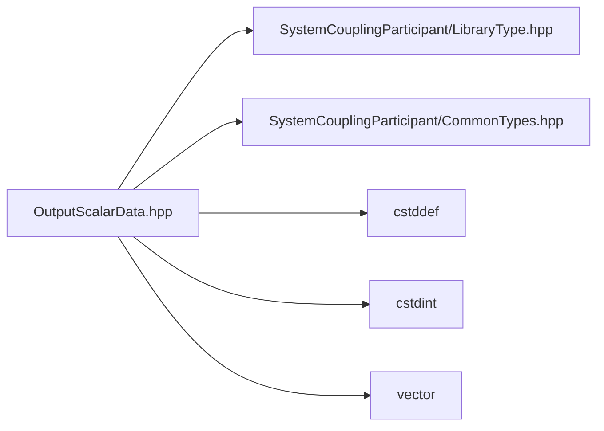

# File OutputScalarData.hpp

![][C++]

**Location**: `OutputScalarData.hpp`


## Classes

* [sysc::OutputScalarData](classsysc_1_1OutputScalarData.md#classsysc_1_1OutputScalarData)

## Namespaces

* [sysc](namespacesysc.md#namespacesysc)

## Includes

* SystemCouplingParticipant/LibraryType.hpp
* SystemCouplingParticipant/CommonTypes.hpp
* <cstddef>
* <cstdint>
* <vector>



## Source

```cpp
/*
* Copyright ANSYS, Inc. Unauthorized use, distribution, or duplication is prohibited.
*/

#pragma once

#include "SystemCouplingParticipant/LibraryType.hpp"

#include "SystemCouplingParticipant/CommonTypes.hpp"

#include <cstddef>
#include <cstdint>
#include <vector>

namespace sysc {

class SYSTEM_COUPLING_PARTICIPANT_DLL OutputScalarData {
public:
  OutputScalarData(
    const double* data,
    std::size_t size);

  OutputScalarData(
    const float* data,
    std::size_t size);

  OutputScalarData(const std::vector<double>& data);

  OutputScalarData(const std::vector<float>& data);

  OutputScalarData(
    const std::uint16_t* data,
    std::size_t size);

  OutputScalarData(const std::vector<std::uint16_t>& data);

  OutputScalarData(
    const std::uint64_t* data,
    std::size_t size);

  OutputScalarData(const std::vector<std::uint64_t>& data);

  OutputScalarData(
    const std::int32_t* data,
    std::size_t size);

  OutputScalarData(const std::vector<std::int32_t>& data);

  OutputScalarData(
    const std::int64_t* data,
    std::size_t size);

  OutputScalarData(const std::vector<std::int64_t>& data);

  OutputScalarData() = default;

  OutputScalarData(const OutputScalarData&) = default;

  OutputScalarData(OutputScalarData&&) = default;

  OutputScalarData& operator=(const OutputScalarData&) = default;

  OutputScalarData& operator=(OutputScalarData&&) = default;

  std::size_t size() const noexcept;

  bool empty() const noexcept;

  sysc::PrimitiveType getDataType() const noexcept;

  const void* getData() const noexcept;

private:
  sysc::PrimitiveType m_dataType{sysc::Double};
  const void* m_data{nullptr};
  std::size_t m_size{0};
};

}  // namespace sysc
```

[public]: https://img.shields.io/badge/-public-brightgreen (public)
[C++]: https://img.shields.io/badge/language-C%2B%2B-blue (C++)
[private]: https://img.shields.io/badge/-private-red (private)
[const]: https://img.shields.io/badge/-const-lightblue (const)