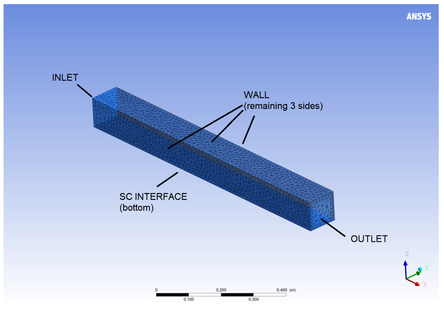
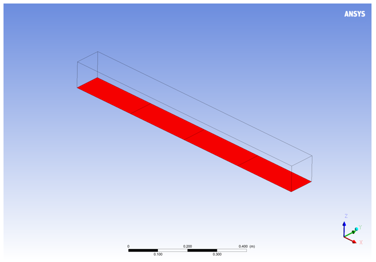
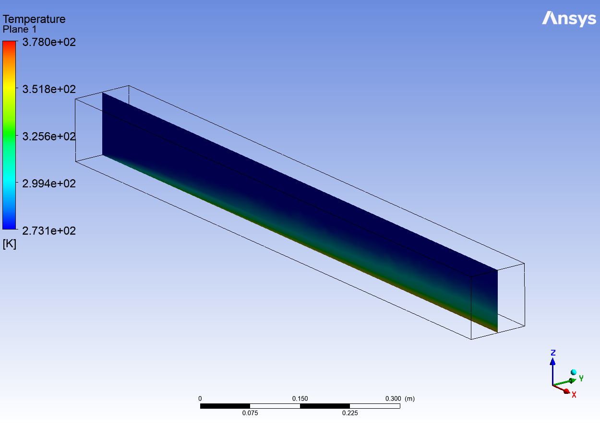

# Heat transfer in square channel air flow tutorial

This tutorial gives instructions on using System Coupling Participant Library
APIs to create a mock solver and use it within the System Coupling co-simulation
infrastructure. It shows how to run a two-solver coupled analysis with the mock
solver and the Fluent solver as participants.

The latter part of this tutorial demonstrates the use of parallel interfaces.
The mock solver code is modified to be executed within the MPI environment.

## Topics covered

- Steady analysis
- Temperature and heat flow transfer
- Coupling to Ansys Fluent
- Parallel execution
- Setup via the SCP file approach

## Verify prerequisites

Ensure that the following prerequisites are met. You've installed:

- A compiler for one of the [supported languages](compiling-linking-executing.md)
- Ansys installation, including System Coupling and Fluent

## Problem description and participant setup

In this example, air is heated as it flows through a rectangular channel. The Fluent solver
is used to model the air flow, and a simple mock solver is used to supply the heatflow to Fluent
via System Coupling.

### Fluent

The Fluent setup involves the flow of air through a rectangular 1-meter-long channel with a
square 0.1 by 0.1 [m] cross-section.
The geometry is discretized using tetrahedral mesh, as shown in _Figure 1_.

- The inlet is the surface coincident with the YZ plane, with a velocity of 0.1 m/s. Temperature of the air is 273.15 [K] (0 [C])

- The outlet is the side opposite from the inlet, with 0 Pa gauge pressure.

- The region participating in the coupled analysis is the surface coincident with the XY plane. This makes the System Coupling interface region a rectangle extending from origin to point (1, 0.1, 0).

- The remaining three sides form a wall.

- Energy model is activated.

- Turbulence model is k-epsilon (with default settings).

- The case is set up to perform five Fluent solver iterations per coupling iteration.

  
_Figure 1: Fluent geometry_

### Mock solver

The mock solver creates a rectangular surface region named **FSI**. This region
overlaps the Fluent region participating in the coupled analysis, so it is also
a rectangle extending from origin to point (1, 0.1, 0).

- The mesh consists of four quad elements, evenly dividing the region, as shown in _Figure 2: Mock solver geometry_.

- It receives temperatures on mesh nodes as inputs on the **FSI** region.

- It sends heat rate on elements as outputs on the **FSI** region. Each of the four elements provides constant 5 [W], so a total of 20 [W] is supplied to Fluent by the mock solver.

  
_Figure 2: Mock solver geometry_

## Get the necessary files

Download the [SCP library tutorial
package](https://github.com/ansys/DevRelPublic/raw/main/Downloads/SystemCoupling/syc_ParticipantLibrary_r2_25.zip)
and extract it to a local directory. Inside the resulting directory, you will
find a subdirectory called **HeatTransferSquareChannel**. This will serve as the
simulation working directory and contains all the files needed for this
tutorial. The contents of this subdirectory are:

- **fluent**:
Directory containing the following files:
  - `fluent.cas.h5`: Fluent case file
  - `fluent.scp`: System Coupling Participant setup file containing the Fluent setup information to be consumed by System Coupling.

- **mocksolver**:
Directory containing the following files:
  - `ChannelFlowMockSolver`: Linux binary executable (serial version)
  - `ChannelFlowMockSolver.bat`: Windows batch script wrapper around the Windows executable (serial version)
  - `ChannelFlowMockSolver.c`: C mock solver code and explanatory comments (serial version)
  - `ChannelFlowMockSolver.cpp`: C++ mock solver code and explanatory comments (serial version)
  - `ChannelFlowMockSolver.exe`: Windows binary executable (serial version)
  - `ChannelFlowMockSolver.f`: Fortran (fixed-form) mock solver code and explanatory comments (serial version)
  - `ChannelFlowMockSolver.py`: Python mock solver code and explanatory comments (serial-only)
  - `ChannelFlowMockSolver.sh`: Linux shell script wrapper around the Linux executable (serial version)
  - `ChannelFlowMockSolverMPI`: Linux binary executable (parallel version)
  - `ChannelFlowMockSolverMPI.bat`: Windows batch script for executing parallel mock solver locally using Intel MPI
  - `ChannelFlowMockSolverMPI.c`: C mock solver code and explanatory comments (parallel version)
  - `ChannelFlowMockSolverMPI.cpp`: C++ mock solver code and explanatory comments (parallel version)
  - `ChannelFlowMockSolverMPI.exe`: Windows binary executable (parallel version)
  - `ChannelFlowMockSolverMPI.f`: Fortran (fixed-form) mock solver code and explanatory comments (parallel version)
  - `ChannelFlowMockSolverMPI.sh`: Linux shell script for executing parallel mock solver locally using Intel MPI
  - `ChannelFlowMockSolverPython.bat`: Windows batch script for executing Python mock solver
  - `ChannelFlowMockSolverPython.sh`: Linux shell script for executing Python mock solver
  - `mocksolver.scp`: Participant Setup file containing the mock solver setup
    information to be consumed by System Coupling. Note that this file has been
    pre-generated for this tutorial. For information about how to generate setup
    files using the Participant Library,
    see [Completing the System Coupling Participant Setup](participant-setup.md) in the
    Participant Library Developer's Guide.

- `runSerial.py`: System Coupling script file to setup and execute the coupled
  analysis using the serial version of the mock solver.

- `runParallel.py`: System Coupling script file to setup and execute the
  coupled analysis using the parallel version of the mock solver.

## Part 1: serial version of the mock solver

For simplicity, **Part 1** of this tutorial uses the serial version of the mock
solver and executes both the mock solver and Fluent in serial. **Part 2** will
demonstrate a more advanced parallel version of the same problem will be
demonstrated in the second part of this tutorial.

### Build the mock solver

Build the mock solver program using a compiler for one of the supported
languages. For examples of how to build this mock solver with different
compilers on different platforms, see [Compiling, linking, and executing applications that use the Participant library](compiling-linking-executing.md)
in the Participant Library Developer's Guide.

> **NOTE:** Pre-built solver executables are provided along with
> the source code, so this step is optional.

### Run the mock solver in standalone mode

To confirm that the APIs were implemented successfully in the mock solver
program, run the executable in standalone mode. To detect any implementation
problems, it is recommended that you perform this step before running the
participant solver in the overall coupled analysis .

To run in standalone mode, an empty string should be provided for the System
Coupling host name. Since this mock solver program takes in the SC host name as
a command-line argument, an empty host name will be used if the argument is
omitted:

- **On Windows, from the Command Prompt:**

```bat
ChannelFlowMockSolver.bat
```

- **On Linux, from the shell:**

```bash
./ChannelFlowMockSolver.sh
```

This will print a few lines containing host, port, and name information to the
console. It will execute the mock coupled analysis for five coupling iterations.

> **Note**: The batch and the shell scripts use the environment variable
> (`AWP_ROOT212`) to set up the participant solver environment. Ensure that this
> environment variable is set to the Ansys installation path (for example `C:\Program
> Files\ANSYS Inc\v212`). Alternatively, you can modify the scripts to use a
> different environment variable.

### Perform the coupled analysis using the mock solver

#### Setup

Execute the coupled analysis (in serial) by using the `runSerial.py` script:

```bash
<ANSYSInstallationPath>/SystemCoupling/bin/systemcoupling -R runSerial.py
```

Note that in order to use a Python solver, you should replace `ChannelFlowMockSolver.bat` with `ChannelFlowMockSolverPython.bat` and `ChannelFlowMockSolver.sh` with `ChannelFlowMockSolverPython.sh` inside the `runSerial.py` script.

> **Note:** Alternatively, you can run System Coupling interactively. Start
> System Coupling by running
> `<ANSYSInstallationPath>/SystemCoupling/bin/systemcoupling` and then typing the
> contents of the script(s) into the command console line-by-line.

You can monitor the solution progress by watching the transcript output.

If the case runs without issue, you've successfully created a mock solver and run a co-simulation between Fluent and the mock solver.

### Visualize the results in CFD-Post

Use CFD-Post to view the Fluent results after the co-simulation run is complete.
You'll be able to visualize the air temperature as it gets heated while flowing through the rectangular channel.

1. **Open CFD-Post.**

2. **Load the Fluent results file.**

    a. In the CFD-Post toolbar, select **File > Load Results**.

    b. In the **Load Results File** dialog, select the Fluent results file that was generated during co-simulation, `fluent-1-00061.dat.h5`.

    The Fluent results file is loaded, and the geometry is displayed on the **3D Viewer** tab of CFD-Post's viewer.

3. **Add a cut-plane along the air flow and visualize the air temperature by coloring the plane with temperature.**

    a. In the CFD-Post toolbar, select **Insert > Location > Plane**, enter the name of the plane in the dialog box, and click **OK**.

    b. In the **Details of Plane 1** view:
      - On the **Geometry** tab, set **Method** to **ZX Plane** and set the **Y** field to **0.05 [m]**.

      - On the **Color** tab, set **Mode** to **Variable** and set **Variable** to **Temperature**.

    This allows you to visualize the air temperature as the air flows through the channel and the hot air is mixed with the colder air.

  
_Figure 3: Fluent temperature results after co-simulation with the mock solver_

## Part 2: The parallel version of the mock solver

The second part of this tutorial demonstrates how to modify this case to
run the mock solver in a parallel MPI environment:

- The parallel mock solver source code is provided with the tutorial package.

- The batch script `ChannelFlowMockSolverMPI.bat` (Windows) or shell script
  `ChannelFlowMockSolverMPI.sh` (Linux) are provided that allow the mock solver
  to be executed locally in parallel using the Intel MPI distribution that comes
  with System Coupling.

- The Fluent solver will also run in local parallel, using its default MPI.

### Parallel mock solver source code

The original mock solver has been modified to work in a parallel MPI
environment. The main difference between the serial and parallel versions is the
`initializeArrays()` function/subroutine that partitions the mesh elements among
the processes based on the number of processes available.

In a more realistic solver, the partitioning can be performed according to an
algorithm suitable for that solver. In this example, the partitioning details
are hard-coded for simplicity. Suppose we label each of the four mesh elements
in the mock solver **A**, **B**, **C**, and **D**, as shown in the schematic
below.

```text
 (0,0.1,0)                    (1,0.1,0)
          6-----7-----8-----9-----10
          |     |     |     |     |
          |  A  |  B  |  C  |  D  |
          |     |     |     |     |
          1-----2-----3-----4-----5
 (0,0,0)                       (1,0,0)
```

The following table shows how the mesh elements are distributed
among the processes, depending on the total number of available processes.

| Number of processes | Rank            | Elements    | Nodes                         |
| ------------------- | --------------- | ----------- | ----------------------------- |
| 1                   | 0               | A, B, C, D  | 1, 2, 3, 4, 5, 6, 7, 8, 9, 10 |
| 2                   | 0               | A, B        | 1, 2, 3, 6, 7, 8              |
| 2                   | 1               | C, D        | 3, 4, 5, 8, 9, 10             |
| 3                   | 0               | A           | 1, 2, 6, 7                    |
| 3                   | 1               | B           | 2, 3, 7, 8                    |
| 3                   | 2               | C, D        | 3, 4, 5, 8, 9, 10             |
| 4 or more           | 0               | A           | 1, 2, 6, 7                    |
| 4 or more           | 1               | B           | 2, 3, 7, 8                    |
| 4 or more           | 2               | C           | 3, 4, 8, 9                    |
| 4 or more           | 3               | D           | 4, 5, 9, 10                   |
| 4 or more           | 4 or greater    | No elements | No nodes                      |

Note that the above partitioning requires that some mesh nodes are duplicated
among different processes. The Participant Library can handle having nodes and
elements duplicated in multiple processes.

The parallel version source code for each supported language is provided with
the tutorial package. Refer to that source code and the comments for more
implementation details.

For more details on how to implement the Participant Library APIs for execution
in a parallel environment, see [Execution in a Parallel Environment](parallel-execution.md) in the
Participant Library _Developer's Guide_.

### Build the parallel mock solver

Build the parallel mock solver program using a compiler for one of the supported
languages. For examples of how to build this solver with different compilers on
different platforms, see [Compiling, linking, and executing applications that use the Participant library](compiling-linking-executing.md) in the Participant
Library _Developer's Guide_.

> **Note:** Pre-built solver executables are provided along with
> the source code, so this step is optional.

### Run the parallel mock solver in standalone mode

For examples of how to execute this solver in standalone mode with different
compilers on different platforms, see [Compiling, linking, and executing applications that use the Participant library](compiling-linking-executing.md)
in the Participant Library _Developer's Guide_.

### Perform the coupled analysis using the parallel mock solver

#### Setup

The coupled analysis will be performed using local parallel execution. The Intel
MPI distribution that comes with System Coupling will be used to execute the
parallel mock solver. Both Fluent and the parallel mock solver will be executed
using 4 processes. To do that, use `-t4` command-line argument when starting
System Coupling to solve the case. Execute the `runParallel.py` script to run
System Coupling in batch mode:

```bash
<ANSYSInstallationPath>/SystemCoupling/bin/systemcoupling -R runParallel.py -t4
```

You can monitor the solution progress by watching the transcript output.

During the execution, note the "Execution Information" section in the System
Coupling transcript will show that both Fluent and the mock solver are executed
in parallel using 4 processes. The `-np 4` command line argument is passed to
the mock solver, and the `-t4` command line argument is passed to Fluent.

```text
+=============================================================================+
|                            Execution Information                            |
+=============================================================================+
...
| DEFAULT-2                                                                   |
|   Execution Command:                                                        |
|     ...ChannelFlowMockSolverMPI.bat ... -np 4                               |
...
| Fluid Flow (Fluent)                                                         |
|   Execution Command:                                                        |
|     ...fluent.exe ... -t4                                                   |
...
+=============================================================================+
```

Once the coupled analysis completes, you've successfully created a parallel mock solver and run a co-simulation between Fluent and the mock solver.

The post-processing step is identical to that of the serial run.
