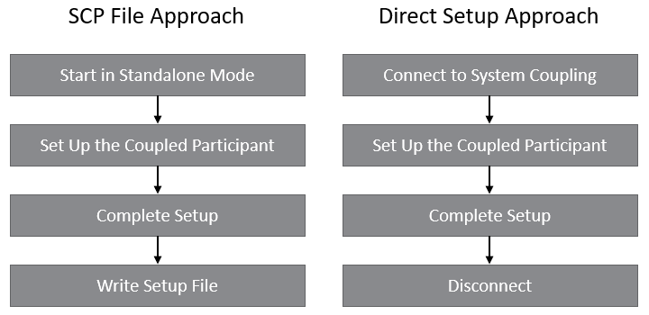

# Completing the System Coupling participant setup

During the setup stage, the participant setup information is communicated to
System Coupling. As mentioned earlier, there are two approaches to communicate
the setup. The first approach is the _SCP file_ approach
and the _direct setup_ approach.

## The SCP file approach

The SCP file approach entails generating an XML-formatted file that contains the
participant setup information that is relevant to System Coupling.
More information about the SCP file format can be found in the System Coupling User's Guide.

Some of the advantages of this approach are:

- The user can easily review and modify the SCP files before starting System Coupling.
- It is a light-weight file in the sense that it does not contain the actual mesh and solution data.
- If desired, the participant library APIs can be implemented to generate the SCP files.

Some of the disadvantages of this approach are:

- This is an extra file that needs to be generated during the setup.
- The SCP file must be consistent with the participant setup. If the setup changes, the SCP file may have to be re-generated.

The [Heat transfer in square channel air flow](channel-flow-tutorial.md)
tutorial demonstrates how the SCP file can be used
during the setup stage to add the participant to the coupled analysis.

## The direct approach

The direct setup approach requires starting System Coupling first, and then adding
the participant by specifying the path to the participant executable
(as well as working directory and any additional command line arguments).
System Coupling invokes the participant in setup mode by adding `--scsetup` command
line argument, along with the host, port, and participant name arguments.
See [Command line arguments for participant solvers](command-line-arguments.md)
for more details on the command line arguments.
The participant in setup mode connects to System Coupling and the setup
is communicated. Once the participant in setup mode is shut down, the
participant is added to the System Coupling datamodel and the participant setup
is complete.

Some of the advantages of this approach are:

- Fewer files are involved in the coupled analysis setup (that is, no SCP files)
- It is easier to ensure that System Coupling always has updated setup information (SCP files can go out-of-sync).
- This is potentially a more streamlined approach - the participant setup and the coupled analysis setup can be merged into a single step.

Some of the disadvantages of this approach are:

- Adding the participant may take longer if the participant has to read the mesh during the setup

The [Oscillating plate damping](plate-damping-tutorial.md) tutorial demonstrates
how the participant library can be used
during the setup stage to add the participant to the coupled analysis.

Note that it is not necessary that the same executable is invoked
during the setup and during the solve stages. The recommended approach is to create
a wrapper (for example a batch or shell script) that can parse the command line arguments
provided by System Coupling, as is shown in the tutorials.
If it is desirable to invoke a different executable depending on whether it is a
setup or a solve stage then this wrapper script can decide which executable to invoke
based on whether the `--scsetup` argument is provided.
This wrapper script should then be provided to System Coupling as the participant executable.

## Steps to complete the participant setup

The sequence of steps to be traversed during the participant setup is shown in Figure 1.

  
_Figure 1: Sequence of Coupled Participant Setup Steps_

### Step 1: Start in standalone mode or connect to System Coupling

If using the SCP file approach, start the participant in standalone mode. If
using the direct setup approach, connect to System Coupling by providing the
host name, port number, participant name, and build information.

#### C++

SCP file approach:

```cpp
sysc::SystemCoupling sc;
```

Direct setup approach:

```cpp
std::string host, name, buildInfo;
unsigned short port;

...

sysc::SystemCoupling sc(host, port, name, buildInfo);
```

#### C

SCP file approach: nothing to be done.

Direct setup approach:

```c
char host[STRING_MAX_SIZE];
unsigned short port;
char name[STRING_MAX_SIZE];
char buildInfo[STRING_MAX_SIZE];

...

SyscError ret = syscConnect(host, port, name, buildInfo);
```

#### Fortran

SCP file approach: nothing to be done.

Direct setup approach:

```fortran
character(len=256) :: host
integer :: scPort = 0
character(len=256) :: name
character(len=256) :: buildInfo

...

ret = syscConnectF(scHost, scPort, scName, buildInfo)
```

#### Python

SCP file approach.

```python
import pyExt.SystemCouplingParticipant as sysc
sc = sysc.SystemCoupling()
```

Direct setup approach:

```python
import pyExt.SystemCouplingParticipant as sysc

host = str()
port = int()
name = str()
buildInfo = str()

...

sc = sysc.SystemCoupling(host, port, name, buildInfo)
```

### Step 2: Set up the coupled participant

Create and register regions, variables, and parameters relevant to the coupled analysis.

In the following code example, two regions (region A and region B) are registered.
Also, two variables (variable X and variable Y) are registered as inputs and outputs
on regions A and B.
Finally, three parameters are registered on the participant: one input parameter, and two output parameters (parameters defined for the c++ and python examples only).

#### C++

```cpp
// Add regions and variables.

// Initialize regionA.
sysc::Region regionA("RegionA", sysc::Surface);

// Initialize regionB.
sysc::Region regionB("RegionB", sysc::Surface);

// Create varX by specifying name,
// tensor type, is extensive, and location.
// Other constructors with different arguments are available.
sysc::Variable varX(
  "Temperature", sysc::Scalar, false, sysc::Node);

// Create varY, similar to varX.
sysc::Variable varY(
  "Heatflow", sysc::Scalar, true, sysc::Element);

// Register varX as input on regionA and as output on regionB.
regionA.addInputVariable(varX);
regionB.addOutputVariable(varX);

// Register varY as input on regionB and as output on regionA.
regionB.addInputVariable(varY);
regionA.addOutputVariable(varY);

// Register regions.
// sc is object of type sysc::SystemCoupling.
sc.addRegion(regionA);
sc.addRegion(regionB);

// Add parameters
sysc::Parameter inParam("inParam");
sysc::Parameter outParam1("outParam1");
sysc::Parameter outParam2("outParam2");

sc.addInputParameter(inParam);
sc.addOutputParameter(outParam1);
sc.addOutputParameter(outParam2);

// Add Attributes
sysc::Dimensionality attrDim(0,0,0,0,0,0,0,1);
sysc::RealAttribute ra1("realAttribute1", 2.7182, attrDim);
sysc::RealAttribute ra2("realAttribute2", 1.0, sysc::Dimensionality(), false);
sysc::IntegerAttribute ia1("intAttribute1", 42);
sysc::IntegerAttribute ia2("intAttribute2", -12, true);
sysc::StringAttribute sa1("strAttribute1", "modifiable attribute");
sysc::StringAttribute sa2("strAttribute2", "non-modifiable attribute");

sc.addRealAttribute(ra1);
sc.addRealAttribute(ra2);
sc.addIntegerAttribute(ia1);
sc.addIntegerAttribute(ia2);
sc.addStringAttribute(sa1);
sc.addStringAttribute(sa2);
```

#### C

```c

SyscError ret;

/* Add regions and variables. */

/* Create two regions, regionA and regionB */

/* Initialize regionA by specifying name and topology.
 * Other functions are available to create the region using
 * different arguments. These functions start with syscGetRegion...
 * It is highly recommended to use one of these functions
 * to set the values for members of regionA.
 */
SyscRegion regionA = syscGetRegionT("RegionA", SyscSurface);

/* Initialize regionB, similar to regionA */
SyscRegion regionB = syscGetRegionT("RegionB", SyscSurface);

/* Create two variables, varX and varY */

/* Initialize varX by specifying name,
 * tensor type, is extensive, and location.
 * Other functions are available to create the variable using
 * different arguments.
 * These functions start with syscGetVariable...
 * It is highly recommended to use one of these functions
 * to set the values for members of varX.
 */
SyscVariable varX = syscGetVariableTE(
  "Temperature", SyscScalar, 0, SyscNode);

/* Initialize varY, similar to varX. */
SyscVariable varY = syscGetVariableTE(
  "Heatflow", SyscScalar, 1, SyscElement);

/* Register varX as input on regionA and as output on regionB. */
ret = syscAddInputVariableF(regionA, varX);
ret = syscAddOutputVariableF(regionB, varX);

/* Register varY as input on regionB and as output on regionA. */
ret = syscAddInputVariableF(regionB, varY);
ret = syscAddOutputVariableF(regionA, varY);

/* Register regions. */
ret = syscAddRegion(regionA);
ret = syscAddRegion(regionB);

/* Add parameters */
SyscParameter inParam("inParam");
SyscParameter outParam1("outParam1");
SyscParameter outParam2("outParam2");

ret = syscAddInputParameter(inParam);
ret = syscAddOutputParameter(outParam1);
ret = syscAddOutputParameter(outParam2);

// Add Attributes
syscDimensionality attrDim(0,0,0,0,0,0,0,1);
syscRealAttribute ra1 = syscGetRealAttribute("realAttribute1", 2.7182, attrDim);
syscRealAttribute ra2 = syscGetRealAttributeVDM("realAttribute2", 1.0, syscDimensionality(), false);
syscIntegerAttribute ia1 = syscGetIntegerAttribute("intAttribute1", 42);
syscIntegerAttribute ia2 = syscGetIntegerAttributeVM("intAttribute2", -12, true);

ret = syscAddRealAttribute(ra1);
ret = syscAddRealAttribute(ra2);
ret = syscAddIntegerAttribute(ia1);
ret = syscAddIntegerAttribute(ia2);
```

#### Fortran

```fortran
type(SyscErrorF) :: ret
type(SyscRegionF) :: regionA
type(SyscRegionF) :: regionB
type(SyscVariableF) :: varX
type(SyscVariableF) :: varY

! Add regions and variables.

! Initialize regionA by specifying name and topology.
! Other functions to initialize the region are available 
! for syscGetRegionF interface.
! It is highly recommended to use one of these functions
! to set the values for members of regionA.
regionA = syscGetRegionF("RegionA", SyscSurface)

! Initialize regionB, similar to regionA
regionB = syscGetRegionF("RegionB", SyscSurface)

! Initialize varX by specifying name,
! tensor type, is extensive, and location.
! Other functions to initialize the variable are available 
! for syscGetVariableF interface.
! It is highly recommended to one of these functions
! to set the values for members of varX.
varX = syscGetVariableF(&
  "Temperature", SyscScalar, .FALSE., SyscNode)

! Initialize varY, similar to varX.
varY = syscGetVariableF(&
  "Heatflow", SyscScalar, .TRUE., SyscElement)

! Register varX as input on regionA and as output on regionB.
ret = syscAddInputVariableF(regionA, varX)
ret = syscAddOutputVariableF(regionB, varX)

! Register varY as input on regionB and as output on regionA.
ret = syscAddInputVariableF(regionB, varY)
ret = syscAddOutputVariableF(regionA, varY)

! Register regions.
ret = syscAddRegionF(regionA)
ret = syscAddRegionF(regionB)

```

#### Python

```python
# Add regions and variables.

# Initialize regionA.
regionA = sysc.Region("RegionA", sysc.Surface)

# Initialize regionB.
regionB = sysc.Region("RegionB", sysc.Surface)

# Create varX by specifying name,
# tensor type, is extensive, and location.
# Other constructors with different arguments are available.
varX = sysc.Variable(
  "Temperature", sysc.Scalar, False, sysc.Node)

# Create varY, similar to varX.
varY = sysc.Variable(
  "Heatflow", sysc.Scalar, True, sysc.Element)

# Register varX as input on regionA and as output on regionB.
regionA.addInputVariable(varX)
regionB.addOutputVariable(varX)

# Register varY as input on regionB and as output on regionA.
regionB.addInputVariable(varY)
regionA.addOutputVariable(varY)

# Register regions.
# sc is object of type sysc.SystemCoupling.
sc.addRegion(regionA)
sc.addRegion(regionB)

# Add parameters
inParam = sysc.Parameter("inParam")
outParam1 = sysc.Parameter("outParam1")
outParam2 = sysc.Parameter("outParam2")

sc.addInputParameter(inParam)
sc.addOutputParameter(outParam1)
sc.addOutputParameter(outParam2)

# Add Attributes
sysc.Dimensionality attrDim(0,0,0,0,0,0,0,1);
sysc.RealAttribute ra1("realAttribute1", 2.7182, attrDim);
sysc.RealAttribute ra2("realAttribute2", 1.0, sysc.Dimensionality(), false);
sysc.IntegerAttribute ia1("intAttribute1", 42);
sysc.IntegerAttribute ia2("intAttribute2", -12, true);

sc.addRealAttribute(ra1);
sc.addRealAttribute(ra2);
sc.addIntegerAttribute(ia1);
sc.addIntegerAttribute(ia2);
```

### Step 3: Complete setup

Specify other participant setup information and complete the coupled analysis setup.

#### C++

```cpp
// complete coupling setup for a transient analysis
// (sc is object of type sysc::SystemCoupling)
sysc::AnalysisType analysisType = sysc::Transient;
bool restartsSupported = true;
sysc::Dimension dimension = sysc::Dimensions::D3;
sysc::TimeIntegration timeIntegration = sysc::TimeIntegration::Implicit;
sysc::SetupInfo setupInfo(analysisType, restartsSupported, dimension, timeIntegration);
sc.completeSetup(setupInfo);
```

#### C

```c
/* Complete coupling setup for a transient analysis. */
SyscAnalysisType analysisType = SyscTransient;
int restartsSupported = 1;
SyscDimension dimension = SyscD3;
SyscTimeIntegration timeIntegration = SyscImplicit;
SyscSetupInfo setupInfo = syscGetSetupInfoARDT(analysisType, restartsSupported, dimension, timeIntegration);
SyscError ret = syscCompleteSetup(setupInfo);
```

#### Fortran

```fortran
! Complete coupling setup for a transient analysis.
! Use SyscSteady or SyscTransient parameters to specify the analysis type.
! Use SyscD2 or SyscD3 to specify the dimension.
! Use SyscImplicit or SyscExplicit to specify the time integration.
int(kind=4) :: analysisType
logical :: restartsSupported
int(kind=4) :: dimension
int(kind=4) :: timeIntegration

type(SyscSetupInfo) :: setupInfo
type(SyscErrorF) :: ret

analysisType = SyscTransient
restartsSupported = .TRUE.
dimension = SyscD3
timeIntegration = SyscImplicit
setupInfo = syscGetSetupInfoF_ARDT(analysisType, restartsSupported, dimension, timeIntegration)
ret = syscCompleteSetupF(setupInfo)
```

#### Python

```python
# complete coupling setup for a transient analysis
# (sc is object of type sysc.SystemCoupling)
analysisType = sysc.Transient
restartsSupported = True
dimension = sysc.Dimension_D3
timeIntegration = sysc.TimeIntegration_Implicit

setupInfo = sysc.SetupInfo(analysisType, restartsSupported, dimension, timeIntegration)
sc.completeSetup(setupInfo)
```

### Step 4: Write the setup file/shutdown

This step is reached after the participant setup is complete.

Write the SCP file (if using the SCP file approach).

System Coupling will be disconnected (if using the direct approach).
The participant in setup mode should proceed to an orderly shutdown after this step.

#### C++

SCP file approach:

```cpp
// Write the SCP file
sc.writeSetupFile(sysc::SetupFileInfo("setup.scp"));
```

Direct setup approach: in C++, disconnection occurs when `sysc::SystemCoupling` object is destroyed.

#### C

SCP file approach:

```c
/* Write the SCP file */
syscWriteSetupFile(syscGetSetupFileInfo("setup.scp"));
```

Direct setup approach:

```c
/* Disconnect */
SyscError ret = syscDisconnect();
```

#### Fortran

SCP file approach:

```fortran
! Write the SCP file
syscWriteSetupFileF(syscGetSetupFileInfoF("setup.scp"))
```

Direct setup approach:

```fortran
type(SyscErrorF) :: ret
ret = syscDisconnectF()
```

#### Python

SCP file approach:

```python
# Write the SCP file, if needed
sc.writeSetupFile(sysc.SetupFileInfo("setup.scp"))
```

Direct setup approach: in Python, disconnection occurs when `sysc.SystemCoupling` object is destroyed.
