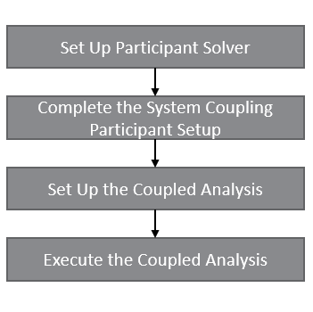

# Steps to set up and execute the coupled analysis

The steps involved in setting up and executing the coupled analysis are shown in Figure 1 and
described in more details below.

  
*Figure 1: Sequence of steps to set up and execute a coupled analysis*

## Step 1: Set up the participant solver

In this step, the individual participant solvers are configured to solve the particular problem.
This step is largely solver-dependent and is beyond the scope of this documentation.

## Step 2: Complete the System Coupling participant setup

In this step, the participant is added to the System Coupling setup and
the participant setup is communicated to System Coupling.

There are two approaches that can be taken to complete this step.

The first approach is to generate the System Coupling Setup (SCP) file to communicate
the problem setup to System Coupling. Although it is not necessary to use the participant library
for this step, the functionality to create the setup files is provided in the participant library
for convenience.

The second approach is to directly communicate the setup information to System Coupling without
using the SCP file. When using this approach, System Coupling invokes the participant in setup mode,
connects to it and gets the participant setup information via the socket connection.

For more information about this step and the advantages and disadvantages of either approach, see
[Completing the System Coupling participant setup](participant-setup.md).

## Step 3: Set up the coupled analysis

In this step, the coupled analysis is set up inside System Coupling.
The Developer's Guide pre-supposes some level of familiarity with general
System Coupling capabilities, therefore this step is not the focus of this document.
See System Coupling User's Guide for more information about this step.

## Step 4: Execute the coupled analysis

In this step, the coupled analysis is executed to solve the coupled problem.
The System Coupling Participant Library
API's must be implemented for this step to be completed successfully.
Therefore, this step is the focus of the System Coupling Developer's Guide.
For more details about this step, see
[Participant steps in a coupled analysis](participant-steps-in-coupled-analysis.md).
