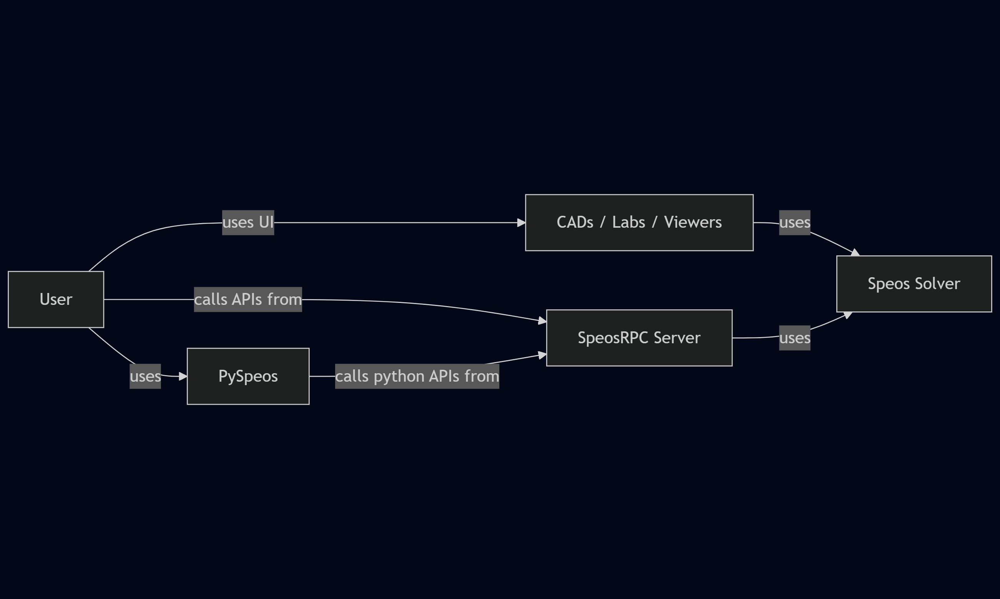
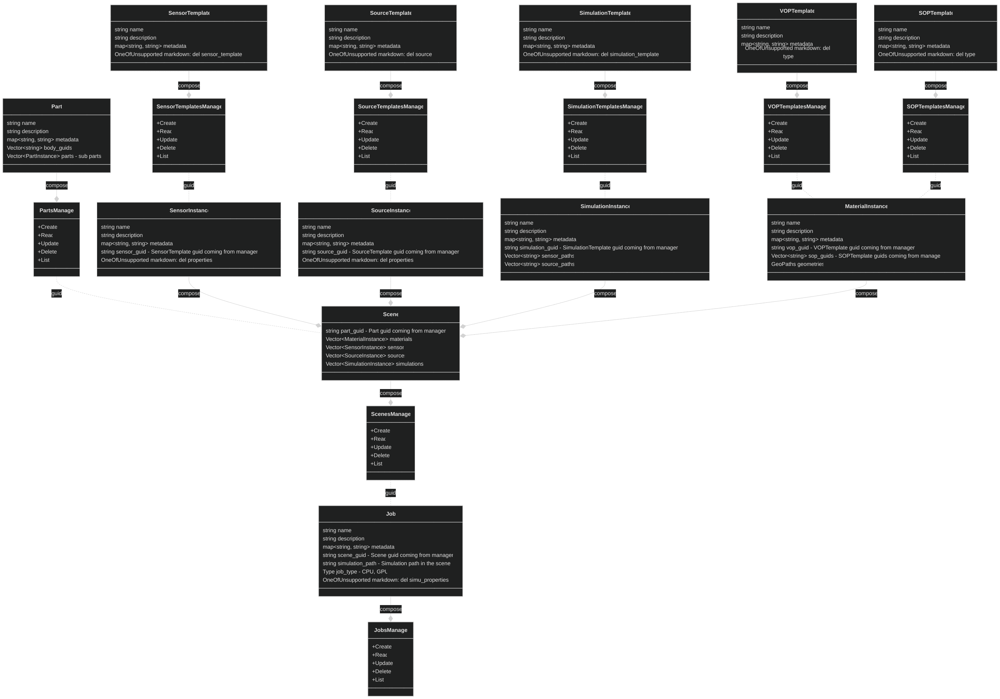

# Introduction

The SpeosRPC Server is based on gRPC and provides APIs to interact with Speos Solver.  

Please be aware that the server is intended to work with a single user.  
The server is under development, so all Speos features are not available yet.

## Why SpeosRPC Server?  

This allows the user to use the Speos capabilities without starting any CAD.  
This offers the possibility to manage Speos capabilities with more liberty:

- Data preparation
- Running jobs
- Result post processing

## gRPC usage advantages

There are several advantages of using gRPC

- Language independency between client and server.  
This means that the user has a large choice of languages to write the API calls.  
The user does not have to write the same language as the server.
- OS independency between client and server.  
The client does not have to run on the same OS as the server.  
The SpeosRPC server is provided for Linux and Windows.
- The client and server can run on different machines.

## Schema

The schema shows different ways to use Speos capabilities:

- via CADs / Labs / Viewers GUIs
- via SpeosRPC Server APIs



### Speos Solver

The Speos Solver represents the intelligence that is used to handle the light simulation.

### SpeosRPC Server

The SpeosRPC Server allows to translate the provided gRPC API calls into features understood by the Speos Solver.

## Workflow

Step 1 : Download the SpeosRPC Server  
Step 2 : Set up the client  
Step 3 : Create your scripts  
Step 4 : Launch the server  
Step 5 : Run your scripts (that will call the server)

### Where to find the SpeosRPC Server?  

When you install Speos using the unified installer, you can add the SpeosRPC Server to be downloaded.  
By default, it will be stored in `C:/Program Files/ANSYS Inc/<vxxx>/Optical Products/SPEOS_RPC`

### How to set up my client?

Setting up a client is a mandatory step in the process.  
The goal of setting up the client is to translate the proto files into the language in which you have chosen to write your scripts.
The proto files contain all the definitions of the Speos features to be translated.
By default, the proto files will be stored in `C:/Program Files/ANSYS Inc/<vxxx>/Optical Products/SPEOS_RPC/APIGrammar`.  

A documentation can be found [here](https://grpc.io/docs/) to help you generate in your chosen language the client interface of the services implemented by the server.  
Once the code is autogenerated, you will have access to all Speos features available in your chosen language.

Thanks to the autogenerated code you will be able to write scripts.

Note:  
For your information, a Python client exists and can be used.  
The Python client, named PySpeos, allows you to use a client without needing to auto-generate code from the proto files.  
PySpeos documentation (package ansys-speos-core) can be found [here](https://speos.docs.pyansys.com/).

### How to launch SpeosRPC Server?

An executable called SpeosRPC_Server is present in the current folder.  
The option --help is available to know more about possible arguments, and also to know how to properly shut down the server.

```bash
./SpeosRPC_Server.exe --help
```

Example of how to properly shutdown a server started on port 50053:

```bash
./SpeosRPC_Server.exe --stop 50053
```

## Information about ansys-api-speos API

### Proto files

The APIs are defined in proto files.  
Those proto files can be found in the folder `APIGrammar/ansys/api/speos/<featureName>/v<X>/<featureName>.proto`.  
An example of `<featureName>` can be `sop` (surface optical property).  
`v<X>` represents the version of the feature, example `v1` for the first version.

### Documentation

A documentation is automatically generated and stored in the folder `APIGrammar/doc`.  
This documentation is based on the comments that are present in the .proto files.

### Key principles

Some key principles will be described here.  
It is important to read them before writing the first calls to the server.

#### XXXsManager vs XXXActions

Many proto files that represent basic Speos features are composed of two different services:
XXXsManager and XXXActions.

##### XXXsManager

The manager allows the client to handle the features it is in charge of.  
Example: a SpectrumsManager allows to create/read/update/delete a spectrum, and list all spectrums present.
The managers allow to create a kind of library of objects.  
Here is an imaginary example of a manager that would handle the feature Object (which contains only a name and a description).

```txt
// Manager for Objects
service ObjectsManager {
 // Create an Object
 rpc Create(Create_Request) returns (Create_Response) {}
 // Read an Object
 rpc Read(Read_Request) returns (Read_Response) {}
 // Update an Object
 rpc Update(Update_Request) returns (Update_Response) {}
 // Delete an Object
 rpc Delete(Delete_Request) returns (Delete_Response) {}
 // List all Objects in manager
 rpc List(List_Request) returns (List_Response) {}
}

message Object {
 string name = 1; // Object name
 string description = 2; // Object description
}
```

Every XXXsManager service is composed of five methods.  

- Create  
Takes the Object message in the request and gives back its corresponding guid once created in the manager.

```txt
// Request to create an Object in ObjectsManager
message Create_Request {
 Object object = 1;
}
message Create_Response {
 string guid = 1; // Guid of the Object created in ObjectsManager
}
```

- Read  
From the guid received in request, gives back its corresponding Object message in the manager.

```txt
// Request to read an Object in ObjectsManager
message Read_Request {
 string guid = 1; // Guid of the Object to be read
}
message Read_Response {
 Object object = 1; // Object corresponding to the guid given in Read_Request
}
```

- Update  
Replace the object corresponding to the guid received by the Object message present in the request

```txt
// Request to update an Object in ObjectsManager
message Update_Request {
 string guid = 1; // Guid of the Object to be updated
 Object object = 2; // Object that will be used for the update
}
message Update_Response {}
```

- Delete  
Delete the object corresponding to the guid received in the request

```txt
// Request to delete an Object in ObjectsManager
message Delete_Request {
 string guid = 1; // Guid of the Object to be deleted
}
message Delete_Response {}
```

- List  
List all objects present in the manager. Return their guids.  
Tip: Can be combined with Read method to retrieve all Object messages and not only guids.

```txt
message List_Request {}
message List_Response {
 repeated string guids = 1; // Guids of the Objects in ObjectsManager
}
```

##### XXXActions

Sometimes some other methods are needed to interact with a feature. But those methods do not fit in the CRUD framework.  
In this case we enter the service XXXActions.  
This gathers all actions that can be done on a specific feature.  
Specific feature means a feature that has been created in its manager, so that its guid is known.  
The first field of an action request is always the guid of the feature concerned.

Example of an action on a scene: load a .speos file to fill it.

```txt
service SceneActions {
    rpc LoadFile(LoadFile_Request) returns (LoadFile_Response) {} 
}

message LoadFile_Request {
 string guid = 1; // Guid of a ScenesManager element to update
    string file_uri = 2; // File uri (path or guid from FileTransferService) 
}

message LoadFile_Response {}
```

#### Template vs Instance

When applicable, the features are separated in two different notions: template and instance.  
The template represents the feature with its inherent caracteristics.  
The instance represents the completion of a template by adding properties such as spatial position, link to geometry, etc.

##### Template

The template objects are handled by a manager that was described in the section above `XXXsManager`.  
The interesting thing about the template notion is that the same template can be used several times with different properties.  
Currently, all the Speos features are not yet available. The user can find the available ones in the template objects protofiles.

##### Instance

The template objects are instantiated in the Scene object, with properties needed to place them at the wanted position, or attached to the wanted geometry.  
The Scene object will gather all features that you need to run a job (compute a simulation).  
For example, it is possible to:

- Create a SourceTemplate::Luminaire with its inherent characteristics -> get its guid in SourceTemplatesManager
- Create a Scene::SourceInstance using the luminaire's guid as source_guid and position it via the LuminaireProperties using an axis_system
- Create another Scene::SourceInstance using the luminaire's guid as source_guid and position it somewhere else via the LuminaireProperties using an axis_system

The Scene object will be described in the following section.

#### Scene

The Scene is the main Speos feature.  
It is a way to gather all features that are needed to have an optical scene.  
Just below can be found the SpeosRPC data preparation big picture:



#### Job

The job feature appears in the graph just above.  
The job is responsible for computing a simulation.  
It is a way to link to a specific SimulationInstance of a specific Scene, and choose some properties (job type, properties specific to the SimulationTemplate type like stop conditions).  
Then the `JobActions` can be called on a specific job to:

- Start
- Stop
- GetProgressStatus
- GetResults
- ...

#### Geo path and xxx_path

Some objects in the Scene need to refer to a geometry, in this case a GeoPath is needed.  
There is a GeoPath explanation in the auto generated documentation.  
A GeoPath is a string that allows the user to target a geometry, by using geometry names separated by "/".  
That can be the whole geometry, a whole sub part, a whole body, a face.  
"" -> the whole root part of the scene  
"body0" -> the whole body named body0 contained in the root part  
"body0/face0" -> the face named face0 contained in the body named body0 contained in the root part  
"part1" -> the whole part named part1 contained in the root part  
"part1/body1" -> the whole body named body1 contained in the part named part1 contained in the root part

Some objects in the Scene need to refer to some Instance, in this case a xxx_path is needed.  
Those objects are refered thanks to their name.  
Example for the SimulationInstance that needs to refer to some SensorInstances via the field sensor_paths.  
An explanation is also given in the auto generated documentation of the concerned fields.  
"" -> all sensors instantiated in the scene  
"sensor1" -> the sensor instance named sensor1 contained in the scene

#### File transfer

If the client is in the situation where the server is not on the same machine, it is then important not to give the local path when a file is expected in a message.  
Example:

```txt
message LoadFile_Request {
 string guid = 1; // Guid of a ScenesManager element to update
    string file_uri = 2; // File uri (path or guid from FileTransferService) 
}
```

The field `file_uri` is expecting

- either a local path (this works only if the server is on the same machine as the client)
- or a guid retrieved after uploading the file via the FileTransferService

The FileTransferService (present in `ansys/api/speos/file/v1/file_transfer.proto`) allows to upload/download files to/from the server.  
A python helper is also present (in `ansys/api/speos/file/v1/file_transfer.py`), to ease the usage of the FileTransferService in case of python client.  
When a file is uploaded to the server, the uri representing the file is returned in the message FileSystemItemInformation.  
This uri can then be used instead of a local path in the fields xxx_file_uri.
