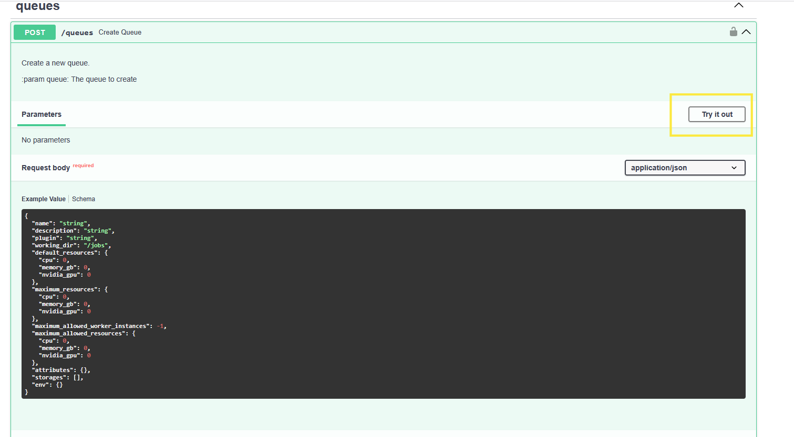

## Introduction

The AVxcelerate Resource Manager REST API v0.1.0 is compatible with the AVX Architecture V2.

This REST API allows to perform CRUD (Create, Read, Update, and Delete) operations on resources such as queues, deployments, applications and app-runtime-configurations.

## Features

### Queues

* You can create queues with the required storages, resource limits and environment variables
* Allowing to manage queues helps will help you configure different applications within resource limits and group the applications requiring same storage together.
* You can adjust the maximum number of workers that can concurrently run on a queue using the parameter 'maximum_allowed_worker_instances'

### Plugins

 You can register a plugin with definition of container runtime.
For example: Docker Engine / Kubernetes

### Jobs

* You can submit a resource-manager job by providing application details (name, version, image, environment variables, etc.) and track it to its completion.
* You can also check the status of the job and clean the resources the job has acquired.

## Python helper

The AVxcelerate python APIs are hosted as a python package on a cluster as part of the Explore service deployment. The developers can install the package using pip and use it to call AVx autonomy APIs without needing to make raw REST calls.

### PyPi Regsitry URL:

The python package is hosted as PyPi compliant registry on each deployed cluster. The registry URL is like this:

https://explore.{{ domain }}/api/explore/pypi

## Usage example

Pre-requisites:

We assume that on the system is running with the **Ubuntu 22.04** version, and that the following tools are already installed:

- python 3.10
- pip 25.1
- uv 0.6

And we assume that you are using AVx Autonomy Toolchain version **25R2.2**

Step 1: Create virtual environment

```bash
$ python -m venv .venv 


Step 2: Activate the virtual environment

```bash
$ source .venv/bin/activate  
```

Step 3: Install python packages:

- ansys-api-avxcelerate-autonomy
- ansys-avxcelerate-autonomy

```bash
$ pip install ansys-api-avxcelerate-autonomy ansys-avxcelerate-autonomy --extra-index-url https://explore.{{ domain }}/api/explore/pypi
```

Step 4: Use ansys-api-avxcelerate-autonomy and ansys-avxcelerate-autonomy in your python code


```python
import asyncio
from ansys.api.avxcelerate.autonomy.explore_service.v1.api.jobs_api import JobsApi
from ansys.api.avxcelerate.autonomy.explore_service.v1.api_client import ApiClient
from ansys.api.avxcelerate.autonomy.explore_service.v1.configuration import Configuration
from ansys.api.avxcelerate.autonomy.explore_service.v1.exceptions import NotFoundException
from ansys.api.avxcelerate.autonomy.explore_service.v1.models.explore_job_read import ExploreJobRead
from ansys.avxcelerate.autonomy.utils.auth_client_session import AuthClientSession
from ansys.avxcelerate.autonomy.utils.token_provider import TokenProvider

async def main():
    base_url = "https://explore.{{ domain }}"
    configuration = Configuration(host=f"{base_url}/api/explore/v1")
    async with ApiClient(configuration) as api_client:
        session = AuthClientSession(base_url=f"{base_url}/api/explore/v1/")
        provider = TokenProvider(f"{base_url}/auth")
        session.set_provider(provider)
        provider.login()
        api_client.rest_client.pool_manager =  session
        jobs_api = JobsApi(api_client)
        job_id = "exp-dec894b2-647c-4ca5-b516-cdfc18c58fdd"
        try:
            job: ExploreJobRead = await jobs_api.get_job(job_id)
            print(job)
        except NotFoundException:
            print("No job found against this id")
        except Exception as ex:
            print(str(ex))
            print("Couldn't get job against this job id")

asyncio.run(main())
```

## Optimize available resource through worker management

### 1. Introduction: worker management in simulation jobs

If you submit a large number of simulation jobs, this will trigger the creation of workers that are queued and launched simultaneously. 

This creation of many worker instances (referred to as containers in Kubernetes) can overload the cluster. As a result, the cluster’s resources may become depleted, which could lead to failures or even a complete system crash.


### 2. Cluster Resource Usage Optimization

To prevent this issue, you can set a limit on the maximum number of worker instances that can be created during a simulation job. 

This limit is controlled by the *maximum_allowed_worker_instances* parameter, which can be set when creating or updating a queue via the Resource Manager REST API. 

Once this limit is configured, the system will only launch up to the specified number of workers at the same time; any additional jobs will remain in a waiting state until sufficient worker capacity becomes available.

### Example

* If The *maximum_allowed_worker_instances* parameter is set to 10 for the queue named *local*. 
* Two jobs are created: 
   
   a. Job (1) with 10 worker instances 
   
   b. Job (2) with 8 worker instances

If Job (1) is created first, it will allocate 10 worker instances, using up all available capacity. As a result, Job (2) will be paused at the *Simulation Step*, and a warning will appear under the *Simulation Step* indicating that no worker instances can be created.

Once Job (1) has finished, then capacity becomes available. Job (2) can then allocate 8 worker instances, the warning disappears, and the simulation proceeds. 

Note: The AVxcelerate toolchain does not support partial allocation of worker instances. If a job requests 10 workers, it will only begin when all 10 worker instances are available.

### Additional Containers

While worker instances are the primary consumers of cluster resources, there are two additional containers that are created when a job is submitted:

 1. Simulation Controller Instance (created on the *simulation-controller-queue*): Manages the job and its associated workers.

 2. Post Controller Instance (created on the *post-controller-queue*): Launched when the visualization tab is opened in the UI and is responsible for data analysis.

When estimating the resources needed for a job, consider that each job will run one simulation controller instance, the specified number of worker instances, and potentially one post controller instance.

Note: By default, there is no limit on the number of simulation controller and post controller instances that can be created. This means that *n* concurrent jobs will result in *n* controller instances, which can consume significant resources. To manage this, you can set the *maximum_allowed_worker_instances* parameter for these queues to control the number of controller instances created.

## Configuring maximum number of parallel running workers per queue

Through the Resource REST API, and the *maximum_allowed_worker_instances* parameter you are able to configure the maximum number of parallel running workers per job. 


Set a limit to the following parameter:
```bash
 "maximum_allowed_worker_instances"
 ``` 

See below screenshot as an example:


Note: The resource manager allocates the job that has the requested amount of workers or less. 

In the example below, only 3 workers are available, so the job that requires 4 workers, appears as 'pending'


## Download concrete scenario files

It is possible to download the concrete scenario files of simulation jobs through the REST API. 

To do this, you need to provides a list of *sample_ids* to generate concrete scenario files for those samples. 

* If 'samples' is empty or not provided, no concrete file is included. 
* If 'samples' is specified, than all the concrete files will be included for these samples in the zip.


You can also specify what kind of documents you want to download:

* Scenario files
* Asset files

 If the parameter: *"filter_by_asset_declaration"* is empty or not provided, all the "common" asset data will be provided.
 * 

## Getting a Token to Use the REST API 

To use the REST API, you need to enter a Token

To generate the Token: 

1. Run the following command from your terminal, to generate a token:
```bash
$ curl \ 'GET'
  -d "client_id=tsalsm-rest-api" \
  -d "client_secret=<redacted>" \
  -d "username=avx-toolchain-us1. er" \
  -d "password=<redacted>" \
  -d "scope=offline_access" \
  -d "grant_type=password" \
  "http://explore.apps.YOURCUSTOMURL.com/auth/realms/avx/protocol/openid-connect/token"
  ```

The output should be the following: Copy and save the generated token so that you can use it to authenticate.

```bash
{
  "access_token": "eyJhbGciOiJSUzI1NiIsInR5cCIgOiAiSldUIiwia2lkIiA6ICJrQWVwLWVZNVNRVlRIMHhqNUFBMXM3U19IeGpRSmxLckNLcE51STFLQkxNIn0.eyJleHAiOjE2ODc0NDA5NzIsImlhdCI6MTY4NzQ0MDY3MiwianRpIjoiYjhkOWFlMWYtMTZmMy00NDM1LTk0MzItYmJjN2NhZWE5NDQ3IiwiaXNzIjoiaHR0cHM6Ly9leHBsb3JlLnN0YWdlLmFwcHMuZnJpc2JlZWRldi5jb20vYXV0aC9yZWFsbXMvYXZ4IiwiYXVkIjoiYWNjb3VudCIsInN1YiI6ImI1NGVhODZkLTkzMjUtNDYwZi1iMDdhLTJlOTBlMmQwNmJiZiIsInR5cCI6IkJlYXJlciIsImF6cCI6InRzYWxzbS1yZXN0LWFwaSIsInNlc3Npb25fc3RhdGUiOiI5YTE2Y2U5NC0xMTY5LTQzY2MtYjYyNS01ZTAxNTc3ZTNkNDYiLCJhY3IiOiIxIiwicmVhbG1fYWNjZXNzIjp7InJvbGVzIjpbIm9mZmxpbmVfYWNjZXNzIiwidW1hX2F1dGhvcml6YXRpb24iLCJkZWZhdWx0LXJvbGVzLWF2eCJdfSwicmVzb3VyY2VfYWNjZXNzIjp7ImFjY291bnQiOnsicm9sZXMiOlsibWFuYWdlLWFjY291bnQiLCJtYW5hZ2UtYWNjb3VudC1saW5rcyIsInZpZXctcHJvZmlsZSJdfX0sInNjb3BlIjoib2ZmbGluZV9hY2Nlc3MgZW1haWwgcHJvZmlsZSIsInNpZCI6IjlhMTZjZTk0LTExNjktNDNjYy1iNjI1LTVlMDE1NzdlM2Q0NiIsImVtYWlsX3ZlcmlmaWVkIjp0cnVlLCJwcmVmZXJyZWRfdXNlcm5hbWUiOiJhdngtdG9vbGNoYWluLXVzZXIiLCJnaXZlbl9uYW1lIjoiIiwiZmFtaWx5X25hbWUiOiIiLCJlbWFpbCI6InRzYWxzbUBhbnN5cy5jb20ifQ.mk5-FqoMvbPeUSRRc3kVicAVt2U-xSYRVmzFwVeDKbcYlJMD551EYf9dzS2F9DBxPOoBDUyAdWyAov8Hj-VcscuMCpuPm9ikq6zf9sXOWCOlT3SYQIm7vHhb16_K1rtbAwRHlRPvyu4IAplj3SBsybkhUFQlSpWyRupl7Y80QZiaSoGviWh8EQabbhdSjzb-JFkOr7CZuQL4G5irpGjQDNa7zX6HzvQYpPWXrhYDpXItP2ZzEDHKIQAK-DUKIQyj8EfemEKx6BUbHquiC_n4f_VCIeGsr9pOPRK_5U87nzrE-rpzVsrFg77cURyX8cXFxfXYgDuB5KmbzLvz5mCxsQ",
  "expires_in": 300,
  "refresh_expires_in": 0,
  "refresh_token": "eyJhbGciOiJIUzI1NiIsInR5cCIgOiAiSldUIiwia2lkIiA6ICIwMmFkMjc0MS03MDc4LTRiYTktYTkyNy03NjhlZjRlYmM1YjcifQ.eyJpYXQiOjE2ODc0NDA2NzIsImp0aSI6ImMyMzhmOGY5LWViNGQtNGM5Yy05NWNjLWJjZmQ0MDhkMWFhNiIsImlzcyI6Imh0dHBzOi8vZXhwbG9yZS5zdGFnZS5hcHBzLmZyaXNiZWVkZXYuY29tL2F1dGgvcmVhbG1zL2F2eCIsImF1ZCI6Imh0dHBzOi8vZXhwbG9yZS5zdGFnZS5hcHBzLmZyaXNiZWVkZXYuY29tL2F1dGgvcmVhbG1zL2F2eCIsInN1YiI6ImI1NGVhODZkLTkzMjUtNDYwZi1iMDdhLTJlOTBlMmQwNmJiZiIsInR5cCI6Ik9mZmxpbmUiLCJhenAiOiJ0c2Fsc20tcmVzdC1hcGkiLCJzZXNzaW9uX3N0YXRlIjoiOWExNmNlOTQtMTE2OS00M2NjLWI2MjUtNWUwMTU3N2UzZDQ2Iiwic2NvcGUiOiJvZmZsaW5lX2FjY2VzcyBlbWFpbCBwcm9maWxlIiwic2lkIjoiOWExNmNlOTQtMTE2OS00M2NjLWI2MjUtNWUwMTU3N2UzZDQ2In0.wTrdeIoEoum8mMaam-eZerfPAywnb2LGr1Wsxv6tBYg",
  "token_type": "Bearer",
  "not-before-policy": 0,
  "session_state": "9a16ce94-1169-43cc-b625-5e01577e3d46",
  "scope": "offline_access email profile"
}
```

**Note**: The mandatory attributes are refresh_token and access_token.

2. Go the REST API documentation page.

3. Click **Authorize**


4. Enter Bearer in the Value field, with a space at the end. Then, insert the access token. Click Authorize once again.


## Creating and Configuring Queues
The following steps explain how to add or update an existing queue through the Resource Manager REST API that will appear in the Explore web app to be selected during the simulation job configuration. 

To create a queue you need to make a POST request to:
```bash
https://explore.{{ environment }}.{{ domain }}/api/resources/v1/queues endpoint
```

1. Edit the Request body and click **Try it out**. 

2. Click **Execute**. A Queue ID will be generated.




You will find an JSON example below: 
```bash
{
    "name": "test-node-selector-queue",
    "description": "Test queue for node selector functionality",
    "plugin": "kubernetes_apisix",
    "working_dir": "/tmp",
    "default_resources": {
      "cpu": 2,
      "memory_gb": 4
    },
    "maximum_resources": {
      "cpu": 4,
      "memory_gb": 8
    },
    "maximum_allowed_worker_instances": 5,
    "maximum_allowed_resources": {
      "cpu": 8,
      "memory_gb": 16
    },
    "attributes": {
      "namespace": "avx-autonomy",
      "copy_files_to_job_folder": false,
      "mount": {
        "pvc-frisbee-data": "/pvc-frisbee-data"
      },
      "node_selector": {
        "node-group-reservation": "my-special-group"
      },
      "tolerations": [
        {
          "key": "node-group-reservation",
          "operator": "Equal",
          "value": "my-special-group",
          "effect": "NoSchedule"
        }
      ]
    },
    "storages": [],
    "env": {
      "ANSYS_LICENSING_WEB": "0",
      "ANSYS_LICENSING_SHARED_WEB": "0",
      "ANSYS_LICENSING_SERVICE_PRIORITY": "fnp",
      "ANSYSLI_TIMEOUT_FLEXLM": "60",
      "ANSYSLI_FLEXLM_TIMEOUT_ENV": "6000000",
      "AVX_LOGGING_LOGS_FILE": "logs.txt",
      "AVX_TELEMETRY_ENABLE": "false",
      "ANSYSLMD_LICENSE_FILE": "1234@ansys-license-server.ansys-license-server.svc.cluster.local",
      "OPENTELEMETRY_LOGGING_LEVEL": "INFO",
      "AVX_STARTUP_STORAGES": "[\n  {\n    \"id\": \"jobs\",\n    \"plugin\": \"local\",\n    \"config\": {\n      \"root\": \"/pvc-frisbee-data/jobs\"\n    },\n    \"read_only\": false\n  },\n  {\n    \"id\": \"assets\",\n    \"plugin\": \"local\",\n    \"config\": {\n      \"root\": \"/pvc-frisbee-data/assets\"\n    },\n    \"read_only\": true\n  },\n  {\n    \"id\": \"http\",\n    \"plugin\": \"http\",\n    \"config\": {},\n    \"read_only\": true\n  }\n]\n",
      "AVX_SIMULATION_CONTROLLER_EXPLORE_SERVICE_STATE_URL": "http://explore-service-svc-api:5000/api/explore/v1/internal/job-state",
      "AVX_SIMULATION_CONTROLLER_STORAGES": "[\n  {\n    \"id\": \"jobs\",\n    \"plugin\": \"local\",\n    \"config\": {\n      \"root\": \"/pvc-frisbee-data/jobs\"\n    },\n    \"read_only\": false\n  },\n  {\n    \"id\": \"assets\",\n    \"plugin\": \"local\",\n    \"config\": {\n      \"root\": \"/pvc-frisbee-data/assets\"\n    },\n    \"read_only\": true\n  },\n  {\n    \"id\": \"http\",\n    \"plugin\": \"http\",\n    \"config\": {},\n    \"read_only\": true\n  }\n]\n",
      "AVX_SIMULATION_CONTROLLER_RESOURCE_MANAGER_URL": "http://resource-manager-service-svc-api:5000/api/resources",
      "AVX_FASTAPI_LICENSE_SERVICE_URL": "http://licensing-service:12588"
    }
  }
```

You need to get the Application ID on which you want to run the job. 

To get this, click **Execute** on the GET/Application command (below):
```bash
https://explore.aws-stage.apps.frisbeedev.com/api/resources/v1/docs
GET https://explore.{{ environment }}.{{ domain }}/api/resources/v1/applications
```


Now map the above generated **Queue ID** with the **Application ID** for the app-runtime-config by making a POST call.

```bash
POST https://explore.{{ environment }}.{{ domain }}/api/resources/v1/app-runtime-config/{queue_id}/application/{app_id}
```


You can find a sample json below which specifies the image path and working directory:

```bash
{
  "env": {},
  "default_resources": null,
  "attributes": {
    "image": "905418323743.dkr.ecr.us-east-2.amazonaws.com/avx/exec-simulation-startup:2026R1.1-beta-20251002-2",
    "working_dir": "/deployment_binaries/data"
  },
  "service_port": null
}
```

Once the queue is created and configured it will be available to select in the Explore & Analyze simulation job configuration template. 