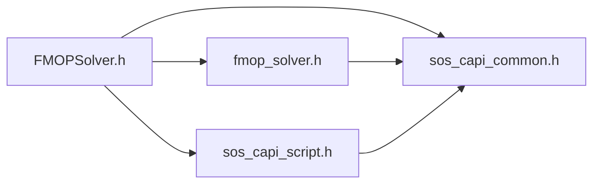

# File FMOPSolver.h

![][C++]

**Location**: `FMOPSolver.h`


## Includes

* [fmop_solver.h](index.md#fmop__solver_8h)
* [sos_capi_common.h](sos__capi__common_8h.md#sos__capi__common_8h)
* [sos_capi_script.h](sos__capi__script_8h.md#sos__capi__script_8h)





## Source


```cpp
#include "fmop_solver.h"  
#include "sos_capi_common.h"  
#include "sos_capi_script.h"

```
