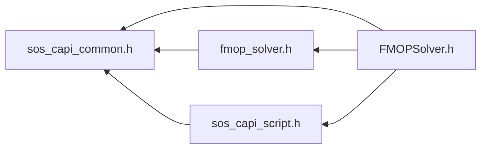

# File sos_capi_common.h

![][C++]

**Location**: `sos_capi_common.h`

C-API for utility functions (load/unload library, license management, error handling)

**copyright**\
Ansys Austria GmbH

## Included by

* [FMOPSolver.h](_f_m_o_p_solver_8h.md#_f_m_o_p_solver_8h)
* [fmop_solver.h](index.md#fmop__solver_8h)
* [sos_capi_script.h](sos__capi__script_8h.md#sos__capi__script_8h)





## Public type definitions

Pubic type definitions used within this API

<a id="sos__capi__common_8h_1a69eb42c1b3b49f22b9e73c6c9869cb75"></a>
### Enumeration type fmop_dataobject_types

![][public]

**Definition**: `sos_capi_common.h` (line 111)


```cpp
enum fmop_dataobject_types {
  fmop_node_data = 0,
  fmop_element_data = 1,
  fmop_scalar_data = 3
}
```


Data type definitions.


<a id="sos__capi__common_8h_1a69eb42c1b3b49f22b9e73c6c9869cb75aaf0fb275c161febc56c4f10e62987049"></a>
#### Enumerator fmop_node_data

node data (one scalar per node)


<a id="sos__capi__common_8h_1a69eb42c1b3b49f22b9e73c6c9869cb75a1ec31fe31f3b8a9fd9dd902b014499ef"></a>
#### Enumerator fmop_element_data

element data (one scalar per element)


<a id="sos__capi__common_8h_1a69eb42c1b3b49f22b9e73c6c9869cb75a16a14aa0d55901638e165fb3a39b3870"></a>
#### Enumerator fmop_scalar_data

scalar data (vector of size 1)


<a id="sos__capi__common_8h_1a4847f3fa2943ffd694eb6cbe169a8bec"></a>
### Enumeration type fmop_error_t

![][public]

**Definition**: `sos_capi_common.h` (line 79)


```cpp
enum fmop_error_t {
  fmop_success = 0,
  fmop_invalid_handle = 1,
  fmop_exception_occurred = 2,
  fmop_settings_error = 3,
  fmop_model_missing = 4,
  fmop_license_error = 5,
  fmop_script_error = 6,
  fmop_script_no_object = 7,
  fmop_script_wrong_type = 8,
  fmop_not_implemented = 16382,
  fmop_const_max = 16383
}
```


Error code definitions.


<a id="sos__capi__common_8h_1a4847f3fa2943ffd694eb6cbe169a8beca41a0a2e83b0ac20d414f4b015522ce55"></a>
#### Enumerator fmop_success

Function execution returned successfully.


<a id="sos__capi__common_8h_1a4847f3fa2943ffd694eb6cbe169a8becacef5c059b0dd649f97d5404db95c3ccf"></a>
#### Enumerator fmop_invalid_handle

The function got an unexpected NULL pointer.


<a id="sos__capi__common_8h_1a4847f3fa2943ffd694eb6cbe169a8becadac3d9086cdab852d265dc924070c198"></a>
#### Enumerator fmop_exception_occurred

An internal error occurred. Request log messages.


<a id="sos__capi__common_8h_1a4847f3fa2943ffd694eb6cbe169a8beca4040927e4d05d13e93b9f2c7373ca0cd"></a>
#### Enumerator fmop_settings_error

Input argument(s) is invalid or missing.


<a id="sos__capi__common_8h_1a4847f3fa2943ffd694eb6cbe169a8becaedda7a6dbd4f5dd3eedecca9ec7dc1e9"></a>
#### Enumerator fmop_model_missing

The requested model identifier is not known.


<a id="sos__capi__common_8h_1a4847f3fa2943ffd694eb6cbe169a8becacf8dfe2eaba2eada73a26e487a04f8fe"></a>
#### Enumerator fmop_license_error

No valid license available.


<a id="sos__capi__common_8h_1a4847f3fa2943ffd694eb6cbe169a8becab6e0160bb71d6930176d907409618f4d"></a>
#### Enumerator fmop_script_error

An error appeare while executing Lua script.


<a id="sos__capi__common_8h_1a4847f3fa2943ffd694eb6cbe169a8beca749f1c6edf13b1303018d7a3632dc316"></a>
#### Enumerator fmop_script_no_object

Object with ident not found in script engine.


<a id="sos__capi__common_8h_1a4847f3fa2943ffd694eb6cbe169a8beca32eddc7d860101cdbb8e1571c726ee91"></a>
#### Enumerator fmop_script_wrong_type

Object with ident has wrong type.


<a id="sos__capi__common_8h_1a4847f3fa2943ffd694eb6cbe169a8beca7fc167a096db0f31209791e0053de2ec"></a>
#### Enumerator fmop_not_implemented

This function is yet not implemented or has been removed.


<a id="sos__capi__common_8h_1a4847f3fa2943ffd694eb6cbe169a8beca41b2d8995eb66857227a50e49e8f6016"></a>
#### Enumerator fmop_const_max

2^14-1 non-modifiable for each API version


<a id="sos__capi__common_8h_1afe21e382a604ef55cba4d683d706422e"></a>
### Enumeration type fmop_license_t

![][public]

**Definition**: `sos_capi_common.h` (line 100)


```cpp
enum fmop_license_t {
  fmop_mesh_signal = 10,
  fmop_mesh_all = 30
}
```


FMOP mesh features which need to be unlocked by a valid license.


<a id="sos__capi__common_8h_1afe21e382a604ef55cba4d683d706422ea5b9372ca962a29cf37faac2948897143"></a>
#### Enumerator fmop_mesh_signal

Unlocks signal meshes.


<a id="sos__capi__common_8h_1afe21e382a604ef55cba4d683d706422ea71a41e6fb1935010b6ed34037f7dae8c"></a>
#### Enumerator fmop_mesh_all

Unlocks all mesh features.


## License handling

API handling licenes requests

<a id="sos__capi__common_8h_1a1cdd0d44e0ea8172b1f7f1095395da89"></a>
### Function FMOP_acquireLicense

![][public]


```cpp
DYNARDO_FMOP_API fmop_error_t FMOP_acquireLicense()
```


Acquires an optiSLang enterprise license.

**Returns**:


* [fmop_settings_error](sos__capi__common_8h.md#sos__capi__common_8h_1a4847f3fa2943ffd694eb6cbe169a8beca4040927e4d05d13e93b9f2c7373ca0cd) if a license has already been acquired successfully

* [fmop_exception_occurred](sos__capi__common_8h.md#sos__capi__common_8h_1a4847f3fa2943ffd694eb6cbe169a8becadac3d9086cdab852d265dc924070c198) if any error occures while checking out the requested feature(s)

* [fmop_success](sos__capi__common_8h.md#sos__capi__common_8h_1a4847f3fa2943ffd694eb6cbe169a8beca41a0a2e83b0ac20d414f4b015522ce55) if a license has been acquired successfully


**Returns**:

Call [FMOP_getErrnoString()](sos__capi__common_8h.md#sos__capi__common_8h_1a4dcdde79d3a37a80540e3a7f5b486110) to get a human readable representation


**Return type**: DYNARDO_FMOP_API [fmop_error_t](sos__capi__common_8h.md#sos__capi__common_8h_1a4847f3fa2943ffd694eb6cbe169a8bec)

<a id="sos__capi__common_8h_1a7086f4db3e639526b2b7fe9ce9392a24"></a>
### Function FMOP_appendLicenseSearchPath

![][public]


```cpp
DYNARDO_FMOP_API fmop_error_t FMOP_appendLicenseSearchPath(const char *abs_path)
```


Appends another license search path to the default ones.

**Deprecated**:

Since 2022 R2. Will be removed in 2023 R1


By default the following license search paths will be checked in the order given:
* @localhost

* the current working directory

* the path pointed to by the environment variable 'LM_LICENSE_FILE'

* the path pointed to by the environment variable 'DYNARDO_LICENSE_FILE'


**Parameters**:

* **abs_path**: An absolute file system path, e.g. '/opt/DYNARDO/licensing', 'D:\Licenses', ...


**Returns**:


* [fmop_settings_error](sos__capi__common_8h.md#sos__capi__common_8h_1a4847f3fa2943ffd694eb6cbe169a8beca4040927e4d05d13e93b9f2c7373ca0cd) if the path given does not exist

* [fmop_exception_occurred](sos__capi__common_8h.md#sos__capi__common_8h_1a4847f3fa2943ffd694eb6cbe169a8becadac3d9086cdab852d265dc924070c198) if the path given invoces any other filesystem error

* [fmop_success](sos__capi__common_8h.md#sos__capi__common_8h_1a4847f3fa2943ffd694eb6cbe169a8beca41a0a2e83b0ac20d414f4b015522ce55) if the path has been appended successfully


**Returns**:

Call [FMOP_getErrnoString()](sos__capi__common_8h.md#sos__capi__common_8h_1a4dcdde79d3a37a80540e3a7f5b486110) to get a human readable representation


**Parameters**:

* const char * **abs_path**

**Return type**: DYNARDO_FMOP_API [fmop_error_t](sos__capi__common_8h.md#sos__capi__common_8h_1a4847f3fa2943ffd694eb6cbe169a8bec)

<a id="sos__capi__common_8h_1a462a99c932a9b5704aae42a15826e4c3"></a>
### Function FMOP_licenseLocked

![][public]


```cpp
DYNARDO_FMOP_API bool FMOP_licenseLocked()
```


Check whether any license feature was acquired.

**Returns**:

True if any license feature is locked, false otherwise


**Return type**: DYNARDO_FMOP_API bool

<a id="sos__capi__common_8h_1a62d038d686a8183e10f52131697bce6c"></a>
### Function FMOP_releaseLicense

![][public]


```cpp
DYNARDO_FMOP_API fmop_error_t FMOP_releaseLicense()
```


Release the acquired license.

Note, that no previously acquired license is released if not all loaded Database and FMOP objects are already released


**Returns**:


* [fmop_settings_error](sos__capi__common_8h.md#sos__capi__common_8h_1a4847f3fa2943ffd694eb6cbe169a8beca4040927e4d05d13e93b9f2c7373ca0cd) if any Database or FMOP object is not already released

* [fmop_success](sos__capi__common_8h.md#sos__capi__common_8h_1a4847f3fa2943ffd694eb6cbe169a8beca41a0a2e83b0ac20d414f4b015522ce55) in all other cases


**Returns**:

Call [FMOP_getErrnoString()](sos__capi__common_8h.md#sos__capi__common_8h_1a4dcdde79d3a37a80540e3a7f5b486110) to get a human readable representation


**Return type**: DYNARDO_FMOP_API [fmop_error_t](sos__capi__common_8h.md#sos__capi__common_8h_1a4847f3fa2943ffd694eb6cbe169a8bec)

## Error Handling

API to access and interpret recent data object error messages

<a id="sos__capi__common_8h_1a4dcdde79d3a37a80540e3a7f5b486110"></a>
### Function FMOP_getErrnoString

![][public]


```cpp
DYNARDO_FMOP_API const char * FMOP_getErrnoString(fmop_error_t error_num)
```


Returns a string description for the error number given.

**Parameters**:

* **error_num**: The error number


**Returns**:

A human readable string description for the error number given.The returned string will be overwritten by this function at the next call and will be destroyed on program termination


?> Calling this function will neither manipulate the internal log message stack nor the errno state of the last library call


?> DON'T USE ERRNO as agrument identifier as this seems to be defined as a macro identifier Refer to [http://www.cplusplus.com/reference/cerrno/errno/](http://www.cplusplus.com/reference/cerrno/errno/) for details


**Parameters**:

* [fmop_error_t](sos__capi__common_8h.md#sos__capi__common_8h_1a4847f3fa2943ffd694eb6cbe169a8bec) **error_num**

**Return type**: DYNARDO_FMOP_API const char *

<a id="sos__capi__common_8h_1ac78d83f9f73afd90854e1d07657fc186"></a>
### Function FMOP_getLastErrno

![][public]


```cpp
DYNARDO_FMOP_API fmop_error_t FMOP_getLastErrno()
```


Returns the error number which has been set at the last library call.

**Returns**:

The error number which has been set at the last library call


**Return type**: DYNARDO_FMOP_API [fmop_error_t](sos__capi__common_8h.md#sos__capi__common_8h_1a4847f3fa2943ffd694eb6cbe169a8bec)

<a id="sos__capi__common_8h_1a6d55525bac5ec09f8194536705dfce7c"></a>
### Function FMOP_getLastErrnoString

![][public]


```cpp
DYNARDO_FMOP_API const char * FMOP_getLastErrnoString()
```


Returns a pointer to a string that describes the error code which has been set at the last library call.

**Returns**:

A human readable string description for the error code that has been set at the last library call. The returned string will be overwritten by this function at the next call and will be destroyed on program termination


?> Calling this function will neither manipulate the internal log message stack nor the errno state of the last library call


**Return type**: DYNARDO_FMOP_API const char *

<a id="sos__capi__common_8h_1aa79c50f0e38654fc5bf42e052b229748"></a>
### Function FMOP_getLastErrorString

![][public]


```cpp
DYNARDO_FMOP_API const char * FMOP_getLastErrorString()
```


Returns internal log messages of level warning and above.

This log level is immutable. [FMOP_setLogLevel()](sos__capi__common_8h.md#sos__capi__common_8h_1ac13c87c4e4d30a83f4d041a908d0a1e7) can not modify it. If the internal logger is empty, the value of [FMOP_getLastErrnoString()](sos__capi__common_8h.md#sos__capi__common_8h_1a6d55525bac5ec09f8194536705dfce7c) will be returned


**Returns**:

Returns all internal, formatted log messages of log level warning and above if either a warning or an error message occured during the last library call. Otherwise the return value of [FMOP_getLastErrnoString()](sos__capi__common_8h.md#sos__capi__common_8h_1a6d55525bac5ec09f8194536705dfce7c) will be returned. The returned string will be overwritten by this function at its next call and will be destroyed on program termination


?> Calling this function will neither manipulate the internal log message stack nor the errno state of the last library call


**Return type**: DYNARDO_FMOP_API const char *

<a id="sos__capi__common_8h_1a1fd89d5a52a09e446992e60a30636118"></a>
### Function FMOP_getLastLogString

![][public]


```cpp
DYNARDO_FMOP_API const char * FMOP_getLastLogString()
```


Returns internal log messages of log levels defined by FMOP_setLogLevel. Serves as debug logger.

Initially all log levels are deactivated and no log messages will be buffered. Call FMOP_setLogLevel ( >0 ) to activate the logger and FMOP_setLogLevel (0) to deactivate it again.


**Returns**:

Returns all internal, formatted log messages of the last library call. The returned string will be overwritten by this function at the next call and will be destroyed on program termination


?> Calling this function will not manipulate the internal log message stack. Though the errno number will be set and can be queried calling [FMOP_getLastErrno()](sos__capi__common_8h.md#sos__capi__common_8h_1ac78d83f9f73afd90854e1d07657fc186)


**Return type**: DYNARDO_FMOP_API const char *

<a id="sos__capi__common_8h_1ac13c87c4e4d30a83f4d041a908d0a1e7"></a>
### Function FMOP_setLogLevel

![][public]


```cpp
DYNARDO_FMOP_API int FMOP_setLogLevel(int log_level)
```


Defines the new log level filter. Valid for all subsequent library calls until a new log level gets set.

**Parameters**:

* **log_level**: Defines the new log level filter for messages returned by FMOP_getLastLog. Accepts the following integer values only:
* 0 ... filter all log levels

* 1 ... return only log messages of log level ERROR

* 2 ... return only log messages of log level WARNING and below

* 3 ... return only log messages of log level INFO and below

* 4 ... return only log messages of log level DEBUG and below

* 5 ... return all log messages, i.e. ERROR, WARNING INFO, DEBUG, TRACE. The log level TRACE is not existing in maintenance, i.e. in customer builds.


**Returns**:

The former log level or -1 if the log_level is unknown


?> Calling this function will not manipulate the internal log message stack. Though the errno number will be set and can be queried calling [FMOP_getLastErrno()](sos__capi__common_8h.md#sos__capi__common_8h_1ac78d83f9f73afd90854e1d07657fc186)


**Parameters**:

* int **log_level**

**Return type**: DYNARDO_FMOP_API int

## Miscellaneous

<a id="sos__capi__common_8h_1a14d4d11f425cfcd2f7149798ad4d9274"></a>
### Function FMOP_getVersionString

![][public]


```cpp
DYNARDO_FMOP_API const char * FMOP_getVersionString()
```


Returns a version string.

**Returns**:

A const pointer to a character array holding the version string. Ownership is handled internally.


?> Calling this function will not manipulate the internal log message stack. Though the errno number will be set and can be queried calling [FMOP_getLastErrno()](sos__capi__common_8h.md#sos__capi__common_8h_1ac78d83f9f73afd90854e1d07657fc186)


**Return type**: DYNARDO_FMOP_API const char *

## FMOP library handling

<a id="sos__capi__common_8h_1a9c8f0f808d3f27c57a3a57d5f9cf4834"></a>
### Function FMOP_initializeLibrary

![][public]


```cpp
DYNARDO_FMOP_API fmop_error_t FMOP_initializeLibrary()
```


Initialize the FMOP library Allocates memory for the global script engine. Call [FMOP_unloadLibrary()](sos__capi__common_8h.md#sos__capi__common_8h_1ae0af273cc642061f90933b4af2a958ad) to release it. A warning is logged if the library was initialized already.

?> This method must be called once, before requesting the global script engine with [FMOP_globalScriptEngine()](sos__capi__script_8h.md#sos__capi__script_8h_1ace6f8c522f626dddbf5fc12d4d1d7a11);


**Return type**: DYNARDO_FMOP_API [fmop_error_t](sos__capi__common_8h.md#sos__capi__common_8h_1a4847f3fa2943ffd694eb6cbe169a8bec)

<a id="sos__capi__common_8h_1ae0af273cc642061f90933b4af2a958ad"></a>
### Function FMOP_unloadLibrary

![][public]


```cpp
DYNARDO_FMOP_API fmop_error_t FMOP_unloadLibrary()
```


Unload the FMOP library Clears the FMOP library from memory. A warning is logged if the library was unloaded already.


**Return type**: DYNARDO_FMOP_API [fmop_error_t](sos__capi__common_8h.md#sos__capi__common_8h_1a4847f3fa2943ffd694eb6cbe169a8bec)

## Source


```cpp

#ifndef DYNARDO_SOS_CAPI_COMMON_H
    #define DYNARDO_SOS_CAPI_COMMON_H


// Generic helper definitions for shared library support
//#if (defined _WIN32 || defined __CYGWIN__) && (not defined MINGW)
#if defined _WIN32 || defined __CYGWIN__
  #define DYNARDO_HELPER_DLL_IMPORT __declspec(dllimport)
  #define DYNARDO_HELPER_DLL_EXPORT __declspec(dllexport)
  #define DYNARDO_HELPER_DLL_LOCAL
#else
  #if __GNUC__ >= 4
    #define DYNARDO_HELPER_DLL_IMPORT __attribute__ ((visibility ("default")))
    #define DYNARDO_HELPER_DLL_EXPORT __attribute__ ((visibility ("default")))
    #define DYNARDO_HELPER_DLL_LOCAL  __attribute__ ((visibility ("hidden")))
  #else
    #define DYNARDO_HELPER_DLL_IMPORT
    #define DYNARDO_HELPER_DLL_EXPORT
    #define DYNARDO_HELPER_DLL_LOCAL
  #endif
#endif

// Now we use the generic helper definitions above to define DYNARDO_FMOP_API and DYNARDO_FMOP_LOCAL.
// DYNARDO_FMOP_API is used for the public API symbols. It either DLL imports or DLL exports (or does nothing
// for static build)
// DYNARDO_FMOP_LOCAL is used for non-api symbols.

#ifdef DYNARDO_DLL // defined if the library is compiled as a DLL
  #ifdef DYNARDO_FMOP_DLL_EXPORTS // defined if we are building the DYNARDO DLL (instead of using it)
    #define DYNARDO_FMOP_API DYNARDO_HELPER_DLL_EXPORT
  #else
    #define DYNARDO_FMOP_API DYNARDO_HELPER_DLL_IMPORT
  #endif // DYNARDO_FMOP_DLL_EXPORTS
  #define DYNARDO_FMOP_LOCAL DYNARDO_HELPER_DLL_LOCAL
#else // DYNARDO_DLL is not defined: this means we compile a static lib.
  #define DYNARDO_FMOP_API
  #define DYNARDO_FMOP_LOCAL
#endif // DYNARDO_DLL

#ifndef __cplusplus
    #if defined(__STDC_VERSION__) && __STDC_VERSION__ >= 199901L
        #include <stdbool.h>
    #elif !defined(false) && !defined(true)
        typedef int bool;
        #define false 0
        #define true 1
    #endif
    #include <stddef.h>
#else
    #include <cstddef>
#endif


#ifdef __cplusplus
extern "C" {
#endif


/*********************************************/

typedef enum
{
    fmop_success = 0,               
    fmop_invalid_handle = 1,        
    fmop_exception_occurred = 2,     
    fmop_settings_error = 3,        
    fmop_model_missing = 4,         
    fmop_license_error = 5,         
    fmop_script_error = 6,          
    fmop_script_no_object = 7,      
    fmop_script_wrong_type = 8,     

    fmop_not_implemented = 16382,   

    fmop_const_max = 16383          

} fmop_error_t;

typedef enum
{
    // Mesh related features
    // Predefined feature combinations
    fmop_mesh_signal    = 10, 
    fmop_mesh_all       = 30  
} fmop_license_t;

typedef enum
{
    fmop_node_data    = 0,  
    fmop_element_data = 1,  
    fmop_scalar_data  = 3   
} fmop_dataobject_types;


/*********************************************/

DYNARDO_FMOP_API fmop_error_t FMOP_appendLicenseSearchPath ( const char * abs_path );
DYNARDO_FMOP_API fmop_error_t FMOP_acquireLicense ( );
DYNARDO_FMOP_API bool FMOP_licenseLocked ();
DYNARDO_FMOP_API fmop_error_t FMOP_releaseLicense ();


/*********************************************/

DYNARDO_FMOP_API const char* FMOP_getLastErrorString ();
DYNARDO_FMOP_API fmop_error_t FMOP_getLastErrno ();
DYNARDO_FMOP_API const char* FMOP_getLastErrnoString ();

DYNARDO_FMOP_API const char* FMOP_getLastLogString ();
DYNARDO_FMOP_API int FMOP_setLogLevel ( int log_level );

DYNARDO_FMOP_API const char* FMOP_getErrnoString ( fmop_error_t error_num );


/*********************************************/

DYNARDO_FMOP_API const char* FMOP_getVersionString ();


/*********************************************/

DYNARDO_FMOP_API fmop_error_t FMOP_initializeLibrary();
DYNARDO_FMOP_API fmop_error_t FMOP_unloadLibrary();

#ifdef __cplusplus
}
#endif

#endif // DYNARDO_SOS_CAPI_COMMON_H

// (c) 2017, Ansys Austria GmbH (proprietary license)
```


[C++]: https://img.shields.io/badge/language-C%2B%2B-blue (C++)
[public]: https://img.shields.io/badge/-public-brightgreen (public)