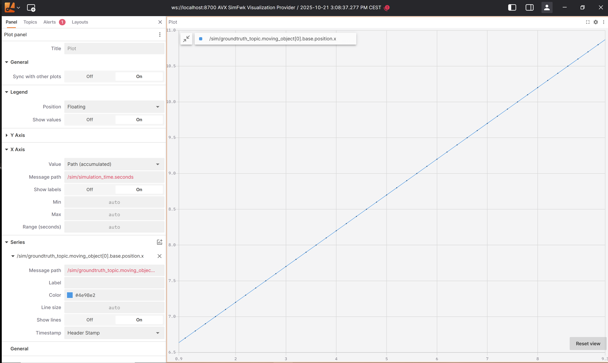
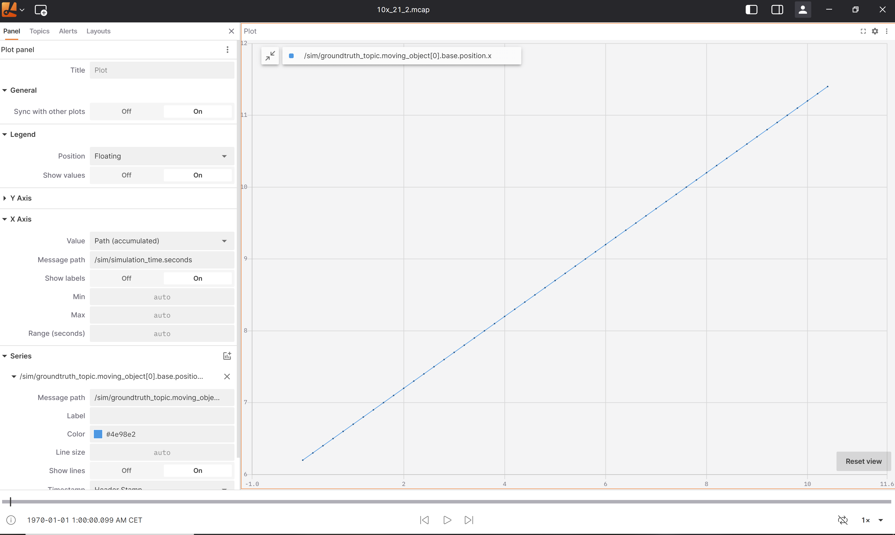

# Install Simulation Framework

For detailed instructions, refer to the **installation** guide.

# Environment dependencies

If you install Simulation Framework locally in `ubuntu 24.04 machine` or inside `ubuntu 24.04 VM` , all build and runtime dependencies will be installed during the installation script above. Alternatively, a `Dockerfile` containing all required dependencies is also provided, if you need to build or test in virtual environment for cloud deployment.

## Build dependencies

In Simulation Framework deployment, a bazel `WORKSPACE` is provided as default build system. You can run example or build your own activity application based on that. However, Simulation Framework is not restricted to any build system.

| Type                                | Name                            | Version | Source                                                                               |
| ----------------------------------- | ------------------------------- | ------- | ------------------------------------------------------------------------------------ |
| Compiler                            | GCC/G++                         | 11      | add-apt-repository -y ppa:ubuntu-toolchain-r/test &&% apt-get install gcc-11 g++-11  |
| Build System (default)              | Bazelisk                        | v1.5.0  | <https://github.com/bazelbuild/bazelisk/releases/download/v1.5.0/bazelisk-linux-amd64> |
| Ubuntu (Noble Numbat 24.04) Package | Build Essential                 | latest  | apt-get install build-essential                                                      |
| Ubuntu (Noble Numbat 24.04) Package | software-properties-common      | latest  | apt-get install software-properties-common                                           |
| Ubuntu (Noble Numbat 24.04) Package | Manual pages                    | latest  | apt-get install manpages-dev                                                         |
| Ubuntu (Noble Numbat 24.04) Package | Cartographic projection library | latest  | apt-get install proj-bin                                                             |
| Ubuntu (Noble Numbat 24.04) Package | Zlib library                    | latest  | apt-get install zlib1g-dev                                                           |
| Ubuntu (Noble Numbat 24.04) Package | ZSTD library                    | latest  | apt-get install libzstd-dev                                                          |

## System requirement

Depending on how complex your simulation is, you might need different recommended CPU/memory resources.
For execution of the [reference simulation](#reference-simulation), following requirements shall be considered:

| Environment       | recommended. CPU           | recommended. Memory | recommended. Disk Space |
| ----------------- | -------------------------- | ------------------- | ----------------------- |
| Workstation or VM | 2.5 GHz processor, 4 cores | 8GB                 | 30 GB                   |
| k8s Cluster       | 300m                       | 400Mi               | 30 GB                   |

# Run example

Within the deployment, an example code is provided to show how to use APIs of Simulation Framework and how to do customization.
Before running the example, please make sure you have valid license setup and be able to connect with Ansys License Manager. More hint please see [setup License](setup_license.md)

```bash
cd simulation_framework/example
./my_activity/run.sh
```

This script compiles automatically the example `my_activity` and triggers the simulation using `my_activity` by means of [command line tool](command_line_tool.md) provided by Simulation Framework. It provides a basic example using bazel to show how Simulation Framework is used as lib. If the test works, you should see some simulation logs and then the evaluated `min_ttc` result in json format prints in console.

# Built-in and default standalone Activities

The autonomy `simfwk_cli` stands as an exemplary application constructed with the Simulation Framework library, offering four predefined activities as references. Users have the flexibility to use these activities to initiate the default simulation application or seamlessly integrate them into a customized simulation. These activities, implemented in the `simfwk-autonomy`, can be selected as `built-in` activities based on their specified `type` in the configuration, contributing to the adaptability of the simulation at any given point. Details about config please refer to [schedule your simulation](simulation_scheduling.md).

| Activity Description             | Type       | Name in Simulation Config        | Publish Topic(s)   | Subscribe Topic(s) |
| -------------------------------- | ---------- | -------------------------------- | ------------------ | ------------------ |
| Foxglove Activity                | built-in   | "foxglove_activity"              | SensorViewTopic    | N/A                |
| GroundTruth Generator            | built-in   | "groundtruth_generator_activity" | SensorViewTopic    | TrafficUpdateTopic |
| Mcap Trace Writer                | built-in   | "mcap_writer_activity"           | SensorViewTopic    | N/A                |
| GroundTruth KPI Evaluator        | built-in   | "kpi_evaluator_activity"         | KpiLoggerTopic     | SensorViewTopic    |
| Default KPI Logger               | built-in   | "kpi_logger_activity"            | N/A                | KpiLoggerTopic     |
| Dummy TPM Model                  | built-in   | "dummy_tpm_activity"             | TrafficUpdateTopic | SensorViewTopic    |
| Dummy Driver Model               | built-in   | "dummy_driver_activity"          | DriverInputTopic   | SensorViewTopic    |
| Standalone GroundTruth Generator | standalone | "standalone_gt_gen_activity"     | SensorViewTopic    | TrafficUpdateTopic |
| Vehicle Model                    | built-in   | "vehicle_activity"               | TrafficUpdateTopic | SensorViewTopic, MotionRequestTopic |
| Esmini                           | built-in   | "esmini_activity"                | SensorViewTopic    | TrafficUpdateTopic |

The table above illustrates the names of default activities provided in the Simulation Framework Autonomy package, their type and configuration name strings, the topics they publish and subscribe to.

These built-in activities are provided within the Simulation Framework Autonomy binary, and their source code is not included. The exception is the source code for the KPI implementation used by the KPI Evaluator. This implementation provides four KPIs: `min_ttc`, `predictive_min_ttc`, `driven_dist` and `collision_detector`. They are based on a simple generic mathematical model and are included in the package under `./include/autonomy/evaluator`. Please verify the logic and use the default KPI Evaluator at your own risk.

## Ideal Sensors and Fusion

Simulation Framework Autonomy can also run *ideal* sensor and sensor-fusion logic (using OSI protobuf messages) by enabling these built-in activities in your scheduler config:

- *Ideal sensors*: any built-in activity that defines `sensor_parameters` (detected by the presence of the `sensor_parameters` object). The activity `name` can be chosen freely by you; the behavior is driven by `sensor_parameters.sensor_type` (`"radar"` / `"camera"`) and the referenced FoV config.
  - `"radar"`: emits only moving objects and stationary objects within the FoV.
  - `"camera"`: emits moving objects, stationary objects, traffic signs/lights, road markings, lane centerlines, and lane boundaries within the FoV.
- `osi_sensor_data_fusion_activity` (fusion activity name is fixed): fuses multiple sensor outputs into a single topic using `fusion_parameters.fusion_logic`.

### Overview

The ideal sensor activities run a FoV pipeline in the sensor frame: they apply a geometric frustum (range, azimuth, elevation) to decide which ground-truth geometry is inside the FoV, then emit the corresponding OSI `SensorData`. Depending on `sensor_type`, different OSI categories are enabled (for example, lane centerlines and lane boundaries are enabled for `camera`, while `radar` only emits moving and stationary objects).

FoV generation also includes an automatic resampling step for sparse polylines: if a lane centerline / lane-boundary polyline has a GT point count between 2 and 4 (inclusive), the activity interpolates along each polyline edge with an approximately fixed XY step size (the goal is to increase in-FoV point density). For performance and correctness, each edge is clipped to its in-FoV span before sampling, so out-of-FoV portions are skipped and only in-FoV points are emitted.

After the FoV-based emission, `sensor_parameters.post_processing_in_sequence` may further post-process the produced lane data (for example):
- `merge_host_lane_context_by_junction_depth`: merges lane-context information across junctions up to a configured depth.
- `sort_lane_boundaries_in_order`: sorts `SensorData::lane_boundary` left-to-right relative to each host lane using lane-topology (far-left border, 3rd-left, 2nd-left, immediate-left, host-left, host-right, immediate-right, 2nd-right, 3rd-right, far-right border), while de-duplicating boundary IDs.

The fusion activity then combines the emitted `SensorData` streams according to the configured fusion logic (currently only `fusion_logic: "by_object_id"` in the reference setup), producing the final fused `SensorData` topic.

In `by_object_id`, the fusion:
- collects the latest input `SensorData` per input topic,
- uses the `sensor_view` from the first valid input as a template,
- merges detections while de-duplicating objects by `header.ground_truth_id[0]`,
- transforms object / lane geometry from each input sensor frame into the **host/ego frame** using each input `mounting_position` + `mounting_orientation`.

If the input sensors provide different timestamps, a warning may be emitted and the fused result may be invalid.

### Where to look in the source code

> [!IMPORTANT]
> The “ideal” sensor and fusion activities are reference implementations. Before relying on their outputs in your setup, you must inspect and understand the exact source logic (FoV filtering, interpolation/clipping, post-processing, and fusion frame/timestamp assumptions) and validate that it matches your expectations and data.

For a white-box understanding of the exact FoV and fusion behavior, start from:

- FoV / resampling logic: `autonomy/sensors/fov/field_of_view.cpp` (and related helpers in `autonomy/sensors/fov/internal/`)
- Ideal sensor activity wiring: `autonomy/simulation/sim_activities/generic_sensor_activity/generic_sensor_activity.h` (+ `.cpp`)
- Fusion logic: `autonomy/sensors/fusion/simple_fusion_by_object_id.h` (+ `.cpp`)
- Fusion activity wiring: `autonomy/simulation/sim_activities/osi_sensor_data_fusion_activity/osi_sensor_data_fusion_activity.h` (+ `.cpp`)

### Example configurations

For ready-to-use example configs, see:

- `bin/solver_setting_configuration_sensors_and_fusion.json` (activity names + wiring)
- `data/sensor_configs/camera_fov_config.json` and `data/sensor_configs/radar_fov_config.json` (FoV parameter examples shipped with the package)

#### How to configure the ideal sensors

In `solver_setting_configuration_sensors_and_fusion.json`, the ideal sensor activities live under:

- `simulation_scheduling.activities[]` entries that define `sensor_parameters` (with `sensor_type` = `"radar"` or `"camera"`). The activity `name` can be chosen freely by you; the behavior is driven by `sensor_parameters`.

Each ideal sensor activity supports:

- `sensor_parameters.sensor_type`: chooses the ideal sensor type name (`"radar"` or `"camera"`). This controls which OSI categories are enabled inside the FoV:
  - `"radar"`: moving objects + stationary objects only
  - `"camera"`: moving objects + stationary objects + traffic signs/lights + road markings + lane centerlines + lane boundaries
- `sensor_parameters.publish_topic_name`: the OSI topic where the activity publishes its `SensorData`/lane/lane-boundary outputs.
- `sensor_parameters.fov_config_file`: generic FoV sensor specs for given sensor:
  - sensor pose in the host frame: `mounting_position.{x,y,z}` and `mounting_orientation.{yaw_degree,pitch_degree,roll_degree}`
  - frustum limits: `min_range_meter`, `max_range_meter`, `horizontal_fov_degree`, `vertical_fov_degree`
  - `sensor_id` written into the generated sensor output
- `sensor_parameters.post_processing_in_sequence`: optional lane post-processing applied after FoV filtering/resampling:
  - `merge_host_lane_context_by_junction_depth` (integer): increases/decreases how much lane context is merged across junction depth.
  - `sort_lane_boundaries_in_order` (boolean): sorts `lane_boundary` left-to-right relative to each host lane using lane topology (border → 3rd-left → 2nd-left → immediate-left → host-left → host-right → immediate-right → 2nd-right → 3rd-right → border), de-duplicating boundary IDs.

When `post_processing_in_sequence` is empty (`{}`), the output is produced directly from FoV filtering + (optional) polyline resampling.

#### How to configure fusion

In the same config, `osi_sensor_data_fusion_activity` supports:

- `depends_on`: which sensor activities provide the input streams.
- `fusion_parameters.publish_topic_name`: the OSI topic where fused `SensorData` is published.
- `fusion_parameters.fusion_logic`:
  - `"by_object_id"`: merges inputs that refer to the same OSI object id (i.e., object-level fusion).

#### Minimal JSON snippet

```json
{
  ...
  "simulation_scheduling": {
    "activities": [
      {
        "name": "ideal_camera_sensor_activity",
        "depends_on": ["groundtruth_generator_activity"],
        "type": "built-in",
        "sensor_parameters": {
          "sensor_type": "camera",
          "publish_topic_name": "IdealCameraSensorTopic",
          "fov_config_file": "data/sensor_configs/camera_fov_config.json",
          "post_processing_in_sequence": {
            "merge_host_lane_context_by_junction_depth": 1,
            "sort_lane_boundaries_in_order": true
          }
        }
      },
      {
        "name": "ideal_radar_sensor_activity",
        "depends_on": ["groundtruth_generator_activity"],
        "type": "built-in",
        "sensor_parameters": {
          "sensor_type": "radar",
          "publish_topic_name": "IdealRadarSensorTopic",
          "fov_config_file": "data/sensor_configs/radar_fov_config.json",
          "post_processing_in_sequence": {}
        }
      },
      {
        "name": "osi_sensor_data_fusion_activity",
        "depends_on": ["ideal_radar_sensor_activity", "ideal_camera_sensor_activity"],
        "type": "built-in",
        "fusion_parameters": {
          "publish_topic_name": "SensorDataTopic",
          "fusion_logic": "by_object_id"
        }
      }
    ]
  }
}
...
```

## Foxglove Activity

This activity supports visualization by starting a Foxglove websocket server on a default host and port.
A `Lichtblick Client(A Visualization Tool)` can connect to the server and consume OSI groundtruth data via a streaming websocket in order to visualize.
The default host and port used are `localhost:8679`. The host and port can be configured by the user by setting values as given in
`Enabling Visualization using Lichtblick` section.

### Enabling Visualization using Lichtblick/Foxglove

The user needs to add the below config setting json node as a child of `simulation_scheduling` in the `solver_setting_configuration.json` in order to enable visualization using Lichtblick/Foxglove Studio.

**Supported OSI Topics:**

- `SensorViewTopic` - Ground truth data (publishes to `/sim/groundtruth_topic`)
- `MotionRequestTopic` - Motion request data (publishes to `/sim/motion_request_topic`)
- `SensorDataTopic` - Sensor data (publishes to `/sim/sensor_data_topic`)
- `TrafficUpdateTopic` - Traffic update data (publishes to `/sim/traffic_update_topic`)
- `TrafficCommandTopic` - Traffic command data (publishes to `/sim/traffic_command_topic`)
- `KpiLoggerTopic` - KPI metrics (publishes to `/kpi/driven_distance`)

```json
  "foxglove":
  {
    "data_streaming": true,
    "host_name": "localhost",
    "port": 8700,
    "data_metric":[
            {
                "topic_name": "SensorViewTopic"
            },
            {
                "topic_name": "MotionRequestTopic"
            },
            {
                "topic_name": "SensorDataTopic"
            },
            {
                "topic_name": "TrafficUpdateTopic"
            },
            {
                "topic_name": "TrafficCommandTopic"
            },
            {
                "topic_name": "KpiLoggerTopic"
            }
    ]
  },
```

**Note:** You can subscribe to any combination of the supported topics based on your visualization needs. All topics use OSI protobuf format except `KpiLoggerTopic` which uses JSON format.

### Visualization Plots for GroundTruth wrt time from GroundTruth using Lichtblick

**Using live streaming:**

- Run simulation using any scale factor with `data_streaming` set to `true` and topic_name set to `SensorViewTopic` in `solver_setting_configuration.json` file.
- Select `Open a Connection` at `localhost:8700` in Lichtblick.
- Set any field to plot for y-axis from the /sim/groundtruth_topic
- Set seconds from /sim/simulation_time on the x-axis.
    Refer settings at 
- The plot will be drawn if the simulation has not ended yet.

**Using MCAP file:**

- Run simulation using any scale factor with `save_mcap` set to `true` and topic_name set to `SensorViewTopic` in `solver_setting_configuration.json` file.
- Select `Open a local file` created in the previous step in Lichtblick.
- Set any field to plot for y-axis from the /sim/groundtruth_topic
- Set seconds from /sim/simulation_time on the x-axis.
    Refer settings at 
- The plot will be drawn for the mcap file selected.

## GroundTruth Generator (GT Gen)

GT Gen serves as the default world simulator in Autonomy and provides ground truth information for the entire simulation based on input `OpenScenario` and `OpenDRIVE` files. Depending on the configuration, it can operate in two modes: `ExternalMovement` and `InternalMovement`.

- **InternalMovement**: This open-loop mode provides simulation ground truth based on a predefined trajectory in the open scenario and map.
- **ExternalMovement (Closed-loop)**: This mode receives `TrafficUpdate` from an external driver and follows its movement commands for closed-loop behavior.

### Subscribing to OSC Variable References

GT Gen can optionally subscribe to `ScenarioVariableTopic` to receive dynamic variable updates during simulation. This feature enables runtime control of OpenScenario variable conditions (e.g., `CarSpeedChangeCondition`) from external activities. To enable this feature, add the `enable_external_scenario_variables` parameter to the `groundtruth_generator_activity` configuration:

```json
{
    "activities": [
        {
            "name": "groundtruth_generator_activity",
            "is_primary_activity": true,
            "enable_external_scenario_variables": true,
            "type": "built-in"
        }
    ]
}
```

When enabled, GT Gen will subscribe to `ScenarioVariableTopic` and update simulation variables based on messages received from publishers. The default value is `false` if the parameter is not specified.

## Mcap Trace Writer

This activity writes the GroundTruth (OSI) data into a trace file in MCAP format. After the simulation finishes successfully, the trace file `simout_trace.mcap` will be available in the specified output directory.
To enable creation of the trace file, user needs to add and enable the below field `save_mcap` as below in the config `solver_setting_configuration.json`.

```json
{
    "sim_instance_name": "gt_gen_with_driver_and_kpi_logger",
    "foxglove":
    {
        "data_streaming": true,
        "host_name": "localhost",
        "port": 8700
    },
    "save_mcap": true,
    "activities": [
        {
            "name": "groundtruth_generator_activity",
            "is_primary_activity": true,
            "topics_cycling_info": [
                {
                    "topic_id": "__all__",
                    "topic_cycle_time_in_ms": 50
                }
            ],
            "type": "built-in"
        },
        {
            "name": "driver_model_activity",
            "depends_on": [
                "groundtruth_generator_activity"
            ],
            "type": "built-in"
        },
        {
            "name": "kpi_evaluator_activity",
            "depends_on": [
                "groundtruth_generator_activity"
            ],
            "type": "built-in"
        },
        {
            "name": "kpi_logger_activity",
            "depends_on": [
                "kpi_evaluator_activity"
            ],
            "type": "built-in"
        }
    ]
}
```

## Dummy TPM Model

The Dummy Traffic Participant (TPM) model uses the ground truth information generated by GT Gen to control the host vehicle's movement. It relies on a simple mathematical model to publish `TrafficUpdateTopic`.

## Dummy Driver Model

The Dummy Driver Model mimics driver behavior based on GroundTruth and publishes a driver input topic that contains log data (in KPI format) of the driver's behavior.

## Standalone GroundTruth Generator

The Standalone GroundTruth Generator functions similarly to the built-in GroundTruth Generator. The difference is that it is a separate executable using the Simulation Framework standalone activity service.

### Command-Line Options

The standalone GT Gen activity supports the following command-line options:

- `--subscribe-scenario-variable`: Enable subscriber for `ScenarioVariableTopic`. When this flag is set, the standalone activity will subscribe to variable reference messages and update simulation variables dynamically during runtime. This is useful for controlling OpenScenario variable conditions from external activities.

Example usage:

```bash
./standalone_gt_gen_activity --subscribe-scenario-variable
```

To view all available options:

```bash
./standalone_gt_gen_activity --help
```

## Vehicle Model Activity

The single-track (also called bicycle) kinematic model is a low-order vehicle representation commonly used for path tracking and motion planning where lateral and yaw dynamics are dominant but high-frequency tire dynamics can be neglected. It is compact, computationally cheap, and suitable for control and simulation.

It is modelled as a builtin `vehicle_activity` within Simulation Framework.

This activity needs `osi3::MotionRequest` and `osi3::SensorView` messages and will output `osi3::TrafficUpdate`.

Files needed by this activity:

- `config_file` — a vehicle configuration (controller gains, geometry and limits).

### Example vehicle configuration

An example test vehicle configuration:

```json
{
    "vehicle_name": "test_vehicle",
    "single_track": {
        "lf": 1.234,
        "lr": 1.234
    },
    "limits": {
        "max_acceleration": 8,
        "max_steering_angle": 0.654,
        "min_acceleration": -8,
        "min_steering_angle": -0.654
    },
    "controller_tuning": {
        "restrictions": {
            "r_jerk": 0.1,
            "r_steering": 2.0
        },
        "sensitivity": {
            "s_jerk": 0.1,
            "s_lat": 0.1,
            "s_lon": 0.1,
            "s_steering": 0.1,
            "s_vel": 0.1,
            "s_yaw": 0.1
        },
        "tracking": {
            "q_lat": 80,
            "q_lon": 100,
            "q_vel": 2000,
            "q_yaw": 2000
        },
        "optimisation": {
            "max_iterations": 50,
            "prediction_horizon_steps": 5
        }
    }
}

```

### States and Inputs

States (motion state):

- x, y — global position of the vehicle reference point (usually centre of gravity).
- psi — vehicle yaw (orientation).
- v — absolute longitudinal speed.

Inputs:

- a — longitudinal acceleration (control input).
- $\delta_f$ — steering angle at the front wheel (control input).

We define the input vector u = [a, $\delta_f$].

### Model Equations

The continuous-time kinematic single-track model in activity is:

$$
\begin{aligned}
\dot{x} &= v \cdot \cos(\psi + \beta_{CG})\\
\dot{y} &= v \cdot \sin(\psi + \beta_{CG})\\
\dot{\psi} &= \frac{v}{lr} \cdot \sin(\beta_{CG})\\
\dot{v} &= a\\
\end{aligned}
$$

where the slip angle at the centre of gravity is defined as: $$\beta_{CG} = \arctan\left(\frac{lr}{lf+lr}\cdot \tan(\delta_f)\right)$$

Here $l_f$ and $l_r$ are the longitudinal distances from the centre of gravity to the front and rear axles respectively. The implementation in `vehicle_activity` uses these parameters from the vehicle configuration.

##### Controller: cost and tuning

The controller implemented with the single-track model that minimizes a weighted nonlinear least-squares cost:

$$
C(\boldsymbol{x}, \boldsymbol{u}) = \frac{1}{2} \sum_{i} W_i \left( y_i(\boldsymbol{x}, \boldsymbol{u}) - y_{i,\mathrm{ref}} \right)^2
$$  

Here, $C(\boldsymbol{x}, \boldsymbol{u})$ represents the weighted mean square error between the predicted outputs $\boldsymbol{y}(\boldsymbol{x}, \boldsymbol{u})$ and the reference outputs $\boldsymbol{y_{\mathrm{ref}}}$. Each term in the summation is scaled by a weight $W_i$, which adjusts the importance of minimizing the error for the corresponding output component $y_i$.

$W_i = Q_i / (S_i * S_i)$

This cost drives the predicted outputs (typically motion states x, y, $\psi$, v) towards a reference trajectory provided by the motion planner.

### Controller Gains to minimise cost function

- Tracking (`Q`) : The `Q` gains adjust the controller's tracking accuracy for respective motion state properties (`q_<property>`). Larger `Q` values result in higher accuracy and more aggressive minimization of tracking errors.
- Sensitivity (`S`) : The `S` gains control the sensitivity of the controller to changes in respective motion state properties (`s_<property>`). Smaller `S` values make the controller more sensitive to incremental/decremental changes.
- Restrictions (`R`) : The `R` gains limit the aggressiveness of the vehicle model inputs, such as the rate of change of acceleration. Smaller `R` values allow more aggressive behavior.

Please note that `s_jerk` and `s_steering` control the sensitivities for restrictions `r_jerk` and `r_steering` respectively.

### Optimization Parameters

The optimization parameters control the solver behavior. The controller predicts its next state by considering its current state and possible future states which is sent as a list of points via motion planner to controller.

**`prediction_horizon_steps`**: Determines how far into the future the controller considers when making decisions. Larger values result in more comprehensive predictions but may slow down the simulation. This value should always be greater than 1.

**`max_iterations`**: Specifies the maximum number of iterations the solver can perform. This parameter ensures the solver has enough time to find a solution in worst-case scenarios and is generally not expected to be modified.

```json
    "controller_tuning": {
        "restrictions": {
            "r_jerk": 0.1,
            "r_steering": 2.0
        },
        "sensitivity": {
            "s_jerk": 0.1,
            "s_lat": 0.1,
            "s_lon": 0.1,
            "s_steering": 0.1,
            "s_vel": 0.1,
            "s_yaw": 0.1
        },
        "tracking": {
            "q_lat": 80,
            "q_lon": 100,
            "q_vel": 2000,
            "q_yaw": 2000
        },
        "optimisation": {
            "max_iterations": 50,
            "prediction_horizon_steps": 5
        }
    }
```

### Example of using vehicle_activity in simulation framework

An example simulation configuration to use the builtin `vehicle_activity`:

```json
{
  "simulation_parameters": {
    "input_open_scenario": "<path to scenario>",
    "input_user_settings": "<path to user settings>",
    "output_directory": "sim_output",
    "job_id": "vehicle_activity_example"
  },
  "simulation_scheduling": {
    "sim_instance_name": "vehicle_activity_example",
    "activities": [
      {
        "name": "groundtruth_generator_activity",
        "is_primary_activity": true,
        "topics_cycling_info": [
          {
            "topic_id": "__all__",
            "topic_cycle_time_in_ms": 100
          }
        ],
        "type": "built-in"
      },
      {
        "name": "dummy_motion_planner",
        "depends_on": [
          "groundtruth_generator_activity"
        ],
        "type": "standalone"
      },
      {
        "name": "vehicle_activity",
        "depends_on": [
          "dummy_motion_planner"
        ],
        "type": "built-in",
        "vehicle_activity_settings": {
          "config_file": "path_to/test_vehicle.json"
        }
      }
    ]
  }
}

```

## esmini — Environment Simulator Minimalistic

### Overview

- esmini is a lightweight OpenSCENARIO runtime (OpenSCENARIO XML v1.0–v1.3, limited coverage) designed to simulate environment actors and scenarios.
- In this framework it is integrated as an built-in activity module and can be used as an alternative ground-truth generator to **[GT-Gen](gt_gen_and_road_logic_suite.md)** .

### Quick highlights

- Supports OpenSCENARIO XML v1.0–v1.3 (feature coverage is partial and evolves), please refer [here](https://github.com/esmini/esmini/blob/master/osc_coverage.txt) for coverage details.

### How to configure esmini as an activity within Simulation Framework

```json
{
  "simulation_parameters": {
    "input_open_scenario": "../path/to/scenario/simple_cut_in.xosc",
    "output_directory": "sim_output",
    "job_id": "esmini_example"
  },
  "simulation_scheduling": {
    "sim_instance_name": "esmini_instance",
    "activities": [
      {
        "name": "esmini_activity",
        "is_primary_activity": true,
        "topics_cycling_info": [
          {
            "topic_id": "__all__",
            "topic_cycle_time_in_ms": 100
          }
        ],
        "type": "built-in"
      },
      {
        "name": "dummy_tpm_activity",
        "depends_on": ["esmini_activity"],
        "type": "built-in"
      },
      {
        "name": "kpi_evaluator_activity",
        "depends_on": ["esmini_activity"],
        "type": "built-in"
      },
      {
        "name": "kpi_logger_activity",
        "depends_on": ["kpi_evaluator_activity"],
        "type": "built-in"
      }
    ]
  }
}

```

In this example `esmini_activity` is used as the main GroundTruth Data Generator which is producing osi::Sensorview, the host within simulation is controlled via `dummy_tpm_activity`. KPIs are evaluated and logged using `kpi_evaluator_activity` and `kpi_logger_activity`.

## Important features supported by this activity

```json
       {
                "name": "esmini_activity",
                "is_primary_activity": true,
                "topics_cycling_info": [
                    {
                        "topic_id": "__all__",
                        "topic_cycle_time_in_ms": 100
                    }
                ],
                "enable_external_scenario_variables": true,
                "disable_ctrls": true,
                "control_mode":"STANDARD",
                "max_longitudinal_distance" : 20.0,
                "max_lateral_deviation" : 0.05,
                "crop_gt_radius": 50.0,
                "type": "built-in"
            },
```

- `disable_ctrls` when true all external control is disabled to make esmini behave like gtgen when its control is with purely InternalController. If this is set to false (or in default case), esmini expects osi3::TrafficUpdate to control it

- `control_mode` configures how esmini accepts external control (only effective when `disable_ctrls` is `false`):
  - `STANDARD`value enables control via `osi3::TrafficUpdate` messages (default).
  - `SIMPLE_VEHICLE_MODEL` enables control via `autonomy::communication::messages::VehicleControlInputMsg` messages.
    Esmini listens for `VehicleControlInputMsg` messages published on the `VehicleControlInputTopic` and applies commands to a vehicle in the scenario. Three control modes are supported:

    - `ACC_N_STEER` — provide acceleration (m/s^2) and steering angle (radians).
    - `ANALOG` — provide continuous throttle and steering values. [-1.0,1.0].
    - `BINARY` — provide discrete throttle/steering steps (-1, 0, 1).

    The message used to control a vehicle is defined in `autonomy/communication/messages/vehicle_control_input_msg/vehicle_control_input_msg.h`

    - BINARY
      - `control_mode = VehicleControlMode::BINARY`
      - `throttle` and `steering` use the `int` variant. Values are limited to -1, 0, 1.

    - ANALOG
      - `control_mode = VehicleControlMode::ANALOG`
      - `throttle` and `steering` use the `double` variant.
      - Throttle is a continuous value between [-1, 1], -1 being full brake and 1 being full throttle, 0 being not applied. Steering is expected in the range [-1, 1] (normalized steering command) -1 is full left and 1 is full right.

    - ACC_N_STEER
      - `control_mode = VehicleControlMode::ACC_N_STEER`
      - `throttle` should be a `double` representing desired acceleration in m/s^2.
      - `steering` should be a `double` representing steering angle in radians.

    Detailed usage of this mode is mentioned in example `examples/autonomy/external_vehicle_control`

  - `SPEED_ONLY_CONTROL` enables control via `autonomy::communication::messages::ObjectSpeedInputMsg` messages.
    Esmini listens for `ObjectSpeedInputMsg` messages published on the `ObjectSpeedInputTopic` and calls `SE_ReportObjectSpeed` to directly set the speed of a scenario object.
    The message contains:
      - `object_id` (uint64_t) — the identifier of the controlled object.
      - `speed` (double, m/s, must be >= 0) — the desired speed to report to esmini.

    The message is defined in `autonomy/communication/messages/object_speed_input_msg/object_speed_input_msg.h`

    This mode is useful when you only need to control the longitudinal speed of an object without full position or vehicle model control.


- `enable_external_scenario_variables` when true , esmini will subscribe to ScenarioVariableTopic for scenario variable manipulation.

- `max_longitudinal_distance` Maximum distance between OSI points in longitudinal direction default : 20.0

- `max_lateral_deviation` Maximum distance between OSI points in lateral direction. It controls the resolution during curvature default : 0.05

- `crop_gt_radius` Radius in meters around the host vehicle used to crop the GroundTruth. Objects (moving objects, stationary objects, traffic signs, traffic lights, road markings), lanes, and lane boundaries outside this radius are removed from the published `SensorView`. A value of `0.0` (default) disables cropping. **Smart lane preservation**: the host vehicle's current lanes and their adjacent (left/right) neighbours are always kept regardless of distance, ensuring the ego's immediate driving context is never discarded.

### Host Vehicle Determination

`GroundTruth::host_vehicle_id` is populated in the OSI output. Esmini assigns "host_vehicle_id"  to the entity whose **`<Private>` action block appears first in the `<Init>` section** of the OpenSCENARIO file — not necessarily the first `<ScenarioObject>` in `<Entities>`.

> **Action required:** Always place the intended ego vehicle's `<Private>` block **first** in `<Init>`. 

> **Pre-2026R1-SP01 behaviour:** The same `<Init>`-order rule governed esmini's internal entity index 0, and `host_vehicle_id` was written to `0`, i.e. first object in the scenarioobject list.


### OSI Source Reference Format (esmini v2.60.0+)

Since esmini v2.60.0, `MovingObject::source_reference` is pre-populated by esmini with three identifiers:

| Index | Content                        | Example                |
|-------|--------------------------------|------------------------|
| `[0]` | `"entity_id:<scenario_index>"` | `"entity_id:0"`        |
| `[1]` | `"entity_type:<type>"`         | `"entity_type:Vehicle"`|
| `[2]` | `"entity_name:<name>"`         | `"entity_name:Ego"`    |

The `esmini_activity` normalises this to the **2-identifier format** defined by the [OSI `source_reference` specification](https://opensimulationinterface.github.io/osi-antora-generator/asamosi/latest/gen/structosi3_1_1MovingObject.html#a28102f7b1679219e151881c74c716073) for OpenSCENARIO-derived objects (`type = "net.asam.openscenario"`):

| Index | OSI field      | Content |
|-------|----------------|---------|
| `[0]` | `identifier[0]`| Entity type: `"Vehicle"`, `"Pedestrian"`, `"Animal"`, `"Other"`, or `"Unknown"` |
| `[1]` | `identifier[1]`| Entity name as defined in the OpenSCENARIO `Entities` block |

> **Note (pre-v2.60.0 behaviour):** In earlier esmini versions, `source_reference` was not pre-filled, and the entity name had to be retrieved via the esmini C API (`SE_GetObjectName`). That fallback has been removed — the adapter now exclusively reads from `source_reference[2]`. If the identifier is absent or malformed, a warning is logged and the name field is left empty.

##### References

- esmini User Guide: <https://esmini.github.io>
- esmini Inner Workings: <https://github.com/esmini/esmini/blob/master/docs/InnerWorkings.md>
- esmini repository: <https://github.com/esmini/esmini>

## GroundTruth KPI Evaluator

The KPI Evaluator calculates four KPIs based on GroundTruth:

- **`min_ttc`**: The minimum time to collision during the simulation. If the value is zero, it indicates a critical collision occurred during the simulation.
- **`predictive_min_ttc`**: The minimum time to collision during the simulation, considering the predictive movement of vehicles. If the value is zero, it indicates a critical collision occurred during the simulation.
- **`driven_dist`**: The total distance driven by the ego vehicle during the simulation.
- **`collision_detector`**: Records the first collision event(s) in the scenario. If no collision occurred, the `value` field is `{}`. When present, `value` contains per-entity collision statistics. Typical fields and meanings:

  - `impact_location`: NOT IMPLEMENTED - percentage overlap of collided entity with host width
  - `v_impact`: host speed at time of collision (m/s).
  - `v_rel_impact`: relative speed between host and the other object at impact (m/s).
  - `v_impact_reduction_stats`: object with details about braking/impact mitigation:
    - `t1`: time (seconds) when the host started actual deceleration; `-1.0` if deceleration never occurred.
    - `t2`: time (seconds) when deceleration was insufficient to avoid the collision; `-1.0` if not applicable.
    - `total_v_impact_reduction`: total speed reduction achieved before impact (m/s).

    Note: The example in below section shows a case where the host collided with two objects simultaneously, and both collisions are recorded, one did reduce its speed other did not.

To add more KPIs to the simulation, please refer to the [customized KPI chapter](../user-guide/customized_kpi_evaluator.md).

## Default KPI logger

The KPI logger captures the evaluated KPI data in `KpiLoggerTopic`, sent from KPI Evaluator, and stores them in JSON output for analyzing your simulation later. If you use the default `GroundTruth KPI Evaluator`, the final KPI file `kpi_results.json` could consist of the following fields:

```json
{
    "driven_dist": {
        "datatype": "double",
        "latest_timestamp_in_ms": 4000,
        "unit": "m",
        "value": 4.0
    },
    "min_ttc": {
        "datatype": "double",
        "latest_timestamp_in_ms": 4000,
        "unit": "ms",
        "value": 9.223372036854776e18
    },
    "predictive_min_ttc": {
        "datatype": "double",
        "latest_timestamp_in_ms": 4000,
        "unit": "ms",
        "value": 9.223372036854776e18
    },
    "collision_detector": {
        "datatype": "json",
        "latest_timestamp_in_ms": 41900,
        "unit": null,
        "value": {
            "1": {
                "self_collision_stats": [
                    {
                        "TrafficVehicle2": {
                            "impact_location": -1.0,
                            "v_impact": 11.0,
                            "v_impact_reduction_stats": {
                                "t1": 40.0,
                                "t2": 41.9,
                                "total_v_impact_reduction": 2.8888999999999996
                            },
                            "v_rel_impact": 11.0
                        }
                    },
                    {
                        "TrafficVehicle1": {
                            "impact_location": -1.0,
                            "v_impact": 13.8889,
                            "v_impact_reduction_stats": {
                                "t1": -1.0,
                                "t2": -1.0,
                                "total_v_impact_reduction": 0.0
                            },
                            "v_rel_impact": 13.8889
                        }
                    }
                ]
            }
        }
    }
}
```

## How to safely utilize the KPI logger

As outlined above, the KPI logger subscribes to KPI messages and records them in a JSON file. To effectively use the KPI logger, follow these steps:

1. Set dependency on KPI evaluator
   In your simulation configuration, ensure that you set a dependency on the KPI evaluator. This KPI evaluator can be sourced from the reference simulation or a customized one. Once this dependency is established, the logger will capture all KPI messages.

2. Caution regarding dependency
   It is crucial to note that the KPI logger can operate independently, allowing you to run simulations without the KPI evaluator dependency. However, be mindful that doing so may result in incomplete logging. Running simulations using logger and evaluator in different frequencies may lead to the omission of certain KPI values. Exercise caution, as this could mean overlooking critical KPI information during the simulation.

3. Understanding potential hazards
   When running the simulation without the specified dependency, be aware that not all KPI values will be logged, if logger and evaluator run in different frequencies. Hence, some KPI samples might be neglected. This introduces the hazard of missing essential KPI data, requiring a thorough understanding of the circumstances and the potential impact on your evaluation.

By following these guidelines, you can ensure the safe and effective use of the KPI logger in your simulation. By verifying the field `latest_timestamp_in_ms` into your KPI analysis, you can enhance the reliability of your simulation results and foster a more robust safety protocol for your application.

## Customization

The Simulation Framework Autonomy not only offers users the capability to extend or customize the default simulation setup but also empowers them to bring their own logic into specific activities and seamlessly communicate with other activities through the introduction of new topics. Additionally, users can incorporate new KPIs, which will be automatically logged by the Simulation Framework.

For detailed instructions on implementing and using customized activities, refer to [how to implement and use customized Activity](../user-guide/customized_activity.md). Furthermore, guidance on adding and utilizing customized KPIs can be found in [how to add and use customized KPIs](../user-guide/customized_kpi_evaluator.md).

# Simulation domain ID

The connection between standalone activities, built-in activities and simfwk core is achieved through [RTIDDS communication](https://www.rti.com/products/dds-standard) using the domain ID (in type of uint16). By default, the binaries in the deployment package use the same domain `147` as default and can communicate with each other.

For the use case where you want to customized the domain ID, i.e. to isolate one standalone activity from `simfwk_cli` or want to run two `simfwk_cli` executables in the same machine. for instance, you can adapt the `simfwk_cli` domain ID through environment variable:

```bash
# open new terminal and adapt the Domian ID in this console
export SIMFWK_DDS_DOMAIN_ID=<other_uint16_number>
# then execute simfwk_cli, it will runs in different domain
./simfwk_cli -s <your_solver_setting_config.json>
```

or run one customized activity in different domain rather than default `147`

```bash
# open new terminal and adapt the Domian ID in this console
export SIMFWK_DDS_DOMAIN_ID=407
# then execute simfwk_cli, it will runs in domain 407
./your_customized_activity_executable
```

Note that please be careful to use this feature because two same processes in the same domain might interfere with each other and results in unexpected behavior, e.g. two `simfwk_cli` run in same domain will received events from other and simulation ends up with wrong scheduling or abortion. Please make sure the processes are isolated correctly if you use this feature and no unexpected hidden process running in background within the same domain, while testing your customized activity.

# Troubleshooting

If simulation or setup faced critical error and can not proceed, Simulation Framework will terminate the simulation or throw exceptions with proper messages to indicate a solution or root causes.

## Licensing error

**Unset of `ANSYSLMD_LICENSE_FILE`**

```console
[Licensing] Trying to connect with Ansys License Manager...
[Licensing] environment variable ANSYSLMD_LICENSE_FILE for connection with ALM is not set!
```

**Connection with license server failed**

```console
[Licensing] Trying to connect with Ansys License Manager...
[Licensing] License check with Ansys License Manager at <your-ansys-license-domain> failed! Please verify address or contact customer support!
```

## Path error

**Can not access simulation config**

If one non-existing path to the scheduling config is given or you do not have read permission to this file, simulation cannot be started and raises following error:

```console
[ERROR][Scheduling] ConfigParser: Scheduling config json file does not exist or failed to load: non-existing.json.
terminate called after throwing an instance of 'std::runtime_error'
  what():  [Scheduling] Error in scheduling configuration!
```

## Scheduling error

**Wrong definition in config**
Any wrong definitions, e.g. missing mandatory field or wrongly defined parameter, name or dependency, exception will be thrown immediately.
E.g. If no activity is assigned as `is_primary_activity` in scheduling config, simulation cannot be started and raises following error:

```console
[ERROR][Scheduling] ConfigParser: No Activity is assigned as 'is_primary_activity: true'. One Activity must be assigned as primary activity for simulation.
terminate called after throwing an instance of 'std::runtime_error'
  what():  [Scheduling] Error in scheduling configuration!
```

**Failed connection to activity**

In case one scheduling event was sent from scheduler server of Simulation Framework but an expected feedback is missing, simulation aborts immediately to ensure the deterministic behavior.
This happens usually when running your application with `standalone activity`, where it loses the connection with main process or dead. In that case, you will see this kind of error like following:

```console
[ERROR][Scheduling] Timed out on receiving feedback for Events:
SchedulingEvent with ID 12 at Simulation timestamp: 0 second and 0 nanos
 was sent to my_standalone_activity_simfwk_standalone_activity_service with standalone activity action StandaloneActivityAction::kInit
Please check your network setup towards the standalone activities
Terminating due to an unhandled exception:
    std::runtime_error
    what(): [Scheduling] Timed out on receiving feedback for Events:
```

**Receiving scheduling event from unexpected source**

In case one unexpected event was received by scheduler server, simulation aborts immediately by raising following error:

```console
[ERROR][Communication] Error _Map_base::at was caught or received following feedback for a non-existing event. Probably it already timed-out:
SchedulingFeedback for the Event with ID 11 received and its action result is ActionResult::kSuccess
Executing original terminate handler...terminate called after throwing an instance of 'std::runtime_error'
```

The root cause of this issue could be that the environment where your simulation applicaiont runs does not have enough resouces, e.g. the CPU was stressed or memory is not enough. Other possible reason is that you have another application process built with Simulation Framework running in the same simulation domain. Please refer to the documentation of [Simulation domain ID section in lifecycle](lifecycle.md)

## Communication error

**Multiple publisher for same Topic**

In Simulation Framework, it is not allowed to have more than one publisher on one `Topic`. The identifier is the unique `TopicId` in type string.
If you try to create publishers on same Topic, e.g. on "YourTopic", following error will be raised:

```console
Terminating due to an unhandled exception:
    std::runtime_error
    what(): [Communication] Found one already created Publisher for the Topic <NameOfDuplicatedTopic>. Multiple publishers for same Topic are not allowed!
```

**Used undefined topic**

If you try to use undefined Topic, e.g. "UndefinedTopic", from topic registry (`core/communication/topic_registry.h`) or use one Topic in Activity without registering it in constructor, following error will be raised:

```console
[ERROR][Communication] Topic <UndefinedTopic> is not found in the registry for Activity <ActivityName>
[ERROR][Communication] Concrete Topic instance is required by constructor of Activity or corresponding CommunicationManager.
Terminating due to an unhandled exception:
    std::runtime_error
    what(): [Communication] Undefined Topic.
```

**Missing Publisher/Subscriber for one Topic**

To optimize simulation load, the system does not permit starting a simulation if an activity publishes a topic that lacks a subscriber. Before the simulation begins, the system checks for matching publishers and subscribers. A default timeout of 10 seconds is applied during this check. If no subscriber is found within this period, the system will throw an exception to indicate the failure.

```console
...
[DEBUG][Communication] Awaiting subscriber match for topic 'NoSubscriberTopic' (timeout: 10000 ms)
[DEBUG][Communication] Awaiting subscriber match for topic 'NoSubscriberTopic' (timeout: 10000 ms)
[ERROR][Communication] Failed on waiting for Subscriber to the Topic NoSubscriberTopic. Please check your simulation settings if Subscriber for this Topic is missing.
Terminating due to an unhandled exception:
    std::runtime_error
    what(): [Communication] Awaiting publisher/subscriber failed.
```

and vice versa, if you missing publisher for one Topic:

```console
[DEBUG][Communication] Awaiting publisher match for topic 'NoPublisherTopic' (timeout: 10000 ms)
[DEBUG][Communication] Awaiting publisher match for topic 'NoPublisherTopic' (timeout: 10000 ms)
[ERROR][Communication] Failed on waiting for Publisher on the Topic NoPublisherTopic. Please check your simulation settings if Publisher for this Topic is missing.
Terminating due to an unhandled exception:
    std::runtime_error
    what(): [Communication] Awaiting publisher/subscriber failed.
```

# Security consideration

By prioritizing these security measures, Simulation Framework aims to provide a secure environment for the user to RTI DDS communication as middleware and mitigate risks associated with third-party integrations.

**Third-party integration security**

- Conduct thorough security assessments of third-party components.
- Regularly review and update dependencies to mitigate vulnerabilities.
- Promptly address vulnerabilities in third-party dependencies.

**RTI DDS as communication**

- Access Control: Enforce access control policies to restrict which entities can publish or subscribe to specific topics within the specified DDS domain.
- Data Encryption: Implement robust encryption mechanisms to ensure the confidentiality of data transmitted over RTI DDS. Configure encryption settings to adhere to industry best practices and regulatory requirements.
- Authentication: Enforce strong authentication mechanisms to verify the identities of participants within the DDS network. Utilize authentication protocols supported by RTI DDS to prevent unauthorized access and ensure the integrity of the communication.

Additional documentation and user forums can be found on [rti community](https://community.rti.com/).
