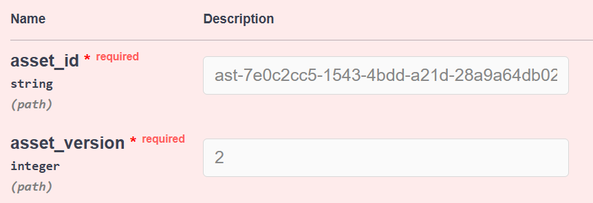
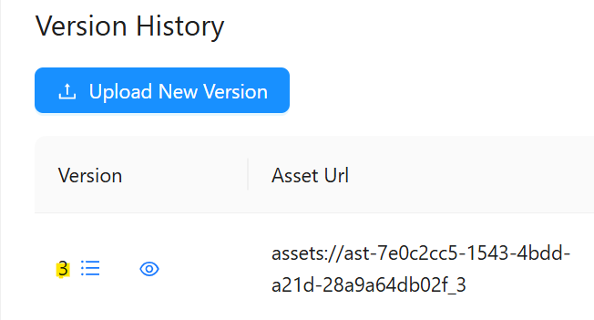
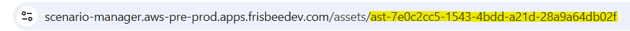
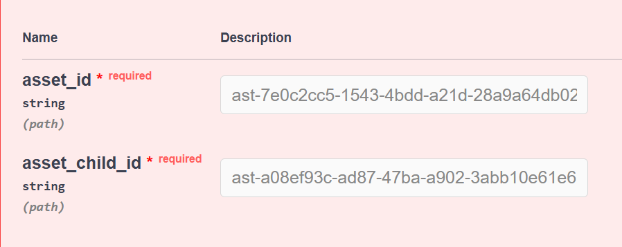
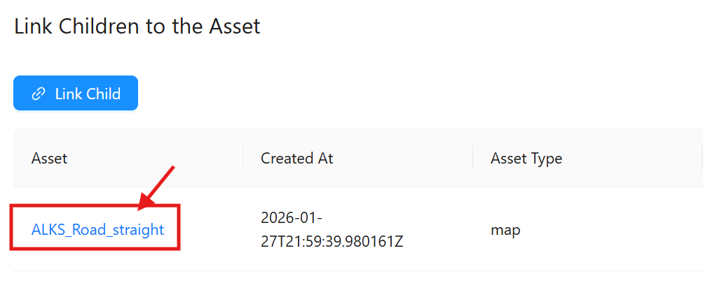
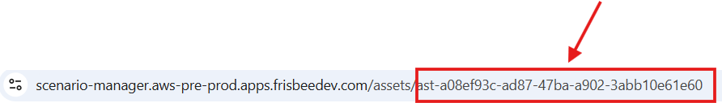

## Introduction

The AVxcelerate Asset Manager REST API v0.1.0 is compatible with the AVX Architecture V2.

This REST API allows to perform CRUD (Create, Read, Update, and Delete) operations on resources such as queues, deployments, applications and app-runtime-configurations.

## Features

### Deleting Asset Versions 

This REST API feature allows you to delete specific asset versions from the Explore & Analyze web app. 
For simulation purposes multiple assets can be linked to a logical scenario to provide more information such as maps, driver input files, etc. 
You can create multiple versions depending on your needs. When the version changes you can delete the files. 

Click **Try it out**

#### 1. Retrieve the Asset Id 
Go to the AVx Scenario Manager web app and press

Select the last part of the Asset URL, as seen below, this is the asset Id. 


Paste it in the **asset_id** field. 


#### 1. Retrieve the Asset version
Go back to the AVx Asset Manager section, get the asset version 


 and paste it in the **asset_version** field. 
 
 

 **Note**: If the Asset isn't linked to any Logical Scenario used for any current or past simulation, the asset will be deleted right away. 
 If the asset was used for a past or current simulation an error message will appear to warn you and inform you it has been used before. 
 You can choose to "force_delete" it but this means any previous simulation job the asset was used with will be lost and the associated data will be lost without any possibility of recovering it. 
To "force_delete" it select "true" in the drop-down.

Add a reason for deleting the asset file in the "deletion_reason" field for audit purposes to allow the information to be tracked for security purposes. 

### Unlinking an Asset Child from an other Asset

This REST API feature allows you to unlink specific asset childs from other assets (logical scenarios, driver inputs, maps etc.) 
For simulation purposes multiple asset childs can be linked to assets to provide more information such as maps, driver input files, etc. 
You can unlink the files when needed. 

#### 1. Retrieve the Asset Id 
Go to the AVx Scenario Manager web app and press 
Select the last part of the Asset URL, as seen below, this is the asset Id. 


Paste it in the "asset_id" field.

 


#### 1. Retrieve the Asset Child Id
Go back to the AVx Asset Manager section, get the "Asset Child Id" by clicking the linked asset 


 and get the Id from the last part of the URL, see below 
and paste it in the "asset_child_id" field.

 


Click **Execute**


## Python helper

The AVxcelerate python APIs are hosted as a python package on a cluster as part of the Explore service deployment. The developers can install the package using pip and use it to call AVx autonomy APIs without needing to make raw REST calls.

### PyPi Regsitry URL:

The python package is hosted as PyPi compliant registry on each deployed cluster. The registry URL is like this:

```bash
https://explore.{{ domain }}/api/explore/pypi
```

## Usage example

Pre-requisites:

We assume that the system is running with the **Ubuntu 22.04** version, and that the following tools are already installed:

- python 3.10
- pip 25.1
- uv 0.6

And we assume that you are using AVx Autonomy Toolchain version **25R2.2**

Step 1: Create virtual environment

```bash
$ python -m venv .venv 


Step 2: Activate the virtual environment

```bash
$ source .venv/bin/activate  
```

Step 3: Install python packages:

- ansys-api-avxcelerate-autonomy
- ansys-avxcelerate-autonomy

```bash
$ pip install ansys-api-avxcelerate-autonomy ansys-avxcelerate-autonomy --extra-index-url https://explore.{{ domain }}/api/explore/pypi
```

Step 4: Use ansys-api-avxcelerate-autonomy and ansys-avxcelerate-autonomy in your python code


```python
import asyncio
from ansys.api.avxcelerate.autonomy.explore_service.v1.api.jobs_api import JobsApi
from ansys.api.avxcelerate.autonomy.explore_service.v1.api_client import ApiClient
from ansys.api.avxcelerate.autonomy.explore_service.v1.configuration import Configuration
from ansys.api.avxcelerate.autonomy.explore_service.v1.exceptions import NotFoundException
from ansys.api.avxcelerate.autonomy.explore_service.v1.models.explore_job_read import ExploreJobRead
from ansys.avxcelerate.autonomy.utils.auth_client_session import AuthClientSession
from ansys.avxcelerate.autonomy.utils.token_provider import TokenProvider

async def main():
    base_url = "https://explore.{{ domain }}"
    configuration = Configuration(host=f"{base_url}/api/explore/v1")
    async with ApiClient(configuration) as api_client:
        session = AuthClientSession(base_url=f"{base_url}/api/explore/v1/")
        provider = TokenProvider(f"{base_url}/auth")
        session.set_provider(provider)
        provider.login()
        api_client.rest_client.pool_manager =  session
        jobs_api = JobsApi(api_client)
        job_id = "exp-dec894b2-647c-4ca5-b516-cdfc18c58fdd"
        try:
            job: ExploreJobRead = await jobs_api.get_job(job_id)
            print(job)
        except NotFoundException:
            print("No job found against this id")
        except Exception as ex:
            print(str(ex))
            print("Couldn't get job against this job id")

asyncio.run(main())
```
