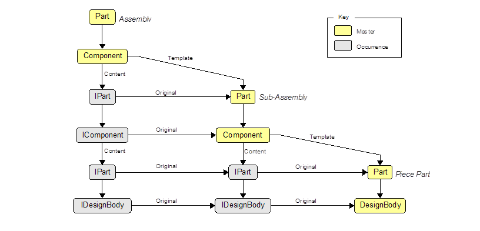

# Parts and components

A Part contains zero or more DesignBody objects and zero or more Component objects. This means a part can contain both design bodies and components, in which case it's neither a pure piece part, nor a pure assembly. This is supported so that the interactive user can restructure design bodies into components, or vice versa.

A component is an *instance* of a *template* part. It has a *placement* matrix to position the component into assembly space. The template is neither a child nor a parent of the component. If the parent-child hierarchy is visualized as an inverted tree structure with the root at the top and leaf nodes at the bottom, then the template is a sideways reference to another part, which is the root of another hierarchy.

The template part may live in the same document as the component, giving rise to what the interactive user would call an *internal component*, or it may live in another document, giving rise to an *external component*. Strictly speaking, it's the template part that's either internal or external, not the component itself.

