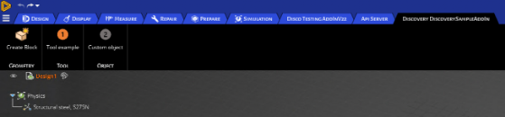

# Customizing the ribbon

## Ribbon customization

In Discovery, add-ins can be used to customize the user interface for their workflows. A good place to start with workflow customization is the ribbon. The ribbon is a graphical control element that appears along a horizontal strip at the top edge of an application window and can be used to organize related commands so that they are easier to find. It is the location in the user-interface where tabs like "Design" and "Simulation" are found. Typically, a ribbon includes tabbed toolbars that are filled with graphical buttons and other graphical control elements and grouped by functionality.

Each add-in can have its own tab or tabs in the ribbon to display and organize the tools created in the add-in.

To customize the ribbon, an add-in implements the IRibbonExtensibility interface. When Discovery is started it calls the add-in’s `IRibbonExtensibility.GetCustomUI` method, and the add-in returns a string that contains an XML description of the changes to be made to the ribbon. The add-in can add new UI objects to the ribbon or change existing ones.

Each UI object such as buttons, check boxes, etc. must be associated with a previously created Command. The command handles the setting of the UI object's text, image, tool tip, and any events that are raised.

## Tabs

Add-ins can add a new tab to the ribbon.



Below is the XML code you can use to create the ribbon tab.

```
<customUI 
	  xmlns="http://schemas.spaceclaim.com/customui" 
	  xmlns:xsi="http://www.w3.org/2001/XMLSchema-instance" 
	  xsi:schemaLocation="http://schemas.spaceclaim.com/customui 	          	  
         http://schemas.spaceclaim.com/customui/SpaceClaimCustomUI.V20.xsd">   
 <ribbon> 
    <tabs> 
      <tab id="Discovery DiscoverySampleAddIn" command="DiscoverySampleAddIn.RibbonTab" label = “My Tab”> 
        <group id ="Geometry" command="DiscoverySampleAddIn.Geometry" label="Geometry"> 
	  <button id="DiscoverySampleAddIn.CreateBlock" size="large" command="DiscoverySampleAddIn.CreateBlock"/> 
        </group> 
        <group id ="Tool" command="DiscoverySampleAddIn.Tool" label="Tool"> 
	  <button id="DiscoverySampleAddIn.button1" size="large" command="DiscoverySampleAddIn.FooTool"/> 
	</group> 
	<group id ="Object" command="DiscoverySampleAddIn.Object" label="Object"> 
	  <button id="DiscoverySampleAddIn.button2" size="large" command="DiscoverySampleAddIn.BarTool"/> 
	</group> 
      </tab> 
    </tabs> 
  </ribbon> 
</customUI> 

```

The XML content that defines the ribbon should be placed into the customUI tags. Under the ribbon tag, you can define a new tab using the tab object. It has the following three attributes:

-   tab id
-   label \(optional\)
-   command \(optional\)

If a label is defined, it is used as the displayed name on the user-interface. If the label is not defined, the tab id is used as the displayed name.

## Groups

A tab is the collection of buttons, but the buttons can be further categorized using "groups." Groups are useful to bring relevant buttons together and give them more context.


In the example above, "geometry," "material properties," etc. are groups that contain relevant buttons and functionalities.

## Buttons

Buttons are the controls that can be used to execute a function \(like the activation of a tool\). When defining the buttons in the customUI XML, you need to define its identifier \(display name\), command, and the size of the button. The size of the button should be defined as "large" for standard buttons requiring a row or "small" for mini buttons that require less space. Below is the schema file that contains examples.

```
<?xml version="1.0" encoding="utf-8"?> 
<customUI 
  xmlns="http://schemas.spaceclaim.com/customui" 
  xmlns:xsi="http://www.w3.org/2001/XMLSchema-instance" 
  xsi:schemaLocation="http://schemas.spaceclaim.com/customui http://schemas.spaceclaim.com/customui/SpaceClaimCustomUI.V20.xsd"> 
  <ribbon> 
   <tabs> 
      <tab id="Discovery DiscoverySampleAddIn" command="DiscoverySampleAddIn.RibbonTab"> 
        <group id ="Geometry" command="DiscoverySampleAddIn.Geometry" label="Geometry"> 
          <button id="DiscoverySampleAddIn.CreateBlock" size="large" command="DiscoverySampleAddIn.CreateBlock"/> 
        </group> 
        <group id ="Tool" command="DiscoverySampleAddIn.Tool" label="Tool"> 
          <button id="DiscoverySampleAddIn.button1" size="large" command="DiscoverySampleAddIn.FooTool"/> 
        </group> 
        <group id ="Object" command="DiscoverySampleAddIn.Object" label="Object"> 
          <button id="DiscoverySampleAddIn.button2" size="large" command="DiscoverySampleAddIn.BarTool"/> 
        </group> 
      </tab> 
  </tabs> 
  </ribbon> 
</customUI> 
```

## Customizing the file menu

Additionally, custom buttons can be added to the file menu \(at the top left, under the Discovery icon\).

To add custom buttons to the file menu, encapsulate the tool buttons with <menu\> <menu/\>.

```
<ribbon> 
    <menu> 
      <button id="DiscoverySampleAddIn.Button1Tool" position="save" command=" DiscoverySampleAddIn.Button1Tool"/> 
      <button id=" DiscoverySampleAddIn.CustomTestTool3" position="close" command=" DiscoverySampleAddIn.CustomTestTool3"/> 
    </menu> 
</ribbon 
```

