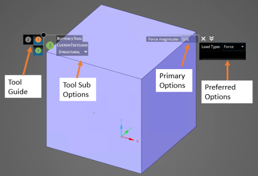
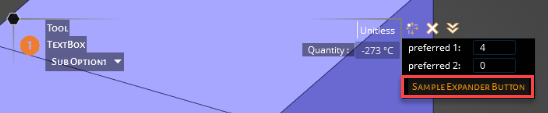
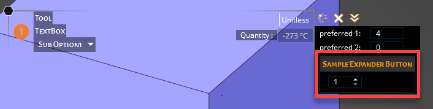
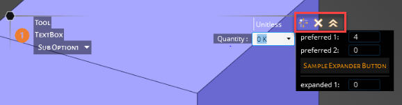

# Customizing tools

## Custom tool

In Discovery, a tool is defined as a piece of functionality related to geometry manipulation \(for example, the Pull tool for geometry extrusion\) or a physical condition definition \(for example, the creation of a Force\). The definition of a tool requires user inputs, called tool options.

In the C\# code, a tool is defined by a class derived from `SpaceClaim.Api.V22.Tool`. The OptionsXml property defines the layout of the panel that contains the tool options, like the ribbon XML.

```
class CustomTool : Tool  
{ 
	public CustomTool() 
			: base(InteractionMode.Solid) {} 
      /* 
       * Defines an options panel for the custom tool. 
       */ 
	public override string OptionsXml  
     { 
		get { return Resources.CustomToolOptions; } 
     } 
}
```

This XML defines the layout and structure of the options panel for a custom tool.

```
<?xml version="1.0" encoding="utf-8"?> 
<customUI xmlns="http://schemas.spaceclaim.com/customui"> 
  <panel command="DiscoverySampleAddIn.BarTool" label="Tool" modeLabel="TextBox"> 
    <group id="DiscoverySampleAddIn.BarToolGuide" label="Tool Guides" optionsType="toolGuide"> 
      <button id="DiscoverySampleAddIn.TickMark" command="DiscoverySampleAddIn.TickMark"/> 
    </group> 
    <group id="DiscoverySampleAddIn.BarTool" label="Textbox Options" optionsType="primary"> 
      <container id="DiscoverySampleAddIn.BarToolContainer" layoutOrientation="vertical"> 
        <textBox id="DiscoverySampleAddIn.CustomObjetMagnitude" command="DiscoverySampleAddIn.CustomObjectMagnitude" width="80" label="Double only:" /> 
      </container> 
    </group> 
  </panel> 
</customUI> 
```



## Tool guide

Another configurable tool item by the add-ins is the tool guide. It is a short cut for reaching tools from various tabs quickly.


```
<group id=" DiscoverySampleAddIn.CustomTestTool3ToolGuideGroup1" label="Tool Guides 1" optionsType="toolGuide"> 
	<button id=" DiscoverySampleAddIn.CustomTestTool3ToolGuide" command=" DiscoverySampleAddIn.TextBoxTool"/> 
	<button id=" DiscoverySampleAddIn.CustomTestTool3ToolGuide" command=" DiscoverySampleAddIn.CheckBoxTool"/> 
</group> 
```

## Tool sub-options

If a tool has options to choose from, it should be expressed as below:

```
<group id="DiscoverySampleAddIn.FooToolSubOption" label="Tool Sub Options" optionsType="toolSubOption"> 
   <toolSubOption id="DiscoverySampleAddIn.FooToolSubOption" command="DiscoverySampleAddIn.FooToolSubOption" width="80"> 
        <item label="Sub Option1"/> 
        <item label="Sub Option2"/> 
   </toolSubOption> 
</group> 

```

Tool sub option is a collection of tool sub option items \(unbounded\) that will be shown in a dropdown. In the example above, there are two items with labels, "Sub Option1" and "Sub Option 2," which are also the display names. Using this code, items tools options can be grouped and filtered. The command for the tool sub option can be defined as shown below in C\# and linked to the XML by the command name.

```
static class FooToolSubOptionComboBox 
    { 
        const string commandName = "DiscoverySampleAddIn.FooToolSubOption"; 
  
        public static readonly string[] toolSubOptionStrings = 
        { 
            "Sub Option1", 
            "Sub Option2" 
        }; 
  
        public static void Initialize() 
        { 
            Command command = Command.Create(commandName); 
  
            string[] items = Array.ConvertAll(toolSubOptionStrings, toolSubOption => toolSubOption.ToString()); 
            command.ControlState = ComboBoxState.CreateFixed(items, 0); 
        } 
  
        public static Command Command => Command.GetCommand(commandName); 
  
        public static string SelectedLoadType 
        { 
            get 
            { 
                var state = (ComboBoxState)Command.ControlState; 
                return toolSubOptionStrings[state.SelectedIndex]; 
            } 
        } 
  
    } 
```

## Primary options

The primary options are mostly used to add another level of selection. They should be created as another group in the tool XML file. They are most likely the key input item for the tool.

Below is an example add-in showing how you can create primary options.

```
<group id="DiscoverySampleAddIn.FooToolPrimary" label="Textbox Options" optionsType="primary"> 
      <container id="DiscoverySampleAddIn.FooToolContainer" layoutOrientation="vertical"> 
        <checkBox id="DiscoverySampleAddIn.CheckBox" label="Unitless" command="DiscoverySampleAddIn.CheckBox"/> 
        <textBox id="DiscoverySampleAddIn.TextBoxDouble" command="DiscoverySampleAddIn.TextBoxDouble" width="80" label="Double only:" /> 
        <textBox id="DiscoverySampleAddIn.TextBoxDouble2" command="DiscoverySampleAddIn.TextBoxDouble2" width="80" label="Double only:" /> 
        <textBox id="DiscoverySampleAddIn.TextBoxQuantity" command="DiscoverySampleAddIn.TextBoxQuantity" width="80" label="Quantity :" quantityType="temperature" /> 
      </container> 
</group> 

```

In primary options, multiple buttons or text box fields can be stacked together. As shown in the example above, they are added to a container with a layout orientation of "vertical."

The example above also defines some check boxes and text boxes. \(See controls for the complete list of controls applicable in the tools.\)

Text box can be set to work with a specific type by setting the `quantityType` attribute.

## Preferred options

Preferred options can be found on the right-side of the tool and they appear with a black background. Preferred options are built in a similar way to the primary options. You can customize preferred options with a variety of buttons and set their visibility.

To create a preferred options block, the add-in needs to define a group with optionsType="preferred." Then, using containers, the items layout can be specified.

In the example below, the preferred options are stacked vertically. As you can see, a button item can be used as an expander to group other items. Also, shown below, the spin box is only visible when a button is clicked. This button functionality can be useful when there are multiple fields that need to be activated under certain conditions.

```

<group id="DiscoverySampleAddIn.FooToolPreferred" label="Textbox Options" optionsType="preferred"> 
     <container id="DiscoverySampleAddIn.FooToolContainer" layoutOrientation="vertical"> 
       <textBox id="DiscoverySampleAddIn.PreferredTextBox1" command="DiscoverySampleAddIn.PreferredTextBox1" width="80" label="preferred 1:" /> 
       <textBox id="DiscoverySampleAddIn.PreferredTextBox2" command="DiscoverySampleAddIn.PreferredTextBox2" width="80" label="preferred 2:" /> 
       <button id="DiscoverySampleAddIn.ExpanderButton" command="DiscoverySampleAddIn.ExpanderButton"  label="Sample Expander Button"> 
       	  <spinBox id="DiscoverySampleAddIn.SpinBox" command="DiscoverySampleAddIn.SpinBox" minimumValue="1" maximumValue="8" width="35"/> 
       </button> 
     </container> 
</group> 
```





## Expanded options

Expanded options allow for further grouping on the tools and they work in a similar way to buttons, but visually they are represented as arrows on the preferred options. To create expanded options, define a group in XML using optionsType="expanded."

```
<group id="DiscoverySampleAddIn.FooToolExpanded" label="Textbox Options" optionsType="expanded"> 
        <container id="DiscoverySampleAddIn.FooToolContainer" layoutOrientation="vertical"> 
          <textBox id="DiscoverySampleAddIn.ExpandedDouble1" command="DiscoverySampleAddIn.ExpandedDouble1" width="80" label="expanded 1:" /> 
        </container> 
...
```


The items inside of this group only become visible after clicking the double arrow above the preferred options.



