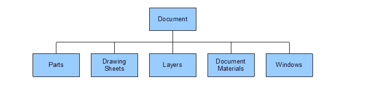

# Document structure

A document contains the following objects:

## Parts

A document always contains at least one part, known as its *main part*, and this represents the design. If the main part has internal components \(instances of other parts that belong to the same document\), the document will contain other parts too.

Internal components are also used for beam profiles, mid-surface parts, and sheet metal unfolded parts.

The structure of a part is described below.

## Drawing sheets

A document contains zero or more drawing sheets.

The structure of a drawing sheet is described below.

## Layers

A document contains one or more layers. There is always a *default layer*, and if you delete another layer, all its objects are moved to the default layer. You can't delete the default layer. The default layer isn't the same as the *active layer*, which is the layer to which new objects are assigned. The active layer is a property of the window.

## Materials

A document contains zero or more document materials, which are materials used by parts, design bodies, or beams in that document.

## Windows

A document contains one or more windows, but it may not have any windows loaded. If the document is explicitly opened, then its windows are also loaded and opened, but if a document is loaded implicitly, for example because it's referenced from another open document, then its windows aren't loaded.

A window shows a *scene*, which is the root of the object hierarchy it displays. The window scene can be a part or a drawing sheet belonging to the same document.

The window also provides access to *interaction contexts*, which allow you to work in a specific coordinate space. The interaction context presents the current selection in that coordinate space. A useful interaction context is the *active context*, which is the context in which the user is working.

