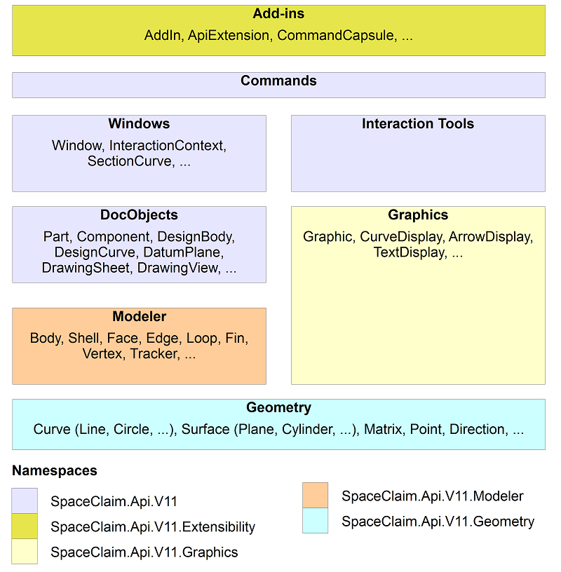

# Geometry API overview

The diagram below shows a conceptual view of the geometry architecture as presented through the API.

For the purposes of this diagram, each box represents a module, where each module makes use of other modules below it in the diagram. The box sizes have no significance.

These modules are merely conceptual groupings, since the only separation apparent in the API is the separation into namespaces, which are shown in different colors in the diagram.

Listed within many of the modules in the diagram are examples of types published by that module.

This section contains the following topics:

-   **[Doc objects](./geo_doc_objects.md)**  

-   **[Document structure](./geo_doc_structure.md)**  

-   **[Part structure](./geo_part_structure.md)**  

