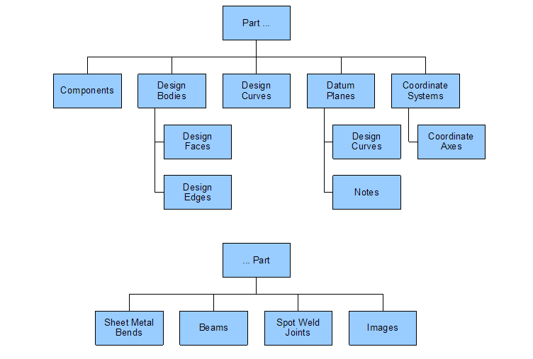

# Part structure

The Discovery object model is quite flat, with the part being a bucket for many objects:

## Components

A part contains zero or more components. A component is an instance of another *template* part. The template part may belong to the same document \(an internal component\), or it may belong to another document \(an external component\).

## Design bodies

A part contains zero or more design bodies. A design body can be open \(a surface body\) or closed \(a solid body\). A design body contains design faces and design edges.

## Design curves

A part contains zero or more design curves. Design curves have 3D geometry, even though they're often sketched in a plane. For example, if you copy and paste design edges, design curves are created, and these need not lie in a plane.

Design curves can also belong to datum planes and drawing sheets.

## Datum planes

A part contains zero or more datum planes. As well as serving as construction planes, as the name suggests, datum planes can also contain design curves and text notes, which lie in the plane. When the datum plane is moved, its children are moved too.

## Coordinate systems

A part contains zero or more coordinate systems. A coordinate system contains three mutually perpendicular coordinate axes.

The world coordinate system, which can be displayed in the user interface, doesn't belong to any document, and isn't presented through the API.

## Sheet metal bends

If a part is a sheet metal part, then it contains zero or more sheet metal bends, which might be cylindrical or conical. If a part is a sheet metal part, then it has a sheet metal *aspect*, which is a companion object presenting sheet metal information, including bends.

## Beams

A part contains zero or more beams, which have a trimmed curve path, a planar cross section, and information about the position and orientation of the cross section relative to the beam path.

## Spot weld joints

A part contains zero or more spot weld joints. A spot weld joint has a collection of spot welds, each of which welds two or more points on design faces.

## Images

A part contains zero or more images. An image is a picture or video, either positioned in space or wrapped onto a design face. An image can also belong to a drawing sheet.

