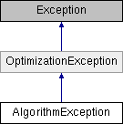

# AlgorithmException Class

**Namespace:** `Phoenix.Optimization`

## Overview

This exception can be thrown by an algorithm when an algorithm specific code is raised.  
 

## Inheritance



## Declaration

```csharp
class AlgorithmException
```

## Description

This exception can be thrown by an algorithm when an algorithm specific code is raised.  
 


## Public Member Functions

|Name|Description|
|-----|-----|
| |`AlgorithmException (int code)`<br>Constructs `AlgorithmException` with a code |
| |`AlgorithmException (int code, string msg)`<br>Constructs exception with a code and message |
| |`AlgorithmException (int code, string msg, Exception inner)`<br>Constructs exception with a code, message and inner exception |
|override void |`GetObjectData (SerializationInfo info, StreamingContext context)`<br>When overridden in a derived class, sets the `SerializationInfo` with information about the exception. |

### Public Member Functions inherited from [OptimizationException]()
|Name|Description|
|-----|-----|
| |`OptimizationException ()`<br>Initializes a new instance of the `OptimizationException` class. |
| |`OptimizationException (string msg)`<br>Initializes a new instance of the `OptimizationException` class with a specified error message. |
| |`OptimizationException (string msg, Exception inner)`<br>Initializes a new instance of the `OptimizationException` class with a specified error message and a reference to the inner exception that is the cause of this exception. |

## Properties
|Name|Description|
|-----|-----|
|int | `Code [get]`<br>Gets the algorithm specific code that was raised |
|override string | `Message [get]`<br>Gets the error code and message used to create the `AlgorithmException`. |

## Constructor & Destructor Documentation

### AlgorithmException()
```csharp
AlgorithmException ( int code)
```

Constructs `AlgorithmException` with a code

**Parameters:**

- `code` - Code for the exception

### AlgorithmException()
```csharp
AlgorithmException ( int code, string msg )
```

Constructs exception with a code and message

**Parameters:**

- `code` - Code for the exception
- `msg` - Message for the exception

### AlgorithmException()
```csharp
AlgorithmException ( int code, string msg, Exception inner )
```

Constructs exception with a code, message, and inner exception

**Parameters:**

- `code` - Code for the exception
- `msg` - Message for the exception
- `inner` - The exception that caused the algorithm exception to be thrown.

### AlgorithmException()
```csharp
AlgorithmException ( SerializationInfo info, StreamingContext context )
```

Initializes a new instance of the `AlgorithmException` class with serialized data.

**Parameters:**

- `info` - The `SerializationInfo` that holds the serialized object data about the exception being thrown.
- `context` - The `StreamingContext` that contains contextual information about the source or destination.

## Member Function Documentation

### GetObjectData
```csharp
override void `GetObjectData` ( SerializationInfo info, StreamingContext context )
```

When overridden in a derived class, sets the `SerializationInfo` with information about the exception.

**Parameters:**

- `info` - The `SerializationInfo` that holds the serialized object data about the exception being thrown.
- `context` - The `StreamingContext` that contains contextual information about the source or destination.

### Code
```csharp
int Code
```

Gets the algorithm specific code that was raised

### Message
```csharp
override string Message
```

Gets the error code and message used to create the `AlgorithmException`.

## Property Documentation

### Code
```csharp
int Code
```

Gets the algorithm specific code that was raised

### Message
```csharp
override string Message
```

Gets the error code and message used to create the `AlgorithmException`.
