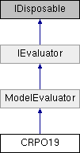

# CRPO19 Class

**Namespace:** `Phoenix.Optimization.AlgorithmTests.Evaluators`

## Overview

Implementation of Constrained Real-Parameter Optimization Fucntion - 01  
 

## Inheritance



## Declaration

```csharp
class CRPO19
```

## Description

Implementation of Constrained Real-Parameter Optimization Fucntion - 01  
 
Source: http://www.ntu.edu.sg/home/EPNSugan/
```
Number of variables: 15 variables. Definition: f(x) = [sum:i=1 to 5, j=1 to 5]{c(i,j)*x(10+j)} + 2*[sum:j=1 to 5]{d(j)*x(10+j)^3} - [sum:i=1 to 10]{b(i)*x(i)} Search domain: 0<= xi <= 10, i=1 to 15; Subject to: gi <= 0, i= 1 to 5 ; Number of local minima: no local minima except the global one. The global minima: x* = (1.66991341326291344e-17, 3.95378229282456509e-16, 3.94599045143233784, 1.06036597479721211e-16, 3.2831773458454161, 9.99999999999999822, 1.12829414671605333e - 17, 1.2026194599794709e - 17, 2.50706276000769697e - 15, 2.24624122987970677e - 15, 0.370764847417013987, 0.278456024942955571, 0.523838487672241171, 0.388620152510322781, 0.298156764974678579 ) f(x*) = 32.6555929502463 
```

## Public Member Functions

|Name|Description|
|-----|-----|
|override void |`addConstraints ()`<br>Adds constraints. |
|override void |`addDesignVariables ()`<br>Adds design variables. |
|override void |`addObjectives ()`<br>Adds objectives. |
| |`CRPO19 ()`<br>Default constructor, uses the default goal of `minimize` |
| |`CRPO19 (Goal goal)`<br>Constructor to use custom goal |
|override ModelEvaluation |`EvaluateModel (object[] designVariables)`<br>Evaluates function. |
|override bool |`IsDesignAcceptable (object[] design, AreDesignsEqual areDesignsEqual)`<br>Determines whether specified design is a local or global optima. |
|[ModelEvaluation]() |`EvaluateModel (object[] designVariables)`<br>Evaluates the model at the given design point. |
|bool |`IsDesignAcceptable (object[] design, AreDesignsEqual areDesignsEqual)`<br>Determines whether design is an acceptable design. |
|void |`SetStartPoint (object[] startValues)`<br>Sets the starting design for the evaluator. |

### Public Member Functions inherited from [ModelEvaluator]()
|Name|Description|
|-----|-----|
|void |`addConstraint (string name, double lowerBound, double upperBound)`<br>Method used to add a constraint |
|virtual void |`addConstraints ()`<br>Method called to specifiy the constraints for the evaluator (by default, not constraints are specified) |
|void |`addDesignVariable (string name, object startValue)`<br>Method used to add design variable |
|void |`addDesignVariable (string name, object startValue, DataTable selectedAlphabet)`<br>Method used to add design variable |
|void |`addDesignVariable (string name, object startValue, double lowerBound, double upperBound)`<br>Method used to add design variable |
|void |`addDesignVariable (string name, object startValue, double lowerBound, double upperBound, DataTable selectedAlphabet)`<br>Method used to add a design variable |
|abstract void |`addDesignVariables ()`<br>Method called to added design variables |
|void |`addObjective (string name, double solveForValue)`<br>Method used to add an objective (assumes solve for objective) |
|void |`addObjective (string name, double solveForValue, double weight)`<br>Method used to add an objective (assumes solve for objective) |
|void |`addObjective (string name, Goal goal)`<br>Method used to add an objective |
|void |`addObjective (string name, Goal goal, double weight, double solveForValue)`<br>Method used to add an objective |
|abstract void |`addObjectives ()`<br>Method called to specifiy the objectives for the evaluator |
|void |`Dispose ()`<br>Called to dispose the object. |
|abstract ModelEvaluation |`EvaluateModel (object[] designVariables)`<br>Evaluates the model at the given design point |
|virtual double |`getIGD (List< double[]> bestDesignObjectives, string filePath)`<br>Calculates the IGD value for multi-objective problem [The IGD formula is slightly modified to get the nearest possible value to actual IGD] [The actual formula accounts for equal no of optimal & obtained set of objectives, while, we calculate based on the number of objectives obtained] |
|abstract bool |`IsDesignAcceptable (object[] design, AreDesignsEqual areDesignsEqual)`<br>Determines whether design is an acceptable design. |
|void |`SetStartPoint (object[] startValues)`<br>Sets the starting design for the evaluator |

## Properties
|Name|Description|
|-----|-----|
|override object[,] | `GlobalBestDesigns [get]`<br>List of the globally best designs for the evaluator. |
|override bool | `HasFailedRuns [get]`<br>Evaluator does not have failed runs. |
|override bool | `HasNonSmoothResponses [get]`<br>Evaluator has smooth responses. |
|override string | `Name [get]`<br>Name of the evaluator. |
|override bool | `UsesConstraints [get]`<br>Evaluator does not use constraints. |
|override bool | `UsesDiscreteVariables [get]`<br>Evaluator does not use multiple discrete variables. |
|override bool | `UsesMinMax [get]`<br>Evaluator does uses minimize/maximize objectives. |
|override bool | `UsesMultipleObjectives [get]`<br>Evaluator does not use multiple objectives. |
|override bool | `UsesSolveFor [get]`<br>Evaluator does not use the `solve for` objective. |

### Properties inherited from [ModelEvaluator]()
|Name|Description|
|-----|-----|
|List< OptConstraint > | `Constraints [get]`<br>Method to get the list of constraints |
|int | `DesignVariableCount [get]`<br>Number of design variables specificed by the evaluator |
|List< DesignVariable > | `DesignVariables [get]`<br>Method to get the list of design variables |
|abstract object[,] | `GlobalBestDesigns [get]`<br>The global best design for the evaluator (a.k.a. "The right answers") |
|abstract bool | `HasFailedRuns [get]`<br>Does the evalutor have failed runs? |
|abstract bool | `HasNonSmoothResponses [get]`<br>Does the evaluator have non-smooth responses |
|abstract string | `Name [get]`<br>Name of the evaluator |
|int | `NumberOfObjectives [get]`<br>Number of objectives specified |
|List< Objective > | `Objectives [get]`<br>Method to get the list of objectives |
|abstract bool | `UsesConstraints [get]`<br>Does the evaluator use constraints? |
|abstract bool | `UsesDiscreteVariables [get]`<br>Does the evaluator use discrete variables? |
|abstract bool | `UsesMinMax [get]`<br>Does the evaluator use a `Minimize/Maximize` objective? |
|abstract bool | `UsesMultipleObjectives [get]`<br>Does the evaluator specify multiple objectives? |
|abstract bool | `UsesSolveFor [get]`<br>Does the evaluator use the `solve for` objective? |

### Properties inherited from [IEvaluator]()
|Name|Description|
|-----|-----|
|List< OptConstraint > | `Constraints [get]`<br>List of constraints defined by the evaluator. |
|int | `DesignVariableCount [get]`<br>Number of design variables specificed by the evaluator. |
|List< DesignVariable > | `DesignVariables [get]`<br>List of design variables defined by the evaluator. |
|object[,] | `GlobalBestDesigns [get]`<br>The global best designs for the evaluator. |
|bool | `HasFailedRuns [get]`<br>Does the evalutor have failed runs? |
|bool | `HasNonSmoothResponses [get]`<br>Does the evaluator have non-smooth responses. |
|string | `Name [get]`<br>Name of the evaluator. |
|int | `NumberOfObjectives [get]`<br>Number of objectives specified. |
|List< Objective > | `Objectives [get]`<br>List of objectives defined by the evaluator. |
|bool | `UsesConstraints [get]`<br>Does the evaluator use constraints? |
|bool | `UsesDiscreteVariables [get]`<br>Does the evaluator use discrete variables? |
|bool | `UsesMinMax [get]`<br>Does the evaluator use a `Minimize/Maximize` objective? |
|bool | `UsesMultipleObjectives [get]`<br>Does the evaluator specify multiple objectives? |
|bool | `UsesSolveFor [get]`<br>Does the evaluator use the `solve for` objective? |

## Additional Inherited Members 

### Protected Member Functions inherited from [ModelEvaluator]() 
|Name|Description|
|-----|-----|
|virtual void | `Dispose (bool disposing)`<br>Standard disposal. |

## Constructor & Destructor Documentation

### CRPO19()
```csharp
CRPO19 ( )
```

Default constructor, uses the default goal of `minimize`

### CRPO19()
```csharp
CRPO19 ( Goal goal)
```

Constructor to use custom goal Matyas does not support the solve for goal.

**Parameters:**

- `goal` - Specifies the goal of the optimization.

## Member Function Documentation

### addConstraints
```csharp
override void `addConstraints` ( )
```

Adds constraints. Reimplemented from [ModelEvaluator]().

### addDesignVariables
```csharp
override void `addDesignVariables` ( )
```

Adds design variables.

Implements [ModelEvaluator]().

### addObjectives
```csharp
override void `addObjectives` ( )
```

Adds objectives.

Implements [ModelEvaluator]().

### EvaluateModel
```csharp
override ModelEvaluation `EvaluateModel` ( object[] designVariables)
```

Evaluates function.

**Parameters:**

- `designVariables` - Design used to evaluate function.

**Returns:** 
- Design results

Implements [ModelEvaluator]().

### IsDesignAcceptable
```csharp
override bool `IsDesignAcceptable` ( object[] design, AreDesignsEqual areDesignsEqual )
```

Determines whether specified design is a local or global optima.

**Parameters:**

- `design` - Design to be tested.
- `areDesignsEqual` - Function delegate to be be used to determine whether two designs are equal.

**Returns:** 
- Returns `true` if the design is a local or global optima; `false` otherwise.

Implements [ModelEvaluator]().

### GlobalBestDesigns
```csharp
override object [,] GlobalBestDesigns
```

List of the globally best designs for the evaluator.

Implements [IEvaluator]().

### HasFailedRuns
```csharp
override bool HasFailedRuns
```

Evaluator does not have failed runs.

Implements [IEvaluator]().

### HasNonSmoothResponses
```csharp
override bool HasNonSmoothResponses
```

Evaluator has smooth responses.

Implements [IEvaluator]().

### Name
```csharp
override string Name
```

Name of the evaluator.

Implements [IEvaluator]().

### UsesConstraints
```csharp
override bool UsesConstraints
```

Evaluator does not use constraints.

Implements [IEvaluator]().

### UsesDiscreteVariables
```csharp
override bool UsesDiscreteVariables
```

Evaluator does not use multiple discrete variables.

Implements [IEvaluator]().

### UsesMinMax
```csharp
override bool UsesMinMax
```

Evaluator does uses minimize/maximize objectives.

Implements [IEvaluator]().

### UsesMultipleObjectives
```csharp
override bool UsesMultipleObjectives
```

Evaluator does not use multiple objectives.

Implements [IEvaluator]().

### UsesSolveFor
```csharp
override bool UsesSolveFor
```

Evaluator does not use the `solve for` objective.

Implements [IEvaluator]().

## Property Documentation

### GlobalBestDesigns
```csharp
override object [,] GlobalBestDesigns
```

List of the globally best designs for the evaluator.

Implements [IEvaluator]().

### HasFailedRuns
```csharp
override bool HasFailedRuns
```

Evaluator does not have failed runs.

Implements [IEvaluator]().

### HasNonSmoothResponses
```csharp
override bool HasNonSmoothResponses
```

Evaluator has smooth responses.

Implements [IEvaluator]().

### Name
```csharp
override string Name
```

Name of the evaluator.

Implements [IEvaluator]().

### UsesConstraints
```csharp
override bool UsesConstraints
```

Evaluator does not use constraints.

Implements [IEvaluator]().

### UsesDiscreteVariables
```csharp
override bool UsesDiscreteVariables
```

Evaluator does not use multiple discrete variables.

Implements [IEvaluator]().

### UsesMinMax
```csharp
override bool UsesMinMax
```

Evaluator does uses minimize/maximize objectives.

Implements [IEvaluator]().

### UsesMultipleObjectives
```csharp
override bool UsesMultipleObjectives
```

Evaluator does not use multiple objectives.

Implements [IEvaluator]().

### UsesSolveFor
```csharp
override bool UsesSolveFor
```

Evaluator does not use the `solve for` objective.

Implements [IEvaluator]().
